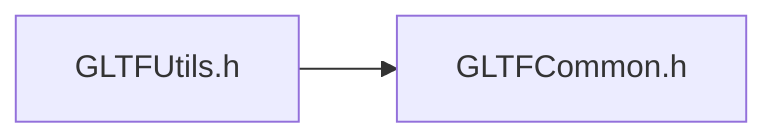
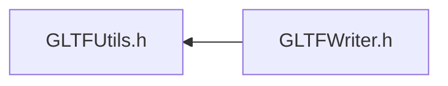

# File GLTFUtils.h

<a id="_g_l_t_f_utils_8h"></a>

![][C++]

## Classes

* [ANSYS::AVZ::GLTFWriter::Utils::Repack](class_a_n_s_y_s_1_1_a_v_z_1_1_g_l_t_f_writer_1_1_utils_1_1_repack.md#class_a_n_s_y_s_1_1_a_v_z_1_1_g_l_t_f_writer_1_1_utils_1_1_repack)

## Namespaces

* [ANSYS](namespace_a_n_s_y_s.md#namespace_a_n_s_y_s)
* [ANSYS::AVZ](namespace_a_n_s_y_s_1_1_a_v_z.md#namespace_a_n_s_y_s_1_1_a_v_z)
* [ANSYS::AVZ::GLTFWriter](namespace_a_n_s_y_s_1_1_a_v_z_1_1_g_l_t_f_writer.md#namespace_a_n_s_y_s_1_1_a_v_z_1_1_g_l_t_f_writer)
* [ANSYS::AVZ::GLTFWriter::Utils](namespace_a_n_s_y_s_1_1_a_v_z_1_1_g_l_t_f_writer_1_1_utils.md#namespace_a_n_s_y_s_1_1_a_v_z_1_1_g_l_t_f_writer_1_1_utils)

## Includes

* [GLTFCommon.h](_g_l_t_f_common_8h.md#_g_l_t_f_common_8h)





## Included by

* [GLTFWriter.h](_g_l_t_f_writer_8h.md#_g_l_t_f_writer_8h)





## Source


```cpp
/*
 * Copyright 2018-2021 ANSYS, Inc. Unauthorized use, distribution, or duplication is prohibited.
 * 
 * Restricted Rights Legend
 *
 * Use, duplication, or disclosure of this
 * software and its documentation by the
 * Government is subject to restrictions as
 * set forth in subdivision [(b)(3)(ii)] of
 * the Rights in Technical Data and Computer
 * Software clause at 52.227-7013.
 */
#ifndef __INCLUDED_GLTF_GLTFUTILS__
#define __INCLUDED_GLTF_GLTFUTILS__

#include "GLTFCommon.h"

namespace ANSYS { namespace AVZ { namespace GLTFWriter {
    namespace Utils {
        GLTFWRITERSPEC void ComputeElementNormals3(const unsigned int numVertices, 
            const float *vertices, 
            const unsigned int numElements, 
            const unsigned int elementSize, 
            const unsigned short *indices, 
            float *normals 
        );
        GLTFWRITERSPEC void ComputeElementNormals3(const unsigned int numVertices, 
            const float *vertices, 
            const unsigned int numElements, 
            const unsigned int elementSize, 
            const unsigned int *indices, 
            float *normals 
        );

        GLTFWRITERSPEC void ComputeVertexNormals3(const unsigned int numVertices, 
            const float *vertices, 
            const unsigned int numElements, 
            const unsigned int elementSize, 
            const unsigned short *indices, 
            float *normals 
        );
        GLTFWRITERSPEC void ComputeVertexNormals3(const unsigned int numVertices, 
            const float *vertices, 
            const unsigned int numElements, 
            const unsigned int elementSize, 
            const unsigned int *indices, 
            float *normals 
        );

#if 0
        GLTFWRITERSPEC unsigned int CreateVectors(unsigned int resolution, 
                                                  float offset, 
                                                  unsigned int numLocations, 
                                                  const float *locations, 
                                                  const float *lengths, 
                                                  const float *directions, 
                                                  std::vector<float> &vertices, 
                                                  std::vector<unsigned int> &indices, 
                                                  std::vector<unsigned int> &newToOld 
                                                  );
        GLTFWRITERSPEC void CreateStreamTubes(unsigned int resolution, 
                                              float diameter, 
                                              unsigned int numLines, 
                                              const unsigned int *lineLengths, 
                                              const float *locations, 
                                              std::vector<float> &vertices, 
                                              std::vector<unsigned int> &indices, 
                                              std::vector<unsigned int> &newToOld 
                                              );
#endif

        class Repack 
        {
        protected:
            virtual ~Repack() {}

        public:
            static GLTFWRITERSPEC Repack *Create(unsigned int elementCount, 
                unsigned int elementSize, 
                const unsigned int *indices 
            );
            static GLTFWRITERSPEC void Destroy(Repack *packer);

            GLTFWRITERSPEC virtual unsigned int NumPacks() const = 0;
            GLTFWRITERSPEC virtual unsigned int NumAttributes(unsigned int packNum 
            ) const = 0;
            GLTFWRITERSPEC virtual const int *ConstructRepackAttribute(const unsigned int *indices, 
                unsigned int attributeSize, 
                const int *attributeData, 
                unsigned int packNum 
            ) = 0;
            GLTFWRITERSPEC virtual const float *ConstructRepackAttribute(const unsigned int *indices, 
                unsigned int attributeSize, 
                const float *attributeData, 
                unsigned int packNum 
            ) = 0;
            GLTFWRITERSPEC virtual unsigned int NumElements(unsigned int packNum 
            ) const = 0;
            GLTFWRITERSPEC virtual const unsigned short *ConstructRepackIndex(const unsigned int *indices, 
                unsigned int packNum 
            ) = 0;
        };
    };

} } } 

#endif
```


[public]: https://img.shields.io/badge/-public-brightgreen (public)
[protected]: https://img.shields.io/badge/-protected-yellow (protected)
[static]: https://img.shields.io/badge/-static-lightgrey (static)
[C++]: https://img.shields.io/badge/language-C%2B%2B-blue (C++)
[Python]: https://img.shields.io/badge/language-Python-blue (Python)
[private]: https://img.shields.io/badge/-private-red (private)
[const]: https://img.shields.io/badge/-const-lightblue (const)
[Markdown]: https://img.shields.io/badge/language-Markdown-blue (Markdown)