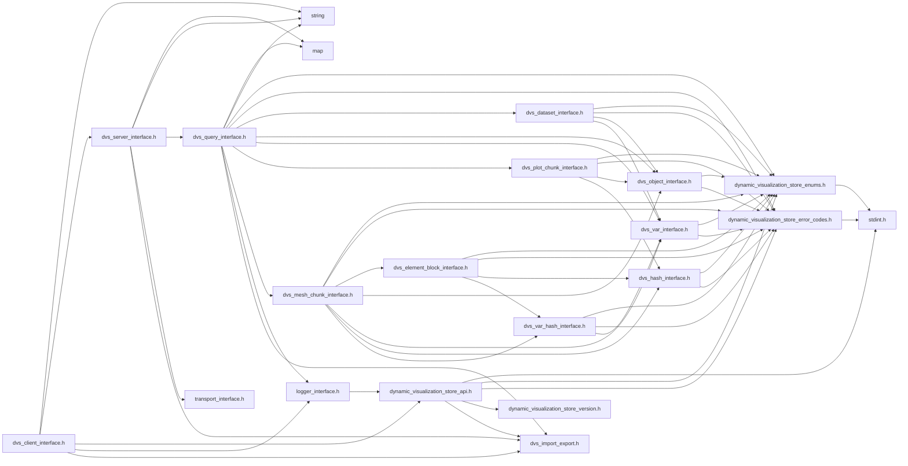
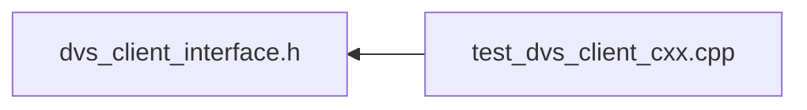

# File dvs\_client\_interface.h

<a id="dvs__client__interface_8h"></a>

![][C++]

C++ Client API for using the Dynamic Visualization Store.


```
Setup the initial connection and needed information

1.) Instantiate [DVS::IServer](#class_d_v_s_1_1_i_server) using [DVS::CREATE_SERVER_INSTANCE()](#dvs__server__interface_8h_1a852580b9a49ac305e4ae26ca637bcc75) method
 1a.) If running a server within this process call setup options ([DVS::IServer::set_options()](#class_d_v_s_1_1_i_server_1a964b0420773ec5f47dbcea04334ba0d3)), see documentation for available options
 1b.) If running a server within this process call startup ([DVS::IServer::startup()](#class_d_v_s_1_1_i_server_1a6699cf48b29583ab3391b9b8397e611c)) to begin running server
2.) Instantiate [DVS::IClient](#class_d_v_s_1_1_i_client) using [DVS::CREATE_CLIENT_INSTANCE()](#dvs__client__interface_8h_1a2475075c9ab4c2e57a8f0b4ab5bc5df4) method and [DVS::IServer](#class_d_v_s_1_1_i_server) created in step 1
3.) Provide a logging method ([DVS::IClient::set_logger()](#class_d_v_s_1_1_i_client_1a024475b03496bc310e211632d153517d)) (optional)
4.) Begin initialization ([DVS::IClient::begin_init()](#class_d_v_s_1_1_i_client_1aff782ecd341fddd87a22a15107efeb3b))
5.) Set unit system ([DVS::IClient::set_unit_system()](#class_d_v_s_1_1_i_client_1a284f922fec402e03365c7873502d1fde)) (optional)
6.) Add information about all parts if applicable ([DVS::IClient::add_part_info()](#class_d_v_s_1_1_i_client_1a5e9ee6af237e76a6e270d99ec8cd4388))
7.) Add information about all variables if applicable ([DVS::IClient::add_var_info()](#class_d_v_s_1_1_i_client_1a82f841d7f6f33071bf8c709623ca215d)) (optional)
8.) Add information about all plots if applicable ([DVS::IClient::add_plot_info()](#class_d_v_s_1_1_i_client_1a1bdb7ca9cf25c63e533f47fe26132af6)) (optional)
9.) End initialization ([DVS::IClient::end_init()](#class_d_v_s_1_1_i_client_1aaf1641a1afbf8bb6257940be28dd94b2))

Now at the end of each timestep we can push data to the ensight server

1.) Begin the update ([DVS::IClient::begin_update()](#class_d_v_s_1_1_i_client_1abd1cbbd2007346ad616dc74eab9d0553))
2.) For Each Part
        Update mesh/nodes ([DVS::IClient::update_nodes()](#class_d_v_s_1_1_i_client_1a87ab36c2f16d093c0beaba60da2cd661))
3.) For Each Element Type
        Update Element ([DVS::IClient::update_elements()](#class_d_v_s_1_1_i_client_1a41aa2ad12fbfa456f3ec8e48530ea6f6), [DVS::IClient::update_elements_polygon()](#class_d_v_s_1_1_i_client_1ac6b3990562f507eda4abedf53e021647), [DVS::IClient::update_elements_polyhedral()](#class_d_v_s_1_1_i_client_1a7a9ccf04ed8502d23913d8eef21607ec))
4.) For Each Variable
        If location on case or part use corresponding update methods i.e. [DVS::IClient::update_var_case()](#class_d_v_s_1_1_i_client_1a8f2e7174f9e89ef5285043dd9357f9b0),
        [DVS::IClient::update_var_case()](#class_d_v_s_1_1_i_client_1a8f2e7174f9e89ef5285043dd9357f9b0)

        If location element or node use corresponding update methods i.e. [DVS::IClient::update_var_element()](#class_d_v_s_1_1_i_client_1aec8ed14b290237049976f68cb81b200f),
        [DVS::IClient::update_var_node()](#class_d_v_s_1_1_i_client_1ae67a2884dd8f68f4757d8d7fac3828d3), [DVS::IClient::update_var_field()](#class_d_v_s_1_1_i_client_1a3834c25cf5ed35a17f08ecefa4b73417)
4.) For Each Plot
         Update plot values ([DVS::IClient::update_plot()](#class_d_v_s_1_1_i_client_1afcf7811f22d58bd328bed415116a4c41))
5.) End update ([DVS::IClient::end_update()](#class_d_v_s_1_1_i_client_1a6396cc4ae967ad5f0da8e234429a97cd))

On application shutdown let the API shut itself down

1.) Destroy instance of [DVS::IClient](#class_d_v_s_1_1_i_client) using [DVS::DESTROY_CLIENT_INSTANCE()](#dvs__client__interface_8h_1a3f13d009a9a07278cbca3449113d78fc) method
```


## Classes

* [DVS::IClient](class_d_v_s_1_1_i_client.md#class_d_v_s_1_1_i_client)

## Namespaces

* [DVS](namespace_d_v_s.md#namespace_d_v_s)

## Includes

* <string>
* [dvs_server_interface.h](dvs__server__interface_8h.md#dvs__server__interface_8h)
* [dynamic_visualization_store_api.h](dynamic__visualization__store__api_8h.md#dynamic__visualization__store__api_8h)
* [logger_interface.h](logger__interface_8h.md#logger__interface_8h)
* dvs_import_export.h





## Included by

* [test_dvs_client_cxx.cpp](test__dvs__client__cxx_8cpp.md#test__dvs__client__cxx_8cpp)





## Source


```cpp
/*  *************************************************************
 *   Copyright 2017-2025 ANSYS, Inc.
 *   All Rights Reserved.
 *
 *        Restricted Rights Legend
 *
 *   Use, duplication, or disclosure of this
 *   software and its documentation by the
 *   Government is subject to restrictions as
 *   set forth in subdivision [(b)(3)(ii)] of
 *   the Rights in Technical Data and Computer
 *   Software clause at 52.227-7013.
 *  *************************************************************
 */

#ifndef ___DVS_DYNAMIC_VISUALIZATION_STORE_CLIENT_INTERFACE___
#define ___DVS_DYNAMIC_VISUALIZATION_STORE_CLIENT_INTERFACE___


#include <string>

#include "dvs_server_interface.h"
#include "dynamic_visualization_store_api.h"
#include "logger_interface.h"

#include "dvs_import_export.h"

namespace DVS
{
    class IClient
    {
    public:


        IClient() = default; 
        virtual ~IClient() = default; 
        IClient(IClient&&) = default;  
        IClient& operator=(IClient&&) = default; 
        IClient(const IClient&) = default; 
        IClient& operator=(const IClient&) = default; 

        virtual void set_logger(ILogger* logger) = 0;

        virtual void set_option(const std::string& key, const std::string& value) = 0;

        virtual void set_options(const std::map<std::string,std::string>& options) = 0;

        virtual void clear_options() = 0;

        virtual const char* get_version() = 0;

        virtual dvs_ret begin_init(const char* dataset_name, uint32_t current_rank, uint32_t total_ranks, uint32_t num_chunks) = 0;

        virtual dvs_ret set_unit_system(const char* system) = 0;

        virtual dvs_ret add_metadata(const char* const keys[], const char* const vals[], uint32_t num_metadata_pairs) = 0;

        virtual dvs_ret add_part_info(const dvs_part_info* part_info, uint32_t num_parts) = 0;

        virtual dvs_ret add_var_info(const dvs_var_info* var_info, uint32_t num_vars) = 0;

        virtual dvs_ret add_plot_info(const dvs_plot_info* plot_info, uint32_t num_plots) = 0;

        virtual uint32_t get_num_parts() const = 0;

        virtual uint32_t get_num_vars() const = 0;

        virtual uint32_t get_num_plots() const = 0;

        virtual const dvs_part_info* get_part_info(uint32_t index) const = 0;

        virtual dvs_ret get_part_id(const std::string& name, uint32_t& id) const = 0;

        virtual const dvs_var_info* get_var_info(uint32_t index) const = 0;

        virtual dvs_ret get_var_id(const std::string& name, uint32_t& id) const = 0;

        virtual const dvs_plot_info* get_plot_info(uint32_t index) const = 0;

        virtual dvs_ret get_plot_id(const std::string& name, uint32_t& id) const = 0;

        virtual dvs_ret end_init() = 0;

        virtual dvs_ret begin_update(uint32_t update_num, uint32_t rank, uint32_t chunk, float time) = 0;

        virtual dvs_ret update_copy_previous_part(uint32_t part_id, const char* options) = 0;

        virtual dvs_ret update_part_rigid_body_motion(
            uint32_t part_id,
            const std::vector<float>& quaternion,
            const std::vector<float>& displacement,
            const std::vector<float>& cg_offset
        ) = 0;

        virtual dvs_ret convert_rotation_to_quaternion(
            std::array<float, 3> axis_start,
            std::array<float, 3> axis_end,
            float relative_rotation_angle,
            std::array<float, 4>& quaternion
        ) = 0;

        virtual dvs_ret update_nodes(uint32_t part_id, const float* x, const float* y, const float* z, uint32_t num_values) = 0;

        virtual dvs_ret update_nodes_structured
        (
            uint32_t part_id,
            const uint32_t global_ijk_max[3],
            const uint32_t local_ijk_min[3],
            const uint32_t local_ijk_max[3],
            const float origin[3],
            const float dir_i[3],
            const float dir_j[3],
            const float dir_k[3],
            const float* i_vals,
            const float* j_vals,
            const float* k_vals
        ) = 0;

        virtual dvs_ret update_nodes_structured
        (
            uint32_t part_id,
            const uint32_t global_ijk_max[3],
            const uint32_t local_ijk_min[3],
            const uint32_t local_ijk_max[3],
            const float* x_vals,
            const float* y_vals,
            const float* z_vals
        ) = 0;

        virtual dvs_ret update_elements(uint32_t part_id, dvs_element_type type, const uint32_t* indices,  uint32_t num_indices) = 0;

        virtual dvs_ret update_elements_polygon
        (
            uint32_t part_id,
            dvs_element_type type,
            const uint32_t* nodes_per_polygon,
            uint32_t nodes_per_polygon_size,
            const uint32_t* indices,
            uint32_t indices_size
        ) = 0;

        virtual dvs_ret update_elements_polyhedral
        (
            uint32_t part_id,
            dvs_element_type type,
            const uint32_t* faces_per_element,
            uint32_t faces_per_element_size,
            const uint32_t* nodes_per_face,
            uint32_t nodes_per_face_size,
            const uint32_t* indices,
            uint32_t indices_size
        ) = 0;


        virtual dvs_ret update_var_case(dvs_var_type var_type, uint32_t var_id, const float* values, uint32_t num_values) = 0;

        virtual dvs_ret update_var_part(dvs_var_type var_type, uint32_t var_id, uint32_t part_id, const float* values, uint32_t num_values) = 0;

        virtual dvs_ret update_var_element(dvs_element_type elem_type, dvs_var_type var_type, uint32_t var_id, uint32_t part_id, const float* values, uint32_t num_values) = 0;

        virtual dvs_ret update_var_element(dvs_element_type elem_type, dvs_var_type var_type, uint32_t var_id, uint32_t part_id, const int64_t* values, uint32_t num_values) = 0;

        virtual dvs_ret update_var_node(dvs_var_type var_type, uint32_t var_id, uint32_t part_id, const float* values, uint32_t num_values) = 0;
        
        virtual dvs_ret update_var_node(dvs_var_type var_type, uint32_t var_id, uint32_t part_id, const int64_t* values, uint32_t num_values) = 0;

        virtual dvs_ret update_var_field(dvs_var_location location, dvs_element_type elem_type, dvs_var_type var_type, uint32_t var_id, uint32_t part_id, const float* values, uint32_t num_values) = 0;
        
        virtual dvs_ret update_var_field(dvs_var_location location, dvs_element_type elem_type, dvs_var_type var_type, uint32_t var_id, uint32_t part_id, const int64_t* values, uint32_t num_values) = 0;

        virtual dvs_ret update_plot(uint32_t plot_id, const float* x_values, const float* y_values, uint32_t num_values) = 0;

        virtual dvs_ret end_update() = 0;

        virtual dvs_ret delete_item(uint32_t update_num, uint32_t rank, const char* filter) = 0;
    };

    DVS_DLL_EXPORT DVS::IClient* CREATE_CLIENT_INSTANCE(DVS::IServer* server, dvs_client_flags flags, const char* secret);

    DVS_DLL_EXPORT void DESTROY_CLIENT_INSTANCE(DVS::IClient* destroy);
}

#endif //___DVS_DYNAMIC_VISUALIZATION_STORE_CLIENT_INTERFACE___
```


[public]: https://img.shields.io/badge/-public-brightgreen (public)
[protected]: https://img.shields.io/badge/-protected-yellow (protected)
[static]: https://img.shields.io/badge/-static-lightgrey (static)
[C++]: https://img.shields.io/badge/language-C%2B%2B-blue (C++)
[Python]: https://img.shields.io/badge/language-Python-blue (Python)
[private]: https://img.shields.io/badge/-private-red (private)
[const]: https://img.shields.io/badge/-const-lightblue (const)
[Markdown]: https://img.shields.io/badge/language-Markdown-blue (Markdown)