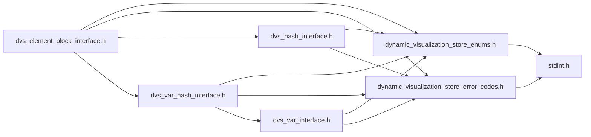
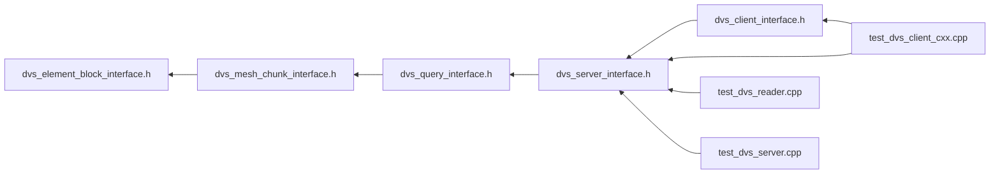

# File dvs\_element\_block\_interface.h

<a id="dvs__element__block__interface_8h"></a>

![][C++]

DVS Reader API Element Block Interface.


## Classes

* [DVS::IElementBlock](class_d_v_s_1_1_i_element_block.md#class_d_v_s_1_1_i_element_block)

## Namespaces

* [DVS](namespace_d_v_s.md#namespace_d_v_s)

## Includes

* [dynamic_visualization_store_enums.h](dynamic__visualization__store__enums_8h.md#dynamic__visualization__store__enums_8h)
* [dynamic_visualization_store_error_codes.h](dynamic__visualization__store__error__codes_8h.md#dynamic__visualization__store__error__codes_8h)
* [dvs_hash_interface.h](dvs__hash__interface_8h.md#dvs__hash__interface_8h)
* [dvs_var_hash_interface.h](dvs__var__hash__interface_8h.md#dvs__var__hash__interface_8h)





## Included by

* [dvs_mesh_chunk_interface.h](dvs__mesh__chunk__interface_8h.md#dvs__mesh__chunk__interface_8h)





## Source


```cpp
/**************************************************************
*
*   (C) 2022-2025 ANSYS, Inc. Unauthorized use, distribution, or duplication is prohibited.
*
*   Restricted Rights Legend
*
*   Use, duplication, or disclosure of this
*   software and its documentation by the
*   Government is subject to restrictions as
*   set forth in subdivision [(b)(3)(ii)] of
*   the Rights in Technical Data and Computer
*   Software clause at 52.227-7013.
*
**************************************************************
*/


#ifndef ___DVS_ELEMENT_BLOCK_INTERFACE_H___
#define ___DVS_ELEMENT_BLOCK_INTERFACE_H___

#include "dynamic_visualization_store_enums.h"
#include "dynamic_visualization_store_error_codes.h"
#include "dvs_hash_interface.h"
#include "dvs_var_hash_interface.h"

namespace DVS
{

class IElementBlock : public DVS::IHash, public DVS::IVarHash
{
public:

    IElementBlock() = default; 
    virtual ~IElementBlock() = default; 
    IElementBlock(IElementBlock&&) = default;  
    IElementBlock& operator=(IElementBlock&&) = default; 
    IElementBlock(const IElementBlock&) = default; 
    IElementBlock& operator=(const IElementBlock&) = default; 

    virtual dvs_element_type get_element_type() const = 0;

    virtual bool get_is_ghost() const = 0;

    virtual dvs_ret get_num_variables(uint32_t& num_vars, VAR_TYPE type = VAR_TYPE::FLOAT) const = 0;

    virtual const DVS::IVar* get_variable(uint32_t index, VAR_TYPE type = VAR_TYPE::FLOAT) const = 0;

    virtual dvs_ret get_variable_size(uint32_t index, uint32_t& num_values, VAR_TYPE type = VAR_TYPE::FLOAT) const = 0;
    
    virtual dvs_ret get_variable_size(const IVar* var, uint32_t& num_values) const = 0;
    
    virtual dvs_ret get_variable_data(uint32_t index, float* array) const = 0;
    
    virtual dvs_ret get_variable_data(uint32_t index, int64_t* array) const = 0;
    
    virtual dvs_ret get_variable_data(const IVar* var, float* array) const = 0;
    
    virtual dvs_ret get_variable_data(const IVar* var, int64_t* array) const = 0;

     [[deprecated("Use dvs_ret get_variable_data(uint32_t index, float* array) instead.")]]
    virtual dvs_ret get_variable_data(uint32_t index, uint32_t* num_values, float* array) = 0;

    [[deprecated("Use dvs_ret get_variable_data(const IVar* var, float* array) instead.")]]
    virtual dvs_ret get_variable_data(const IVar* var, uint32_t* num_values, float* array) = 0;

    virtual dvs_ret get_nodes_per_element(uint32_t& nodes_per_element) const = 0;

    virtual dvs_ret get_num_elements(uint32_t& num_elements) const = 0;

    virtual dvs_ret get_connectivity_size(uint32_t& indices_size) = 0;

    virtual dvs_ret get_connectivity(uint32_t* indices) = 0;

    virtual dvs_ret get_connectivity_polygon_size(uint32_t& nodes_per_polygon_size, uint32_t& indices_size) = 0;

    virtual dvs_ret get_connectivity_polygon(uint32_t* nodes_per_polygon, uint32_t* indices) = 0;

    virtual dvs_ret get_connectivity_polyhedral_size(uint32_t& faces_per_element_size,
                                             uint32_t& nodes_per_face_size,
                                             uint32_t& indices_size) = 0;

    virtual dvs_ret get_connectivity_polyhedral(uint32_t* faces_per_element,
                                        uint32_t* nodes_per_face,
                                        uint32_t* indices) = 0;
};

}//namespace DVS

#endif //___DVS_ELEMENT_BLOCK_INTERFACE_H___
```


[public]: https://img.shields.io/badge/-public-brightgreen (public)
[protected]: https://img.shields.io/badge/-protected-yellow (protected)
[static]: https://img.shields.io/badge/-static-lightgrey (static)
[C++]: https://img.shields.io/badge/language-C%2B%2B-blue (C++)
[Python]: https://img.shields.io/badge/language-Python-blue (Python)
[private]: https://img.shields.io/badge/-private-red (private)
[const]: https://img.shields.io/badge/-const-lightblue (const)
[Markdown]: https://img.shields.io/badge/language-Markdown-blue (Markdown)