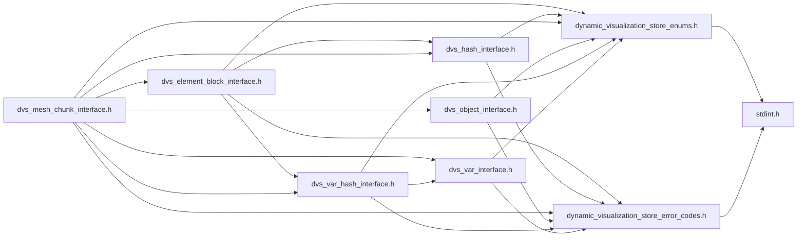
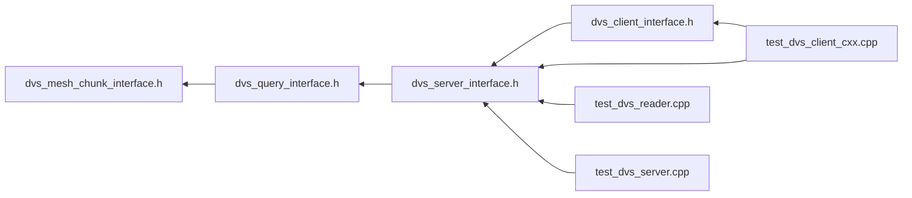

# File dvs\_mesh\_chunk\_interface.h

<a id="dvs__mesh__chunk__interface_8h"></a>

![][C++]

DVS Reader API Mesh Chunk Interface.


## Classes

* [DVS::IMeshChunk](class_d_v_s_1_1_i_mesh_chunk.md#class_d_v_s_1_1_i_mesh_chunk)

## Namespaces

* [DVS](namespace_d_v_s.md#namespace_d_v_s)

## Includes

* [dynamic_visualization_store_enums.h](dynamic__visualization__store__enums_8h.md#dynamic__visualization__store__enums_8h)
* [dynamic_visualization_store_error_codes.h](dynamic__visualization__store__error__codes_8h.md#dynamic__visualization__store__error__codes_8h)
* [dvs_element_block_interface.h](dvs__element__block__interface_8h.md#dvs__element__block__interface_8h)
* [dvs_object_interface.h](dvs__object__interface_8h.md#dvs__object__interface_8h)
* [dvs_var_interface.h](dvs__var__interface_8h.md#dvs__var__interface_8h)
* [dvs_hash_interface.h](dvs__hash__interface_8h.md#dvs__hash__interface_8h)
* [dvs_var_hash_interface.h](dvs__var__hash__interface_8h.md#dvs__var__hash__interface_8h)





## Included by

* [dvs_query_interface.h](dvs__query__interface_8h.md#dvs__query__interface_8h)





## Source


```cpp
/**************************************************************
*
*   (C) 2022-2025 ANSYS, Inc. Unauthorized use, distribution, or duplication is prohibited.
*
*   Restricted Rights Legend
*
*   Use, duplication, or disclosure of this
*   software and its documentation by the
*   Government is subject to restrictions as
*   set forth in subdivision [(b)(3)(ii)] of
*   the Rights in Technical Data and Computer
*   Software clause at 52.227-7013.
*
**************************************************************
*/


#ifndef ___DVS_MESH_CHUNK_INTERFACE_H___
#define ___DVS_MESH_CHUNK_INTERFACE_H___

#include "dynamic_visualization_store_enums.h"
#include "dynamic_visualization_store_error_codes.h"

#include "dvs_element_block_interface.h"
#include "dvs_object_interface.h"
#include "dvs_var_interface.h"
#include "dvs_hash_interface.h"
#include "dvs_var_hash_interface.h"

namespace DVS
{

class IMeshChunk : public DVS::IHash, public DVS::IVarHash
{
public:

    IMeshChunk() = default; 
    virtual ~IMeshChunk() = default; 
    IMeshChunk(IMeshChunk&&) = default;  
    IMeshChunk& operator=(IMeshChunk&&) = default; 
    IMeshChunk(const IMeshChunk&) = default; 
    IMeshChunk& operator=(const IMeshChunk&) = default; 

    enum MeshType
    {
        UNKNOWN = 0, 
        UNSTRUCTURED = 1, 
        PARALLELEPIPED = 2, 
        CURVILINEAR = 3, 
    };

    enum Axis
    {
        X = 0, 
        Y = 1, 
        Z = 2, 
    };

    virtual MeshType get_type() const = 0;

    virtual const DVS::IObject* get_object() const = 0;

    virtual float get_time() const = 0;

    virtual uint32_t get_rank() const = 0;

    virtual uint32_t get_chunk() const = 0;

    virtual dvs_ret get_coords_size(uint32_t& component_size) = 0;

    virtual dvs_ret get_coords(float* x_coords, float* y_coords, float* z_coords) = 0;

    virtual dvs_ret get_coords_interleaved(float* coords) = 0;

    virtual dvs_ret get_coords_curv_size(uint32_t& component_size) = 0;

    virtual dvs_ret get_coords_curv(float local_ijk_min[3], float local_ijk_max[3], float global_ijk_max[3],
                                    float* x_coords, float* y_coords, float* z_coords) = 0;

    virtual dvs_ret get_coords_curv_interleaved(float local_ijk_min[3], float local_ijk_max[3], float global_ijk_max[3],
                                                float* coords) = 0;

    virtual dvs_ret get_coords_parallele_size(uint32_t& i_vals_size, uint32_t& j_vals_size, uint32_t& k_vals_size) = 0;

    virtual dvs_ret get_coords_parallele(float origin[3],
                                         float dir_vec_i[3], float dir_vec_j[3], float dir_vec_k[3],
                                         float local_ijk_min[3], float local_ijk_max[3], float global_ijk_max[3],
                                         float* i_vals, float* j_vals, float* k_vals) = 0;

    virtual dvs_ret get_num_variables(uint32_t& num_vars, VAR_TYPE type = VAR_TYPE::FLOAT) const = 0;

    virtual const DVS::IVar* get_variable(uint32_t index, VAR_TYPE type = VAR_TYPE::FLOAT) const = 0;

    virtual dvs_ret get_variable_size(uint32_t index, uint32_t& num_values, VAR_TYPE type = VAR_TYPE::FLOAT) const = 0;
    
    virtual dvs_ret get_variable_size(const IVar* var, uint32_t& num_values) const = 0;

    virtual dvs_ret get_variable_data(uint32_t index, float* array) const = 0;
    
    virtual dvs_ret get_variable_data(uint32_t index, int64_t* array) const = 0;

    virtual dvs_ret get_variable_data(const IVar* var, float* array) const = 0;
    
    virtual dvs_ret get_variable_data(const IVar* var, int64_t* array) const = 0;

    [[deprecated("Use dvs_ret get_variable_data(uint32_t index, float* array) instead.")]]
    virtual dvs_ret get_variable_data(uint32_t index, uint32_t* num_values, float* array) = 0;

    [[deprecated("Use dvs_ret get_variable_data(const IVar* var, float* array) instead.")]]
    virtual dvs_ret get_variable_data(const IVar* var, uint32_t* num_values, float* array) = 0;

    virtual dvs_ret get_num_element_blocks(uint32_t& num_elem_blocks) const = 0;

    virtual dvs_ret get_element_block_types(dvs_element_type* element_types) const = 0;

    virtual DVS::IElementBlock* get_element_block(uint32_t index) = 0;

    virtual DVS::IElementBlock* get_element_block_by_type(dvs_element_type type) = 0;
};

} //namespace DVS

#endif //___DVS_MESH_CHUNK_INTERFACE_H___
```


[public]: https://img.shields.io/badge/-public-brightgreen (public)
[protected]: https://img.shields.io/badge/-protected-yellow (protected)
[static]: https://img.shields.io/badge/-static-lightgrey (static)
[C++]: https://img.shields.io/badge/language-C%2B%2B-blue (C++)
[Python]: https://img.shields.io/badge/language-Python-blue (Python)
[private]: https://img.shields.io/badge/-private-red (private)
[const]: https://img.shields.io/badge/-const-lightblue (const)
[Markdown]: https://img.shields.io/badge/language-Markdown-blue (Markdown)