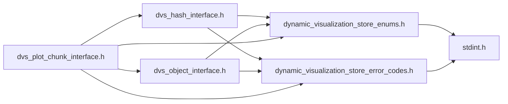
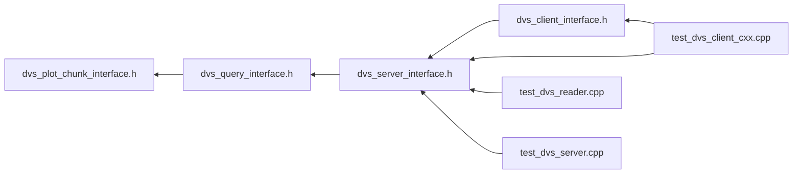

# File dvs\_plot\_chunk\_interface.h

<a id="dvs__plot__chunk__interface_8h"></a>

![][C++]

DVS Reader API Plot Chunk Interface.


## Classes

* [DVS::IPlotChunk](class_d_v_s_1_1_i_plot_chunk.md#class_d_v_s_1_1_i_plot_chunk)

## Namespaces

* [DVS](namespace_d_v_s.md#namespace_d_v_s)

## Includes

* [dynamic_visualization_store_enums.h](dynamic__visualization__store__enums_8h.md#dynamic__visualization__store__enums_8h)
* [dynamic_visualization_store_error_codes.h](dynamic__visualization__store__error__codes_8h.md#dynamic__visualization__store__error__codes_8h)
* [dvs_object_interface.h](dvs__object__interface_8h.md#dvs__object__interface_8h)
* [dvs_hash_interface.h](dvs__hash__interface_8h.md#dvs__hash__interface_8h)





## Included by

* [dvs_query_interface.h](dvs__query__interface_8h.md#dvs__query__interface_8h)





## Source


```cpp
/**************************************************************
*
*   (C) 2022-2025 ANSYS, Inc. Unauthorized use, distribution, or duplication is prohibited.
*
*   Restricted Rights Legend
*
*   Use, duplication, or disclosure of this
*   software and its documentation by the
*   Government is subject to restrictions as
*   set forth in subdivision [(b)(3)(ii)] of
*   the Rights in Technical Data and Computer
*   Software clause at 52.227-7013.
*
**************************************************************
*/


#ifndef ___DVS_PLOT_CHUNK_INTERFACE_H___
#define ___DVS_PLOT_CHUNK_INTERFACE_H___

#include "dynamic_visualization_store_enums.h"
#include "dynamic_visualization_store_error_codes.h"

#include "dvs_object_interface.h"
#include "dvs_hash_interface.h"

namespace DVS
{

class IPlotChunk : public DVS::IHash
{
public:

    IPlotChunk() = default; 
    virtual ~IPlotChunk() = default; 
    IPlotChunk(IPlotChunk&&) = default;  
    IPlotChunk& operator=(IPlotChunk&&) = default; 
    IPlotChunk(const IPlotChunk&) = default; 
    IPlotChunk& operator=(const IPlotChunk&) = default; 

    virtual float get_time() const = 0;

    virtual uint32_t get_rank() const = 0;

    virtual const DVS::IObject* get_object() const = 0;

    virtual dvs_ret get_data(uint32_t* num_values, float* x_axis_values, float* y_axis_values) = 0;
};

} //namespace DVS

#endif //___DVS_PLOT_CHUNK_INTERFACE_H___
```


[public]: https://img.shields.io/badge/-public-brightgreen (public)
[protected]: https://img.shields.io/badge/-protected-yellow (protected)
[static]: https://img.shields.io/badge/-static-lightgrey (static)
[C++]: https://img.shields.io/badge/language-C%2B%2B-blue (C++)
[Python]: https://img.shields.io/badge/language-Python-blue (Python)
[private]: https://img.shields.io/badge/-private-red (private)
[const]: https://img.shields.io/badge/-const-lightblue (const)
[Markdown]: https://img.shields.io/badge/language-Markdown-blue (Markdown)