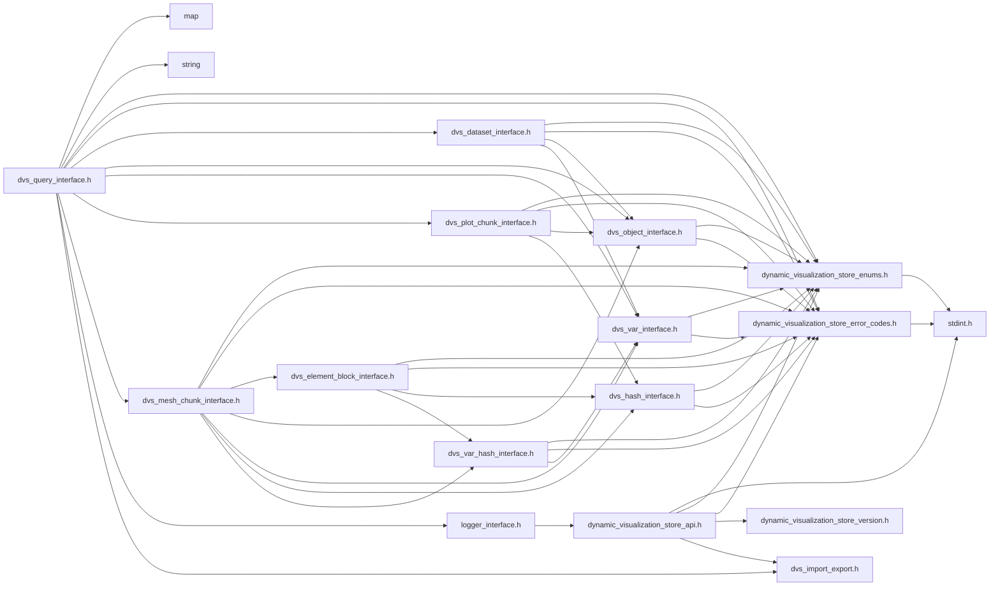
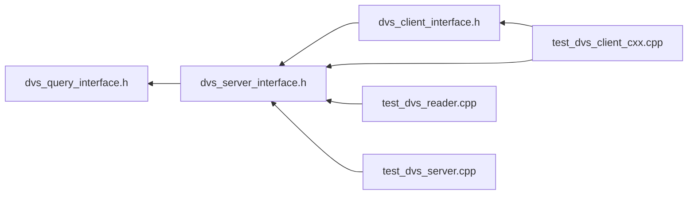

# File dvs\_query\_interface.h

<a id="dvs__query__interface_8h"></a>

![][C++]

DVS Reader API Query Interface.


```
1.) Instantiate [DVS::IQuery](#class_d_v_s_1_1_i_query) object using [DVS::CREATE_QUERY_INSTANCE()](#dvs__query__interface_8h_1ac614cf475eca0727cdb5b42faabcca7d) method
2.) Add uri using [DVS::IQuery::add_uri()](#class_d_v_s_1_1_i_query_1ae1b22e6a7c4f0c76ade9105f30d1bc2d) method
3.) Chain queries using [DVS::IQuery::filter()](#class_d_v_s_1_1_i_query_1a8a810da09342690eb371b324079f206e) method
4.) Destroy top level [DVS::IQuery](#class_d_v_s_1_1_i_query) object using [DVS::IQuery::release()](#class_d_v_s_1_1_i_query_1a257f79d7de21658c07dc602dfa6bbf34) method, children will be destroyed
```


## Classes

* [DVS::IQuery](class_d_v_s_1_1_i_query.md#class_d_v_s_1_1_i_query)

## Namespaces

* [DVS](namespace_d_v_s.md#namespace_d_v_s)

## Includes

* <map>
* <string>
* [dynamic_visualization_store_enums.h](dynamic__visualization__store__enums_8h.md#dynamic__visualization__store__enums_8h)
* [dynamic_visualization_store_error_codes.h](dynamic__visualization__store__error__codes_8h.md#dynamic__visualization__store__error__codes_8h)
* [dvs_dataset_interface.h](dvs__dataset__interface_8h.md#dvs__dataset__interface_8h)
* [dvs_object_interface.h](dvs__object__interface_8h.md#dvs__object__interface_8h)
* [dvs_var_interface.h](dvs__var__interface_8h.md#dvs__var__interface_8h)
* [dvs_plot_chunk_interface.h](dvs__plot__chunk__interface_8h.md#dvs__plot__chunk__interface_8h)
* [dvs_mesh_chunk_interface.h](dvs__mesh__chunk__interface_8h.md#dvs__mesh__chunk__interface_8h)
* [logger_interface.h](logger__interface_8h.md#logger__interface_8h)
* dvs_import_export.h





## Included by

* [dvs_server_interface.h](dvs__server__interface_8h.md#dvs__server__interface_8h)





## Source


```cpp
/**************************************************************
*
*   (C) 2022-2025 ANSYS, Inc. Unauthorized use, distribution, or duplication is prohibited.
*
*   Restricted Rights Legend
*
*   Use, duplication, or disclosure of this
*   software and its documentation by the
*   Government is subject to restrictions as
*   set forth in subdivision [(b)(3)(ii)] of
*   the Rights in Technical Data and Computer
*   Software clause at 52.227-7013.
*
**************************************************************
*/


#ifndef ___DVS_QUERY_INTERFACE_H___
#define ___DVS_QUERY_INTERFACE_H___

#include <map>
#include <string>
#include "dynamic_visualization_store_enums.h"
#include "dynamic_visualization_store_error_codes.h"
#include "dvs_dataset_interface.h"
#include "dvs_object_interface.h"
#include "dvs_var_interface.h"
#include "dvs_plot_chunk_interface.h"
#include "dvs_mesh_chunk_interface.h"
#include "logger_interface.h"


#include "dvs_import_export.h"

namespace DVS
{
class IQuery
{
public:

    IQuery() = default; 
    virtual ~IQuery() = default; 
    IQuery(IQuery&&) = default;  
    IQuery& operator=(IQuery&&) = default; 
    IQuery(const IQuery&) = default; 
    IQuery& operator=(const IQuery&) = default; 

    virtual void release() = 0;

    virtual void set_logger(DVS::ILogger* logger) = 0;

    virtual dvs_ret add_uri(const char* uri) = 0;

    virtual dvs_ret get_num_servers(const char* uri, uint32_t& num_servers) = 0;

    virtual void set_server_mod(uint32_t server_num, uint32_t server_mod) = 0;

    virtual DVS::IQuery* filter(const char* filter) = 0;

    virtual dvs_ret get_num_ranks(uint32_t& num_ranks) = 0;

    virtual dvs_ret get_ranks(uint32_t* ranks) = 0;

    virtual dvs_ret get_num_chunks_per_rank(uint32_t& num_chunks) = 0;

    virtual dvs_ret get_chunks_per_rank(uint32_t* chunks) = 0;

    virtual dvs_ret get_num_datasets(uint32_t& num_datasets) = 0;

    virtual DVS::IDataset* get_dataset(uint32_t index) = 0;

    virtual dvs_ret get_num_parts(uint32_t& num_parts) = 0;

    virtual const DVS::IObject* get_part(uint32_t index) = 0;

    virtual dvs_ret get_num_plots(uint32_t& num_plots) = 0;

    virtual const DVS::IObject* get_plot(uint32_t index) = 0;

    virtual dvs_ret get_variable_data(const DVS::IObject* object,
                                      const DVS::IVar* var,
                                      float time,
                                      float* values) = 0;

    virtual dvs_ret get_num_variables(uint32_t& num_vars) = 0;

    virtual const DVS::IVar* get_variable(uint32_t index) = 0;

    virtual dvs_ret get_num_timesteps(uint32_t& num_timesteps) = 0;

    virtual dvs_ret get_timesteps(float* timesteps) = 0;

    virtual dvs_ret get_num_mesh_chunks(uint32_t& num_mesh_chunks) = 0;

    virtual DVS::IMeshChunk* get_mesh_chunk(uint32_t index) = 0;

    virtual dvs_ret get_num_plot_chunks(uint32_t& num_plot_chunks) = 0;

    virtual DVS::IPlotChunk* get_plot_chunk(uint32_t index) = 0;

    virtual dvs_ret get_hash_available(const char* hash, bool& available) = 0;

    virtual void clear_data() = 0;

};

DVS_DLL_EXPORT IQuery* CREATE_QUERY_INSTANCE();
} //namespace DVS

#endif //___DVS_QUERY_INTERFACE_H___
```


[public]: https://img.shields.io/badge/-public-brightgreen (public)
[protected]: https://img.shields.io/badge/-protected-yellow (protected)
[static]: https://img.shields.io/badge/-static-lightgrey (static)
[C++]: https://img.shields.io/badge/language-C%2B%2B-blue (C++)
[Python]: https://img.shields.io/badge/language-Python-blue (Python)
[private]: https://img.shields.io/badge/-private-red (private)
[const]: https://img.shields.io/badge/-const-lightblue (const)
[Markdown]: https://img.shields.io/badge/language-Markdown-blue (Markdown)