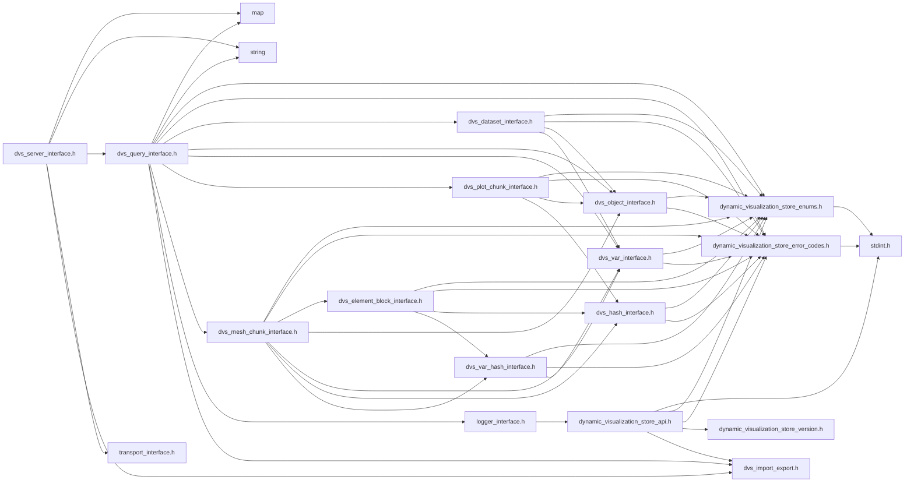
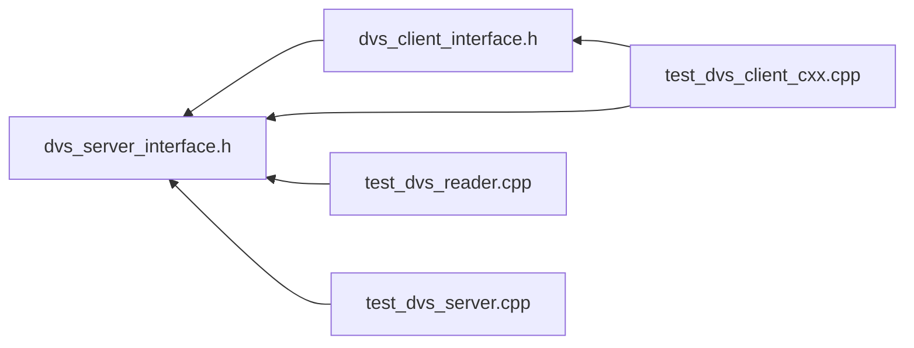

# File dvs\_server\_interface.h

<a id="dvs__server__interface_8h"></a>

![][C++]

C++ Server API for using Dynamic Visualization Store Server.


```
1.) Instantiate [DVS::IServer](#class_d_v_s_1_1_i_server) using [DVS::CREATE_SERVER_INSTANCE()](#dvs__server__interface_8h_1a852580b9a49ac305e4ae26ca637bcc75) method
2.) Set options using [DVS::IServer::set_options()](#class_d_v_s_1_1_i_server_1a964b0420773ec5f47dbcea04334ba0d3) or [DVS::IServer::set_option()](#class_d_v_s_1_1_i_server_1a1edb4dec67086f10bc0329b6adf9084c)
3.) Startup server using [DVS::IServer::startup()](#class_d_v_s_1_1_i_server_1a6699cf48b29583ab3391b9b8397e611c)
4.) If needed see if it's running via [DVS::IServer::running()](#class_d_v_s_1_1_i_server_1a5fdee3f663dbe7b7dab11621f76737e2)
5.) Shutdown server using [DVS::IServer::shutdown()](#class_d_v_s_1_1_i_server_1a7ce6bb49a2d383b0821267415a93802d)
6.) Destroy instance using [DVS::DESTROY_SERVER_INSTANCE()](#dvs__server__interface_8h_1adcdcbab1954ec53631a7136af7fc49b8)
```


## Classes

* [DVS::IServer](class_d_v_s_1_1_i_server.md#class_d_v_s_1_1_i_server)

## Namespaces

* [DVS](namespace_d_v_s.md#namespace_d_v_s)

## Includes

* <map>
* <string>
* [dvs_query_interface.h](dvs__query__interface_8h.md#dvs__query__interface_8h)
* transport_interface.h
* dvs_import_export.h





## Included by

* [dvs_client_interface.h](dvs__client__interface_8h.md#dvs__client__interface_8h)
* [test_dvs_client_cxx.cpp](test__dvs__client__cxx_8cpp.md#test__dvs__client__cxx_8cpp)
* [test_dvs_reader.cpp](test__dvs__reader_8cpp.md#test__dvs__reader_8cpp)
* [test_dvs_server.cpp](test__dvs__server_8cpp.md#test__dvs__server_8cpp)





## Source


```cpp
/*  *************************************************************
 *   Copyright 2017-2025 ANSYS, Inc.
 *   All Rights Reserved.
 *
 *        Restricted Rights Legend
 *
 *   Use, duplication, or disclosure of this
 *   software and its documentation by the
 *   Government is subject to restrictions as
 *   set forth in subdivision [(b)(3)(ii)] of
 *   the Rights in Technical Data and Computer
 *   Software clause at 52.227-7013.
 *  *************************************************************
 */

#ifndef ___DVS_SERVER_INTERFACE___
#define ___DVS_SERVER_INTERFACE___


#include <map>
#include <string>

#include "dvs_query_interface.h"
#include "transport_interface.h"
#include "dvs_import_export.h"


namespace DVS
{
    class IServer
    {
    public:

        IServer() = default; 
        virtual ~IServer() = default; 
        IServer(IServer&&) = default;  
        IServer& operator=(IServer&&) = default; 
        IServer(const IServer&) = default; 
        IServer& operator=(const IServer&) = default; 

        virtual void set_options(const std::map<const char*,const char*>& options) = 0;

        virtual void set_option(const char* key, const char* value) = 0;

        virtual void clear_options() = 0;

        virtual bool running() const = 0;

        virtual dvs_ret get_timestep_count(uint32_t& num_pending, uint32_t& num_complete) const = 0;

        virtual dvs_ret startup(uint32_t server_number, uint32_t local_ranks) = 0;

        virtual dvs_ret startup_unthreaded(uint32_t server_number, uint32_t local_ranks) = 0;

        virtual dvs_ret update() = 0;

        virtual dvs_ret terminating() = 0;

        virtual void shutdown() = 0;

        virtual ITransport* create_transport(const std::string& shared_secret) = 0;

        virtual const char* get_uri() = 0;

        virtual DVS::IQuery* create_query(const std::string& filter=std::string(), DVS::IQuery* parent=nullptr) = 0;

    };

    DVS_DLL_EXPORT IServer* CREATE_SERVER_INSTANCE(const char* uri);

    DVS_DLL_EXPORT void DESTROY_SERVER_INSTANCE(DVS::IServer* destroy);
    
}

#endif //___DVS_SERVER_INTERFACE___
```


[public]: https://img.shields.io/badge/-public-brightgreen (public)
[protected]: https://img.shields.io/badge/-protected-yellow (protected)
[static]: https://img.shields.io/badge/-static-lightgrey (static)
[C++]: https://img.shields.io/badge/language-C%2B%2B-blue (C++)
[Python]: https://img.shields.io/badge/language-Python-blue (Python)
[private]: https://img.shields.io/badge/-private-red (private)
[const]: https://img.shields.io/badge/-const-lightblue (const)
[Markdown]: https://img.shields.io/badge/language-Markdown-blue (Markdown)