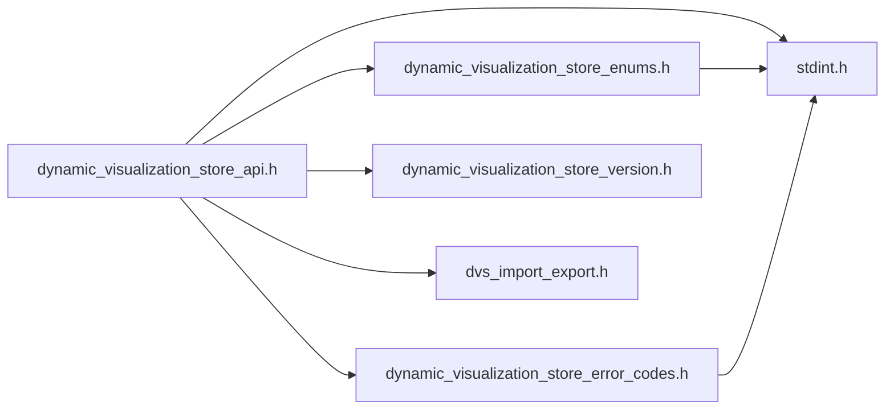
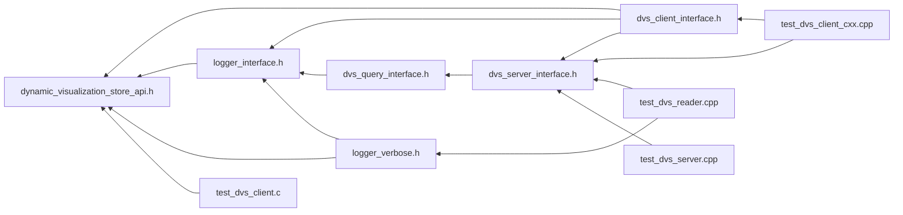

# File dynamic\_visualization\_store\_api.h

<a id="dynamic__visualization__store__api_8h"></a>

![][C]

C API for using Dynamic Visualization Store.


```
Setup the initial connection and needed information

1.) Call [dvs_server_create()](#dynamic__visualization__store__api_8h_1a06196ff56fe7f270172239c1be4ce0cd)
2.) Call [dvs_connect()](#dynamic__visualization__store__api_8h_1ab96812d4412a9af10e7e7924c572a7c9)
3.) Provide a logging method ([dvs_register_log_func()](#dynamic__visualization__store__api_8h_1ae57cf8cf0b10421aace6df32a98c60ae)) (optional)
4.) Begin initialization ([dvs_begin_init()](#dynamic__visualization__store__api_8h_1a3744408f15cd4a36d19880d24d442a0d))
5.) Set unit system ([dvs_set_unit_system()](#dynamic__visualization__store__api_8h_1a14b52ceff846429259cab42ee11579f0)) (optional)
6.) Add information about all parts if applicable ([dvs_add_part_info()](#dynamic__visualization__store__api_8h_1a4e8a904ae19fd7f2b0c300543bc42576))
7.) Add information about all variables if applicable ([dvs_add_var_info()](#dynamic__visualization__store__api_8h_1a0b9bbed0db0a5f3e91af8a02aed48e1e)) (optional)
8.) Add information about all plots if applicable ([dvs_add_plot_info()](#dynamic__visualization__store__api_8h_1afe298f932fd909b7caabd6f430489b16)) (optional)
9.) End initialization ([dvs_end_init()](#dynamic__visualization__store__api_8h_1ac4d82529053c964b76bd42916c51835e))

Now at the end of each timestep we can push data to the ensight server

1.) Begin the update ([dvs_begin_update()](#dynamic__visualization__store__api_8h_1aaac598618be531e8aa2b72ad41e18537))
2.) For Each Part
        Update mesh/nodes ([dvs_update_nodes()](#dynamic__visualization__store__api_8h_1a7fdc956a0712ef2a60195fa013e59222))
3.) For Each Element Type
        Update Element ([dvs_update_elements()](#dynamic__visualization__store__api_8h_1a05061077e83272567bbc43367c0b8e74))
4.) For Each Variable
        If location on case or part use corresponding update methods i.e. [dvs_update_var_case_scalar()](#dynamic__visualization__store__api_8h_1ad97de401448e85da8cb13d3e45cfb227),
        [dvs_update_var_case_vector()](#dynamic__visualization__store__api_8h_1ab4e0ac12018e08551d6b8121971fea7e), [dvs_update_var_part_scalar()](#dynamic__visualization__store__api_8h_1a853ed7ef2608619b82dd51055cee3f60), [dvs_update_var_part_vector()](#dynamic__visualization__store__api_8h_1a0b8da4c016b09b93b3fcf71afe384b21)

        If location element or node use corresponding update methods i.e. [dvs_update_var_element_scalar()](#dynamic__visualization__store__api_8h_1aae3c0a5237c193d05266fba6e6798a4c),
        [dvs_update_var_element_vector()](#dynamic__visualization__store__api_8h_1af3cd5ecfd626ca40b1273634734f38d5), dvs_update_var_node_scalar, [dvs_update_var_node_vector()](#dynamic__visualization__store__api_8h_1a9086155711ed76c6141bdde2291f140a)
4.) For Each Plot
         Update plot values ([dvs_update_plot()](#dynamic__visualization__store__api_8h_1a433ce5100e551dca71dee92b0afe1563))
5.) End update ([dvs_end_update()](#dynamic__visualization__store__api_8h_1ae75177bf47fcb28313e79840bf778c75))

On application shutdown let the API shut itself down

1.) Call [dvs_shutdown()](#dynamic__visualization__store__api_8h_1a815bb1d2251e35e3bfd3c44a4a338052) to cleanup data structures
```


## Classes

* [dvs\_part\_info](structdvs__part__info.md#structdvs__part__info)
* [dvs\_var\_info](structdvs__var__info.md#structdvs__var__info)
* [dvs\_plot\_info](structdvs__plot__info.md#structdvs__plot__info)

## Includes

* <stdint.h>
* [dynamic_visualization_store_enums.h](dynamic__visualization__store__enums_8h.md#dynamic__visualization__store__enums_8h)
* [dynamic_visualization_store_error_codes.h](dynamic__visualization__store__error__codes_8h.md#dynamic__visualization__store__error__codes_8h)
* [dynamic_visualization_store_version.h](dynamic__visualization__store__version_8h.md#dynamic__visualization__store__version_8h)
* dvs_import_export.h





## Included by

* [dvs_client_interface.h](dvs__client__interface_8h.md#dvs__client__interface_8h)
* [logger_interface.h](logger__interface_8h.md#logger__interface_8h)
* [logger_verbose.h](logger__verbose_8h.md#logger__verbose_8h)
* [test_dvs_client.c](test__dvs__client_8c.md#test__dvs__client_8c)





## Typedefs

<a id="dynamic__visualization__store__api_8h_1a80c7c60e9cd61fcc0a0aacac09d66947"></a>
### Typedef dvs\_log\_func

![][public]


```cpp
typedef void(* dvs_log_func) (void *, const char *)
```


Function pointer for logging methods.

void* param is for data to be sent back to logging method, might be NULL


**Return type**: void(*

## Functions

<a id="dynamic__visualization__store__api_8h_1ab96812d4412a9af10e7e7924c572a7c9"></a>
### Function dvs\_connect

![][public]


```cpp
DVS_DLL_EXPORT dvs_ret dvs_connect(int32_t server_id, enum dvs_client_flags flags, const char *secret, int32_t *session_id)
```


Connect to dvs server.

This call will connect to a server that has been created using [dvs\_server\_create()](dynamic__visualization__store__api_8h.md#dynamic__visualization__store__api_8h_1a06196ff56fe7f270172239c1be4ce0cd) If server is being created locally [dvs\_server\_start()](dynamic__visualization__store__api_8h.md#dynamic__visualization__store__api_8h_1aa5722a5316ee73bdd998c9a327e8cb3d) must be called before connecting.


**Parameters**:

* **server_id**: id of server created by [dvs\_server\_create()](dynamic__visualization__store__api_8h.md#dynamic__visualization__store__api_8h_1a06196ff56fe7f270172239c1be4ce0cd)
* **flags**: flags for client setup see [dvs\_client\_flags](dynamic__visualization__store__enums_8h.md#dynamic__visualization__store__enums_8h_1aec8cbac60b9cafe5d1c0ad6593f05e9f) ([dynamic\_visualization\_store\_enums.h](dynamic__visualization__store__enums_8h.md#dynamic__visualization__store__enums_8h))
* **secret**: shared secret to use for client, can be NULL
* **session_id**: dynamic id created for connection, used for client dvs calls


**Returns**:

0 on success, otherwise -1


**Parameters**:

* int32_t **server_id**
* enum [dvs\_client\_flags](dynamic__visualization__store__enums_8h.md#dynamic__visualization__store__enums_8h_1aec8cbac60b9cafe5d1c0ad6593f05e9f) **flags**
* const char * **secret**
* int32_t * **session_id**

**Return type**: DVS_DLL_EXPORT [dvs\_ret](dynamic__visualization__store__error__codes_8h.md#dynamic__visualization__store__error__codes_8h_1a1d7466ae72e89fe36cbf2408b4f7d9c1)

<a id="dynamic__visualization__store__api_8h_1aca9b6d6040443c3adf4d873dd1afbb4f"></a>
### Function dvs\_client\_set\_option

![][public]


```cpp
DVS_DLL_EXPORT dvs_ret dvs_client_set_option(int32_t session_id, const char *key, const char *value)
```


Set an option on the client.

Options are key/value string pairs that can be used to set various options on the client or transport layer.


See [dynamic\_visualization\_store\_error\_codes.h](dynamic__visualization__store__error__codes_8h.md#dynamic__visualization__store__error__codes_8h) for possible error codes


**Parameters**:

* **session_id**: id for session created by [dvs\_connect()](dynamic__visualization__store__api_8h.md#dynamic__visualization__store__api_8h_1ab96812d4412a9af10e7e7924c572a7c9)
* **key**: option key
* **value**: option value


**Returns**:

[dvs\_ret](dynamic__visualization__store__error__codes_8h.md#dynamic__visualization__store__error__codes_8h_1a1d7466ae72e89fe36cbf2408b4f7d9c1) DVS_NONE on success, otherwise see method description


**Parameters**:

* int32_t **session_id**
* const char * **key**
* const char * **value**

**Return type**: DVS_DLL_EXPORT [dvs\_ret](dynamic__visualization__store__error__codes_8h.md#dynamic__visualization__store__error__codes_8h_1a1d7466ae72e89fe36cbf2408b4f7d9c1)

<a id="dynamic__visualization__store__api_8h_1ae57cf8cf0b10421aace6df32a98c60ae"></a>
### Function dvs\_register\_log\_func

![][public]


```cpp
DVS_DLL_EXPORT dvs_ret dvs_register_log_func(int32_t session_id, void *user_data, dvs_log_func func, enum dvs_log_flags flags)
```


Register logging function for client to call (optional but recommended).

Will not see any logging messages if not registered


**Parameters**:

* **session_id**: id for session created by [dvs\_connect()](dynamic__visualization__store__api_8h.md#dynamic__visualization__store__api_8h_1ab96812d4412a9af10e7e7924c572a7c9)
* **user_data**: user data that will be passed into [dvs\_log\_func](dynamic__visualization__store__api_8h.md#dynamic__visualization__store__api_8h_1a80c7c60e9cd61fcc0a0aacac09d66947) calls
* **func**: function pointer for logging (see [dvs\_log\_func](dynamic__visualization__store__api_8h.md#dynamic__visualization__store__api_8h_1a80c7c60e9cd61fcc0a0aacac09d66947))
* **flags**: which items to be logged, see [dvs\_log\_flags](dynamic__visualization__store__enums_8h.md#dynamic__visualization__store__enums_8h_1a9bca12092877a90e6c497994093a8609) ([dynamic\_visualization\_store\_enums.h](dynamic__visualization__store__enums_8h.md#dynamic__visualization__store__enums_8h))


**Returns**:

[dvs\_ret](dynamic__visualization__store__error__codes_8h.md#dynamic__visualization__store__error__codes_8h_1a1d7466ae72e89fe36cbf2408b4f7d9c1) TODO


**Parameters**:

* int32_t **session_id**
* void * **user_data**
* [dvs\_log\_func](dynamic__visualization__store__api_8h.md#dynamic__visualization__store__api_8h_1a80c7c60e9cd61fcc0a0aacac09d66947) **func**
* enum [dvs\_log\_flags](dynamic__visualization__store__enums_8h.md#dynamic__visualization__store__enums_8h_1a9bca12092877a90e6c497994093a8609) **flags**

**Return type**: DVS_DLL_EXPORT [dvs\_ret](dynamic__visualization__store__error__codes_8h.md#dynamic__visualization__store__error__codes_8h_1a1d7466ae72e89fe36cbf2408b4f7d9c1)

<a id="dynamic__visualization__store__api_8h_1ab8e85aad9b7ec78976db76017803a6b6"></a>
### Function dvs\_get\_version

![][public]


```cpp
DVS_DLL_EXPORT const char * dvs_get_version()
```


Get the current version of the built library.

This gets the current semantic version of the DVS library. Can be checked against DVS_CURRENT_API_VERSION in [dynamic\_visualization\_store\_version.h](dynamic__visualization__store__version_8h.md#dynamic__visualization__store__version_8h)


This version follows semantic versioning of MAJOR.MINOR.PATCH. Any change to MAJOR or MINOR should be considered incompatible and the library should be updated.


**Returns**:

const* the current version of the built library


**Return type**: DVS_DLL_EXPORT const char *

<a id="dynamic__visualization__store__api_8h_1a3744408f15cd4a36d19880d24d442a0d"></a>
### Function dvs\_begin\_init

![][public]


```cpp
DVS_DLL_EXPORT dvs_ret dvs_begin_init(int32_t session_id, const char *dataset_name, uint32_t current_rank, uint32_t total_ranks, uint32_t num_chunks)
```


begin setup of rank

**Parameters**:

* **session_id**: id for session created by [dvs\_connect()](dynamic__visualization__store__api_8h.md#dynamic__visualization__store__api_8h_1ab96812d4412a9af10e7e7924c572a7c9)
* **dataset_name**: name for dataset
* **current_rank**: Rank this solver is processing (zero based)
* **total_ranks**: Total number of ranks across solver nodes
* **num_chunks**: Number of chunks for this rank (usually 1)


**Returns**:

[dvs\_ret](dynamic__visualization__store__error__codes_8h.md#dynamic__visualization__store__error__codes_8h_1a1d7466ae72e89fe36cbf2408b4f7d9c1) TODO


**Parameters**:

* int32_t **session_id**
* const char * **dataset_name**
* uint32_t **current_rank**
* uint32_t **total_ranks**
* uint32_t **num_chunks**

**Return type**: DVS_DLL_EXPORT [dvs\_ret](dynamic__visualization__store__error__codes_8h.md#dynamic__visualization__store__error__codes_8h_1a1d7466ae72e89fe36cbf2408b4f7d9c1)

<a id="dynamic__visualization__store__api_8h_1a14b52ceff846429259cab42ee11579f0"></a>
### Function dvs\_set\_unit\_system

![][public]


```cpp
DVS_DLL_EXPORT dvs_ret dvs_set_unit_system(int32_t session_id, const char *system)
```


Set a unit system (optional but recommended).

Note: This cannot be changed once [dvs\_end\_init()](dynamic__visualization__store__api_8h.md#dynamic__visualization__store__api_8h_1ac4d82529053c964b76bd42916c51835e) is called


**Parameters**:

* **session_id**: id for session created by [dvs\_connect()](dynamic__visualization__store__api_8h.md#dynamic__visualization__store__api_8h_1ab96812d4412a9af10e7e7924c572a7c9)
* **system**: UTF-8 compatible unit system see: [https://nexusdemo.ensight.com/docs/python/html/ENS_UNITSSchema.html](https://nexusdemo.ensight.com/docs/python/html/ENS_UNITSSchema.html)


**Returns**:

[dvs\_ret](dynamic__visualization__store__error__codes_8h.md#dynamic__visualization__store__error__codes_8h_1a1d7466ae72e89fe36cbf2408b4f7d9c1) TODO


**Parameters**:

* int32_t **session_id**
* const char * **system**

**Return type**: DVS_DLL_EXPORT [dvs\_ret](dynamic__visualization__store__error__codes_8h.md#dynamic__visualization__store__error__codes_8h_1a1d7466ae72e89fe36cbf2408b4f7d9c1)

<a id="dynamic__visualization__store__api_8h_1ac5c67fdc3806bf89eebbe49e6daea5c2"></a>
### Function dvs\_add\_metadata

![][public]


```cpp
DVS_DLL_EXPORT dvs_ret dvs_add_metadata(int32_t session_id, const char *const metadata_keys[], const char *const metadata_vals[], uint32_t num_metadata_pairs)
```


Add metadata for the current dataset.

Errors:
* DVS_NONE: Success

* DVS_PARAM_NULL: Method called with NULL params or num_metadata_pairs == 0

* DVS_CLIENT_INVALID_TRANSPORT: Internal error, should not happen

* DVS_TRANSPORT_NULL_INVALID_SERVER: Internal error, should not happen

* DVS_VERSION_MISMATCH: Client version out of date with server version, update server and client to match

* DVS_VERSION_UNKNOWN: Unable to determine server version, update the server to match the client

* DVS_TRANSPORT_SERVICE_FAILURE: Normally caused by server call retry time out or invalid secret key


**Parameters**:

* **session_id**: id for session created by [dvs\_connect()](dynamic__visualization__store__api_8h.md#dynamic__visualization__store__api_8h_1ab96812d4412a9af10e7e7924c572a7c9)
* **metadata_keys**: string array of UTF-8 Compatible string keys, each string should be null terminated
* **metadata_vals**: string array of UTF-8 Compatible string values, each string should be null terminated
* **num_metadata_pairs**: number of key/value pairs in the arrays


**Returns**:

[dvs\_ret](dynamic__visualization__store__error__codes_8h.md#dynamic__visualization__store__error__codes_8h_1a1d7466ae72e89fe36cbf2408b4f7d9c1) DVS_NONE on success, otherwise see method description


**Parameters**:

* int32_t **session_id**
* const char *const **metadata_keys**
* const char *const **metadata_vals**
* uint32_t **num_metadata_pairs**

**Return type**: DVS_DLL_EXPORT [dvs\_ret](dynamic__visualization__store__error__codes_8h.md#dynamic__visualization__store__error__codes_8h_1a1d7466ae72e89fe36cbf2408b4f7d9c1)

<a id="dynamic__visualization__store__api_8h_1a4e8a904ae19fd7f2b0c300543bc42576"></a>
### Function dvs\_add\_part\_info

![][public]


```cpp
DVS_DLL_EXPORT dvs_ret dvs_add_part_info(int32_t session_id, const struct dvs_part_info *parts, uint32_t num_parts)
```


Add part info for simulation.

Note: These cannot be changed once [dvs\_end\_init()](dynamic__visualization__store__api_8h.md#dynamic__visualization__store__api_8h_1ac4d82529053c964b76bd42916c51835e) is called


**Parameters**:

* **session_id**: id for session created by [dvs\_connect()](dynamic__visualization__store__api_8h.md#dynamic__visualization__store__api_8h_1ab96812d4412a9af10e7e7924c572a7c9)
* **parts**: this solver handles
* **num_parts**: size of parts array, maximum number of parts (2^30)


**Returns**:

[dvs\_ret](dynamic__visualization__store__error__codes_8h.md#dynamic__visualization__store__error__codes_8h_1a1d7466ae72e89fe36cbf2408b4f7d9c1) TODO


**Parameters**:

* int32_t **session_id**
* const struct [dvs\_part\_info](structdvs__part__info.md#structdvs__part__info) * **parts**
* uint32_t **num_parts**

**Return type**: DVS_DLL_EXPORT [dvs\_ret](dynamic__visualization__store__error__codes_8h.md#dynamic__visualization__store__error__codes_8h_1a1d7466ae72e89fe36cbf2408b4f7d9c1)

<a id="dynamic__visualization__store__api_8h_1a0b9bbed0db0a5f3e91af8a02aed48e1e"></a>
### Function dvs\_add\_var\_info

![][public]


```cpp
DVS_DLL_EXPORT dvs_ret dvs_add_var_info(int32_t session_id, const struct dvs_var_info *vars, uint32_t num_vars)
```


Add var info for simulation.

Note: These cannot be changed once [dvs\_end\_init()](dynamic__visualization__store__api_8h.md#dynamic__visualization__store__api_8h_1ac4d82529053c964b76bd42916c51835e) is called


**Parameters**:

* **session_id**: id for session created by [dvs\_connect()](dynamic__visualization__store__api_8h.md#dynamic__visualization__store__api_8h_1ab96812d4412a9af10e7e7924c572a7c9)
* **vars**: variables definitions which will be sent from this compute node
* **num_vars**: size of var array


**Returns**:

[dvs\_ret](dynamic__visualization__store__error__codes_8h.md#dynamic__visualization__store__error__codes_8h_1a1d7466ae72e89fe36cbf2408b4f7d9c1) TODO


**Parameters**:

* int32_t **session_id**
* const struct [dvs\_var\_info](structdvs__var__info.md#structdvs__var__info) * **vars**
* uint32_t **num_vars**

**Return type**: DVS_DLL_EXPORT [dvs\_ret](dynamic__visualization__store__error__codes_8h.md#dynamic__visualization__store__error__codes_8h_1a1d7466ae72e89fe36cbf2408b4f7d9c1)

<a id="dynamic__visualization__store__api_8h_1afe298f932fd909b7caabd6f430489b16"></a>
### Function dvs\_add\_plot\_info

![][public]


```cpp
DVS_DLL_EXPORT dvs_ret dvs_add_plot_info(int32_t session_id, const struct dvs_plot_info *plots, uint32_t num_plots)
```


Add plot info for simulation.

NOTE: These cannot be changed once end_init() is called.


**Parameters**:

* **session_id**: id for session created by [dvs\_connect()](dynamic__visualization__store__api_8h.md#dynamic__visualization__store__api_8h_1ab96812d4412a9af10e7e7924c572a7c9)
* **plots**: plots this solver handles
* **num_plots**: size of plots array


**Returns**:

[dvs\_ret](dynamic__visualization__store__error__codes_8h.md#dynamic__visualization__store__error__codes_8h_1a1d7466ae72e89fe36cbf2408b4f7d9c1) TODO


**Parameters**:

* int32_t **session_id**
* const struct [dvs\_plot\_info](structdvs__plot__info.md#structdvs__plot__info) * **plots**
* uint32_t **num_plots**

**Return type**: DVS_DLL_EXPORT [dvs\_ret](dynamic__visualization__store__error__codes_8h.md#dynamic__visualization__store__error__codes_8h_1a1d7466ae72e89fe36cbf2408b4f7d9c1)

<a id="dynamic__visualization__store__api_8h_1a5a6cd68f61a53bce6780d3ef95038277"></a>
### Function dvs\_get\_num\_part\_info

![][public]


```cpp
DVS_DLL_EXPORT uint32_t dvs_get_num_part_info(int32_t session_id)
```


Get the number of [dvs\_part\_info](structdvs__part__info.md#structdvs__part__info) objects for this client session.

Note: This checks the local client session information, does not contact server


**Parameters**:

* **session_id**: which client session id to check


**Returns**:

uint32_t number of [dvs\_part\_info](structdvs__part__info.md#structdvs__part__info) objects, or 0 on error


**Parameters**:

* int32_t **session_id**

**Return type**: DVS_DLL_EXPORT uint32_t

<a id="dynamic__visualization__store__api_8h_1ad75625cedecbcd365c868c9893c6c2d8"></a>
### Function dvs\_get\_num\_var\_info

![][public]


```cpp
DVS_DLL_EXPORT uint32_t dvs_get_num_var_info(int32_t session_id)
```


Get the number of [dvs\_var\_info](structdvs__var__info.md#structdvs__var__info) objects for this client session.

Note: This checks the local client session information, does not contact server


**Parameters**:

* **session_id**: which client session id to check


**Returns**:

uint32_t number of [dvs\_var\_info](structdvs__var__info.md#structdvs__var__info) objects, or 0 on error


**Parameters**:

* int32_t **session_id**

**Return type**: DVS_DLL_EXPORT uint32_t

<a id="dynamic__visualization__store__api_8h_1aa44dcb6596c7833d2b9fe2a0435bb4c4"></a>
### Function dvs\_get\_num\_plot\_info

![][public]


```cpp
DVS_DLL_EXPORT uint32_t dvs_get_num_plot_info(int32_t session_id)
```


Get the number of [dvs\_plot\_info](structdvs__plot__info.md#structdvs__plot__info) objects for this client session.

Note: This checks the local client session information, does not contact server


**Parameters**:

* **session_id**: which client session id to check


**Returns**:

uint32_t number of [dvs\_plot\_info](structdvs__plot__info.md#structdvs__plot__info) objects, or 0 on error


**Parameters**:

* int32_t **session_id**

**Return type**: DVS_DLL_EXPORT uint32_t

<a id="dynamic__visualization__store__api_8h_1a5b5a64e37bd6830f518947e7a0f7985e"></a>
### Function dvs\_get\_part\_info

![][public]


```cpp
DVS_DLL_EXPORT const struct dvs_part_info * dvs_get_part_info(int32_t session_id, uint32_t index)
```


Get the [dvs\_part\_info](structdvs__part__info.md#structdvs__part__info) object for this index.

Note: This checks the local client session information, does not contact server


**Parameters**:

* **session_id**: which client session id to check
* **index**: index of the [dvs\_part\_info](structdvs__part__info.md#structdvs__part__info) object to retrieve


**Returns**:

const dvs_part_info* object found or NULL on not found or error


**Parameters**:

* int32_t **session_id**
* uint32_t **index**

**Return type**: DVS_DLL_EXPORT const struct [dvs\_part\_info](structdvs__part__info.md#structdvs__part__info) *

<a id="dynamic__visualization__store__api_8h_1aefeb5e79919700a670799d9f3e8f0e2c"></a>
### Function dvs\_get\_part\_id

![][public]


```cpp
DVS_DLL_EXPORT dvs_ret dvs_get_part_id(int32_t session_id, const char *name, uint32_t *id)
```


Get the ID being used by the client for the named part.

Errors: DVS_NONE: Success DVS_INVALID_NAME: No object with name found DVS_ID_NO_VALID_SESSION: No session found matching session_id DVS_ID_INVALID_TYPE: Session id is of wrong type (possibly server) DVS_PARAM_NULL: Null param passed in


**Parameters**:

* **session_id**: which client session id to check
* **name**: the name of the part to search for
* **id**: UINT32_MAX on failure, otherwise the id of the part for this client


**Returns**:

DVS_NONE on success, else see method description


**Parameters**:

* int32_t **session_id**
* const char * **name**
* uint32_t * **id**

**Return type**: DVS_DLL_EXPORT [dvs\_ret](dynamic__visualization__store__error__codes_8h.md#dynamic__visualization__store__error__codes_8h_1a1d7466ae72e89fe36cbf2408b4f7d9c1)

<a id="dynamic__visualization__store__api_8h_1a8992f4a5e6c36c5e4da67968b170313c"></a>
### Function dvs\_get\_var\_info

![][public]


```cpp
DVS_DLL_EXPORT const struct dvs_var_info * dvs_get_var_info(int32_t session_id, uint32_t index)
```


Get the [dvs\_var\_info](structdvs__var__info.md#structdvs__var__info) object for this index.

Note: This checks the local client session information, does not contact server


**Parameters**:

* **session_id**: which client session id to check
* **index**: index of the [dvs\_var\_info](structdvs__var__info.md#structdvs__var__info) object to retrieve


**Returns**:

const dvs_var_info* object found or NULL on not found or error


**Parameters**:

* int32_t **session_id**
* uint32_t **index**

**Return type**: DVS_DLL_EXPORT const struct [dvs\_var\_info](structdvs__var__info.md#structdvs__var__info) *

<a id="dynamic__visualization__store__api_8h_1a355c95f11b171a15755f748da3349e67"></a>
### Function dvs\_get\_var\_id

![][public]


```cpp
DVS_DLL_EXPORT dvs_ret dvs_get_var_id(int32_t session_id, const char *name, uint32_t *id)
```


Get the ID being used by the client for the named var.

Errors: DVS_NONE: Success DVS_INVALID_NAME: No object with name found DVS_ID_NO_VALID_SESSION: No session found matching session_id DVS_ID_INVALID_TYPE: Session id is of wrong type (possibly server) DVS_PARAM_NULL: Null param passed in


**Parameters**:

* **session_id**: which client session id to check
* **name**: the name of the var to search for
* **id**: UINT32_MAX on failure, otherwise the id of the var for this client


**Returns**:

DVS_NONE on success, else see method description


**Parameters**:

* int32_t **session_id**
* const char * **name**
* uint32_t * **id**

**Return type**: DVS_DLL_EXPORT [dvs\_ret](dynamic__visualization__store__error__codes_8h.md#dynamic__visualization__store__error__codes_8h_1a1d7466ae72e89fe36cbf2408b4f7d9c1)

<a id="dynamic__visualization__store__api_8h_1ac3fca7087e8b4366686cef98a95f241f"></a>
### Function dvs\_get\_plot\_info

![][public]


```cpp
DVS_DLL_EXPORT const struct dvs_plot_info * dvs_get_plot_info(int32_t session_id, uint32_t index)
```


Get the [dvs\_plot\_info](structdvs__plot__info.md#structdvs__plot__info) object for this index.

Note: This checks the local client session information, does not contact server


**Parameters**:

* **session_id**: which client session id to check
* **index**: index of the [dvs\_plot\_info](structdvs__plot__info.md#structdvs__plot__info) object to retrieve


**Returns**:

const dvs_plot_info* object found or NULL on not found or error


**Parameters**:

* int32_t **session_id**
* uint32_t **index**

**Return type**: DVS_DLL_EXPORT const struct [dvs\_plot\_info](structdvs__plot__info.md#structdvs__plot__info) *

<a id="dynamic__visualization__store__api_8h_1a3ae625f138573f6fa9904f0609ca1eb1"></a>
### Function dvs\_get\_plot\_id

![][public]


```cpp
DVS_DLL_EXPORT dvs_ret dvs_get_plot_id(int32_t session_id, const char *name, uint32_t *id)
```


Get the ID being used by the client for the named plot.

Errors: DVS_NONE: Success DVS_INVALID_NAME: No object with name found DVS_ID_NO_VALID_SESSION: No session found matching session_id DVS_ID_INVALID_TYPE: Session id is of wrong type (possibly server) DVS_PARAM_NULL: Null param passed in


**Parameters**:

* **session_id**: which client session id to check
* **name**: the name of the plot to search for
* **id**: UINT32_MAX on failure, otherwise the id of the plot for this client


**Returns**:

DVS_NONE on success, else see method description


**Parameters**:

* int32_t **session_id**
* const char * **name**
* uint32_t * **id**

**Return type**: DVS_DLL_EXPORT [dvs\_ret](dynamic__visualization__store__error__codes_8h.md#dynamic__visualization__store__error__codes_8h_1a1d7466ae72e89fe36cbf2408b4f7d9c1)

<a id="dynamic__visualization__store__api_8h_1ac4d82529053c964b76bd42916c51835e"></a>
### Function dvs\_end\_init

![][public]


```cpp
DVS_DLL_EXPORT dvs_ret dvs_end_init(int32_t session_id)
```


end the initialization of the rank

This must be called to let server know initialization for this rank is complete


**Parameters**:

* **session_id**: id for session created by [dvs\_connect()](dynamic__visualization__store__api_8h.md#dynamic__visualization__store__api_8h_1ab96812d4412a9af10e7e7924c572a7c9)


**Returns**:

[dvs\_ret](dynamic__visualization__store__error__codes_8h.md#dynamic__visualization__store__error__codes_8h_1a1d7466ae72e89fe36cbf2408b4f7d9c1) TODO


**Parameters**:

* int32_t **session_id**

**Return type**: DVS_DLL_EXPORT [dvs\_ret](dynamic__visualization__store__error__codes_8h.md#dynamic__visualization__store__error__codes_8h_1a1d7466ae72e89fe36cbf2408b4f7d9c1)

<a id="dynamic__visualization__store__api_8h_1aaac598618be531e8aa2b72ad41e18537"></a>
### Function dvs\_begin\_update

![][public]


```cpp
DVS_DLL_EXPORT dvs_ret dvs_begin_update(int32_t session_id, uint32_t update_num, uint32_t rank, uint32_t chunk, float time)
```


Method to begin an update.

**Parameters**:

* **session_id**: id for session created by [dvs\_connect()](dynamic__visualization__store__api_8h.md#dynamic__visualization__store__api_8h_1ab96812d4412a9af10e7e7924c572a7c9)
* **update_num**: update number of this update, must be monotonically increasing
* **rank**: the rank we are sending an update for (zero based)
* **chunk**: the chunk number this update is for (zero based)
* **time**: time in seconds this update is for


**Returns**:

[dvs\_ret](dynamic__visualization__store__error__codes_8h.md#dynamic__visualization__store__error__codes_8h_1a1d7466ae72e89fe36cbf2408b4f7d9c1) TODO


**Parameters**:

* int32_t **session_id**
* uint32_t **update_num**
* uint32_t **rank**
* uint32_t **chunk**
* float **time**

**Return type**: DVS_DLL_EXPORT [dvs\_ret](dynamic__visualization__store__error__codes_8h.md#dynamic__visualization__store__error__codes_8h_1a1d7466ae72e89fe36cbf2408b4f7d9c1)

<a id="dynamic__visualization__store__api_8h_1af2223790199210c6fd1f5ac5ade6c60a"></a>
### Function dvs\_update\_copy\_previous\_part

![][public]


```cpp
DVS_DLL_EXPORT dvs_ret dvs_update_copy_previous_part(int32_t session_id, uint32_t part_id, const char *options)
```


Copy data from the previous timestep before applying other data.

Currently we only support the options of empty string, mesh or mesh.vars empty string and mesh.vars will copy the mesh, connectivity, and nodal/elemental variables. mesh only copies the mesh and connectivity. Note: Currently plots and case/part constant variables will not be copied via this option and must always be sent.


**Parameters**:

* **session_id**: id for session created by [dvs\_connect()](dynamic__visualization__store__api_8h.md#dynamic__visualization__store__api_8h_1ab96812d4412a9af10e7e7924c572a7c9)
* **part_id**: the id of the part we are copying data for, UINT32_MAX to select all parts
* **options**: options to copy, see method description


**Returns**:

[dvs\_ret](dynamic__visualization__store__error__codes_8h.md#dynamic__visualization__store__error__codes_8h_1a1d7466ae72e89fe36cbf2408b4f7d9c1) TODO


**Parameters**:

* int32_t **session_id**
* uint32_t **part_id**
* const char * **options**

**Return type**: DVS_DLL_EXPORT [dvs\_ret](dynamic__visualization__store__error__codes_8h.md#dynamic__visualization__store__error__codes_8h_1a1d7466ae72e89fe36cbf2408b4f7d9c1)

<a id="dynamic__visualization__store__api_8h_1a7fdc956a0712ef2a60195fa013e59222"></a>
### Function dvs\_update\_nodes

![][public]


```cpp
DVS_DLL_EXPORT dvs_ret dvs_update_nodes(int32_t session_id, uint32_t part_id, const float *x, const float *y, const float *z, uint32_t num_values)
```


Update nodes for a specific part.

**Parameters**:

* **session_id**: id for session created by [dvs\_connect()](dynamic__visualization__store__api_8h.md#dynamic__visualization__store__api_8h_1ab96812d4412a9af10e7e7924c572a7c9)
* **part_id**: the id of part we are updating nodes for
* **x**: array of x components for nodes
* **y**: array of y components for nodes
* **z**: array of z components for nodes
* **num_values**: number of values in individual x/y/z arrays (max nodes in part 2^31)


**Returns**:

[dvs\_ret](dynamic__visualization__store__error__codes_8h.md#dynamic__visualization__store__error__codes_8h_1a1d7466ae72e89fe36cbf2408b4f7d9c1) TODO


**Parameters**:

* int32_t **session_id**
* uint32_t **part_id**
* const float * **x**
* const float * **y**
* const float * **z**
* uint32_t **num_values**

**Return type**: DVS_DLL_EXPORT [dvs\_ret](dynamic__visualization__store__error__codes_8h.md#dynamic__visualization__store__error__codes_8h_1a1d7466ae72e89fe36cbf2408b4f7d9c1)

<a id="dynamic__visualization__store__api_8h_1a0d0312c5143eb8de2e08a903c929d8c3"></a>
### Function dvs\_update\_nodes\_parallelepiped

![][public]


```cpp
DVS_DLL_EXPORT dvs_ret dvs_update_nodes_parallelepiped(int32_t session_id, uint32_t part_id, const uint32_t global_ijk_max[3], const uint32_t local_ijk_min[3], const uint32_t local_ijk_max[3], const float origin[3], const float dir_i[3], const float dir_j[3], const float dir_k[3], const float *i_vals, const float *j_vals, const float *k_vals)
```


Update the nodes for a parallelepiped structured part.

A parallelepiped structured part is represented by the global IJK grid across ranks, the local sub-block's IJK range, the ogigin of the IJK sub-block, the normalized direction (unit) vectors for each IJK dimension, and the absolute distances for each IJK index from the origin of this sub-block.


Global IJK Max: for a 2x3x4 grid would be: [2 3 4]


Local IJK Dimensions: The min/max represent a local sub-block from the overall global grid. This could be the entire range if not splitting the grid into multiple ranks or a specific slice. For example you could have a 2ix3jx4k grid where it was split across the I dimension. One rank would specify min/max IJK as min:[0,0,0], max:[0,2,3], the other rank would specify min/max IJK as min:[1,0,0], max:[1,2,3]. If sending the data all as one rank it would be the full range of: min:[0,0,0], max:[1,2,3]


Direction (Unit) Vectors: These represent the XYZ orientation of each IJK axis. I.E. if I==X J==Y K==Z the vectors would be dir_i: [1 0 0], dir_j: [0 1 0], dir_k: [0 0 1]


IJK Vals: These specify the absolute distance from the XYZ origin in each IJK direction(specified by the direction vectors). So if the distance was 1 between every I index, 2 between every J index, and 3 in between every K index the arrays would look like: i_vals: [0 1 2 3 4 5....] j_vals: [0 2 4 6 8 10....] k_vals: [0 3 6 9 12 15....]


**Note:** iblanking information is sent via [dvs\_update\_var\_node\_scalar()](dynamic__visualization__store__api_8h.md#dynamic__visualization__store__api_8h_1aea17a7bbdc6ac8c2cdd4e6c35c1a8578) using [DVS\_STRUCTURED\_IBLANKED\_NODES](dynamic__visualization__store__enums_8h.md#dynamic__visualization__store__enums_8h_1aa405c87964a066405de5426a3089702b) as the variable id


**Note:** Ghost element information is sent via [dvs\_update\_var\_element\_scalar()](dynamic__visualization__store__api_8h.md#dynamic__visualization__store__api_8h_1aae3c0a5237c193d05266fba6e6798a4c) using [DVS\_STRUCTURED\_GHOST\_ELEMENTS](dynamic__visualization__store__enums_8h.md#dynamic__visualization__store__enums_8h_1a5f85a0e808c3bad9b9b616e62f5724c0) as the variable id


**Parameters**:

* **session_id**: id for session created by [dvs\_connect()](dynamic__visualization__store__api_8h.md#dynamic__visualization__store__api_8h_1ab96812d4412a9af10e7e7924c572a7c9)
* **part_id**: the id of part we are updating nodes for
* **global_ijk_max**: The one based global ijk max of the mesh across all ranks
* **local_ijk_min**: the zero based local sub-block ijk min for this rank
* **local_ijk_max**: the zero based local sub-block ijk max for this rank
* **origin**: the XYZ origin of this local ijk block
* **dir_i**: The normalized XYZ direction vector for the i dimension
* **dir_j**: The normalized XYZ direction vector for the j dimension
* **dir_k**: The normalized XYZ direction vector for the k dimension
* **i_vals**: The absolute distance vector for each i index from the local sub block's origin of size iMax-iMin+1
* **j_vals**: The absolute distance vector for each j index from the local sub block's origin of size jMax-jMin+1
* **k_vals**: The absolute distance vector for each k index from the local sub block's origin of size kMax-kMin+1


**Returns**:

[dvs\_ret](dynamic__visualization__store__error__codes_8h.md#dynamic__visualization__store__error__codes_8h_1a1d7466ae72e89fe36cbf2408b4f7d9c1) TODO


**Parameters**:

* int32_t **session_id**
* uint32_t **part_id**
* const uint32_t **global_ijk_max**
* const uint32_t **local_ijk_min**
* const uint32_t **local_ijk_max**
* const float **origin**
* const float **dir_i**
* const float **dir_j**
* const float **dir_k**
* const float * **i_vals**
* const float * **j_vals**
* const float * **k_vals**

**Return type**: DVS_DLL_EXPORT [dvs\_ret](dynamic__visualization__store__error__codes_8h.md#dynamic__visualization__store__error__codes_8h_1a1d7466ae72e89fe36cbf2408b4f7d9c1)

<a id="dynamic__visualization__store__api_8h_1af69daaa5a2ac63f7ce31a2e8e3d66332"></a>
### Function dvs\_update\_nodes\_curvilinear

![][public]


```cpp
DVS_DLL_EXPORT dvs_ret dvs_update_nodes_curvilinear(int32_t session_id, uint32_t part_id, const uint32_t global_ijk_max[3], const uint32_t local_ijk_min[3], const uint32_t local_ijk_max[3], const float *x_vals, const float *y_vals, const float *z_vals)
```


Update the nodes for a curvilinear structured part.

A curvilinear structured part is represented by the global IJK grid across ranks, the local sub-block's IJK rank, and the actual XYZ values for each IJK grid point in the local grid.


Local IJK Dimensions: The min/max represent a local sub-block from the overall global grid. This could be the entire range if not splitting the grid into multiple ranks or a specific slice. For example you could have a 2ix3jx4k grid where it was split across the I dimension. One rank would specify min/max IJK as min:[0,0,0], max:[0,2,3], the other rank would specify min/max IJK as min:[1,0,0], max:[1,2,3]. If sending the data all as one rank it would be the full range of: min:[0,0,0], max:[1,2,3]


IJK Vals: These specify the actual XYZ location for each IJK value in the grid. The order of these should be by the fastest changing dimension being I, the next being J, and the next being K. I.E. for a 2x2x2 grid the x_vals array would contain the X component for IJK values: [i0 j0 k0][i1 j0 k0][i0 j1 k0][i1 j1 k0][i0 j0 k1][i1 j0 k1][i0 j1 k1][i1 j1 k1].


**Note:** iblanking information is sent via [dvs\_update\_var\_node\_scalar()](dynamic__visualization__store__api_8h.md#dynamic__visualization__store__api_8h_1aea17a7bbdc6ac8c2cdd4e6c35c1a8578) using [DVS\_STRUCTURED\_IBLANKED\_NODES](dynamic__visualization__store__enums_8h.md#dynamic__visualization__store__enums_8h_1aa405c87964a066405de5426a3089702b) as the variable id


**Note:** Ghost element information is sent via [dvs\_update\_var\_element\_scalar()](dynamic__visualization__store__api_8h.md#dynamic__visualization__store__api_8h_1aae3c0a5237c193d05266fba6e6798a4c) using [DVS\_STRUCTURED\_GHOST\_ELEMENTS](dynamic__visualization__store__enums_8h.md#dynamic__visualization__store__enums_8h_1a5f85a0e808c3bad9b9b616e62f5724c0) as the variable id


**Parameters**:

* **session_id**: id for session created by [dvs\_connect()](dynamic__visualization__store__api_8h.md#dynamic__visualization__store__api_8h_1ab96812d4412a9af10e7e7924c572a7c9)
* **part_id**: the id of part we are updating nodes for
* **global_ijk_max**: The one based global ijk max of the mesh across all ranks
* **local_ijk_min**: the zero based local sub-block ijk min for this rank
* **local_ijk_max**: the zero based local sub-block ijk max for this rank
* **x_vals**: The actual X component for each IJK value for the local sub block (size (iMax-iMin+1)*(jMax-jMin+1)*(kMax-kMin+1))
* **y_vals**: The actual Y component for each IJK value for the local sub block (size (iMax-iMin+1)*(jMax-jMin+1)*(kMax-kMin+1))
* **z_vals**: The actual Z component for each IJK value for the local sub block (size (iMax-iMin+1)*(jMax-jMin+1)*(kMax-kMin+1))


**Returns**:

[dvs\_ret](dynamic__visualization__store__error__codes_8h.md#dynamic__visualization__store__error__codes_8h_1a1d7466ae72e89fe36cbf2408b4f7d9c1) TODO


**Parameters**:

* int32_t **session_id**
* uint32_t **part_id**
* const uint32_t **global_ijk_max**
* const uint32_t **local_ijk_min**
* const uint32_t **local_ijk_max**
* const float * **x_vals**
* const float * **y_vals**
* const float * **z_vals**

**Return type**: DVS_DLL_EXPORT [dvs\_ret](dynamic__visualization__store__error__codes_8h.md#dynamic__visualization__store__error__codes_8h_1a1d7466ae72e89fe36cbf2408b4f7d9c1)

<a id="dynamic__visualization__store__api_8h_1a05061077e83272567bbc43367c0b8e74"></a>
### Function dvs\_update\_elements

![][public]


```cpp
DVS_DLL_EXPORT dvs_ret dvs_update_elements(int32_t session_id, uint32_t part_id, enum dvs_element_type type, const uint32_t *indices, uint32_t num_indices)
```


Update elements for a specific part and element type.

This will update the elements for a part. The number of indices needed will vary depending on the type and the num_elements. I.E. if updating triangles with 3 elements the indices array should be of size 9 (3 triangles with 3 indices)


**Parameters**:

* **session_id**: id for session created by [dvs\_connect()](dynamic__visualization__store__api_8h.md#dynamic__visualization__store__api_8h_1ab96812d4412a9af10e7e7924c572a7c9)
* **part_id**: unique id of part to update elements for (must match parts added with dvs_add_part_info)
* **type**: element type of elements to update (points, triangles, quads, etc.)
* **indices**: node indices for each element, for ordering info per element type see EnSight's User Manual, section 9.2.3 Supported EnSight Gold Elements
* **num_indices**: the size of the indices array


**Returns**:

ret_val TODO


**Parameters**:

* int32_t **session_id**
* uint32_t **part_id**
* enum [dvs\_element\_type](dynamic__visualization__store__enums_8h.md#dynamic__visualization__store__enums_8h_1af1c8824b29a0ab747460216716cc2895) **type**
* const uint32_t * **indices**
* uint32_t **num_indices**

**Return type**: DVS_DLL_EXPORT [dvs\_ret](dynamic__visualization__store__error__codes_8h.md#dynamic__visualization__store__error__codes_8h_1a1d7466ae72e89fe36cbf2408b4f7d9c1)

<a id="dynamic__visualization__store__api_8h_1a763afb059b0301ba18fefe3cd126ce79"></a>
### Function dvs\_update\_elements\_polygon

![][public]


```cpp
DVS_DLL_EXPORT dvs_ret dvs_update_elements_polygon(int32_t session_id, uint32_t part_id, enum dvs_element_type type, const uint32_t *nodes_per_polygon, uint32_t nodes_per_polygon_size, const uint32_t *indices, uint32_t indices_size)
```


Update N-SIDED elements.

This method will send over a list of arbitrarily sized polygons. The nodes_per_polygon param is an array containing the size of each polygon. I.E. if sending a quadrangle, and a 25 sided element the nodes_per_polygon array might look like [4, 25]. The size of the indices array would be 4+25=29 in this example where the first 4 items in the indices array would correspond to the first item in the nodes_per_polygon array, the next 25 items in the indices array would correspond to the second item in the nodes_per_polygon array


**Parameters**:

* **session_id**: id for session created by [dvs\_connect()](dynamic__visualization__store__api_8h.md#dynamic__visualization__store__api_8h_1ab96812d4412a9af10e7e7924c572a7c9)
* **part_id**: unique id of part to update elements for (must match parts added with dvs_add_part_info)
* **type**: element type of elements to update (N_SIDED_POLYGON or N_SIDED_POLYGON_GHOST)
* **nodes_per_polygon**: Array containing number of nodes in each element/polygon
* **nodes_per_polygon_size**: size of nodes_per_polygon array
* **indices**: Array of node indices for the polygons described in nodes_per_polygon
* **indices_size**: Size of indices array


**Returns**:

[dvs\_ret](dynamic__visualization__store__error__codes_8h.md#dynamic__visualization__store__error__codes_8h_1a1d7466ae72e89fe36cbf2408b4f7d9c1) TODO


**Parameters**:

* int32_t **session_id**
* uint32_t **part_id**
* enum [dvs\_element\_type](dynamic__visualization__store__enums_8h.md#dynamic__visualization__store__enums_8h_1af1c8824b29a0ab747460216716cc2895) **type**
* const uint32_t * **nodes_per_polygon**
* uint32_t **nodes_per_polygon_size**
* const uint32_t * **indices**
* uint32_t **indices_size**

**Return type**: DVS_DLL_EXPORT [dvs\_ret](dynamic__visualization__store__error__codes_8h.md#dynamic__visualization__store__error__codes_8h_1a1d7466ae72e89fe36cbf2408b4f7d9c1)

<a id="dynamic__visualization__store__api_8h_1aff070e9087ba34f41200ff0cd1d3002e"></a>
### Function dvs\_update\_elements\_polyhedral

![][public]


```cpp
DVS_DLL_EXPORT dvs_ret dvs_update_elements_polyhedral(int32_t session_id, uint32_t part_id, enum dvs_element_type type, const uint32_t *faces_per_element, uint32_t faces_per_element_size, const uint32_t *nodes_per_face, uint32_t nodes_per_face_size, const uint32_t *indices, uint32_t indices_size)
```


Update N-FACED Elements.

**Parameters**:

* **session_id**: id for session created by [dvs\_connect()](dynamic__visualization__store__api_8h.md#dynamic__visualization__store__api_8h_1ab96812d4412a9af10e7e7924c572a7c9)
* **part_id**: unique id of part to update elements for (must match parts added with dvs_add_part_info)
* **type**: element type of elements to update (CONVEX_POLYHEDRON or CONVEX_POLYHEDRON_GHOST)
* **faces_per_element**: Array of how many faces are in each element
* **faces_per_element_size**: size of faces_per_element array
* **nodes_per_face**: Array of how many nodes each face contains
* **nodes_per_face_size**: size of nodes_per_face array
* **indices**: Node indices for elements
* **indices_size**: size of node indices


**Returns**:

[dvs\_ret](dynamic__visualization__store__error__codes_8h.md#dynamic__visualization__store__error__codes_8h_1a1d7466ae72e89fe36cbf2408b4f7d9c1) TODO


**Parameters**:

* int32_t **session_id**
* uint32_t **part_id**
* enum [dvs\_element\_type](dynamic__visualization__store__enums_8h.md#dynamic__visualization__store__enums_8h_1af1c8824b29a0ab747460216716cc2895) **type**
* const uint32_t * **faces_per_element**
* uint32_t **faces_per_element_size**
* const uint32_t * **nodes_per_face**
* uint32_t **nodes_per_face_size**
* const uint32_t * **indices**
* uint32_t **indices_size**

**Return type**: DVS_DLL_EXPORT [dvs\_ret](dynamic__visualization__store__error__codes_8h.md#dynamic__visualization__store__error__codes_8h_1a1d7466ae72e89fe36cbf2408b4f7d9c1)

<a id="dynamic__visualization__store__api_8h_1ad97de401448e85da8cb13d3e45cfb227"></a>
### Function dvs\_update\_var\_case\_scalar

![][public]


```cpp
DVS_DLL_EXPORT dvs_ret dvs_update_var_case_scalar(int32_t session_id, uint32_t var_id, float scalar)
```


Update value of case scalar.

**Parameters**:

* **session_id**: id for session created by [dvs\_connect()](dynamic__visualization__store__api_8h.md#dynamic__visualization__store__api_8h_1ab96812d4412a9af10e7e7924c572a7c9)
* **var_id**: unique id of variable to update (must match var added with dvs_add_var_info)
* **scalar**: value to update


**Returns**:

[dvs\_ret](dynamic__visualization__store__error__codes_8h.md#dynamic__visualization__store__error__codes_8h_1a1d7466ae72e89fe36cbf2408b4f7d9c1) TODO


**Parameters**:

* int32_t **session_id**
* uint32_t **var_id**
* float **scalar**

**Return type**: DVS_DLL_EXPORT [dvs\_ret](dynamic__visualization__store__error__codes_8h.md#dynamic__visualization__store__error__codes_8h_1a1d7466ae72e89fe36cbf2408b4f7d9c1)

<a id="dynamic__visualization__store__api_8h_1a853ed7ef2608619b82dd51055cee3f60"></a>
### Function dvs\_update\_var\_part\_scalar

![][public]


```cpp
DVS_DLL_EXPORT dvs_ret dvs_update_var_part_scalar(int32_t session_id, uint32_t var_id, uint32_t part_id, float scalar)
```


Update value of part scalar.

**Parameters**:

* **session_id**: id for session created by [dvs\_connect()](dynamic__visualization__store__api_8h.md#dynamic__visualization__store__api_8h_1ab96812d4412a9af10e7e7924c572a7c9)
* **var_id**: unique id of variable to update (must match var added with dvs_add_var_info)
* **part_id**: unique id of part associated with (must match parts added with dvs_add_part_info)
* **scalar**: value to update


**Returns**:

[dvs\_ret](dynamic__visualization__store__error__codes_8h.md#dynamic__visualization__store__error__codes_8h_1a1d7466ae72e89fe36cbf2408b4f7d9c1) TODO


**Parameters**:

* int32_t **session_id**
* uint32_t **var_id**
* uint32_t **part_id**
* float **scalar**

**Return type**: DVS_DLL_EXPORT [dvs\_ret](dynamic__visualization__store__error__codes_8h.md#dynamic__visualization__store__error__codes_8h_1a1d7466ae72e89fe36cbf2408b4f7d9c1)

<a id="dynamic__visualization__store__api_8h_1ab4e0ac12018e08551d6b8121971fea7e"></a>
### Function dvs\_update\_var\_case\_vector

![][public]


```cpp
DVS_DLL_EXPORT dvs_ret dvs_update_var_case_vector(int32_t session_id, uint32_t var_id, const float *vec)
```


Update value of case vector.

**Parameters**:

* **session_id**: id for session created by [dvs\_connect()](dynamic__visualization__store__api_8h.md#dynamic__visualization__store__api_8h_1ab96812d4412a9af10e7e7924c572a7c9)
* **var_id**: unique id of variable to update (must match var added with dvs_add_var_info)
* **vec**: array of x,y,z values (size 3)


**Returns**:

[dvs\_ret](dynamic__visualization__store__error__codes_8h.md#dynamic__visualization__store__error__codes_8h_1a1d7466ae72e89fe36cbf2408b4f7d9c1) TODO


**Parameters**:

* int32_t **session_id**
* uint32_t **var_id**
* const float * **vec**

**Return type**: DVS_DLL_EXPORT [dvs\_ret](dynamic__visualization__store__error__codes_8h.md#dynamic__visualization__store__error__codes_8h_1a1d7466ae72e89fe36cbf2408b4f7d9c1)

<a id="dynamic__visualization__store__api_8h_1a0b8da4c016b09b93b3fcf71afe384b21"></a>
### Function dvs\_update\_var\_part\_vector

![][public]


```cpp
DVS_DLL_EXPORT dvs_ret dvs_update_var_part_vector(int32_t session_id, uint32_t var_id, uint32_t part_id, const float *vec)
```


Update value of part scalar.

**Parameters**:

* **session_id**: id for session created by [dvs\_connect()](dynamic__visualization__store__api_8h.md#dynamic__visualization__store__api_8h_1ab96812d4412a9af10e7e7924c572a7c9)
* **var_id**: unique id of variable to update (must match var added with dvs_add_var_info)
* **part_id**: unique id of part associated with (must match parts added with dvs_add_part_info)
* **vec**: array of x,y,z values (size 3)


**Returns**:

[dvs\_ret](dynamic__visualization__store__error__codes_8h.md#dynamic__visualization__store__error__codes_8h_1a1d7466ae72e89fe36cbf2408b4f7d9c1) TODO


**Parameters**:

* int32_t **session_id**
* uint32_t **var_id**
* uint32_t **part_id**
* const float * **vec**

**Return type**: DVS_DLL_EXPORT [dvs\_ret](dynamic__visualization__store__error__codes_8h.md#dynamic__visualization__store__error__codes_8h_1a1d7466ae72e89fe36cbf2408b4f7d9c1)

<a id="dynamic__visualization__store__api_8h_1aae3c0a5237c193d05266fba6e6798a4c"></a>
### Function dvs\_update\_var\_element\_scalar

![][public]


```cpp
DVS_DLL_EXPORT dvs_ret dvs_update_var_element_scalar(int32_t session_id, uint32_t var_id, uint32_t part_id, enum dvs_element_type type, const float *scalars, uint32_t num_vals)
```


Update a field of scalars on elements.

**Parameters**:

* **session_id**: id for session created by [dvs\_connect()](dynamic__visualization__store__api_8h.md#dynamic__visualization__store__api_8h_1ab96812d4412a9af10e7e7924c572a7c9)
* **var_id**: unique id for variable to update (must match var added with dvs_add_var_info)
* **part_id**: unique id for part element is associated with (must match parts added with dvs_add_part_info)
* **type**: element type to update
* **scalars**: array of scalars
* **num_vals**: number of values in scalar array


**Returns**:

[dvs\_ret](dynamic__visualization__store__error__codes_8h.md#dynamic__visualization__store__error__codes_8h_1a1d7466ae72e89fe36cbf2408b4f7d9c1) TODO


**Parameters**:

* int32_t **session_id**
* uint32_t **var_id**
* uint32_t **part_id**
* enum [dvs\_element\_type](dynamic__visualization__store__enums_8h.md#dynamic__visualization__store__enums_8h_1af1c8824b29a0ab747460216716cc2895) **type**
* const float * **scalars**
* uint32_t **num_vals**

**Return type**: DVS_DLL_EXPORT [dvs\_ret](dynamic__visualization__store__error__codes_8h.md#dynamic__visualization__store__error__codes_8h_1a1d7466ae72e89fe36cbf2408b4f7d9c1)

<a id="dynamic__visualization__store__api_8h_1a008017a6bb9e8c8488e392d3cf58f7ad"></a>
### Function dvs\_update\_var\_element\_scalar\_int64

![][public]


```cpp
DVS_DLL_EXPORT dvs_ret dvs_update_var_element_scalar_int64(int32_t session_id, uint32_t var_id, uint32_t part_id, enum dvs_element_type type, const int64_t *scalars, uint32_t num_vals)
```


Update a field of int64 scalars on elements.

**Parameters**:

* **session_id**: id for session created by [dvs\_connect()](dynamic__visualization__store__api_8h.md#dynamic__visualization__store__api_8h_1ab96812d4412a9af10e7e7924c572a7c9)
* **var_id**: unique id for variable to update (must match var added with dvs_add_var_info)
* **part_id**: unique id for part element is associated with (must match parts added with dvs_add_part_info)
* **type**: element type to update
* **scalars**: array of scalars
* **num_vals**: number of values in scalar array


**Returns**:

[dvs\_ret](dynamic__visualization__store__error__codes_8h.md#dynamic__visualization__store__error__codes_8h_1a1d7466ae72e89fe36cbf2408b4f7d9c1) TODO


**Parameters**:

* int32_t **session_id**
* uint32_t **var_id**
* uint32_t **part_id**
* enum [dvs\_element\_type](dynamic__visualization__store__enums_8h.md#dynamic__visualization__store__enums_8h_1af1c8824b29a0ab747460216716cc2895) **type**
* const int64_t * **scalars**
* uint32_t **num_vals**

**Return type**: DVS_DLL_EXPORT [dvs\_ret](dynamic__visualization__store__error__codes_8h.md#dynamic__visualization__store__error__codes_8h_1a1d7466ae72e89fe36cbf2408b4f7d9c1)

<a id="dynamic__visualization__store__api_8h_1aea17a7bbdc6ac8c2cdd4e6c35c1a8578"></a>
### Function dvs\_update\_var\_node\_scalar

![][public]


```cpp
DVS_DLL_EXPORT dvs_ret dvs_update_var_node_scalar(int32_t session_id, uint32_t var_id, uint32_t part_id, const float *scalars, uint32_t num_vals)
```


Update a field of scalars on nodes.

**Parameters**:

* **session_id**: id for session created by [dvs\_connect()](dynamic__visualization__store__api_8h.md#dynamic__visualization__store__api_8h_1ab96812d4412a9af10e7e7924c572a7c9)
* **var_id**: unique id for variable to update (must match var added with dvs_add_var_info)
* **part_id**: unique id for part nodes are associated with (must match parts added with dvs_add_part_info)
* **scalars**: array of scalars to set on variable
* **num_vals**: number of values in scalar array


**Returns**:

[dvs\_ret](dynamic__visualization__store__error__codes_8h.md#dynamic__visualization__store__error__codes_8h_1a1d7466ae72e89fe36cbf2408b4f7d9c1) TODO


**Parameters**:

* int32_t **session_id**
* uint32_t **var_id**
* uint32_t **part_id**
* const float * **scalars**
* uint32_t **num_vals**

**Return type**: DVS_DLL_EXPORT [dvs\_ret](dynamic__visualization__store__error__codes_8h.md#dynamic__visualization__store__error__codes_8h_1a1d7466ae72e89fe36cbf2408b4f7d9c1)

<a id="dynamic__visualization__store__api_8h_1a7c130a702347b1baa7e884303f3ce9d5"></a>
### Function dvs\_update\_var\_node\_scalar\_int64

![][public]


```cpp
DVS_DLL_EXPORT dvs_ret dvs_update_var_node_scalar_int64(int32_t session_id, uint32_t var_id, uint32_t part_id, const int64_t *scalars, uint32_t num_vals)
```


Update a field of int64 scalars on nodes.

**Parameters**:

* **session_id**: id for session created by [dvs\_connect()](dynamic__visualization__store__api_8h.md#dynamic__visualization__store__api_8h_1ab96812d4412a9af10e7e7924c572a7c9)
* **var_id**: unique id for variable to update (must match var added with dvs_add_var_info)
* **part_id**: unique id for part nodes are associated with (must match parts added with dvs_add_part_info)
* **scalars**: array of scalars to set on variable
* **num_vals**: number of values in scalar array <br/>


**Returns**:

[dvs\_ret](dynamic__visualization__store__error__codes_8h.md#dynamic__visualization__store__error__codes_8h_1a1d7466ae72e89fe36cbf2408b4f7d9c1) TODO


**Parameters**:

* int32_t **session_id**
* uint32_t **var_id**
* uint32_t **part_id**
* const int64_t * **scalars**
* uint32_t **num_vals**

**Return type**: DVS_DLL_EXPORT [dvs\_ret](dynamic__visualization__store__error__codes_8h.md#dynamic__visualization__store__error__codes_8h_1a1d7466ae72e89fe36cbf2408b4f7d9c1)

<a id="dynamic__visualization__store__api_8h_1af3cd5ecfd626ca40b1273634734f38d5"></a>
### Function dvs\_update\_var\_element\_vector

![][public]


```cpp
DVS_DLL_EXPORT dvs_ret dvs_update_var_element_vector(int32_t session_id, uint32_t var_id, uint32_t part_id, enum dvs_element_type type, const float *values, uint32_t num_values)
```


Update a field of vectors on elements.

Updates a field of vectors on elements, the size of all coordinate arrays must be the same.


**Parameters**:

* **session_id**: id for session created by [dvs\_connect()](dynamic__visualization__store__api_8h.md#dynamic__visualization__store__api_8h_1ab96812d4412a9af10e7e7924c572a7c9)
* **var_id**: unique id for variable to update (must match var added with dvs_add_var_info)
* **part_id**: unique id for part to update (must match parts added with dvs_add_part_info)
* **type**: element type to update
* **values**: array of values to udpate, should be the size of number of elements * 3, values are XYZ XYZ XYZ.......... XYZ
* **num_values**: size of values array


**Returns**:

[dvs\_ret](dynamic__visualization__store__error__codes_8h.md#dynamic__visualization__store__error__codes_8h_1a1d7466ae72e89fe36cbf2408b4f7d9c1) TODO


**Parameters**:

* int32_t **session_id**
* uint32_t **var_id**
* uint32_t **part_id**
* enum [dvs\_element\_type](dynamic__visualization__store__enums_8h.md#dynamic__visualization__store__enums_8h_1af1c8824b29a0ab747460216716cc2895) **type**
* const float * **values**
* uint32_t **num_values**

**Return type**: DVS_DLL_EXPORT [dvs\_ret](dynamic__visualization__store__error__codes_8h.md#dynamic__visualization__store__error__codes_8h_1a1d7466ae72e89fe36cbf2408b4f7d9c1)

<a id="dynamic__visualization__store__api_8h_1a9086155711ed76c6141bdde2291f140a"></a>
### Function dvs\_update\_var\_node\_vector

![][public]


```cpp
DVS_DLL_EXPORT dvs_ret dvs_update_var_node_vector(int32_t session_id, uint32_t var_id, uint32_t part_id, const float *values, uint32_t num_values)
```


Update a field of vectors on nodes.

Updates a field of vectors on nodes, the size of all coordinate arrays must be the same.


**Parameters**:

* **session_id**: id for session created by [dvs\_connect()](dynamic__visualization__store__api_8h.md#dynamic__visualization__store__api_8h_1ab96812d4412a9af10e7e7924c572a7c9)
* **var_id**: unique id for variable to update (must match var added with dvs_add_var_info)
* **part_id**: unique id for part to update (must match parts added with dvs_add_part_info)
* **values**: array of values to udpate, should be the size of number of nodes * 3, values are XYZ XYZ XYZ.......... XYZ
* **num_values**: size of values array


**Returns**:

[dvs\_ret](dynamic__visualization__store__error__codes_8h.md#dynamic__visualization__store__error__codes_8h_1a1d7466ae72e89fe36cbf2408b4f7d9c1) TODO


**Parameters**:

* int32_t **session_id**
* uint32_t **var_id**
* uint32_t **part_id**
* const float * **values**
* uint32_t **num_values**

**Return type**: DVS_DLL_EXPORT [dvs\_ret](dynamic__visualization__store__error__codes_8h.md#dynamic__visualization__store__error__codes_8h_1a1d7466ae72e89fe36cbf2408b4f7d9c1)

<a id="dynamic__visualization__store__api_8h_1a433ce5100e551dca71dee92b0afe1563"></a>
### Function dvs\_update\_plot

![][public]


```cpp
DVS_DLL_EXPORT dvs_ret dvs_update_plot(int32_t session_id, uint32_t plot_id, const float *x_values, const float *y_values, uint32_t num_values)
```


Update the data for a plot.

Update the data for a plot, the size of the x_values and y_values should match and be the same as num_values


**Parameters**:

* **session_id**: id for session created by [dvs\_connect()](dynamic__visualization__store__api_8h.md#dynamic__visualization__store__api_8h_1ab96812d4412a9af10e7e7924c572a7c9)
* **plot_id**: id of plot to update matching plot_infos sent with dvs_add_plot_info
* **x_values**: array of x axis values
* **y_values**: array of y axis values
* **num_values**: size of arrays


**Returns**:

[dvs\_ret](dynamic__visualization__store__error__codes_8h.md#dynamic__visualization__store__error__codes_8h_1a1d7466ae72e89fe36cbf2408b4f7d9c1) TODO


**Parameters**:

* int32_t **session_id**
* uint32_t **plot_id**
* const float * **x_values**
* const float * **y_values**
* uint32_t **num_values**

**Return type**: DVS_DLL_EXPORT [dvs\_ret](dynamic__visualization__store__error__codes_8h.md#dynamic__visualization__store__error__codes_8h_1a1d7466ae72e89fe36cbf2408b4f7d9c1)

<a id="dynamic__visualization__store__api_8h_1ae75177bf47fcb28313e79840bf778c75"></a>
### Function dvs\_end\_update

![][public]


```cpp
DVS_DLL_EXPORT dvs_ret dvs_end_update(int32_t session_id)
```


Call to end the update for this timestep/rank/chunk.

**Parameters**:

* **session_id**: id for session created by [dvs\_connect()](dynamic__visualization__store__api_8h.md#dynamic__visualization__store__api_8h_1ab96812d4412a9af10e7e7924c572a7c9)


**Returns**:

[dvs\_ret](dynamic__visualization__store__error__codes_8h.md#dynamic__visualization__store__error__codes_8h_1a1d7466ae72e89fe36cbf2408b4f7d9c1) TODO


**Parameters**:

* int32_t **session_id**

**Return type**: DVS_DLL_EXPORT [dvs\_ret](dynamic__visualization__store__error__codes_8h.md#dynamic__visualization__store__error__codes_8h_1a1d7466ae72e89fe36cbf2408b4f7d9c1)

<a id="dynamic__visualization__store__api_8h_1a5237ada583b0cb7817d12d1135f9349e"></a>
### Function dvs\_delete\_item

![][public]


```cpp
DVS_DLL_EXPORT dvs_ret dvs_delete_item(int32_t session_id, uint32_t update_num, uint32_t rank, const char *filter)
```


Delete an item.

This call must be called by every rank similarly to how begin_update happens.


Currently this will only allow for timesteps to be deleted. In the future it can be expanded to all objects via the filter mechanism (see [Query Stanzas](#group__group__dvs__filtering_1dvs_query_stanzas)). Currently this supports the operands of eq, gt, gte, lt, lte. Example: To delete all timesteps >= time 1.1 the filter would be "/timestep.time/gte/1.1//" .


It also currently only supports one statement so /timestep.time/gt/1.1//and/timestep.time/lt/2.1// is not valid as of version 1.1.0.


Note: The update number should be monotonically increasing with the begin_update calls


**Parameters**:

* **session_id**: id for session created by [dvs\_connect()](dynamic__visualization__store__api_8h.md#dynamic__visualization__store__api_8h_1ab96812d4412a9af10e7e7924c572a7c9)
* **update_num**: update number of this update, must be monotonically increasing
* **rank**: rank making this call
* **filter**: filter for the item(s) to delete see detailed description for more info


**Returns**:

[dvs\_ret](dynamic__visualization__store__error__codes_8h.md#dynamic__visualization__store__error__codes_8h_1a1d7466ae72e89fe36cbf2408b4f7d9c1) TODO


**Parameters**:

* int32_t **session_id**
* uint32_t **update_num**
* uint32_t **rank**
* const char * **filter**

**Return type**: DVS_DLL_EXPORT [dvs\_ret](dynamic__visualization__store__error__codes_8h.md#dynamic__visualization__store__error__codes_8h_1a1d7466ae72e89fe36cbf2408b4f7d9c1)

<a id="dynamic__visualization__store__api_8h_1a345e9b656b994a3e1677b354077b2fff"></a>
### Function dvs\_print\_stats

![][public]


```cpp
DVS_DLL_EXPORT dvs_ret dvs_print_stats(int32_t session_id)
```


This will be deprecated, just placeholder for printing out stats that the client is collecting for prototyping.

**Parameters**:

* **session_id**: id for session created by [dvs\_connect()](dynamic__visualization__store__api_8h.md#dynamic__visualization__store__api_8h_1ab96812d4412a9af10e7e7924c572a7c9)


**Parameters**:

* int32_t **session_id**

**Return type**: DVS_DLL_EXPORT [dvs\_ret](dynamic__visualization__store__error__codes_8h.md#dynamic__visualization__store__error__codes_8h_1a1d7466ae72e89fe36cbf2408b4f7d9c1)

<a id="dynamic__visualization__store__api_8h_1abf84206bdff4c0d6f00ada37f6eadf55"></a>
### Function dvs\_session\_shutdown

![][public]


```cpp
DVS_DLL_EXPORT dvs_ret dvs_session_shutdown(int32_t session_id)
```


Shutdown session.

**Parameters**:

* **session_id**: id for session created by [dvs\_connect()](dynamic__visualization__store__api_8h.md#dynamic__visualization__store__api_8h_1ab96812d4412a9af10e7e7924c572a7c9)


**Returns**:

[dvs\_ret](dynamic__visualization__store__error__codes_8h.md#dynamic__visualization__store__error__codes_8h_1a1d7466ae72e89fe36cbf2408b4f7d9c1) TODO


**Parameters**:

* int32_t **session_id**

**Return type**: DVS_DLL_EXPORT [dvs\_ret](dynamic__visualization__store__error__codes_8h.md#dynamic__visualization__store__error__codes_8h_1a1d7466ae72e89fe36cbf2408b4f7d9c1)

<a id="dynamic__visualization__store__api_8h_1adc2aa26177a1b4a487b3c8f3f7b7b23d"></a>
### Function dvs\_session\_shutdown\_all

![][public]


```cpp
DVS_DLL_EXPORT void dvs_session_shutdown_all()
```


Shutdown all connected sessions.

All previously returned session_id's from dvs_connect will be invalid once this call is made.


**Return type**: DVS_DLL_EXPORT void

<a id="dynamic__visualization__store__api_8h_1a815bb1d2251e35e3bfd3c44a4a338052"></a>
### Function dvs\_shutdown

![][public]


```cpp
DVS_DLL_EXPORT void dvs_shutdown()
```


Shuts down the api, performing any necessary cleanup, also calls [dvs\_server\_shutdown\_all()](dynamic__visualization__store__api_8h.md#dynamic__visualization__store__api_8h_1ac16a3c06bb1968ddba06d83f5e2a1f56) if any servers are currently running.


**Return type**: DVS_DLL_EXPORT void

<a id="dynamic__visualization__store__api_8h_1a06196ff56fe7f270172239c1be4ce0cd"></a>
### Function dvs\_server\_create

![][public]


```cpp
DVS_DLL_EXPORT dvs_ret dvs_server_create(const char *server_uri, int32_t *server_id)
```


Create a Dynamic Visualization Store server instance for the client to connect.

**Parameters**:

* **server_uri**: URI of server to create of the format protocol://hostname:port, i.e. grpc://localhost:50055 or null:// see [Server URIs](#group__group__dvs__uri_1dvs_server_uri) for more info.
* **server_id**: unique id dynamically created for this server, -1 if failure


**Returns**:

0 on success, else TODO


**Parameters**:

* const char * **server_uri**
* int32_t * **server_id**

**Return type**: DVS_DLL_EXPORT [dvs\_ret](dynamic__visualization__store__error__codes_8h.md#dynamic__visualization__store__error__codes_8h_1a1d7466ae72e89fe36cbf2408b4f7d9c1)

<a id="dynamic__visualization__store__api_8h_1ae8abdb8455cea44bbd9f509c1a063516"></a>
### Function dvs\_server\_set\_option

![][public]


```cpp
DVS_DLL_EXPORT dvs_ret dvs_server_set_option(int32_t server_id, const char *key, const char *value)
```


Add an option to the server.

These options are used on server startup. Setting an option after a server is started will do nothing until the server is restarted (not common). See [Server Options](#group__group__dvs__server_1dvs_server_options).


**Parameters**:

* **server_id**: id of server from [dvs\_server\_create()](dynamic__visualization__store__api_8h.md#dynamic__visualization__store__api_8h_1a06196ff56fe7f270172239c1be4ce0cd)
* **key**: Key for option to add, MAX LENGTH 2048
* **value**: Value for option, MAX LENGTH 2048


**Returns**:

0 on success, else TODO


**Parameters**:

* int32_t **server_id**
* const char * **key**
* const char * **value**

**Return type**: DVS_DLL_EXPORT [dvs\_ret](dynamic__visualization__store__error__codes_8h.md#dynamic__visualization__store__error__codes_8h_1a1d7466ae72e89fe36cbf2408b4f7d9c1)

<a id="dynamic__visualization__store__api_8h_1aa5722a5316ee73bdd998c9a327e8cb3d"></a>
### Function dvs\_server\_start

![][public]


```cpp
DVS_DLL_EXPORT dvs_ret dvs_server_start(int32_t server_id, uint32_t server_number, uint32_t local_ranks)
```


Start a Dynamic Visualization Store server in a separate thread to receive data from solver node.

server_number is used by the DVS server, for each group of servers this number should be unique and monotonically increasing with no gaps (valid: 0, 1, 2 invalid: 0, 2)


local_ranks is used to determine how many clients will be connecting to this server


**Parameters**:

* **server_id**: id of server from [dvs\_server\_create()](dynamic__visualization__store__api_8h.md#dynamic__visualization__store__api_8h_1a06196ff56fe7f270172239c1be4ce0cd)
* **server_number**: The server number (zero based) for this server, should be unique for each server in this server group.
* **local_ranks**: Number of local ranks this server will handle.


**Returns**:

0 if server started, else TODO


**Parameters**:

* int32_t **server_id**
* uint32_t **server_number**
* uint32_t **local_ranks**

**Return type**: DVS_DLL_EXPORT [dvs\_ret](dynamic__visualization__store__error__codes_8h.md#dynamic__visualization__store__error__codes_8h_1a1d7466ae72e89fe36cbf2408b4f7d9c1)

<a id="dynamic__visualization__store__api_8h_1a996a1d0e1696ad7f991e44357d78a422"></a>
### Function dvs\_server\_started

![][public]


```cpp
DVS_DLL_EXPORT dvs_ret dvs_server_started(int32_t server_id, uint32_t *running)
```


Check to see if a server was started with this server_num.

**Parameters**:

* **server_id**: id of server from [dvs\_server\_create()](dynamic__visualization__store__api_8h.md#dynamic__visualization__store__api_8h_1a06196ff56fe7f270172239c1be4ce0cd)
* **running**: 1 if running, else 0


**Returns**:

0 on success, else TODO


**Parameters**:

* int32_t **server_id**
* uint32_t * **running**

**Return type**: DVS_DLL_EXPORT [dvs\_ret](dynamic__visualization__store__error__codes_8h.md#dynamic__visualization__store__error__codes_8h_1a1d7466ae72e89fe36cbf2408b4f7d9c1)

<a id="dynamic__visualization__store__api_8h_1adeb64f5db63b08a79f2a59a85c5d9683"></a>
### Function dvs\_server\_timestep\_count

![][public]


```cpp
DVS_DLL_EXPORT dvs_ret dvs_server_timestep_count(int32_t server_id, uint32_t *num_pending, uint32_t *num_complete)
```


Query a Dynamic Visualization Store server as to the number of timesteps it contains.

**Parameters**:

* **server_id**: id of server from [dvs\_server\_create()](dynamic__visualization__store__api_8h.md#dynamic__visualization__store__api_8h_1a06196ff56fe7f270172239c1be4ce0cd)
* **num_pending**: The number of incomplete timesteps currently in the server
* **num_complete**: The number of complete timesteps currently in the server


**Returns**:

0 on success, else TODO


**Parameters**:

* int32_t **server_id**
* uint32_t * **num_pending**
* uint32_t * **num_complete**

**Return type**: DVS_DLL_EXPORT [dvs\_ret](dynamic__visualization__store__error__codes_8h.md#dynamic__visualization__store__error__codes_8h_1a1d7466ae72e89fe36cbf2408b4f7d9c1)

<a id="dynamic__visualization__store__api_8h_1ad16ba277108c7187b0a11f461b1477ca"></a>
### Function dvs\_server\_shutdown

![][public]


```cpp
DVS_DLL_EXPORT dvs_ret dvs_server_shutdown(int32_t server_id)
```


Shutdown this server thread.

**Parameters**:

* **server_id**: id of server from [dvs\_server\_create()](dynamic__visualization__store__api_8h.md#dynamic__visualization__store__api_8h_1a06196ff56fe7f270172239c1be4ce0cd)


**Returns**:

0 on success, else TODO


**Parameters**:

* int32_t **server_id**

**Return type**: DVS_DLL_EXPORT [dvs\_ret](dynamic__visualization__store__error__codes_8h.md#dynamic__visualization__store__error__codes_8h_1a1d7466ae72e89fe36cbf2408b4f7d9c1)

<a id="dynamic__visualization__store__api_8h_1ac16a3c06bb1968ddba06d83f5e2a1f56"></a>
### Function dvs\_server\_shutdown\_all

![][public]


```cpp
DVS_DLL_EXPORT void dvs_server_shutdown_all()
```


Shutdown all server threads.


**Return type**: DVS_DLL_EXPORT void

<a id="dynamic__visualization__store__api_8h_1a11887bd000ddab30ababc765e244b094"></a>
### Function dvs\_server\_get\_uri

![][public]


```cpp
DVS_DLL_EXPORT dvs_ret dvs_server_get_uri(int32_t server_id, char *uri, uint32_t *size)
```


Return the URI of the requested server.

```cpp
// Usage:
uint32_t uri_size = 0;
err = dvs_server_get_uri(server_id, NULL, &uri_size);
  if (err == DVS_NONE && uri_size >0){
    char* my_uri = (char*)malloc (uri_size * sizeof(char));
    dvs_server_get_uri(server_id, my_uri, &uri_size);
  }
```


**Parameters**:

* **server_id**: the ID of the server
* **uri**: an optional char array to be filled with the uri value
* **size**: an optional uint32_t to be filled with the size of the uri array


**Returns**:

DVS_NONE if the server is running and a port is allocated.


**Parameters**:

* int32_t **server_id**
* char * **uri**
* uint32_t * **size**

**Return type**: DVS_DLL_EXPORT [dvs\_ret](dynamic__visualization__store__error__codes_8h.md#dynamic__visualization__store__error__codes_8h_1a1d7466ae72e89fe36cbf2408b4f7d9c1)

<a id="dynamic__visualization__store__api_8h_1ab768f6a1427178b8dd5e8888f19da0d4"></a>
### Function dvs\_add\_part\_rigid\_body\_motion

![][public]


```cpp
DVS_DLL_EXPORT dvs_ret dvs_add_part_rigid_body_motion(int32_t session_id, uint32_t update_num, uint32_t part_id, const float *quaternion, const float *displacement, const float *cg_offset)
```


Add rigid body motion data to a specific part for a specific update. Any non-needed input can be set to NULL.

**Parameters**:

* **session_id**: id for session created by [dvs\_connect()](dynamic__visualization__store__api_8h.md#dynamic__visualization__store__api_8h_1ab96812d4412a9af10e7e7924c572a7c9)
* **update_num**: update number of this update, must be monotonically increasing
* **quaternion**: the quaternion defining the rigid body rotation. Can be NULL.
* **displacement**: an array describing the rigid body translation. Can be NULL
* **cg_offset**: an array describing the center of gravity offset to be applied before applying the rotation and the translation. Can be NULL


**Returns**:

DVS_NONE if the update was successful


**Parameters**:

* int32_t **session_id**
* uint32_t **update_num**
* uint32_t **part_id**
* const float * **quaternion**
* const float * **displacement**
* const float * **cg_offset**

**Return type**: DVS_DLL_EXPORT [dvs\_ret](dynamic__visualization__store__error__codes_8h.md#dynamic__visualization__store__error__codes_8h_1a1d7466ae72e89fe36cbf2408b4f7d9c1)

<a id="dynamic__visualization__store__api_8h_1a21864240d89612eb1fb81fdceb829d1e"></a>
### Function dvs\_convert\_rotation\_to\_quaternion

![][public]


```cpp
DVS_DLL_EXPORT dvs_ret dvs_convert_rotation_to_quaternion(int32_t session_id, const float *axis_start, const float *axis_end, float relative_rotation_angle, float *quaternion)
```


Utility API to convert a rigid body rotation described by the rotation axis and the angle of rotation to its quaternion representation.

**Parameters**:

* **session_id**: id for session created by [dvs\_connect()](dynamic__visualization__store__api_8h.md#dynamic__visualization__store__api_8h_1ab96812d4412a9af10e7e7924c572a7c9)
* **axis_start**: an array of floats describing the starting point of the line representing the rotation axis
* **axis_end**: an array of floats describing the end point of the line representing the rotation axis
* **relative_rotation_angle**: the angle to rotate around the give axis
* **quaternion**: an array of 4 floats to be filled with the quaternion representation of the rotation


**Returns**:

DVS_NONE if the convertion was successful


**Parameters**:

* int32_t **session_id**
* const float * **axis_start**
* const float * **axis_end**
* float **relative_rotation_angle**
* float * **quaternion**

**Return type**: DVS_DLL_EXPORT [dvs\_ret](dynamic__visualization__store__error__codes_8h.md#dynamic__visualization__store__error__codes_8h_1a1d7466ae72e89fe36cbf2408b4f7d9c1)

## Source


```cpp
/*  *************************************************************
 *   Copyright 2017-2025 ANSYS, Inc.
 *   All Rights Reserved.
 *
 *        Restricted Rights Legend
 *
 *   Use, duplication, or disclosure of this
 *   software and its documentation by the
 *   Government is subject to restrictions as
 *   set forth in subdivision [(b)(3)(ii)] of
 *   the Rights in Technical Data and Computer
 *   Software clause at 52.227-7013.
 *  *************************************************************
 */

#ifndef _DYNAMIC_VISUALIZATION_STORE_API_
#define _DYNAMIC_VISUALIZATION_STORE_API_


#include <stdint.h>
#include "dynamic_visualization_store_enums.h"
#include "dynamic_visualization_store_error_codes.h"
#include "dynamic_visualization_store_version.h"

#include "dvs_import_export.h"

#ifdef __cplusplus
extern "C"
{
#endif /* __cplusplus */

struct dvs_part_info
{
    uint32_t _id; 
    char* _name; 
    uint8_t _structured; 
    uint8_t _chunking; 
    uint32_t _metadata_num_pairs; 
    char** _metadata_keys; 
    char** _metadata_vals; 
};

struct dvs_var_info
{
    uint32_t _id; 
    char* _name; 
    enum dvs_var_type _type; 
    enum dvs_var_location _location; 
    char* _unit; 
    char* _unit_label; 
    uint32_t _metadata_num_pairs; 
    char** _metadata_keys; 
    char** _metadata_vals; 
};

struct dvs_plot_info
{
    uint32_t _id; 
    char* _name; 
    char* _x_axis_title; 
    char* _x_axis_units; 
    char* _y_axis_title; 
    char* _y_axis_units; 
    uint32_t _metadata_num_pairs; 
    char** _metadata_keys; 
    char** _metadata_vals; 
};

DVS_DLL_EXPORT dvs_ret dvs_connect(int32_t server_id, enum dvs_client_flags flags, const char* secret, int32_t* session_id);

DVS_DLL_EXPORT dvs_ret dvs_client_set_option(int32_t session_id, const char* key, const char* value);

// Function definition for logging of client messages
// First param is for user defined data

typedef void (*dvs_log_func)(void*, const char*);

DVS_DLL_EXPORT dvs_ret dvs_register_log_func(int32_t session_id, void* user_data, dvs_log_func func, enum dvs_log_flags flags);

DVS_DLL_EXPORT const char* dvs_get_version();

DVS_DLL_EXPORT dvs_ret dvs_begin_init(int32_t session_id, const char* dataset_name, uint32_t current_rank, uint32_t total_ranks, uint32_t num_chunks);

DVS_DLL_EXPORT dvs_ret dvs_set_unit_system(int32_t session_id, const char* system);

DVS_DLL_EXPORT dvs_ret dvs_add_metadata(int32_t session_id, const char* const metadata_keys[],  const char* const metadata_vals[], uint32_t num_metadata_pairs);

DVS_DLL_EXPORT dvs_ret dvs_add_part_info(int32_t session_id, const struct dvs_part_info* parts, uint32_t num_parts);

DVS_DLL_EXPORT dvs_ret dvs_add_var_info(int32_t session_id, const struct dvs_var_info* vars, uint32_t num_vars);

DVS_DLL_EXPORT dvs_ret dvs_add_plot_info(int32_t session_id, const struct dvs_plot_info* plots, uint32_t num_plots);

DVS_DLL_EXPORT uint32_t dvs_get_num_part_info(int32_t session_id);

DVS_DLL_EXPORT uint32_t dvs_get_num_var_info(int32_t session_id);


DVS_DLL_EXPORT uint32_t dvs_get_num_plot_info(int32_t session_id);

DVS_DLL_EXPORT const struct dvs_part_info* dvs_get_part_info(int32_t session_id, uint32_t index);

DVS_DLL_EXPORT dvs_ret dvs_get_part_id(int32_t session_id, const char* name, uint32_t* id);

DVS_DLL_EXPORT const struct dvs_var_info* dvs_get_var_info(int32_t session_id, uint32_t index);

DVS_DLL_EXPORT dvs_ret dvs_get_var_id(int32_t session_id, const char* name, uint32_t* id);

DVS_DLL_EXPORT const struct dvs_plot_info* dvs_get_plot_info(int32_t session_id, uint32_t index);

DVS_DLL_EXPORT dvs_ret dvs_get_plot_id(int32_t session_id, const char* name, uint32_t* id);

DVS_DLL_EXPORT dvs_ret dvs_end_init(int32_t session_id);

DVS_DLL_EXPORT dvs_ret dvs_begin_update(int32_t session_id, uint32_t update_num, uint32_t rank, uint32_t chunk, float time);

DVS_DLL_EXPORT dvs_ret dvs_update_copy_previous_part(int32_t session_id, uint32_t part_id, const char* options);

DVS_DLL_EXPORT dvs_ret dvs_update_nodes(int32_t session_id, uint32_t part_id, const float* x, const float* y, const float* z, uint32_t num_values);

DVS_DLL_EXPORT dvs_ret dvs_update_nodes_parallelepiped
(
    int32_t session_id,
    uint32_t part_id,
    const uint32_t global_ijk_max[3],
    const uint32_t local_ijk_min[3],
    const uint32_t local_ijk_max[3],
    const float origin[3],
    const float dir_i[3],
    const float dir_j[3],
    const float dir_k[3],
    const float* i_vals,
    const float* j_vals,
    const float* k_vals
);

DVS_DLL_EXPORT dvs_ret dvs_update_nodes_curvilinear
(
    int32_t session_id,
    uint32_t part_id,
    const uint32_t global_ijk_max[3],
    const uint32_t local_ijk_min[3],
    const uint32_t local_ijk_max[3],
    const float* x_vals,
    const float* y_vals,
    const float* z_vals
);

DVS_DLL_EXPORT dvs_ret dvs_update_elements(int32_t session_id, uint32_t part_id, enum dvs_element_type type, const uint32_t* indices, uint32_t num_indices);

DVS_DLL_EXPORT dvs_ret dvs_update_elements_polygon
(
    int32_t session_id,
    uint32_t part_id,
    enum dvs_element_type type,
    const uint32_t* nodes_per_polygon,
    uint32_t nodes_per_polygon_size,
    const uint32_t* indices,
    uint32_t indices_size
);

DVS_DLL_EXPORT dvs_ret dvs_update_elements_polyhedral
(
    int32_t session_id,
    uint32_t part_id,
    enum dvs_element_type type,
    const uint32_t* faces_per_element,
    uint32_t faces_per_element_size,
    const uint32_t* nodes_per_face,
    uint32_t nodes_per_face_size,
    const uint32_t* indices,
    uint32_t indices_size
);

DVS_DLL_EXPORT dvs_ret dvs_update_var_case_scalar(int32_t session_id, uint32_t var_id, float scalar);

DVS_DLL_EXPORT dvs_ret dvs_update_var_part_scalar(int32_t session_id, uint32_t var_id, uint32_t part_id, float scalar);

DVS_DLL_EXPORT dvs_ret dvs_update_var_case_vector(int32_t session_id, uint32_t var_id, const float* vec);

DVS_DLL_EXPORT dvs_ret dvs_update_var_part_vector(int32_t session_id, uint32_t var_id, uint32_t part_id, const float* vec);

DVS_DLL_EXPORT dvs_ret dvs_update_var_element_scalar(int32_t session_id, uint32_t var_id, uint32_t part_id, enum dvs_element_type type, const float* scalars, uint32_t num_vals);

DVS_DLL_EXPORT dvs_ret dvs_update_var_element_scalar_int64(int32_t session_id, uint32_t var_id, uint32_t part_id, enum dvs_element_type type, const int64_t* scalars, uint32_t num_vals);

DVS_DLL_EXPORT dvs_ret dvs_update_var_node_scalar(int32_t session_id, uint32_t var_id, uint32_t part_id, const float* scalars, uint32_t num_vals);

DVS_DLL_EXPORT dvs_ret dvs_update_var_node_scalar_int64(int32_t session_id, uint32_t var_id, uint32_t part_id, const int64_t* scalars, uint32_t num_vals);

DVS_DLL_EXPORT dvs_ret dvs_update_var_element_vector(int32_t session_id, uint32_t var_id, uint32_t part_id, enum dvs_element_type type, const float* values, uint32_t num_values);

DVS_DLL_EXPORT dvs_ret dvs_update_var_node_vector(int32_t session_id, uint32_t var_id, uint32_t part_id, const float* values, uint32_t num_values);

DVS_DLL_EXPORT dvs_ret dvs_update_plot(int32_t session_id, uint32_t plot_id, const float* x_values, const float* y_values, uint32_t num_values);

DVS_DLL_EXPORT dvs_ret dvs_end_update(int32_t session_id);

DVS_DLL_EXPORT dvs_ret dvs_delete_item(int32_t session_id, uint32_t update_num, uint32_t rank, const char* filter);

DVS_DLL_EXPORT dvs_ret dvs_print_stats(int32_t session_id);

DVS_DLL_EXPORT dvs_ret dvs_session_shutdown(int32_t session_id);

DVS_DLL_EXPORT void dvs_session_shutdown_all();

DVS_DLL_EXPORT void dvs_shutdown();

DVS_DLL_EXPORT dvs_ret dvs_server_create(const char* server_uri, int32_t* server_id);

DVS_DLL_EXPORT dvs_ret dvs_server_set_option(int32_t server_id, const char* key, const char* value);

DVS_DLL_EXPORT dvs_ret dvs_server_start(int32_t server_id, uint32_t server_number, uint32_t local_ranks);

DVS_DLL_EXPORT dvs_ret dvs_server_started(int32_t server_id, uint32_t* running);

 DVS_DLL_EXPORT dvs_ret dvs_server_timestep_count(int32_t server_id, uint32_t* num_pending, uint32_t* num_complete);

DVS_DLL_EXPORT dvs_ret dvs_server_shutdown(int32_t server_id);

DVS_DLL_EXPORT void dvs_server_shutdown_all();

DVS_DLL_EXPORT dvs_ret dvs_server_get_uri(int32_t server_id, char* uri, uint32_t* size);

DVS_DLL_EXPORT dvs_ret dvs_add_part_rigid_body_motion(
    int32_t session_id,
    uint32_t update_num,
    uint32_t part_id,
    const float* quaternion,
    const float* displacement,
    const float* cg_offset
);

DVS_DLL_EXPORT dvs_ret dvs_convert_rotation_to_quaternion(
    int32_t session_id,
    const float* axis_start,
    const float* axis_end,
    float relative_rotation_angle,
    float* quaternion
);

#ifdef __cplusplus
} /* End of extern "C" */
#endif /* __cplusplus */
#endif //_DYNAMIC_VISUALIZATION_STORE_API_
```


[public]: https://img.shields.io/badge/-public-brightgreen (public)
[protected]: https://img.shields.io/badge/-protected-yellow (protected)
[static]: https://img.shields.io/badge/-static-lightgrey (static)
[C]: https://img.shields.io/badge/language-C-blue (C)
[Python]: https://img.shields.io/badge/language-Python-blue (Python)
[private]: https://img.shields.io/badge/-private-red (private)
[const]: https://img.shields.io/badge/-const-lightblue (const)
[Markdown]: https://img.shields.io/badge/language-Markdown-blue (Markdown)