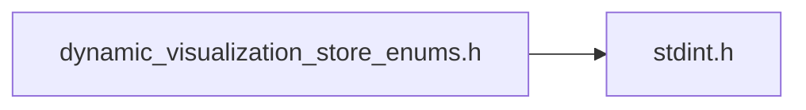
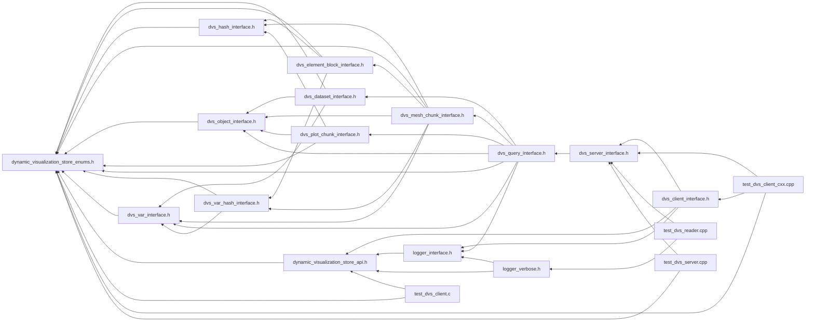

# File dynamic\_visualization\_store\_enums.h

<a id="dynamic__visualization__store__enums_8h"></a>

![][C++]

Contains enums used in C/C++ API.


## Includes

* <stdint.h>





## Included by

* [dvs_dataset_interface.h](dvs__dataset__interface_8h.md#dvs__dataset__interface_8h)
* [dvs_element_block_interface.h](dvs__element__block__interface_8h.md#dvs__element__block__interface_8h)
* [dvs_hash_interface.h](dvs__hash__interface_8h.md#dvs__hash__interface_8h)
* [dvs_mesh_chunk_interface.h](dvs__mesh__chunk__interface_8h.md#dvs__mesh__chunk__interface_8h)
* [dvs_object_interface.h](dvs__object__interface_8h.md#dvs__object__interface_8h)
* [dvs_plot_chunk_interface.h](dvs__plot__chunk__interface_8h.md#dvs__plot__chunk__interface_8h)
* [dvs_query_interface.h](dvs__query__interface_8h.md#dvs__query__interface_8h)
* [dvs_var_hash_interface.h](dvs__var__hash__interface_8h.md#dvs__var__hash__interface_8h)
* [dvs_var_interface.h](dvs__var__interface_8h.md#dvs__var__interface_8h)
* [dynamic_visualization_store_api.h](dynamic__visualization__store__api_8h.md#dynamic__visualization__store__api_8h)
* [test_dvs_client.c](test__dvs__client_8c.md#test__dvs__client_8c)
* [test_dvs_client_cxx.cpp](test__dvs__client__cxx_8cpp.md#test__dvs__client__cxx_8cpp)
* [test_dvs_server.cpp](test__dvs__server_8cpp.md#test__dvs__server_8cpp)





## Macros

<a id="dynamic__visualization__store__enums_8h_1a5e6fa5a06a37ae50af937ca7195800cd"></a>
### Macro DVS\_MAX\_USER\_DEFINED\_VAR\_ID

![][public]


```cpp
#define DVS_MAX_USER_DEFINED_VAR_ID (UINT32_MAX-10002)
```


DVS reserves the last 10000 VAR IDs for special variables


<a id="dynamic__visualization__store__enums_8h_1a0e0ee6900f90f933e57cae688b6d9af3"></a>
### Macro DVS\_IBLANK\_EXTERIOR

![][public]


```cpp
#define DVS_IBLANK_EXTERIOR 0.f
```


Exterior Node (blanked by default)


<a id="dynamic__visualization__store__enums_8h_1ac8f987404e3eba989ee90e4a1ffb955b"></a>
### Macro DVS\_IBLANK\_INTERIOR

![][public]


```cpp
#define DVS_IBLANK_INTERIOR 1.f
```


Interior Node (shown by default)


<a id="dynamic__visualization__store__enums_8h_1a72b07503916fc120112f00b07a2a5ed1"></a>
### Macro DVS\_IBLANK\_BOUNDARY

![][public]


```cpp
#define DVS_IBLANK_BOUNDARY 2.f
```


Boundary Node


<a id="dynamic__visualization__store__enums_8h_1aacf7a4e385cf72ee26356af937b3c609"></a>
### Macro DVS\_IBLANK\_INTERNAL\_BOUNDARY

![][public]


```cpp
#define DVS_IBLANK_INTERNAL_BOUNDARY 3.f
```


Internal boundary/baffle node


<a id="dynamic__visualization__store__enums_8h_1abab4ad5aaffe16664aaacb0850994cf7"></a>
### Macro DVS\_IBLANK\_SYMMETRY

![][public]


```cpp
#define DVS_IBLANK_SYMMETRY 4.f
```


Symmetry surface


<a id="dynamic__visualization__store__enums_8h_1aa405c87964a066405de5426a3089702b"></a>
### Macro DVS\_STRUCTURED\_IBLANKED\_NODES

![][public]


```cpp
#define DVS_STRUCTURED_IBLANKED_NODES ([DVS\_MAX\_USER\_DEFINED\_VAR\_ID](dynamic__visualization__store__enums_8h.md#dynamic__visualization__store__enums_8h_1a5e6fa5a06a37ae50af937ca7195800cd)+1)
```


Special nodal var for structured data to IBLANK nodes


<a id="dynamic__visualization__store__enums_8h_1a5f85a0e808c3bad9b9b616e62f5724c0"></a>
### Macro DVS\_STRUCTURED\_GHOST\_ELEMENTS

![][public]


```cpp
#define DVS_STRUCTURED_GHOST_ELEMENTS ([DVS\_MAX\_USER\_DEFINED\_VAR\_ID](dynamic__visualization__store__enums_8h.md#dynamic__visualization__store__enums_8h_1a5e6fa5a06a37ae50af937ca7195800cd)+2)
```


Special elemental var structured data for ghost elements


<a id="dynamic__visualization__store__enums_8h_1a103ab970c3f869611c5a888ec2c1f48e"></a>
### Macro DVS\_NODE\_ID

![][public]


```cpp
#define DVS_NODE_ID ([DVS\_MAX\_USER\_DEFINED\_VAR\_ID](dynamic__visualization__store__enums_8h.md#dynamic__visualization__store__enums_8h_1a5e6fa5a06a37ae50af937ca7195800cd)+3)
```


Special nodal int64 ID


<a id="dynamic__visualization__store__enums_8h_1a2f5c54081f521c1891cb24f0276d7276"></a>
### Macro DVS\_ELEMENT\_ID

![][public]


```cpp
#define DVS_ELEMENT_ID ([DVS\_MAX\_USER\_DEFINED\_VAR\_ID](dynamic__visualization__store__enums_8h.md#dynamic__visualization__store__enums_8h_1a5e6fa5a06a37ae50af937ca7195800cd)+4)
```


Special elemental int64 ID


<a id="dynamic__visualization__store__enums_8h_1a06c4478ecbbdfb5120af82e6ebf04ecd"></a>
### Macro DVS\_BEGIN\_INTERNAL\_CONN\_ID

![][public]


```cpp
#define DVS_BEGIN_INTERNAL_CONN_ID ([DVS\_MAX\_USER\_DEFINED\_VAR\_ID](dynamic__visualization__store__enums_8h.md#dynamic__visualization__store__enums_8h_1a5e6fa5a06a37ae50af937ca7195800cd)+5+PNT)
```


Begin of internal special var ID numbers for connectivity


<a id="dynamic__visualization__store__enums_8h_1a991e2afb5c20b847daf1581cb7dac29b"></a>
### Macro DVS\_END\_INTERNAL\_CONN\_ID

![][public]


```cpp
#define DVS_END_INTERNAL_CONN_ID ([DVS\_MAX\_USER\_DEFINED\_VAR\_ID](dynamic__visualization__store__enums_8h.md#dynamic__visualization__store__enums_8h_1a5e6fa5a06a37ae50af937ca7195800cd)+5+UNDEFINED)
```


End of internal special var ID numbers for connectivity


<a id="dynamic__visualization__store__enums_8h_1a437b7d261fd6c93718d52eed922f176e"></a>
### Macro DVS\_BEGIN\_INTERNAL\_COORD\_ID

![][public]


```cpp
#define DVS_BEGIN_INTERNAL_COORD_ID ([DVS\_END\_INTERNAL\_CONN\_ID](dynamic__visualization__store__enums_8h.md#dynamic__visualization__store__enums_8h_1a991e2afb5c20b847daf1581cb7dac29b)+1)
```


Begin of internal special var ID numbers for coordinates


<a id="dynamic__visualization__store__enums_8h_1a3cbd0d81720597f8bed2b151601c8119"></a>
### Macro DVS\_END\_INTERNAL\_COORD\_ID

![][public]


```cpp
#define DVS_END_INTERNAL_COORD_ID ([DVS\_BEGIN\_INTERNAL\_COORD\_ID](dynamic__visualization__store__enums_8h.md#dynamic__visualization__store__enums_8h_1a437b7d261fd6c93718d52eed922f176e)+2)
```


End of internal special var ID numbers for coordinates


<a id="dynamic__visualization__store__enums_8h_1aa9b02b6607cf18551f0fb311ab6b8508"></a>
### Macro FOREACH\_ELEM\_ENUM

![][public]


```cpp
#define FOREACH_ELEM_ENUM( ELEM )
```


Creates elements, used to create an enum and strings from the enum names.

For a description of supported elements and their index order please see the EnSight user manual, section 9.2.3 Supported EnSight Gold Elements


<a id="dynamic__visualization__store__enums_8h_1aed8760364c7992625d06c93d12b2496d"></a>
### Macro GENERATE\_ENUM

![][public]


```cpp
#define GENERATE_ENUM ENUM,( ENUM )
```


Generates the enums from above list.


<a id="dynamic__visualization__store__enums_8h_1ac42448ef0a94fdc3cf928d57dd2e84a3"></a>
### Macro GENERATE\_ENUM\_STRING

![][public]


```cpp
#define GENERATE_ENUM_STRING #STRING,( STRING )
```


Generates the strings from the enums in the above list.


<a id="dynamic__visualization__store__enums_8h_1a2ec35112e4d361e7e2e4c82b9225b101"></a>
### Macro DVS\_ENV\_LISTEN\_ALL\_NETWORKS

![][public]


```cpp
#define DVS_ENV_LISTEN_ALL_NETWORKS "DVS_LISTEN_ALL_NETWORKS"
```


<a id="dynamic__visualization__store__enums_8h_1a95d96d444a421c022e9adb7e7cda8735"></a>
### Macro DVS\_ENV\_USE\_TCP\_SOCKETS

![][public]


```cpp
#define DVS_ENV_USE_TCP_SOCKETS "DVS_USE_TCP_SOCKETS"
```


<a id="dynamic__visualization__store__enums_8h_1aca0e979dca9081948d5abaf5ee129d85"></a>
### Macro DVS\_ENV\_DISABLE\_TLS

![][public]


```cpp
#define DVS_ENV_DISABLE_TLS "DVS_DISABLE_TLS"
```


<a id="dynamic__visualization__store__enums_8h_1af393224ea73e087b5865f204139ed74d"></a>
### Macro DVS\_ENV\_UNIX\_DOMAIN\_SOCKET\_PATH

![][public]


```cpp
#define DVS_ENV_UNIX_DOMAIN_SOCKET_PATH "DVS_UNIX_DOMAIN_SOCKET_PATH"
```


<a id="dynamic__visualization__store__enums_8h_1a308b066fe9c05a87979369ef3c9686d8"></a>
### Macro DVS\_SERVER\_OPT\_LISTEN\_ALL\_NETWORKS

![][public]


```cpp
#define DVS_SERVER_OPT_LISTEN_ALL_NETWORKS "SERVER_LISTEN_ALL_NETWORKS"
```


<a id="dynamic__visualization__store__enums_8h_1ad7b3c8c74a56f4a0457d9aa78badbebf"></a>
### Macro DVS\_SERVER\_OPT\_USE\_TCP\_SOCKETS

![][public]


```cpp
#define DVS_SERVER_OPT_USE_TCP_SOCKETS "SERVER_USE_TCP_SOCKETS"
```


<a id="dynamic__visualization__store__enums_8h_1a932f99babdbc24bb72e69af7df77556e"></a>
### Macro DVS\_SERVER\_OPT\_DISABLE\_TLS

![][public]


```cpp
#define DVS_SERVER_OPT_DISABLE_TLS "SERVER_DISABLE_TLS"
```


<a id="dynamic__visualization__store__enums_8h_1a1edc106284d80a22c318afd4ff7ee1b2"></a>
### Macro DVS\_SERVER\_OPT\_UNIX\_DOMAIN\_SOCKET\_PATH

![][public]


```cpp
#define DVS_SERVER_OPT_UNIX_DOMAIN_SOCKET_PATH "SERVER_UNIX_DOMAIN_SOCKET_PATH"
```


## Enumeration types

<a id="dynamic__visualization__store__enums_8h_1af4f0eba512eff253854b44d7ce078491"></a>
### Enumeration type dvs\_var\_location

![][public]


```cpp
enum dvs_var_location {
  NODE = 0,
  ELEMENT,
  PART,
  CASE
}
```


What variable is associated with.


<a id="dynamic__visualization__store__enums_8h_1af4f0eba512eff253854b44d7ce078491a59a889456a2d742fdca191dccb3e871d"></a>
#### Enumerator NODE

This is a field variable per each node of a part's mesh.


<a id="dynamic__visualization__store__enums_8h_1af4f0eba512eff253854b44d7ce078491a3d10bfe84917127ab3347aa5c6309f33"></a>
#### Enumerator ELEMENT

This is a field variable per each element of a part.


<a id="dynamic__visualization__store__enums_8h_1af4f0eba512eff253854b44d7ce078491a173f98c603042f6241b70157d56e385f"></a>
#### Enumerator PART

This is a variable for an entire part.


<a id="dynamic__visualization__store__enums_8h_1af4f0eba512eff253854b44d7ce078491a9c9b14644e9370719a51b7342bbc9c4d"></a>
#### Enumerator CASE

This is a variable for an entire case (i.e. dataset).


<a id="dynamic__visualization__store__enums_8h_1af6aa6351345da4151507012681b3aff0"></a>
### Enumeration type dvs\_var\_type

![][public]


```cpp
enum dvs_var_type {
  SCALAR = 0,
  VECTOR,
  COMPLEX_SCALAR,
  COMPLEX_VECTOR,
  TENSOR,
  TENSOR9
}
```


Data type of variable.


<a id="dynamic__visualization__store__enums_8h_1af6aa6351345da4151507012681b3aff0a7efbb6cac96595e63e8fa171bde1eb68"></a>
#### Enumerator SCALAR

Scalar.


<a id="dynamic__visualization__store__enums_8h_1af6aa6351345da4151507012681b3aff0a1a85ef13eaa80e8561743892f9dba958"></a>
#### Enumerator VECTOR

XYZ Coordinates.


<a id="dynamic__visualization__store__enums_8h_1af6aa6351345da4151507012681b3aff0a6e84f87c66ae25da0a294d1fbd420c0b"></a>
#### Enumerator COMPLEX\_SCALAR

NOT SUPPORTED YET.


<a id="dynamic__visualization__store__enums_8h_1af6aa6351345da4151507012681b3aff0a67a10947ab9de6d2c7fa68db76c93a5d"></a>
#### Enumerator COMPLEX\_VECTOR

NOT SUPPORTED YET.


<a id="dynamic__visualization__store__enums_8h_1af6aa6351345da4151507012681b3aff0aea73d7e9d7db611ad93f6acf4486e4b6"></a>
#### Enumerator TENSOR

NOT SUPPORTED YET.


<a id="dynamic__visualization__store__enums_8h_1af6aa6351345da4151507012681b3aff0a101dd79694ce22ee8b4ad64e00a89665"></a>
#### Enumerator TENSOR9

NOT SUPPORTED YET.


<a id="dynamic__visualization__store__enums_8h_1a72a02f8c046b459abfa438d402dbba52"></a>
### Enumeration type dvs\_structured\_type

![][public]


```cpp
enum dvs_structured_type {
  UNKNOWN = -1,
  PARALLELEPIPED = 0,
  CURVILINEAR = 1
}
```


Structure mesh types available in DVS.


<a id="dynamic__visualization__store__enums_8h_1a72a02f8c046b459abfa438d402dbba52a6ce26a62afab55d7606ad4e92428b30c"></a>
#### Enumerator UNKNOWN

Unknown type.


<a id="dynamic__visualization__store__enums_8h_1a72a02f8c046b459abfa438d402dbba52a64849d874c1036d5e88f88e53706a76f"></a>
#### Enumerator PARALLELEPIPED

Parallepiped.


<a id="dynamic__visualization__store__enums_8h_1a72a02f8c046b459abfa438d402dbba52acd60e0b216d803cc36de999bfbd2547b"></a>
#### Enumerator CURVILINEAR

Curvilinear.


<a id="dynamic__visualization__store__enums_8h_1aec8cbac60b9cafe5d1c0ad6593f05e9f"></a>
### Enumeration type dvs\_client\_flags

![][public]


```cpp
enum dvs_client_flags {
  NONE = 0x00000000,
  BLOCK_FOR_SERVER = 0x00000001,
  DEDUP = 0x00000002,
  BEGIN_INIT_WAIT_ON_REINIT = 0x00000004
}
```


Flags for specific server setup.


<a id="dynamic__visualization__store__enums_8h_1aec8cbac60b9cafe5d1c0ad6593f05e9fac157bdf0b85a40d2619cbc8bc1ae5fe2"></a>
#### Enumerator NONE

No Flags.


<a id="dynamic__visualization__store__enums_8h_1aec8cbac60b9cafe5d1c0ad6593f05e9fa9feb185df8061416aa9a23b0150dc821"></a>
#### Enumerator BLOCK\_FOR\_SERVER

Clients should block for servers to be initialized before sending data.


<a id="dynamic__visualization__store__enums_8h_1aec8cbac60b9cafe5d1c0ad6593f05e9fa81b113ffc96eb6d968a19950727c0ff9"></a>
#### Enumerator DEDUP

Do not send duplicate data to server.


<a id="dynamic__visualization__store__enums_8h_1aec8cbac60b9cafe5d1c0ad6593f05e9fa825692bac2ef9eae4260a063ccf6322c"></a>
#### Enumerator BEGIN\_INIT\_WAIT\_ON\_REINIT

Blocking wait on reinitialization to complete before reinitializing again.


<a id="dynamic__visualization__store__enums_8h_1a9bca12092877a90e6c497994093a8609"></a>
### Enumeration type dvs\_log\_flags

![][public]


```cpp
enum dvs_log_flags {
  LOG_NONE = 0x00,
  LOG_PERF = 0x01,
  LOG_DEBUG = 0x02,
  LOG_UPDATE_BEG_END = 0x04,
  LOG_ALL = 0xFFFFFFFF
}
```


Flags to control logging filters.


<a id="dynamic__visualization__store__enums_8h_1a9bca12092877a90e6c497994093a8609a85639df34979de4e5ff6f7b05e4de8f1"></a>
#### Enumerator LOG\_NONE

Don't log anything.


<a id="dynamic__visualization__store__enums_8h_1a9bca12092877a90e6c497994093a8609a44abba758508bd463abce2a64861da17"></a>
#### Enumerator LOG\_PERF

Log any messages related to performance.


<a id="dynamic__visualization__store__enums_8h_1a9bca12092877a90e6c497994093a8609ab9f002c6ffbfd511da8090213227454e"></a>
#### Enumerator LOG\_DEBUG

Log any messages related to debugging the API.


<a id="dynamic__visualization__store__enums_8h_1a9bca12092877a90e6c497994093a8609a1a3a1b2a98f96b6de074cd9ae93805bb"></a>
#### Enumerator LOG\_UPDATE\_BEG\_END

Log messages related to begin and end of updates.


<a id="dynamic__visualization__store__enums_8h_1a9bca12092877a90e6c497994093a8609a87cff070224b283d7aace436723245fc"></a>
#### Enumerator LOG\_ALL

Log all messages.


<a id="dynamic__visualization__store__enums_8h_1aafcfd80cd55c92c53106bb56fdaf026d"></a>
### Enumeration type dvs\_verbosity

![][public]


```cpp
enum dvs_verbosity {
  DVS_QUIET = 1,
  DVS_NORMAL = 2,
  DVS_VERBOSE = 3
}
```


Verbosity levels.

The higher the level the less messages will be filtered.


<a id="dynamic__visualization__store__enums_8h_1aafcfd80cd55c92c53106bb56fdaf026dad4b043cfb9ef5408e6754d16e7e2e2b4"></a>
#### Enumerator DVS\_QUIET

Only log errors.


<a id="dynamic__visualization__store__enums_8h_1aafcfd80cd55c92c53106bb56fdaf026da753f22bd767584fa37190092039cb6cf"></a>
#### Enumerator DVS\_NORMAL

Default, displays warnings and errors.


<a id="dynamic__visualization__store__enums_8h_1aafcfd80cd55c92c53106bb56fdaf026da95f57c1525070266247b1a687f565f5b"></a>
#### Enumerator DVS\_VERBOSE

Displays informational messages, warnings, errors.


<a id="dynamic__visualization__store__enums_8h_1a430545460675139bdb1c6f190c26c33c"></a>
### Enumeration type dvs\_log\_level

![][public]


```cpp
enum dvs_log_level {
  ERR = 1,
  WARN = 2,
  INFO = 3
}
```


Message levels for logging messages.


<a id="dynamic__visualization__store__enums_8h_1a430545460675139bdb1c6f190c26c33ca0f886785b600b91048fcdc434c6b4a8e"></a>
#### Enumerator ERR

Log an error.


<a id="dynamic__visualization__store__enums_8h_1a430545460675139bdb1c6f190c26c33ca74dac7ac23d5b810db6d4067f14e8676"></a>
#### Enumerator WARN

Log a warning.


<a id="dynamic__visualization__store__enums_8h_1a430545460675139bdb1c6f190c26c33ca748005382152808a72b1a9177d9dc806"></a>
#### Enumerator INFO

Log an informational message.


<a id="dynamic__visualization__store__enums_8h_1a58d40a201426f3ef9955ca05fa5bec4f"></a>
### Enumeration type dvs\_structured\_iblanking\_vals

![][public]


```cpp
enum dvs_structured_iblanking_vals {
  IBLANK_EXTERIOR = 0,
  IBLANK_INTERIOR,
  IBLANK_BOUNDARY,
  IBLANK_INTERNAL_BOUNDARY,
  IBLANK_SYMMETRY
}
```


IBLANKING Values allowed by DVS.


<a id="dynamic__visualization__store__enums_8h_1a58d40a201426f3ef9955ca05fa5bec4fa44f7efc4bb3ff0be1a96b3e80e6e53c5"></a>
#### Enumerator IBLANK\_EXTERIOR

Exterior Node (blanked by default).


<a id="dynamic__visualization__store__enums_8h_1a58d40a201426f3ef9955ca05fa5bec4faf001e0f17533bd2198690276d596a547"></a>
#### Enumerator IBLANK\_INTERIOR

Interior Node (shown by default).


<a id="dynamic__visualization__store__enums_8h_1a58d40a201426f3ef9955ca05fa5bec4fa2bd5dab58d1216e7d285cde14b2c778a"></a>
#### Enumerator IBLANK\_BOUNDARY

Boundary Node.


<a id="dynamic__visualization__store__enums_8h_1a58d40a201426f3ef9955ca05fa5bec4faee0199f2f37a95fb29fe1d80de8b8593"></a>
#### Enumerator IBLANK\_INTERNAL\_BOUNDARY

Internal boundary/baffle node.


<a id="dynamic__visualization__store__enums_8h_1a58d40a201426f3ef9955ca05fa5bec4fa70dbfc061b5eec9b32d4e8800e1ea78c"></a>
#### Enumerator IBLANK\_SYMMETRY

Symmetry surface.


<a id="dynamic__visualization__store__enums_8h_1af1c8824b29a0ab747460216716cc2895"></a>
### Enumeration type dvs\_element\_type

![][public]


```cpp
enum dvs_element_type {

}
```


List of macro generated enums.


## Variables

<a id="dynamic__visualization__store__enums_8h_1a984df02e2e549a33fc4632ff53693b54"></a>
### Variable dvs\_element\_type\_name

![][public]
![][static]


```cpp
const char* dvs_element_type_name[][]                                         = {

}
```


String array of enum names.


**Type**: const char *

## Source


```cpp
/*  *************************************************************
 *   Copyright 2017-2025 ANSYS, Inc.
 *   All Rights Reserved.
 *
 *        Restricted Rights Legend
 *
 *   Use, duplication, or disclosure of this
 *   software and its documentation by the
 *   Government is subject to restrictions as
 *   set forth in subdivision [(b)(3)(ii)] of
 *   the Rights in Technical Data and Computer
 *   Software clause at 52.227-7013.
 *  *************************************************************
 */

#ifndef __DYNAMIC_VISUALIZATION_STORE_ENUMS__
#define __DYNAMIC_VISUALIZATION_STORE_ENUMS__

#include <stdint.h>


enum dvs_var_location
{
    NODE = 0, 
    ELEMENT, 
    PART, 
    CASE, 
};

enum dvs_var_type
{
    SCALAR = 0, 
    VECTOR, 
    COMPLEX_SCALAR, 
    COMPLEX_VECTOR, 
    TENSOR, 
    TENSOR9, 
};

enum dvs_structured_type
{
    UNKNOWN = -1, 
    PARALLELEPIPED = 0, 
    CURVILINEAR = 1, 
};

enum dvs_client_flags
{
    NONE = 0x00000000, 
    BLOCK_FOR_SERVER = 0x00000001, 
    DEDUP = 0x00000002, 
    BEGIN_INIT_WAIT_ON_REINIT = 0x00000004, 
};

enum dvs_log_flags
{
    LOG_NONE = 0x00, 
    LOG_PERF = 0x01, 
    LOG_DEBUG = 0x02, 
    LOG_UPDATE_BEG_END = 0x04, 
    LOG_ALL = 0xFFFFFFFF 
};

enum dvs_verbosity
{
    DVS_QUIET = 1, 
    DVS_NORMAL = 2, 
    DVS_VERBOSE = 3, 
};

enum dvs_log_level
{
    ERR = 1, 
    WARN = 2, 
    INFO = 3 
};

#define DVS_MAX_USER_DEFINED_VAR_ID (UINT32_MAX-10002) 

#define DVS_IBLANK_EXTERIOR 0.f
#define DVS_IBLANK_INTERIOR 1.f
#define DVS_IBLANK_BOUNDARY 2.f
#define DVS_IBLANK_INTERNAL_BOUNDARY 3.f
#define DVS_IBLANK_SYMMETRY 4.f

#define DVS_STRUCTURED_IBLANKED_NODES (DVS_MAX_USER_DEFINED_VAR_ID+1)
#define DVS_STRUCTURED_GHOST_ELEMENTS (DVS_MAX_USER_DEFINED_VAR_ID+2)
#define DVS_NODE_ID (DVS_MAX_USER_DEFINED_VAR_ID+3)
#define DVS_ELEMENT_ID (DVS_MAX_USER_DEFINED_VAR_ID+4)

#define DVS_BEGIN_INTERNAL_CONN_ID (DVS_MAX_USER_DEFINED_VAR_ID+5+PNT)

#define DVS_END_INTERNAL_CONN_ID (DVS_MAX_USER_DEFINED_VAR_ID+5+UNDEFINED)

#define DVS_BEGIN_INTERNAL_COORD_ID (DVS_END_INTERNAL_CONN_ID+1)

#define DVS_END_INTERNAL_COORD_ID (DVS_BEGIN_INTERNAL_COORD_ID+2)


enum dvs_structured_iblanking_vals
{
    IBLANK_EXTERIOR = 0, 
    IBLANK_INTERIOR, 
    IBLANK_BOUNDARY, 
    IBLANK_INTERNAL_BOUNDARY, 
    IBLANK_SYMMETRY 
};

#define FOREACH_ELEM_ENUM(ELEM) \
    ELEM(PNT) \
    ELEM(PNT_GHOST) \
    ELEM(BAR_2) \
    ELEM(BAR_2_GHOST) \
    ELEM(BAR_3) \
    ELEM(BAR_3_GHOST) \
    ELEM(N_SIDED_POLYGON) \
    ELEM(N_SIDED_POLYGON_GHOST) \
    ELEM(TRIANGLE) \
    ELEM(TRIANGLE_GHOST) \
    ELEM(TRIANGLE_6) \
    ELEM(TRIANGLE_6_GHOST) \
    ELEM(QUADRANGLE) \
    ELEM(QUADRANGLE_GHOST) \
    ELEM(QUADRANGLE_8) \
    ELEM(QUADRANGLE_8_GHOST) \
    ELEM(TETRAHEDRON) \
    ELEM(TETRAHEDRON_GHOST) \
    ELEM(TETRAHEDRON_10) \
    ELEM(TETRAHEDRON_10_GHOST) \
    ELEM(PYRAMID) \
    ELEM(PYRAMID_GHOST) \
    ELEM(PYRAMID_13) \
    ELEM(PYRAMID_13_GHOST) \
    ELEM(HEXAHEDRON) \
    ELEM(HEXAHEDRON_GHOST) \
    ELEM(HEXAHEDRON_20) \
    ELEM(HEXAHEDRON_20_GHOST) \
    ELEM(PENTAHEDRON) \
    ELEM(PENTAHEDRON_GHOST) \
    ELEM(PENTAHEDRON_15) \
    ELEM(PENTAHEDRON_15_GHOST) \
    ELEM(CONVEX_POLYHEDRON) \
    ELEM(CONVEX_POLYHEDRON_GHOST) \
    ELEM(STRUCTURED) \
    ELEM(UNDEFINED) \
    ELEM(UNDEFINED_PARALLELEPIPED) \
    ELEM(UNDEFINED_CURVILINEAR)

#define GENERATE_ENUM(ENUM) ENUM,

#define GENERATE_ENUM_STRING(STRING) #STRING,

enum dvs_element_type {
    FOREACH_ELEM_ENUM(GENERATE_ENUM)
};

static const char *dvs_element_type_name[] = {
    FOREACH_ELEM_ENUM(GENERATE_ENUM_STRING)
};

#define DVS_ENV_LISTEN_ALL_NETWORKS "DVS_LISTEN_ALL_NETWORKS"
#define DVS_ENV_USE_TCP_SOCKETS "DVS_USE_TCP_SOCKETS"
#define DVS_ENV_DISABLE_TLS "DVS_DISABLE_TLS"
#define DVS_ENV_UNIX_DOMAIN_SOCKET_PATH "DVS_UNIX_DOMAIN_SOCKET_PATH"
#define DVS_SERVER_OPT_LISTEN_ALL_NETWORKS "SERVER_LISTEN_ALL_NETWORKS"
#define DVS_SERVER_OPT_USE_TCP_SOCKETS "SERVER_USE_TCP_SOCKETS"
#define DVS_SERVER_OPT_DISABLE_TLS "SERVER_DISABLE_TLS"
#define DVS_SERVER_OPT_UNIX_DOMAIN_SOCKET_PATH "SERVER_UNIX_DOMAIN_SOCKET_PATH"

#endif //__DYNAMIC_VISUALIZATION_STORE_ENUMS__
```


[public]: https://img.shields.io/badge/-public-brightgreen (public)
[protected]: https://img.shields.io/badge/-protected-yellow (protected)
[static]: https://img.shields.io/badge/-static-lightgrey (static)
[C++]: https://img.shields.io/badge/language-C%2B%2B-blue (C++)
[Python]: https://img.shields.io/badge/language-Python-blue (Python)
[private]: https://img.shields.io/badge/-private-red (private)
[const]: https://img.shields.io/badge/-const-lightblue (const)
[Markdown]: https://img.shields.io/badge/language-Markdown-blue (Markdown)