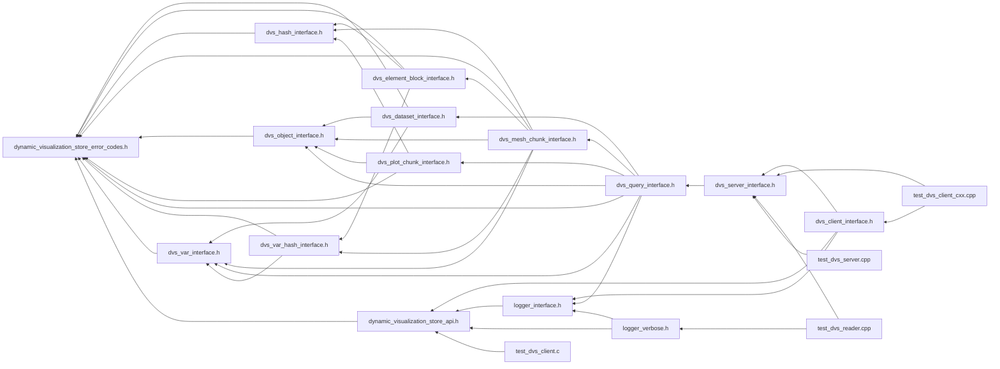

# File dynamic\_visualization\_store\_error\_codes.h

<a id="dynamic__visualization__store__error__codes_8h"></a>

![][C++]

Contains errors used in the DVS C/C++ API.


## Includes

* <stdint.h>


## Included by

* [dvs_dataset_interface.h](dvs__dataset__interface_8h.md#dvs__dataset__interface_8h)
* [dvs_element_block_interface.h](dvs__element__block__interface_8h.md#dvs__element__block__interface_8h)
* [dvs_hash_interface.h](dvs__hash__interface_8h.md#dvs__hash__interface_8h)
* [dvs_mesh_chunk_interface.h](dvs__mesh__chunk__interface_8h.md#dvs__mesh__chunk__interface_8h)
* [dvs_object_interface.h](dvs__object__interface_8h.md#dvs__object__interface_8h)
* [dvs_plot_chunk_interface.h](dvs__plot__chunk__interface_8h.md#dvs__plot__chunk__interface_8h)
* [dvs_query_interface.h](dvs__query__interface_8h.md#dvs__query__interface_8h)
* [dvs_var_hash_interface.h](dvs__var__hash__interface_8h.md#dvs__var__hash__interface_8h)
* [dvs_var_interface.h](dvs__var__interface_8h.md#dvs__var__interface_8h)
* [dynamic_visualization_store_api.h](dynamic__visualization__store__api_8h.md#dynamic__visualization__store__api_8h)





## Macros

<a id="dynamic__visualization__store__error__codes_8h_1a38e0cdcf6ce1713fb9eb13576fef3eaf"></a>
### Macro DVS\_PARAM\_NULL

![][public]


```cpp
#define DVS_PARAM_NULL -100
```


Param passed into method was NULL when it should not be.


<a id="dynamic__visualization__store__error__codes_8h_1acdcc465d26d012c099863c9f4e5bdfa9"></a>
### Macro DVS\_PARAM\_INVALID\_SIZE

![][public]


```cpp
#define DVS_PARAM_INVALID_SIZE -101
```


Param passed in was of invalid size.


<a id="dynamic__visualization__store__error__codes_8h_1acc7d005f0fc92ff0c35281bd426ce3cc"></a>
### Macro DVS\_PARAM\_OUT\_OF\_BOUNDS

![][public]


```cpp
#define DVS_PARAM_OUT_OF_BOUNDS -102
```


A parameter index was out of bounds.


<a id="dynamic__visualization__store__error__codes_8h_1a38f8936157ddbc1944daa2ba3136bfa4"></a>
### Macro DVS\_INVALID\_ID

![][public]


```cpp
#define DVS_INVALID_ID -103
```


Invalid ID passed in.


<a id="dynamic__visualization__store__error__codes_8h_1a253b6d1c4b726be2c671a0cf2a429950"></a>
### Macro DVS\_PARAM\_INVALID\_VAR

![][public]


```cpp
#define DVS_PARAM_INVALID_VAR -104
```


Invalid variable passed in.


<a id="dynamic__visualization__store__error__codes_8h_1af9fb37f098533ab13657a90681315b90"></a>
### Macro DVS\_PARAM\_INVALID\_VAR\_LOC

![][public]


```cpp
#define DVS_PARAM_INVALID_VAR_LOC -105
```


Invalid variable location passed in.


<a id="dynamic__visualization__store__error__codes_8h_1a59583df111e112de252fde42cff5ce6e"></a>
### Macro DVS\_PARAM\_INVALID\_OBJECT

![][public]


```cpp
#define DVS_PARAM_INVALID_OBJECT -106
```


Invalid object passed in.


<a id="dynamic__visualization__store__error__codes_8h_1adb11c8275b7f0a0522fa12b5344c94b1"></a>
### Macro DVS\_PARAM\_INVALID\_OBJECT\_TYPE

![][public]


```cpp
#define DVS_PARAM_INVALID_OBJECT_TYPE -107
```


Invalid object type passed in.


<a id="dynamic__visualization__store__error__codes_8h_1a7471160feb84da63d95d6c477c1c112d"></a>
### Macro DVS\_PARAM\_INVALID\_TIME

![][public]


```cpp
#define DVS_PARAM_INVALID_TIME -108
```


Invalid time passed in.


<a id="dynamic__visualization__store__error__codes_8h_1af18b10f6c4b2d71a5bd73cc978dc207f"></a>
### Macro DVS\_PARAM\_OBJECT\_DATASET\_MISMATCH

![][public]


```cpp
#define DVS_PARAM_OBJECT_DATASET_MISMATCH -109
```


Objects passed in belong to different datasets.


<a id="dynamic__visualization__store__error__codes_8h_1a991ff842def08fb7aeb3e96765465843"></a>
### Macro DVS\_PARAM\_INVALID

![][public]


```cpp
#define DVS_PARAM_INVALID -110
```


Parameter invalid, see error messages.


<a id="dynamic__visualization__store__error__codes_8h_1a9490d96aea47ae93002e2164f3388e2c"></a>
### Macro DVS\_INVALID\_NAME

![][public]


```cpp
#define DVS_INVALID_NAME -111
```


Invalid part name.


<a id="dynamic__visualization__store__error__codes_8h_1ac0b6f1bfe9fa4babbe75a5dcfe6692ac"></a>
### Macro DVS\_DUPLICATE\_ELEM\_BLOCK\_TYPE

![][public]


```cpp
#define DVS_DUPLICATE_ELEM_BLOCK_TYPE -112
```


Duplicate element block of same type added, only one element block should be added for each element type.


<a id="dynamic__visualization__store__error__codes_8h_1a3aeabbfca5c162d24036dc433739d1b1"></a>
### Macro DVS\_TRANSPORT\_NULL\_INVALID\_SERVER

![][public]


```cpp
#define DVS_TRANSPORT_NULL_INVALID_SERVER -150
```


Internal error, server failed to be instantiated.


<a id="dynamic__visualization__store__error__codes_8h_1a8f9cead720b698834ce60756a8245ab0"></a>
### Macro DVS\_TRANSPORT\_SERVICE\_UNAVAILABLE

![][public]


```cpp
#define DVS_TRANSPORT_SERVICE_UNAVAILABLE -151
```


Service is unavailable. Potentially increase number of retries and backoff timer.


<a id="dynamic__visualization__store__error__codes_8h_1a5278bf30fbc14f0471243a9b186708a5"></a>
### Macro DVS\_TRANSPORT\_SERVICE\_FAILURE

![][public]


```cpp
#define DVS_TRANSPORT_SERVICE_FAILURE -152
```


Unrecoverable error, turn on verbose logging to get more information, might be fine depending on use.


<a id="dynamic__visualization__store__error__codes_8h_1ace505cba0aaf23efa56f27ef0b5f8dfc"></a>
### Macro DVS\_ID\_INVALID

![][public]


```cpp
#define DVS_ID_INVALID -200
```


Server or client ID is not valid.


<a id="dynamic__visualization__store__error__codes_8h_1a60a028020e32066ebc2abbbbe6695bee"></a>
### Macro DVS\_ID\_INVALID\_TYPE

![][public]


```cpp
#define DVS_ID_INVALID_TYPE -201
```


Client ID used for Server ID or Server ID used for Client ID.


<a id="dynamic__visualization__store__error__codes_8h_1ae8fbab61e536e8b2ee7218a038cf8ece"></a>
### Macro DVS\_ID\_NO\_VALID\_SERVER

![][public]


```cpp
#define DVS_ID_NO_VALID_SERVER -202
```


Server ID is not valid or server instance no longer valid.


<a id="dynamic__visualization__store__error__codes_8h_1affa3bea2b7e9157b78d9c1d5689093c4"></a>
### Macro DVS\_ID\_NO\_VALID\_SESSION

![][public]


```cpp
#define DVS_ID_NO_VALID_SESSION -203
```


Session ID for client is not valid or client instance no longer valid.


<a id="dynamic__visualization__store__error__codes_8h_1a1ed031d8a21d42fa6bac0d2584050c93"></a>
### Macro DVS\_ID\_OUT\_OF\_IDS

![][public]


```cpp
#define DVS_ID_OUT_OF_IDS -204
```


Maximum number of clients 1,048,575 reached.


<a id="dynamic__visualization__store__error__codes_8h_1ac371b997ba2d3e8625d2b03e7eeffbfb"></a>
### Macro DVS\_SERVER\_START\_FAILED

![][public]


```cpp
#define DVS_SERVER_START_FAILED -300
```


Internal error, server failed to start.


<a id="dynamic__visualization__store__error__codes_8h_1ab5eb980bd5a675198578c2d70bb628f8"></a>
### Macro DVS\_SERVER\_ALREADY\_STARTED

![][public]


```cpp
#define DVS_SERVER_ALREADY_STARTED -301
```


Server was already previously started.


<a id="dynamic__visualization__store__error__codes_8h_1ae6698f7ca4f01e0588183b3081f31e67"></a>
### Macro DVS\_SERVER\_NOT\_STARTED

![][public]


```cpp
#define DVS_SERVER_NOT_STARTED -302
```


DVS server terminating.


<a id="dynamic__visualization__store__error__codes_8h_1abb787175fdb1c48324d6fa5d21338aa3"></a>
### Macro DVS\_SERVER\_FAILED\_INIT

![][public]


```cpp
#define DVS_SERVER_FAILED_INIT -303
```


DVS server failed to initialize.


<a id="dynamic__visualization__store__error__codes_8h_1a6aab715fe03138335d33c51734c5df13"></a>
### Macro DVS\_SERVER\_FAILED\_SYNC\_RANKS

![][public]


```cpp
#define DVS_SERVER_FAILED_SYNC_RANKS -304
```


DVS server failed syncing ranks, servers disagree on number of ranks.


<a id="dynamic__visualization__store__error__codes_8h_1a2619e1d7638ffd5e6b2606e62be8c242"></a>
### Macro DVS\_SERVER\_FAILED\_DEFINITIONS\_MERGE

![][public]


```cpp
#define DVS_SERVER_FAILED_DEFINITIONS_MERGE -305
```


Merging definitions across server failed, definitions across servers do not match up.


<a id="dynamic__visualization__store__error__codes_8h_1a09d9cbd7bcfd9f5a6098e40e4c1ade42"></a>
### Macro DVS\_SERVER\_FAILED\_TIMELINE\_SYNC

![][public]


```cpp
#define DVS_SERVER_FAILED_TIMELINE_SYNC -306
```


Syncing timelines between servers failed.


<a id="dynamic__visualization__store__error__codes_8h_1ace7a1f90d90090c38a5f1a5067dac384"></a>
### Macro DVS\_SERVER\_FAILED\_READER\_CREATE

![][public]


```cpp
#define DVS_SERVER_FAILED_READER_CREATE -307
```


Internal error for fatal error.


<a id="dynamic__visualization__store__error__codes_8h_1a19cf1e588b91f501534311012bf428c9"></a>
### Macro DVS\_SERVER\_WAIT\_TIMEOUT

![][public]


```cpp
#define DVS_SERVER_WAIT_TIMEOUT -308
```


Timeout occured, increase wait time if unintended.


<a id="dynamic__visualization__store__error__codes_8h_1a863800ad689e30effa651705e8ff7278"></a>
### Macro DVS\_SERVER\_CACHE\_NOT\_ACCESSIBLE

![][public]


```cpp
#define DVS_SERVER_CACHE_NOT_ACCESSIBLE -309
```


The cache is not available for write.


<a id="dynamic__visualization__store__error__codes_8h_1ad7bc3686b4c5f1a6721efa8a7f576f38"></a>
### Macro DVS\_SERVER\_QUERY\_FAILED

![][public]


```cpp
#define DVS_SERVER_QUERY_FAILED -310
```


The server query cannot be created yet.


<a id="dynamic__visualization__store__error__codes_8h_1a56c80c7209e07a53580486c5b7c462ac"></a>
### Macro DVS\_SERVER\_TERMINATING

![][public]


```cpp
#define DVS_SERVER_TERMINATING 300
```


DVS server terminating.


<a id="dynamic__visualization__store__error__codes_8h_1a1a9fe3336207ecb452fd955aaff81194"></a>
### Macro DVS\_CLIENT\_INVALID\_TRANSPORT

![][public]


```cpp
#define DVS_CLIENT_INVALID_TRANSPORT -400
```


Internal error, tranport layer failed to instantiate.


<a id="dynamic__visualization__store__error__codes_8h_1aecac61d1237916452e3778780ceecda1"></a>
### Macro DVS\_CLIENT\_WAIT\_TIMEOUT

![][public]


```cpp
#define DVS_CLIENT_WAIT_TIMEOUT -401
```


Timeout waiting for client to connect to server, increase timeout if unintended.


<a id="dynamic__visualization__store__error__codes_8h_1afb514fe908555095153fa0c06137aefc"></a>
### Macro DVS\_DATASET\_NAME\_EMPTY

![][public]


```cpp
#define DVS_DATASET_NAME_EMPTY -500
```


Dataset name passed in is empty.


<a id="dynamic__visualization__store__error__codes_8h_1af81828d5fc96eec8fc603ed7f7bf8940"></a>
### Macro DVS\_NO\_DATA

![][public]


```cpp
#define DVS_NO_DATA -502
```


This object has no data.


<a id="dynamic__visualization__store__error__codes_8h_1a66733044e74ab242ce6ecf94072f06ec"></a>
### Macro DVS\_METADATA\_NO\_HASH\_OFFSET\_TABLE

![][public]


```cpp
#define DVS_METADATA_NO_HASH_OFFSET_TABLE -600
```


Internal error in case of table not available. Needed for backward compatibility.


<a id="dynamic__visualization__store__error__codes_8h_1a7c587fcdbc8d28afaf9823c351ca4cc8"></a>
### Macro DVS\_METADATA\_HASH\_OFFSET\_TABLE\_BACKCOMPAT

![][public]


```cpp
#define DVS_METADATA_HASH_OFFSET_TABLE_BACKCOMPAT -601
```


Internal error in case of table avaiable but with negative values. Needed for backward compatibility.


<a id="dynamic__visualization__store__error__codes_8h_1afdc4afc773568bcac998c26ba93e91a6"></a>
### Macro DVS\_INVALID\_STRUCTURED\_DATA

![][public]


```cpp
#define DVS_INVALID_STRUCTURED_DATA -700
```


Internal error, structured data structure is invalid.


<a id="dynamic__visualization__store__error__codes_8h_1a54a8b7818996b5ec66ac6d97f4dd6061"></a>
### Macro DVS\_INVALID\_ELEMENT\_TYPE

![][public]


```cpp
#define DVS_INVALID_ELEMENT_TYPE -701
```


The element type is invalid for this method.


<a id="dynamic__visualization__store__error__codes_8h_1a28a95357eedffd7749f76e93b7b71358"></a>
### Macro DVS\_INVALID\_MESH\_TYPE

![][public]


```cpp
#define DVS_INVALID_MESH_TYPE -702
```


Invalid mesh type for this method.


<a id="dynamic__visualization__store__error__codes_8h_1abc6389f4e500de0977a65f626545ba65"></a>
### Macro DVS\_INVALID\_CONNECTIVITY\_RANGE

![][public]


```cpp
#define DVS_INVALID_CONNECTIVITY_RANGE -703
```


Connectivity index higher than number of nodes (should be zero based).


<a id="dynamic__visualization__store__error__codes_8h_1a066dc9db3f56d47d76bf9691a60afce4"></a>
### Macro DVS\_TYPE\_MISMATCH

![][public]


```cpp
#define DVS_TYPE_MISMATCH -704
```


Mismatched DVS data types.


<a id="dynamic__visualization__store__error__codes_8h_1adc4e96717d505d0ef3abc6f8c5aab584"></a>
### Macro DVS\_VERSION\_MISMATCH

![][public]


```cpp
#define DVS_VERSION_MISMATCH -800
```


Invalid version, please update client and server to match.


<a id="dynamic__visualization__store__error__codes_8h_1aa868448478d42e79c26830f67bf89081"></a>
### Macro DVS\_VERSION\_UNKNOWN

![][public]


```cpp
#define DVS_VERSION_UNKNOWN -801
```


Unknown version, please update client and server to match.


<a id="dynamic__visualization__store__error__codes_8h_1a48a521ee0d0edb67897912b3921ded0b"></a>
### Macro DVS\_QUERY\_INVALID\_FILTER

![][public]


```cpp
#define DVS_QUERY_INVALID_FILTER -900
```


Filter is incorrectly formed.


<a id="dynamic__visualization__store__error__codes_8h_1a198e7ec145a9d81ee152f94ebcf58f54"></a>
### Macro DVS\_QUERY\_INVALID\_URI

![][public]


```cpp
#define DVS_QUERY_INVALID_URI -901
```


URI is incorrectly formed.


<a id="dynamic__visualization__store__error__codes_8h_1a49abd540100e9f2db6b3caf62634569c"></a>
### Macro DVS\_QUERY\_HAS\_CHILDREN

![][public]


```cpp
#define DVS_QUERY_HAS_CHILDREN -903
```


A query cannot be modified if it still has child chained queries.


<a id="dynamic__visualization__store__error__codes_8h_1aeee185bd2fe3d398c376ceb33f54e5fd"></a>
### Macro DVS\_HASH\_NOT\_FOUND

![][public]


```cpp
#define DVS_HASH_NOT_FOUND -8
```


Hash not found in cache when it should be, data invalid.


<a id="dynamic__visualization__store__error__codes_8h_1a0faf5ec02d2b9244d5ee0953a9d2ff84"></a>
### Macro DVS\_METADATA\_ERROR

![][public]


```cpp
#define DVS_METADATA_ERROR -7
```


Error loading metadata.


<a id="dynamic__visualization__store__error__codes_8h_1a9a42eabb8d4e1e16fd689aee51e2c11f"></a>
### Macro DVS\_CACHE\_EMPTY

![][public]


```cpp
#define DVS_CACHE_EMPTY -6
```


No server folders in cache.


<a id="dynamic__visualization__store__error__codes_8h_1aff3fd07ec1db2e1b2eb0775fe05beedb"></a>
### Macro DVS\_CACHE\_MISSING\_SERVERS

![][public]


```cpp
#define DVS_CACHE_MISSING_SERVERS -5
```


Gaps in number of servers, data corrupt?


<a id="dynamic__visualization__store__error__codes_8h_1a266a56a3c0d6f1a9a7de28a0ed986c69"></a>
### Macro DVS\_INVALID\_HASH

![][public]


```cpp
#define DVS_INVALID_HASH -4
```


Object hash is invalid, should not happen.


<a id="dynamic__visualization__store__error__codes_8h_1ae730e5a16b76d31e581c531b5fa5b0d9"></a>
### Macro DVS\_DATA\_FAILED\_LOAD

![][public]


```cpp
#define DVS_DATA_FAILED_LOAD -3
```


Data failed to load from the cache, potentially doesn't exist.


<a id="dynamic__visualization__store__error__codes_8h_1a7f10de9937c1df1f714d697915784ac4"></a>
### Macro DVS\_INVALID\_CACHE

![][public]


```cpp
#define DVS_INVALID_CACHE -2
```


There was an error creating/accessing the cache, might not exist or not readable (bad permissions?).


<a id="dynamic__visualization__store__error__codes_8h_1afa18e57baf3bff24155a96ada7c8127b"></a>
### Macro DVS\_UNKNOWN

![][public]


```cpp
#define DVS_UNKNOWN -1
```


Unknown error, notify developers.


<a id="dynamic__visualization__store__error__codes_8h_1a83b88ce16159d34fe5ce63e7024462a7"></a>
### Macro DVS\_NONE

![][public]


```cpp
#define DVS_NONE 0
```


No detected error has occurred.


<a id="dynamic__visualization__store__error__codes_8h_1ab0b92e44aa87f8c0492a192a04547a36"></a>
### Macro DVS\_RANK\_NOT\_INITIALIZED

![][public]


```cpp
#define DVS_RANK_NOT_INITIALIZED 100
```


Begin update or delete item called on unintialized rank, call begin/end init sequence.


<a id="dynamic__visualization__store__error__codes_8h_1a6f9ee61e5c6d85f42d2e21796d217b44"></a>
### Macro DVS\_OTHER\_RANKS\_NOT\_INITIALIZED

![][public]


```cpp
#define DVS_OTHER_RANKS_NOT_INITIALIZED 101
```


Other ranks on server have not yet called begin/end init sequence.


<a id="dynamic__visualization__store__error__codes_8h_1ad04b5c3cbfdbb5d3cfebbfcc41ec7292"></a>
### Macro DVS\_RANK\_REINITIALIZING

![][public]


```cpp
#define DVS_RANK_REINITIALIZING 102
```


Waiting for reinitializing to occur, other ranks may not have called it yet.


<a id="dynamic__visualization__store__error__codes_8h_1a43a46aafb7336ede05d111ef65aa877c"></a>
### Macro DVS\_RANK\_NOT\_REINITIALIZED

![][public]


```cpp
#define DVS_RANK_NOT_REINITIALIZED 103
```


Other ranks have started reinitializing but this one did not, call begin/end init sequence.


<a id="dynamic__visualization__store__error__codes_8h_1aab49d592787b55e73cd074a7030d0217"></a>
### Macro DVS\_RANK\_ALREADY\_REINITIALIZED

![][public]


```cpp
#define DVS_RANK_ALREADY_REINITIALIZED 104
```


Begin init already called but server has not finished reinitializing yet.


<a id="dynamic__visualization__store__error__codes_8h_1a01f7d7bd785a44fe33885b89f86f248d"></a>
### Macro DVS\_REINITIALIZE\_WAITING\_MERGE

![][public]


```cpp
#define DVS_REINITIALIZE_WAITING_MERGE 105
```


Waiting on merge of definitions to occur.


<a id="dynamic__visualization__store__error__codes_8h_1a5665df8b7c763378dd7eed3cd11b9797"></a>
### Macro DVS\_DELETE\_BAD\_QUERY

![][public]


```cpp
#define DVS_DELETE_BAD_QUERY 109
```


A bad filter has been given to the delete_item call.


## Typedefs

<a id="dynamic__visualization__store__error__codes_8h_1a1d7466ae72e89fe36cbf2408b4f7d9c1"></a>
### Typedef dvs\_ret

![][public]


```cpp
typedef int32_t dvs_ret
```


Return value of methods, TODO.


**Return type**: int32_t

## Source


```cpp
/*  *************************************************************
 *   Copyright 2017-2025 ANSYS, Inc.
 *   All Rights Reserved.
 *
 *        Restricted Rights Legend
 *
 *   Use, duplication, or disclosure of this
 *   software and its documentation by the
 *   Government is subject to restrictions as
 *   set forth in subdivision [(b)(3)(ii)] of
 *   the Rights in Technical Data and Computer
 *   Software clause at 52.227-7013.
 *  *************************************************************
 */

#ifndef ___DVS_ERROR_CODES___
#define ___DVS_ERROR_CODES___

#include <stdint.h>


typedef int32_t dvs_ret;
//typedef enum dvs_error dvs_ret;

#define DVS_PARAM_NULL -100 
#define DVS_PARAM_INVALID_SIZE -101 
#define DVS_PARAM_OUT_OF_BOUNDS -102 
#define DVS_INVALID_ID -103 
#define DVS_PARAM_INVALID_VAR -104 
#define DVS_PARAM_INVALID_VAR_LOC -105 
#define DVS_PARAM_INVALID_OBJECT -106 
#define DVS_PARAM_INVALID_OBJECT_TYPE -107 
#define DVS_PARAM_INVALID_TIME -108 
#define DVS_PARAM_OBJECT_DATASET_MISMATCH -109 
#define DVS_PARAM_INVALID -110 
#define DVS_INVALID_NAME -111 
#define DVS_DUPLICATE_ELEM_BLOCK_TYPE -112 

#define DVS_TRANSPORT_NULL_INVALID_SERVER -150 
#define DVS_TRANSPORT_SERVICE_UNAVAILABLE -151 
#define DVS_TRANSPORT_SERVICE_FAILURE -152 

#define DVS_ID_INVALID -200 
#define DVS_ID_INVALID_TYPE -201 
#define DVS_ID_NO_VALID_SERVER -202 
#define DVS_ID_NO_VALID_SESSION -203 
#define DVS_ID_OUT_OF_IDS -204 

#define DVS_SERVER_START_FAILED -300 
#define DVS_SERVER_ALREADY_STARTED -301 
#define DVS_SERVER_NOT_STARTED -302 
#define DVS_SERVER_FAILED_INIT -303 
#define DVS_SERVER_FAILED_SYNC_RANKS -304 
#define DVS_SERVER_FAILED_DEFINITIONS_MERGE -305 
#define DVS_SERVER_FAILED_TIMELINE_SYNC -306 
#define DVS_SERVER_FAILED_READER_CREATE -307 
#define DVS_SERVER_WAIT_TIMEOUT -308 
#define DVS_SERVER_CACHE_NOT_ACCESSIBLE -309 
#define DVS_SERVER_QUERY_FAILED -310 
#define DVS_SERVER_TERMINATING 300 

#define DVS_CLIENT_INVALID_TRANSPORT -400 
#define DVS_CLIENT_WAIT_TIMEOUT -401 

#define DVS_DATASET_NAME_EMPTY -500 

#define DVS_NO_DATA -502 

#define DVS_METADATA_NO_HASH_OFFSET_TABLE -600 
#define DVS_METADATA_HASH_OFFSET_TABLE_BACKCOMPAT -601 

#define DVS_INVALID_STRUCTURED_DATA -700 
#define DVS_INVALID_ELEMENT_TYPE -701 
#define DVS_INVALID_MESH_TYPE -702 
#define DVS_INVALID_CONNECTIVITY_RANGE -703 
#define DVS_TYPE_MISMATCH -704 

#define DVS_VERSION_MISMATCH -800 
#define DVS_VERSION_UNKNOWN -801 

#define DVS_QUERY_INVALID_FILTER -900 
#define DVS_QUERY_INVALID_URI -901 

#define DVS_QUERY_HAS_CHILDREN -903 

#define DVS_HASH_NOT_FOUND -8 
#define DVS_METADATA_ERROR -7 
#define DVS_CACHE_EMPTY -6 
#define DVS_CACHE_MISSING_SERVERS -5 
#define DVS_INVALID_HASH -4 
#define DVS_DATA_FAILED_LOAD -3 
#define DVS_INVALID_CACHE -2 
#define DVS_UNKNOWN -1 
#define DVS_NONE 0 

#define DVS_RANK_NOT_INITIALIZED 100 
#define DVS_OTHER_RANKS_NOT_INITIALIZED 101 
#define DVS_RANK_REINITIALIZING 102 
#define DVS_RANK_NOT_REINITIALIZED 103 
#define DVS_RANK_ALREADY_REINITIALIZED 104 
#define DVS_REINITIALIZE_WAITING_MERGE 105 

#define DVS_DELETE_BAD_QUERY 109 

#endif //___DVS_ERROR_CODES___
```


[public]: https://img.shields.io/badge/-public-brightgreen (public)
[protected]: https://img.shields.io/badge/-protected-yellow (protected)
[static]: https://img.shields.io/badge/-static-lightgrey (static)
[C++]: https://img.shields.io/badge/language-C%2B%2B-blue (C++)
[Python]: https://img.shields.io/badge/language-Python-blue (Python)
[private]: https://img.shields.io/badge/-private-red (private)
[const]: https://img.shields.io/badge/-const-lightblue (const)
[Markdown]: https://img.shields.io/badge/language-Markdown-blue (Markdown)