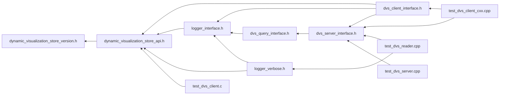

# File dynamic\_visualization\_store\_version.h

<a id="dynamic__visualization__store__version_8h"></a>

![][C]

C API for using Dynamic Visualization Store.


## Included by

* [dynamic_visualization_store_api.h](dynamic__visualization__store__api_8h.md#dynamic__visualization__store__api_8h)





## Macros

<a id="dynamic__visualization__store__version_8h_1ad6da902b33396e8306b60564e95d66e5"></a>
### Macro DVS\_CURRENT\_API\_VERSION

![][public]


```cpp
#define DVS_CURRENT_API_VERSION "1.4.4"
```


Ansys v26.1.


## Source


```cpp
/**************************************************************
*
*   (C) 2022-2025 ANSYS, Inc. Unauthorized use, distribution, or duplication is prohibited.
*
*   Restricted Rights Legend
*
*   Use, duplication, or disclosure of this
*   software and its documentation by the
*   Government is subject to restrictions as
*   set forth in subdivision [(b)(3)(ii)] of
*   the Rights in Technical Data and Computer
*   Software clause at 52.227-7013.
*
**************************************************************
*/


#ifndef ___DVS_VERSION_H___
#define ___DVS_VERSION_H___

//Prior version had no version file
//1.1.0 ANSYS v22.1 and v22.2
//1.2.1 Ansys v23.2
//1.3.0 Ansys v24.1
//1.4.0 Ansys v24.2
//1.4.1 Ansys v25.1
//1.4.2 Ansys v25.2
//1.4.3 Ansys v26.1
#define DVS_CURRENT_API_VERSION "1.4.4" 

#endif //___DVS_VERSION_H___
```


[public]: https://img.shields.io/badge/-public-brightgreen (public)
[protected]: https://img.shields.io/badge/-protected-yellow (protected)
[static]: https://img.shields.io/badge/-static-lightgrey (static)
[C]: https://img.shields.io/badge/language-C-blue (C)
[Python]: https://img.shields.io/badge/language-Python-blue (Python)
[private]: https://img.shields.io/badge/-private-red (private)
[const]: https://img.shields.io/badge/-const-lightblue (const)
[Markdown]: https://img.shields.io/badge/language-Markdown-blue (Markdown)