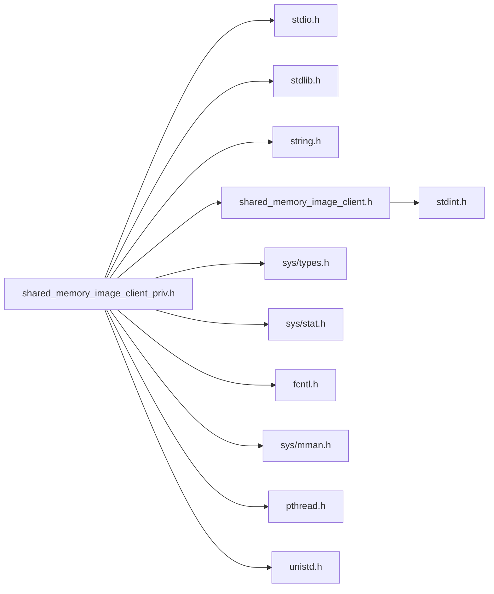

# File shared\_memory\_image\_client\_priv.h

<a id="shared__memory__image__client__priv_8h"></a>

![][C]

C API the shared memory image transport API server interface.

**version**\
1.0

This file describes the internal format of the shared memory system and the inner workings of the buffer state machine. It also provides the interface to a shared memory image server.<br/>


When creating a shared memory transport server, the [shared\_memory\_image\_client.h](shared__memory__image__client_8h.md#shared__memory__image__client_8h) interface is used to create/destroy a stream, albeit with unique option flags. The server does not use the [SharedMemoryImageStream\_lock()](shared__memory__image__client_8h.md#shared__memory__image__client_8h_1afefb8f5297147640b46d1f9eb1e77c9e) / [SharedMemoryImageStream\_unlock()](shared__memory__image__client_8h.md#shared__memory__image__client_8h_1ac885e449551afd5fb5a7f19c5ec785a6) functions. Instead, it calls [SharedMemoryImageStream\_putframe()](shared__memory__image__client__priv_8h.md#shared__memory__image__client__priv_8h_1abe3cb5374af97eeccf691864f6e2b2ad) whenever it has new imagery it wants to push to the client.


Server operations are as follows:


1. The client creates/sizes the shared memory file that is to be used and passes the filename to the server.

2. The server creates/initializes the shared memory stream by calling [SharedMemoryImageStream\_create()](shared__memory__image__client_8h.md#shared__memory__image__client_8h_1a03ba052ae823b3e39fef153db8f03ea2) with the IMAGESTREAM_OPTIONS_SERVER option. 
```cpp
SharedMemoryImageStream stream;
SharedMemoryImageError err;
err = SharedMemoryImageStream_create("shared_memory_file",
                                     IMAGESTREAM_OPTIONS_SERVER, &stream);
if (err < IMAGESTREAM_NOERROR) <handle error>
```


3. Periodically, the server may push a new image: 
```cpp
struct _SharedMemoryFrame frame;
frame.iFrame = 10;
frame.iWidth = 640;
frame.iHeight = 480;
frame.buffer = <some application buffer at least 648x480x3 bytes in size>;
SharedMemoryImageError err;
err = SharedMemoryImageStream_lock(stream, &frame));
```
 The data passed via buffer is copied into the shared memory space. Note, in some conditions, this function does not return a fatal error (<0), instead the error code return can report that no client has made a connection or that the frame was dropped because the client has not been responding to the frames being pushed fast enough.

4. When the communication is finished, the server should call: 
```cpp
SharedMemoryImageError err = SharedMemoryImageStream_destroy(stream);
```

## Includes

* <stdio.h>
* <stdlib.h>
* <string.h>
* [shared_memory_image_client.h](shared__memory__image__client_8h.md#shared__memory__image__client_8h)
* <sys/types.h>
* <sys/stat.h>
* <fcntl.h>
* <sys/mman.h>
* <pthread.h>
* <unistd.h>





## Included by

* [shared_memory_image_client_python.c](shared__memory__image__client__python_8c.md#shared__memory__image__client__python_8c)


## Macros

<a id="shared__memory__image__client__priv_8h_1a24ac2d665ce98370e25639bba2d992b6"></a>
### Macro IMAGESTREAM\_OPTIONS\_INITBUFFERHEADERS

![][public]


```cpp
#define IMAGESTREAM_OPTIONS_INITBUFFERHEADERS 0x00000001
```


set if the create call should initialize the buffer state


<a id="shared__memory__image__client__priv_8h_1a673fd1d2f27007af83467699cb53614f"></a>
### Macro IMAGESTREAM\_OPTIONS\_NOTHREADS

![][public]


```cpp
#define IMAGESTREAM_OPTIONS_NOTHREADS 0x00000002
```


if set, the mutex and monitoring thread will not be created


<a id="shared__memory__image__client__priv_8h_1aa87740042e4f5882fa4c990a6528c2e3"></a>
### Macro IMAGESTREAM\_OPTIONS\_SERVER

![][public]


```cpp
#define IMAGESTREAM_OPTIONS_SERVER [IMAGESTREAM\_OPTIONS\_INITBUFFERHEADERS](shared__memory__image__client__priv_8h.md#shared__memory__image__client__priv_8h_1a24ac2d665ce98370e25639bba2d992b6)|[IMAGESTREAM\_OPTIONS\_NOTHREADS](shared__memory__image__client__priv_8h.md#shared__memory__image__client__priv_8h_1a673fd1d2f27007af83467699cb53614f)
```


these options should be set for server streams


## Functions

<a id="shared__memory__image__client__priv_8h_1abe3cb5374af97eeccf691864f6e2b2ad"></a>
### Function SharedMemoryImageStream\_putframe

![][public]


```cpp
DEV SharedMemoryImageError SharedMemoryImageStream_putframe(SharedMemoryImageStream stream, SharedMemoryFrame frame)
```


SharedMemoryImageStream_putframe push a new image into a server image stream channel.

This function can only be called on a shared memory image stream created in server mode (options = IMAGESTREAM_OPTIONS_SERVER). The caller should create a frame structure with the frame number, the image size in pixels and a pointer to the image data (row major, tightly packed, RGB byte ordering). This call will copy the data pointed to by the buffer field, so the frame structure can be discarded after this call.


Return codes: These are not technically errors, but they do provide some feedback on the current disposition of the image transport stream.


IMAGESTREAM_UNCONNECTED - no client has connected to this stream yet. IMAGESTREAM_NO_BUFFERAVAILABLE - the frame has not been queued because the client has not yet read previous frames. IMAGESTREAM_NOERROR - the image frame has been queued up to be read by the client.


**Parameters**:

* **stream**: - the stream to push the image into
* **frame**: - the image to push into the stream


**Returns**:

[SharedMemoryImageError](shared__memory__image__client_8h.md#shared__memory__image__client_8h_1a0496a9a3db499fa9145fe97d2e6dae9a) - the return code for the operation


**Parameters**:

* [SharedMemoryImageStream](shared__memory__image__client_8h.md#shared__memory__image__client_8h_1af5b8eb2ae90823f10e9a17698ea80749) **stream**
* [SharedMemoryFrame](shared__memory__image__client_8h.md#shared__memory__image__client_8h_1a995c49496fcc1a41fb2d104c6473223b) **frame**

**Return type**: DEV [SharedMemoryImageError](shared__memory__image__client_8h.md#shared__memory__image__client_8h_1a0496a9a3db499fa9145fe97d2e6dae9a)

## Source


```cpp
/*  *************************************************************
 *   Copyright 2017-2020 ANSYS, Inc.
 *   All Rights Reserved.
 *
 *        Restricted Rights Legend
 *
 *   Use, duplication, or disclosure of this
 *   software and its documentation by the
 *   Government is subject to restrictions as
 *   set forth in subdivision [(b)(3)(ii)] of
 *   the Rights in Technical Data and Computer
 *   Software clause at 52.227-7013.
 *  *************************************************************
 */

#ifndef ___ENSIGHT_GRPC_SHMEM_CLIENT_PRIV_H___
#define ___ENSIGHT_GRPC_SHMEM_CLIENT_PRIV_H___


#include <stdio.h>
#include <stdlib.h>
#include <string.h>

#include "shared_memory_image_client.h"

#ifdef WIN32
#include <windows.h>
#else
#include <sys/types.h>
#include <sys/stat.h>
#include <fcntl.h>
#include <sys/mman.h>
#include <pthread.h>
#include <unistd.h>
#endif

#ifdef __cplusplus
extern "C" {
#endif

/* additional, private, creation options.  These are normally used by EnSight, not clients */
/* if set, the BufferHeader structures are initialized to IMAGESTREAM_BUFFER_STATE_SERVER */
#define IMAGESTREAM_OPTIONS_INITBUFFERHEADERS    0x00000001   
#define IMAGESTREAM_OPTIONS_NOTHREADS            0x00000002   
/* common server creation options */
#define IMAGESTREAM_OPTIONS_SERVER            IMAGESTREAM_OPTIONS_INITBUFFERHEADERS|IMAGESTREAM_OPTIONS_NOTHREADS    


 /*
  * Shared memory layout:
  *
  * Note: all pixels are 3 bytes RGB byte ordering, no scanline gaps/alignment
  *
  * base memory mapped pointer
  *   struct BufferHeader for buffer 0
  *   uint_8 data[n] image payload data
  *   struct BufferHeader for buffer 1
  *   uint_8 data[n] image payload data
  *
  * BufferHeader
  * uint32_t  frame_number
  * uint32_t  width in pixels of the entire frame
  * uint32_t  height in pixels of the entire frame
  * uint32_t  offset          offset from the top of the image in scanlines for this block  (0=end of frame)
  * uint32_t  num_scanlines   number of scanlines of data in the current payload
  * uint8_t   buffer_state:   0=server owned, 1=server writing, 2=client owned, 3=client reading
  *
  * The server is responsible for initializing the shared memory header states.
  * 
  *
  * These are the values for 'buffer_state' flag in the BufferHeader
  * structures.  Only the process that has control over the buffer can
  * change its state.  State progression:
  *
  * server sets to 4
  * client sets to 0
  * server sets to 1
  * server sets to 2
  * client sets to 3
  * client sets to 0
  *
  */

/* 0=server has control over this buffer */
#define IMAGESTREAM_BUFFER_STATE_SERVER           0
/* 1=server has control over this buffer and it actively writing to it */
#define IMAGESTREAM_BUFFER_STATE_SERVER_LOCKED    1
/* 2=client has control over this buffer and it has content written to by the server */
#define IMAGESTREAM_BUFFER_STATE_CLIENT           2
/* 3=client has control over this buffer and has mapped it to a frame */
#define IMAGESTREAM_BUFFER_STATE_CLIENT_LOCKED    3
/* 4=(unconnected) client has control over the buffer.  The server initializes the buffer
 * state to this value and waits for a client to connect.  When a client connects, it 
 * changes the state to 0 */
#define IMAGESTREAM_BUFFER_STATE_INIT             4

typedef struct {
    uint32_t frame_number;  
    uint32_t width;         
    uint32_t height;        
    uint32_t offset;        
    uint32_t num_scanlines; 
    uint8_t  buffer_state;  
    uint8_t  pad[3];        
} BufferHeader;             

/* 
 * These are the values for the 'frame_state' flag in the _SharedMemoryImageStream
 * structure. 
 * The frame starts in UNDEFINED state.  The lcl_thread_process() thread will
 * transition the frame to the READY state.  SharedMemoryImageStream_lock() will
 * transition the frame to the LOCKED state.  SharedMemoryImageStream_unlock() will
 * transition the frame back to the UNDEFINED state.
 *
 * Note: if the image frame is locked, any associated buffer (frame_buffer_number),
 * will also be moved to IMAGESTREAM_BUFFER_STATE_CLIENT_LOCKED and then released to
 * IMAGESTREAM_BUFFER_STATE_SERVER when the frame goes back to 
 * IMAGESTREAM_FRAME_STATE_UNDEFINED.
 */
#define IMAGESTREAM_FRAME_STATE_UNDEFINED         0
#define IMAGESTREAM_FRAME_STATE_IMAGE_READY       1
#define IMAGESTREAM_FRAME_STATE_IMAGE_LOCKED      2

struct _SharedMemoryImageStream {
    /* memory mapped pointer and its length (note: this is not marked volatile as it is not
     * intended to be accessed directly, but the data it points to is volatile) */
    uint8_t *ptr;            
    size_t length;           
    uint8_t shutting_down;   
    uint8_t frame_state;     
    struct _SharedMemoryFrame frame;  
    int32_t frame_buffer_number;      
    /* pointers into the memory mapped space (ptr) */
    BufferHeader volatile *buffer_header[2];  
    uint8_t *buffer_data[2]; 
    size_t payload_length;   

    uint32_t options;        
    /* platform specific bits for memory mapped I/O, a thread and a mutex */
#ifdef WIN32
    HANDLE fd;
    HANDLE file_map;
    CRITICAL_SECTION mutex;
    HANDLE thread;
#else
    int fd;
    pthread_mutex_t mutex;
    pthread_t thread;
#endif
};


 SharedMemoryImageError SharedMemoryImageStream_putframe(SharedMemoryImageStream stream,
    SharedMemoryFrame frame);

#ifdef __cplusplus
}
#endif

#endif
```


[public]: https://img.shields.io/badge/-public-brightgreen (public)
[protected]: https://img.shields.io/badge/-protected-yellow (protected)
[static]: https://img.shields.io/badge/-static-lightgrey (static)
[C]: https://img.shields.io/badge/language-C-blue (C)
[Python]: https://img.shields.io/badge/language-Python-blue (Python)
[private]: https://img.shields.io/badge/-private-red (private)
[const]: https://img.shields.io/badge/-const-lightblue (const)
[Markdown]: https://img.shields.io/badge/language-Markdown-blue (Markdown)