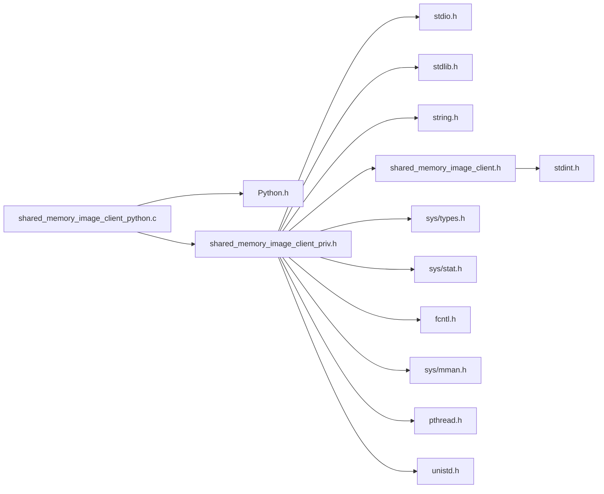

# File shared\_memory\_image\_client\_python.c

<a id="shared__memory__image__client__python_8c"></a>

![][C++]

Python interface to the [shared\_memory\_image\_client.h](shared__memory__image__client_8h.md#shared__memory__image__client_8h) API.

**author**\
Randy Frank ([randy.frank@ansys.com](mailto:randy.frank@ansys.com))


**version**\
1.0


## ensight_grpc_shmem python module

This module implements a set of Python bindings to the shared memory image transport API.


A simple example exercising the API might be:


```cpp
import ensight_grpc_shmem
import time

def run_server(dx=1920, dy=1080, n=500):
    s = ensight_grpc_shmem.stream_create("shmem.bin", ensight_grpc_shmem.IMAGESTREAM_OPTIONS_SERVER)
    img = b'\0'*dx*dy*3
    for i in range(n):
        time.sleep(1./60.)
        err = ensight_grpc_shmem.stream_putframe(s, dx, dy, i, img)
        print("Frame: {} {}".format(i, err))
        if i == 0:
            time.sleep(5)
    ensight_grpc_shmem.stream_destroy(s)

def run_client(num=200):
    c = ensight_grpc_shmem.stream_create("shmem.bin")
    count = 0
    while True:
        img = ensight_grpc_shmem.stream_lock(c)
        if type(img) is dict:
            print("Frame: {} {} {} {}".format(img['framenumber'], img['width'], img['height'],count))
            ensight_grpc_shmem.stream_unlock(c)
            count += 1
        if count > num:
            break
    ensight_grpc_shmem.stream_destroy(c)
```

## Includes

* <Python.h>
* [shared_memory_image_client_priv.h](shared__memory__image__client__priv_8h.md#shared__memory__image__client__priv_8h)





## Macros

<a id="shared__memory__image__client__python_8c_1a4a1e12ec49840b798c6413a8f6c947a9"></a>
### Macro MAX\_STREAMS

![][public]


```cpp
#define MAX_STREAMS 50
```


the maximum number of active streams we allow


## Variables

<a id="shared__memory__image__client__python_8c_1af18ca478d6e9ed48c335c286ec199d15"></a>
### Variable streamlist

![][public]
![][static]


```cpp
SharedMemoryImageStream streamlist[MAX_STREAMS][MAX_STREAMS] = { 0 }
```


the table of active stream objects


**Type**: [SharedMemoryImageStream](shared__memory__image__client_8h.md#shared__memory__image__client_8h_1af5b8eb2ae90823f10e9a17698ea80749)

## Functions

<a id="shared__memory__image__client__python_8c_1a68584fd5e8630714c738fc30ad19fa03"></a>
### Function stream\_create

![][public]


```cpp
stream_id stream_create(str filename, int options=IMAGESTREAM_OPTIONS_NONE)
```


Create a shared memory image stream.

Python wrapper for [SharedMemoryImageStream\_create()](shared__memory__image__client_8h.md#shared__memory__image__client_8h_1a03ba052ae823b3e39fef153db8f03ea2). Function in the [ensight\_grpc\_shmem python module](#shared__memory__image__client__python_8c_1ensight_grpc_shmem) Python module. 

**Parameters**:

* **filename**: the name of the shared memory file to use.
* **options**: the stream creation options


**Exceptions**:

* **[IMAGESTREAM\_BAD\_ARGS](shared__memory__image__client_8h.md#shared__memory__image__client_8h_1ac2b3e8a36182f38dab1c5fd7a700a0c6)**: 
* **[IMAGESTREAM\_BAD\_FILE\_SIZE](shared__memory__image__client_8h.md#shared__memory__image__client_8h_1a54a45d2f039e6275c28249eedfa2515d)**: 
* **[IMAGESTREAM\_UNABLE\_TO\_OPEN\_FILE](shared__memory__image__client_8h.md#shared__memory__image__client_8h_1a5b68da171a139f688d317320d0a4eb3e)**: 
* **[IMAGESTREAM\_UNABLE\_TO\_MAP\_FILE](shared__memory__image__client_8h.md#shared__memory__image__client_8h_1ac7eb344cf60975382720f71182dab490)**: 
* **[IMAGESTREAM\_MEMORY\_ALLOC\_ERROR](shared__memory__image__client_8h.md#shared__memory__image__client_8h_1ae37af5c9dcf1d89b30b82ca4be840cfe)**: 
* **[IMAGESTREAM\_THREAD\_CREATE\_ERROR](shared__memory__image__client_8h.md#shared__memory__image__client_8h_1ac0d310d75b0c3ff53d524a0a5fe25b6f)**:


**Returns**:

the allocated stream id.


**See also**: [SharedMemoryImageStream\_create()](shared__memory__image__client_8h.md#shared__memory__image__client_8h_1a03ba052ae823b3e39fef153db8f03ea2).


**Parameters**:

* str **filename**
* int **options** = [IMAGESTREAM\_OPTIONS\_NONE](shared__memory__image__client_8h.md#shared__memory__image__client_8h_1a7fbe522f7a46875a755f07c8ff69e2df) 

**Return type**: stream_id

<a id="shared__memory__image__client__python_8c_1ac78db99f06d47f7718fdcac4ae3cc374"></a>
### Function stream\_lock

![][public]


```cpp
frame stream_lock(stream_id id)
```


Get any available image frame.

Python wrapper for [SharedMemoryImageStream\_lock()](shared__memory__image__client_8h.md#shared__memory__image__client_8h_1afefb8f5297147640b46d1f9eb1e77c9e). Function in the [ensight\_grpc\_shmem python module](#shared__memory__image__client__python_8c_1ensight_grpc_shmem) Python module. 

**Parameters**:

* **id**: the stream to read from.


**Exceptions**:

* **[IMAGESTREAM\_BAD\_ARGS](shared__memory__image__client_8h.md#shared__memory__image__client_8h_1ac2b3e8a36182f38dab1c5fd7a700a0c6)**: 
* **[IMAGESTREAM\_IS\_SERVER](shared__memory__image__client_8h.md#shared__memory__image__client_8h_1ac914cc76952081d1ccc7c520e12770b1)**: 
* **[IMAGESTREAM\_LOCKED](shared__memory__image__client_8h.md#shared__memory__image__client_8h_1a8389f19c29b726a2bed3c5831d1fb267)**:


**Returns**:

[SharedMemoryImageError](shared__memory__image__client_8h.md#shared__memory__image__client_8h_1a0496a9a3db499fa9145fe97d2e6dae9a) if no images are read or a dictionary with the same fields as [\_SharedMemoryFrame](struct___shared_memory_frame.md#struct___shared_memory_frame).


**See also**: [SharedMemoryImageStream\_lock()](shared__memory__image__client_8h.md#shared__memory__image__client_8h_1afefb8f5297147640b46d1f9eb1e77c9e). <br/>


**Parameters**:

* stream_id **id**

**Return type**: frame

<a id="shared__memory__image__client__python_8c_1a233ea80003a929e8e60aabd26a3b5c5e"></a>
### Function stream\_unlock

![][public]


```cpp
SharedMemoryImageError stream_unlock(stream_id id)
```


Unlock the frame allocated by [stream\_lock()](shared__memory__image__client__python_8c.md#shared__memory__image__client__python_8c_1ac78db99f06d47f7718fdcac4ae3cc374).

Python wrapper for [SharedMemoryImageStream\_unlock()](shared__memory__image__client_8h.md#shared__memory__image__client_8h_1ac885e449551afd5fb5a7f19c5ec785a6). Function in the [ensight\_grpc\_shmem python module](#shared__memory__image__client__python_8c_1ensight_grpc_shmem) Python module. 

**Parameters**:

* **id**: the stream to read from.


**Exceptions**:

* **[IMAGESTREAM\_BAD\_ARGS](shared__memory__image__client_8h.md#shared__memory__image__client_8h_1ac2b3e8a36182f38dab1c5fd7a700a0c6)**: 
* **[IMAGESTREAM\_IS\_SERVER](shared__memory__image__client_8h.md#shared__memory__image__client_8h_1ac914cc76952081d1ccc7c520e12770b1)**: 
* **[IMAGESTREAM\_NOT\_LOCKED](shared__memory__image__client_8h.md#shared__memory__image__client_8h_1ab7873d9185a495020022f80c238142bc)**:


**Returns**:

[SharedMemoryImageError](shared__memory__image__client_8h.md#shared__memory__image__client_8h_1a0496a9a3db499fa9145fe97d2e6dae9a) if no images are read or a dictionary with the same fields as [\_SharedMemoryFrame](struct___shared_memory_frame.md#struct___shared_memory_frame).


**See also**: [SharedMemoryImageStream\_unlock()](shared__memory__image__client_8h.md#shared__memory__image__client_8h_1ac885e449551afd5fb5a7f19c5ec785a6). <br/>


**Parameters**:

* stream_id **id**

**Return type**: [SharedMemoryImageError](shared__memory__image__client_8h.md#shared__memory__image__client_8h_1a0496a9a3db499fa9145fe97d2e6dae9a)

<a id="shared__memory__image__client__python_8c_1af656cd2bf739307f1d52221d49da37ae"></a>
### Function stream\_destroy

![][public]


```cpp
SharedMemoryImageError stream_destroy(stream_id id)
```


Close down and destroy a shared memory transport interface.

Python wrapper for [SharedMemoryImageStream\_destroy()](shared__memory__image__client_8h.md#shared__memory__image__client_8h_1a4ea47b6bda387b71ed5f91db329eff65). Function in the [ensight\_grpc\_shmem python module](#shared__memory__image__client__python_8c_1ensight_grpc_shmem) Python module. 

**Parameters**:

* **id**: the stream to be destroyed.


**Exceptions**:

* **[IMAGESTREAM\_BAD\_ARGS](shared__memory__image__client_8h.md#shared__memory__image__client_8h_1ac2b3e8a36182f38dab1c5fd7a700a0c6)**:


**Returns**:

IMAGESTREAM_NOERROR


**See also**: [SharedMemoryImageStream\_destroy()](shared__memory__image__client_8h.md#shared__memory__image__client_8h_1a4ea47b6bda387b71ed5f91db329eff65). <br/>


**Parameters**:

* stream_id **id**

**Return type**: [SharedMemoryImageError](shared__memory__image__client_8h.md#shared__memory__image__client_8h_1a0496a9a3db499fa9145fe97d2e6dae9a)

<a id="shared__memory__image__client__python_8c_1a23b3d9929aaff2a388402452ce5228c1"></a>
### Function stream\_putframe

![][public]


```cpp
SharedMemoryImageError stream_putframe(stream_id id, int width, int height, int framenumber, bytes pixeldata)
```


Push an image into the shared memory transport buffer.

Python wrapper for [SharedMemoryImageStream\_putframe()](shared__memory__image__client__priv_8h.md#shared__memory__image__client__priv_8h_1abe3cb5374af97eeccf691864f6e2b2ad). Only used by server connections. Function in the [ensight\_grpc\_shmem python module](#shared__memory__image__client__python_8c_1ensight_grpc_shmem) Python module. 

**Parameters**:

* **id**: the stream to write to.
* **width**: width of the frame in pixels
* **height**: height of the frame in pixels
* **framenumber**: the sequence number of this frame
* **pixeldata**: a bytes() object of at least width*height*3 bytes in size


**Exceptions**:

* **[IMAGESTREAM\_BAD\_ARGS](shared__memory__image__client_8h.md#shared__memory__image__client_8h_1ac2b3e8a36182f38dab1c5fd7a700a0c6)**: 
* **[IMAGESTREAM\_IS\_NOTSERVER](shared__memory__image__client_8h.md#shared__memory__image__client_8h_1aff57dd9d671a32995d562d68fcfa5fff)**: 
* **[IMAGESTREAM\_FRAME\_TOO\_LARGE](shared__memory__image__client_8h.md#shared__memory__image__client_8h_1ae5bdc8c10b2aa9db85d0955c99cba2c6)**:


**Returns**:

[SharedMemoryImageError](shared__memory__image__client_8h.md#shared__memory__image__client_8h_1a0496a9a3db499fa9145fe97d2e6dae9a) IMAGESTREAM_UNCONNECTED, IMAGESTREAM_NO_BUFFERAVAILABLE, IMAGESTREAM_NOERROR


**See also**: [SharedMemoryImageStream\_putframe()](shared__memory__image__client__priv_8h.md#shared__memory__image__client__priv_8h_1abe3cb5374af97eeccf691864f6e2b2ad). <br/>


**Parameters**:

* stream_id **id**
* int **width**
* int **height**
* int **framenumber**
* bytes **pixeldata**

**Return type**: [SharedMemoryImageError](shared__memory__image__client_8h.md#shared__memory__image__client_8h_1a0496a9a3db499fa9145fe97d2e6dae9a)

<a id="shared__memory__image__client__python_8c_1aeba34290ea6015f65d64f909b0fc56a3"></a>
### Function PyDict\_SetItemString\_DECREF

![][public]
![][static]


```cpp
static int PyDict_SetItemString_DECREF(PyObject *dict, const char *key, PyObject *val)
```


**Parameters**:

* PyObject * **dict**
* const char * **key**
* PyObject * **val**

**Return type**: int

<a id="shared__memory__image__client__python_8c_1a98e79146454f923c19b1cbeb7c88533a"></a>
### Function return\_error

![][public]
![][static]


```cpp
static PyObject * return_error(int err)
```


**Parameters**:

* int **err**

**Return type**: PyObject *

<a id="shared__memory__image__client__python_8c_1a9e3880be3e21ac3544287b850f83f636"></a>
### Function Py\_stream\_create

![][public]
![][static]


```cpp
static PyObject * Py_stream_create(PyObject *self, PyObject *args, PyObject *keywds)
```


**Parameters**:

* PyObject * **self**
* PyObject * **args**
* PyObject * **keywds**

**Return type**: PyObject *

<a id="shared__memory__image__client__python_8c_1a7d9f96dc92caba6f2821605b1211321a"></a>
### Function Py\_stream\_lock

![][public]
![][static]


```cpp
static PyObject * Py_stream_lock(PyObject *self, PyObject *args, PyObject *keywds)
```


**Parameters**:

* PyObject * **self**
* PyObject * **args**
* PyObject * **keywds**

**Return type**: PyObject *

<a id="shared__memory__image__client__python_8c_1a4f14bab9b6a969ed9eba4432e6562f2f"></a>
### Function Py\_stream\_unlock

![][public]
![][static]


```cpp
static PyObject * Py_stream_unlock(PyObject *self, PyObject *args, PyObject *keywds)
```


**Parameters**:

* PyObject * **self**
* PyObject * **args**
* PyObject * **keywds**

**Return type**: PyObject *

<a id="shared__memory__image__client__python_8c_1ae1b97db4b34706b8e574d5f50deb16b4"></a>
### Function Py\_stream\_putframe

![][public]
![][static]


```cpp
static PyObject * Py_stream_putframe(PyObject *self, PyObject *args, PyObject *keywds)
```


**Parameters**:

* PyObject * **self**
* PyObject * **args**
* PyObject * **keywds**

**Return type**: PyObject *

<a id="shared__memory__image__client__python_8c_1ae0034a5978bb646155fc431817b2d4fe"></a>
### Function Py\_stream\_destroy

![][public]
![][static]


```cpp
static PyObject * Py_stream_destroy(PyObject *self, PyObject *args, PyObject *keywds)
```


**Parameters**:

* PyObject * **self**
* PyObject * **args**
* PyObject * **keywds**

**Return type**: PyObject *

<a id="shared__memory__image__client__python_8c_1a5dd7396c5be0a252896150b42cd7e43a"></a>
### Function stream\_python\_shutdown

![][public]
![][static]


```cpp
static void stream_python_shutdown(void)
```


**Parameters**:

* void

**Return type**: void

## Source


```cpp
/**************************************************************************
 *
 *   ****************************************
 *    Copyright 2020 ANSYS Inc.
 *    All Rights Reserved.
 *
 *    Restricted Rights Legend
 *
 *    Government is subject to restrictions as
 *    set forth in subdivision [(b)(3)(ii)] of
 *    the Rights in Technical Data and Computer
 *    Software clause at 52.227-7013.
 *   ****************************************
 *
 *************************************************************************/

/* Warning this is a HACK to get around Python issues mixing debug modules with
 * release Python builds. */

#ifdef _DEBUG
#undef _DEBUG
#include <Python.h>
#define _DEBUG
#else
#include <Python.h>
#endif

#include "shared_memory_image_client_priv.h"

#define MAX_STREAMS 50   
static SharedMemoryImageStream streamlist[MAX_STREAMS] = { 0 };   


#ifdef DOXYGEN
stream_id stream_create(str filename, int options=IMAGESTREAM_OPTIONS_NONE);

frame stream_lock(stream_id id);

SharedMemoryImageError stream_unlock(stream_id id);

SharedMemoryImageError stream_destroy(stream_id id);

SharedMemoryImageError stream_putframe(stream_id id, int width, int height, int framenumber, bytes pixeldata);

#endif

/* Utility functions PyDict_SetItemString with DECREF */
static int PyDict_SetItemString_DECREF(PyObject *dict, const char *key, PyObject *val)
{
    int ret = PyDict_SetItemString(dict, key, val);
    if (ret == 0) Py_DECREF(val);
    return(ret);
}

// Given an error code, return the code or raise an exception
static PyObject *return_error(int err)
{
    if (err >= IMAGESTREAM_NOERROR) {
        return PyLong_FromLong(err);
    }
    PyErr_SetString(PyExc_RuntimeError, SharedMemoryImageStream_errorstring(err));
    return NULL;
}

static PyObject *Py_stream_create(PyObject *self, PyObject *args, PyObject *keywds)
{
    char *filename = NULL;
    uint32_t options = 0;
    static const char *kwlist[] = { "filename", "options", NULL };
    if (!PyArg_ParseTupleAndKeywords(args, keywds, (char *)"s|i", (char **)kwlist,
        &filename, &options)) return NULL;
    int32_t stream_id = -1;
    for (int i = 0; i < MAX_STREAMS; i++) {
        if (!streamlist[i]) {
            stream_id = i;
        }
    }
    if (stream_id == -1) {
        PyErr_SetString(PyExc_RuntimeError, "Maximum number of simultaneous streams open");
        return NULL;
    }
    SharedMemoryImageStream stream;
    SharedMemoryImageError err = SharedMemoryImageStream_create(filename, options, &stream);
    if (err != IMAGESTREAM_NOERROR) {
        return return_error(err);
    }
    streamlist[stream_id] = stream;
    return PyLong_FromLong(stream_id);
}

static PyObject *Py_stream_lock(PyObject *self, PyObject *args, PyObject *keywds)
{
    int32_t stream_id = -1;
    static const char *kwlist[] = { "stream_id", NULL };
    if (!PyArg_ParseTupleAndKeywords(args, keywds, (char *)"i", (char **)kwlist,
        &stream_id)) return NULL;
    if ((stream_id < 0) || (stream_id >= MAX_STREAMS) || !streamlist[stream_id]) {
        PyErr_SetString(PyExc_RuntimeError, "Unknown stream id");
        return NULL;
    }
    SharedMemoryFrame frame;
    SharedMemoryImageError err = SharedMemoryImageStream_lock(streamlist[stream_id], &frame);
    if (err != IMAGESTREAM_NOERROR) {
        return return_error(err);
    }
    PyObject *ret = PyDict_New();
    PyDict_SetItemString_DECREF(ret, "width", PyLong_FromLong(frame->iWidth));
    PyDict_SetItemString_DECREF(ret, "height", PyLong_FromLong(frame->iHeight));
    PyDict_SetItemString_DECREF(ret, "framenumber", PyLong_FromLong(frame->iFrame));
    PyDict_SetItemString_DECREF(ret, "pixeldata", PyBytes_FromStringAndSize(frame->buffer,
        frame->iWidth*3*frame->iHeight));
    return ret;
}

static PyObject *Py_stream_unlock(PyObject *self, PyObject *args, PyObject *keywds)
{
    int32_t stream_id = -1;
    static const char *kwlist[] = { "stream_id", NULL };
    if (!PyArg_ParseTupleAndKeywords(args, keywds, (char *)"i", (char **)kwlist,
        &stream_id)) return NULL;
    if ((stream_id < 0) || (stream_id >= MAX_STREAMS) || !streamlist[stream_id]) {
        PyErr_SetString(PyExc_RuntimeError, "Unknown stream id");
        return NULL;
    }
    SharedMemoryImageError err = SharedMemoryImageStream_unlock(streamlist[stream_id]);
    return return_error(err);
}

static PyObject *Py_stream_putframe(PyObject *self, PyObject *args, PyObject *keywds)
{
    int32_t stream_id = -1;
    int32_t iWidth = 0;
    int32_t iHeight = 0;
    uint32_t iFrame = 0;
    PyObject *pData = NULL;
    static const char *kwlist[] = { "stream_id", "width", "height", "framenumber", "pixeldata", NULL };
    if (!PyArg_ParseTupleAndKeywords(args, keywds, (char *)"iiiiO", (char **)kwlist,
        &stream_id, &iWidth, &iHeight, &iFrame, &pData)) return NULL;
    if ((stream_id < 0) || (stream_id >= MAX_STREAMS) || !streamlist[stream_id]) {
        PyErr_SetString(PyExc_RuntimeError, "Unknown stream id");
        return NULL;
    }
    int32_t frame_size = iWidth * iHeight * 3;
    if (frame_size < 1) {
        PyErr_SetString(PyExc_RuntimeError, "Invalid frame size");
        return NULL;
    }
    if (!PyBytes_Check(pData)) {
        PyErr_SetString(PyExc_RuntimeError, "Pixeldata must be a bytes object");
        return NULL;
    }
    Py_ssize_t data_size = PyBytes_Size(pData);
    if (data_size < frame_size) {
        PyErr_SetString(PyExc_RuntimeError, "Pixeldata is too small for specified frame size");
        return NULL;
    }
    struct _SharedMemoryFrame frame;
    frame.iFrame = iFrame;
    frame.iWidth = iWidth;
    frame.iHeight = iHeight;
    frame.buffer = PyBytes_AsString(pData);
    SharedMemoryImageError err = SharedMemoryImageStream_putframe(streamlist[stream_id], &frame);
    return return_error(err);
}

static PyObject *Py_stream_destroy(PyObject *self, PyObject *args, PyObject *keywds)
{
    int32_t stream_id = -1;
    static const char *kwlist[] = { "stream_id", NULL };
    if (!PyArg_ParseTupleAndKeywords(args, keywds, (char *)"i", (char **)kwlist,
        &stream_id)) return NULL;
    if ((stream_id < 0) || (stream_id >= MAX_STREAMS) || !streamlist[stream_id]) {
        PyErr_SetString(PyExc_RuntimeError, "Unknown stream id");
        return NULL;
    }    
    SharedMemoryImageError err = SharedMemoryImageStream_destroy(streamlist[stream_id]);
    streamlist[stream_id] = NULL;
    return return_error(err);
}

static void stream_python_shutdown(void)
{
    for (int i = 0; i < MAX_STREAMS; i++) {
        if (streamlist[i]) SharedMemoryImageStream_destroy(streamlist[i]);
        streamlist[i] = NULL;
    }
}


/* Module definition */
static PyObject *pmodule = NULL;
static PyMethodDef py_methods[] = {
    {(char *)"stream_create", (PyCFunction)Py_stream_create, METH_VARARGS | METH_KEYWORDS, 
     (char *)"Create a new shared memory image stream"},
    {(char *)"stream_lock", (PyCFunction)Py_stream_lock, METH_VARARGS | METH_KEYWORDS,
     (char *)"Lock and return the next image from an image stream"},
    {(char *)"stream_unlock", (PyCFunction)Py_stream_unlock, METH_VARARGS | METH_KEYWORDS,
     (char *)"Release the lock on an image stream"},
    {(char *)"stream_putframe", (PyCFunction)Py_stream_putframe, METH_VARARGS | METH_KEYWORDS,
     (char *)"Push a new frame into the image stream"},
    {(char *)"stream_destroy", (PyCFunction)Py_stream_destroy, METH_VARARGS | METH_KEYWORDS,
     (char *)"Destroy an image stream"},
    {NULL, NULL, 0, NULL}
};

#if PY_MAJOR_VERSION >= 3

static struct PyModuleDef moduledef = {
        PyModuleDef_HEAD_INIT,
        "ensight_grpc_shmem",
        "EnSight gRPC shared memory image stream",
        -1,
        py_methods,
        NULL,                /* m_reload */
        NULL,                /* m_traverse */
        NULL,                /* m_clear */
        NULL,                /* m_free */
};

PyMODINIT_FUNC PyInit_ensight_grpc_shmem()
{
    pmodule = PyModule_Create(&moduledef);
#else
PyMODINIT_FUNC initensight_grpc_shmem()
{
    pmodule = Py_InitModule3("ensight_grpc_shmem", py_methods, "EnSight gRPC shared memory image stream");
#endif

    // Common (2 & 3) code starts here -------------------------------------------------
    PyModule_AddStringConstant(pmodule, "version", IMAGESTREAM_API_VERSION);

    PyModule_AddIntConstant(pmodule, "OPTIONS_NONE", (int)IMAGESTREAM_OPTIONS_NONE);
    PyModule_AddIntConstant(pmodule, "OPTIONS_SERVER", (int)IMAGESTREAM_OPTIONS_SERVER);
    PyModule_AddIntConstant(pmodule, "OPTIONS_FLIPVERTICAL", (int)IMAGESTREAM_OPTIONS_FLIPVERTICAL);

    PyModule_AddIntConstant(pmodule, "ERROR_NOERROR", (int)IMAGESTREAM_NOERROR);
    PyModule_AddIntConstant(pmodule, "ERROR_NO_BUFFERAVAILABLE", (int)IMAGESTREAM_NO_BUFFERAVAILABLE);
    PyModule_AddIntConstant(pmodule, "ERROR_NO_FRAMEAVAILABLE", (int)IMAGESTREAM_NO_FRAMEAVAILABLE);
    PyModule_AddIntConstant(pmodule, "ERROR_RECONNECTING", (int)IMAGESTREAM_RECONNECTING);
    PyModule_AddIntConstant(pmodule, "ERROR_UNCONNECTED", (int)IMAGESTREAM_UNCONNECTED);

    /* cleanup on exit */
    Py_AtExit(stream_python_shutdown);
    // Common (2 & 3) code ends here -------------------------------------------------

#if PY_MAJOR_VERSION >= 3
    return pmodule;
}
#else
    return;
}
#endif

```


[public]: https://img.shields.io/badge/-public-brightgreen (public)
[protected]: https://img.shields.io/badge/-protected-yellow (protected)
[static]: https://img.shields.io/badge/-static-lightgrey (static)
[C++]: https://img.shields.io/badge/language-C%2B%2B-blue (C++)
[Python]: https://img.shields.io/badge/language-Python-blue (Python)
[private]: https://img.shields.io/badge/-private-red (private)
[const]: https://img.shields.io/badge/-const-lightblue (const)
[Markdown]: https://img.shields.io/badge/language-Markdown-blue (Markdown)