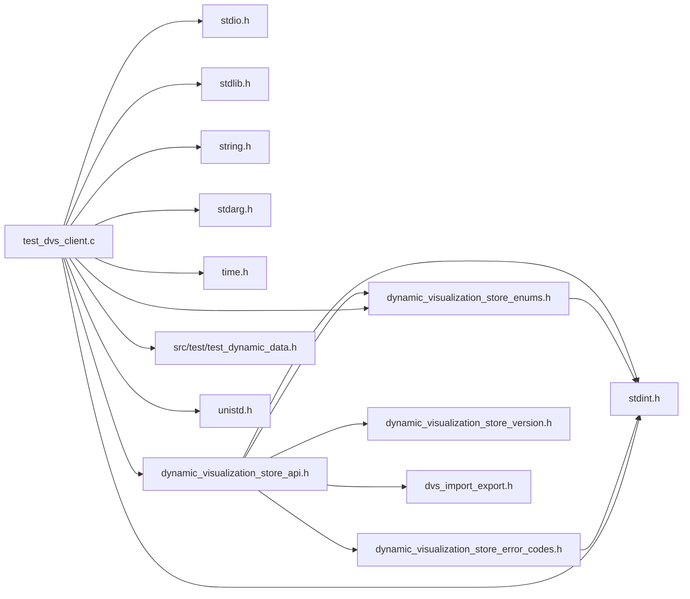

# File test\_dvs\_client.c

<a id="test__dvs__client_8c"></a>

![][C]

Test client to exercise the C API of the Dynamic Visualization Store API.

**version**\
0.1

## Includes

* <stdio.h>
* <stdlib.h>
* <string.h>
* <stdint.h>
* <stdarg.h>
* <time.h>
* [dynamic_visualization_store_api.h](dynamic__visualization__store__api_8h.md#dynamic__visualization__store__api_8h)
* [dynamic_visualization_store_enums.h](dynamic__visualization__store__enums_8h.md#dynamic__visualization__store__enums_8h)
* src/test/test_dynamic_data.h
* <unistd.h>





## Macros

<a id="test__dvs__client_8c_1ae71449b1cc6e6250b91f539153a7a0d3"></a>
### Macro M\_PI

![][public]


```cpp
#define M_PI 3.141592653589793238462643383279502884
```


## Functions

<a id="test__dvs__client_8c_1aae64bd0c132a92bc351c373dba929ec5"></a>
### Function logging\_function

![][public]
![][static]


```cpp
static void logging_function(void *user_data, const char *message)
```


**Parameters**:

* void * **user_data**
* const char * **message**

**Return type**: void

<a id="test__dvs__client_8c_1a3c04138a5bfe5d72780bb7e82a18e627"></a>
### Function main

![][public]


```cpp
int main(int argc, char **argv)
```


Main method of test client application.

**Parameters**:

* **argc**: Number of arguments
* **argv**: arguments


**Returns**:

int return value of app (unused)


**Parameters**:

* int **argc**
* char ** **argv**

**Return type**: int

## Source


```cpp
/*  *************************************************************
 *   Copyright 2017-2025 ANSYS, Inc.
 *   All Rights Reserved.
 *
 *        Restricted Rights Legend
 *
 *   Use, duplication, or disclosure of this
 *   software and its documentation by the
 *   Government is subject to restrictions as
 *   set forth in subdivision [(b)(3)(ii)] of
 *   the Rights in Technical Data and Computer
 *   Software clause at 52.227-7013.
 *  *************************************************************
 */


#include <stdio.h>
#include <stdlib.h>
#include <string.h>
#include <stdint.h>
#include <stdarg.h>
#include <time.h>

#include "dynamic_visualization_store_api.h"
#include "dynamic_visualization_store_enums.h"
#include "src/test/test_dynamic_data.h"

#ifdef _WIN32
#include <Windows.h>
#else
#include <unistd.h>
#endif

#ifndef M_PI
# define M_PI   3.141592653589793238462643383279502884
#endif

static void logging_function(void* user_data, const char* message)
{
    fprintf(stderr, message);
}

int main(int argc, char** argv)
{
    uint32_t port = 50055;
    uint32_t msec_delay = 0;
    char host[512] = {0};
    strcpy(host, "127.0.0.1");
    char protocol[10] = {0};
    strcpy(protocol, "grpc");
    uint32_t width = 50;
    uint32_t height = 50;
    uint32_t depth = 50;
    uint32_t max_timesteps = 10;
    uint32_t current_rank = 0;
    uint32_t total_ranks = 1;
    uint8_t create_ghosts = 1;
    uint8_t block_for_server = 1;
    uint8_t block_for_reinit = 1;
    uint32_t starting_timestep = 0;
    uint32_t dedup = 1;
    uint32_t send_structured_parts = 0;
    char dataset_id[255] = {0};
    strcpy(dataset_id, "Test-C-API");
    char secret[255] = {0};
    uint32_t plot_rank = 0;
    uint32_t server_number = 0;
    uint32_t server_verbosity = 0;
    uint32_t local_ranks = 0;
    uint32_t all_defs = 0;
    char cache_uri[512] = {0};
    uint32_t log_all = 0;
    uint32_t debug_wait = 0;
    uint32_t start_server = 0;
    uint32_t test_reinit = 0;
    uint32_t reinit_parts = 0;
    uint32_t reinit_plots = 0;
    uint32_t reinit_vars = 0;
    uint32_t time_period = 0;
    uint32_t test_iblanking = 0;
    char dvs_file_loc[1024] = {0};
    uint32_t test_delete = 0;
    uint32_t rm_int64 = 0;
    uint32_t generate_rbm = 0;
    int32_t conn_timeout = -1;

    uint32_t i = 1;
    int allow_all_networks = 0;
    int disable_tls = 0;
    int use_tcp_sockets = 0;
    char base_uds_path[1024]="/tmp/greeter";

    while (i < argc)
    {
        if ((strcmp(argv[i], "-p") == 0 ) && (i < argc - 1))
        {
            i++;
            port = atoi(argv[i]);
        }
        else if ((strcmp(argv[i], "-h") == 0) && (i < argc - 1))
        {
            i++;
            strncpy(host, argv[i], sizeof(host)-1);
        }
        else if ((strcmp(argv[i], "-protocol") == 0) && (i < argc - 1))
        {
            i++;
            strncpy(protocol, argv[i], sizeof(protocol)-1);
            if (strcmp(protocol, "grpc") != 0 && strcmp(protocol, "null") != 0 )
            {
                fprintf(stderr, "protocol: %s invalid\n", protocol);
                exit(1);
            }
        }
        else if ((strcmp(argv[i], "-d") == 0) && (i < argc - 1))
        {
            i++;
            msec_delay = atoi(argv[i]);
        }
        else if ((strcmp(argv[i], "-s") == 0) && (i < argc - 3))
        {
            i++;
            width = atoi(argv[i++]);
            height = atoi(argv[i++]);
            depth = atoi(argv[i]);
        }
        else if ((strcmp(argv[i], "-t") == 0) && (i < argc - 1))
        {
            i++;
            max_timesteps = atoi(argv[i]);
        }
        else if ((strcmp(argv[i], "-r") == 0) && (i < argc - 2))
        {
            i++;
            current_rank = atoi(argv[i++]);
            total_ranks = atoi(argv[i]);
        }
        else if (strcmp(argv[i], "-noghost") == 0)
        {
            create_ghosts = 0;
        }
        else if (strcmp(argv[i], "-nowait") == 0)
        {
            block_for_server = 0;
        }
        else if(strcmp(argv[i], "-generate_rbm") == 0){
            generate_rbm = 1;
        }
        else if ((strcmp(argv[i], "-start") == 0) && (i < argc - 1))
        {
            i++;
            starting_timestep = atoi(argv[i]);
        }
        else if (strcmp(argv[i], "-nodedup") == 0)
        {
            dedup = 0;
        }
        else if (strcmp(argv[i], "-id") == 0)
        {
            i++;
            memset(dataset_id, 0, 255);
            strncpy(dataset_id, argv[i], sizeof(dataset_id)-1);
        }
        else if (strcmp(argv[i], "-secret") == 0)
        {
            i++;
            strncpy(secret, argv[i], sizeof(secret)-1);
        }
        else if (strcmp(argv[i], "-structured") == 0)
        {
            send_structured_parts = 1;
        }
        else if (strcmp(argv[i], "-iblank") == 0)
        {
            test_iblanking = 1;
        }
        else if (strcmp(argv[i], "-plot_rank") == 0)
        {
            i++;
            plot_rank = atoi(argv[i]);
        }
        else if (strcmp(argv[i], "-server") == 0 && (i < argc - 3))
        {
            i++;
            start_server = 1;
            server_number = atoi(argv[i++]);
            local_ranks = atoi(argv[i++]);
            server_verbosity = atoi(argv[i]);
        }
        else if (strcmp(argv[i], "-cache_uri") == 0)
        {
            i++;
            strncpy(cache_uri, argv[i], sizeof(cache_uri)-1);
        }
        else if (strcmp(argv[i], "-all_defs") == 0)
        {
            all_defs = 1;
        }
        else if (strcmp(argv[i], "-log_all") == 0)
        {
            log_all = 1;
        }
        else if (strcmp(argv[i], "-debug_wait") == 0)
        {
            i++;
            debug_wait = atoi(argv[i]);
        }
        else if (strcmp(argv[i], "-reinit_vars") == 0)
        {
            test_reinit = 1;
            reinit_vars = 1;
        }
        else if (strcmp(argv[i], "-reinit_parts") == 0)
        {
            test_reinit = 1;
            reinit_parts = 1;
        }
        else if (strcmp(argv[i], "-reinit_plots") == 0)
        {
            test_reinit = 1;
            reinit_plots = 1;
        }
        else if (strcmp(argv[i], "-reinit_all") == 0)
        {
            test_reinit = 1;
            reinit_parts = 1;
            reinit_vars = 1;
            reinit_plots = 1;
        }
        else if (strcmp(argv[i], "-time_period") == 0)
        {
            i++;
            time_period = atoi(argv[i]);
        }
        else if (strcmp(argv[i], "-dvs_file") == 0)
        {
            i++;
            strncpy(dvs_file_loc, argv[i], sizeof(dvs_file_loc)-1);
        }
        else if (strcmp(argv[i], "-test_delete") == 0)
        {
            test_delete = 1;
        }
        else if (strcmp(argv[i], "-rm_int64") == 0)
        {
            rm_int64 = 1;
        }
        else if (strcmp(argv[i], "-allow_all_networks") == 0)
        {
            i++;
            allow_all_networks = atoi(argv[i]);
        }
        else if (strcmp(argv[i], "-disable_tls") == 0)
        {
            i++;
            disable_tls = atoi(argv[i]);
        }
        else if (strcmp(argv[i], "-use_tcp_sockets") == 0)
        {
            i++;
            use_tcp_sockets = atoi(argv[i]);
        }
        else if (strcmp(argv[i], "-base_uds_path") == 0){
            i++;
            strncpy(base_uds_path, argv[i], sizeof(base_uds_path)-1);
        }
        else if (strcmp(argv[i], "-conn_timeout") == 0)
        {
            i++;
            conn_timeout = atoi(argv[i]);
        }
        else
        {
            fprintf(stderr, "Unknown option: %s\n", argv[i]);
            fprintf(stderr, "Usage: %s [-p port] [-h host] [-d msec_delay] [-t num_timesteps] [-s dx dy dz] [-noghost] [-nowait] [-start t]\n", argv[0]);
            fprintf(stderr, "Options:\n");
            fprintf(stderr, "  -t timesteps         Number of timesteps to generate.  Default: %u\n", max_timesteps);
            fprintf(stderr, "  -p port              Server port to connect to.  Default: %u\n", port);
            fprintf(stderr, "  -h host              Server hostname to connect to.  Default: %s\n", host);
            fprintf(stderr, "  -protocol str        Server protocol. I.E. grpc or null. Default: grpc");
            fprintf(stderr, "  -d delay             Number of milliseconds to delay between timestep pushes.  Default: %u\n", msec_delay);
            fprintf(stderr, "  -s dx dy dz          Size of 3D hex grid (width height depth) Default: %u %u %u\n", width, height, depth);
            fprintf(stderr, "  -r x y               Rank information x=current rank (0 based), y=total number of ranks. Default: %u %u\n", current_rank, total_ranks);
            fprintf(stderr, "  -noghost             Do not create ghost elements\n");
            fprintf(stderr, "  -nowait              Do not wait for server to be available\n");
            fprintf(stderr, "  -start t             Begin timesteps with timestep Default: %u\n", starting_timestep);
            fprintf(stderr, "  -nodedup             Do not de-duplicate data on the client side Default: deduplicate\n");
            fprintf(stderr, "  -id string           Set an id/name for the dataset Default: TestID\n");
            fprintf(stderr, "  -secret string       Shared secret to use when talking with server Default: no shared secret\n");
            fprintf(stderr, "  -structured          Turn on sending structured part data Default: Don't send structured part data\n");
            fprintf(stderr, "  -plot_rank           Set the rank which should send plot data to EnSight (zero based) Default: %u\n", plot_rank);
            fprintf(stderr, "  -server n r v        Start a server using server number [n], expecting [r] local ranks for DVS connections to connect to with verbosity [v]. Local Rank Min/Max: 1/1000\n");
            fprintf(stderr, "  -cache_uri str       The URI for the server to use for the cache. Default: No cache\n");
            fprintf(stderr, "  -all_defs            Send all part/var definitions no matter the current rank. Default: No\n");
            fprintf(stderr, "  -log_all             Print out all client logging information\n. Default: No client logs");
            fprintf(stderr, "  -debug_wait ms       Wait for [ms] for debugging\n");
            fprintf(stderr, "  -reinit_vars         Test reinit vars\n");
            fprintf(stderr, "  -reinit_parts        Test reinit parts\n");
            fprintf(stderr, "  -reinit_plots        Test reinit plots\n");
            fprintf(stderr, "  -reinit_all          Test all reinit\n");
            fprintf(stderr, "  -time_period p       Set modulus for time value to test timestep overwrite\n");
            fprintf(stderr, "  -dvs_file str        Set a location for the dvs files to be created Default :./\n");
            fprintf(stderr, "  -test_delete         Test deleting all timesteps before each update Default: Do not test\n");
            fprintf(stderr, "  -rm_int64            Eliminate int64");
            fprintf(stderr, "  -generate_rbm        Generate test rigid body motion");
            fprintf(stderr, "  -allow_all_networks  Let the server listen to 0.0.0.0 instead of 127.0.0.1\n");
            fprintf(stderr, "  -disable_tls         Do not use certificates for the server/client handshake\n");
            fprintf(stderr, "  -use_tcp_sockets     Use TCP sockets and not unix domain sockets. On windows TCP sockets will always be used.\n");
            fprintf(stderr, "  -base_uds_path       Supply the base unix domain socket path for linux. Defaults to /tmp/greeter\n");
            fprintf(stderr, "  -conn_timeout s      Set a client timeout for blocking connection calls. Defaults to -1 (infinite)\n");
            exit(1);
        }
        i++;
    }

    if (debug_wait > 0)
    {
        #ifdef _WIN32
            Sleep(debug_wait);
        #else
            usleep(debug_wait*1000);
        #endif
    }

    fprintf(stderr, "Current Library Version: %s\n", dvs_get_version());
    char uri[1024] = {0};
    snprintf(uri, sizeof(uri), "%s://%s:%u", protocol, host, port);
#ifndef WIN32
    if (!use_tcp_sockets){
        snprintf(uri, sizeof(uri),"%s://%s:%d/?uds_path=%s", protocol, host, port, base_uds_path);
    }
#endif
    fprintf(stderr, "Connecting to: %s\n", uri);
    fprintf(stderr, "Timestep delay: %u\n", msec_delay);

    uint32_t send_vars = 1;
    uint32_t send_elems = 1;
    uint32_t send_hex_elems = 1;
    uint32_t send_nfaced_elems = 1;
    uint32_t send_pnt_elems = 1;
    uint32_t send_tri_quad_elems = 1;
    uint32_t send_nsided_elems = 0;
    uint32_t send_plots = 1;

    enum dvs_client_flags flags;
    if (block_for_server) flags |= BLOCK_FOR_SERVER;
    if (dedup) flags |= DEDUP;
    if (block_for_reinit) flags |= BEGIN_INIT_WAIT_ON_REINIT;

    fprintf(stderr, "Client Flags: Blocking: %d, Dedup: %u\n", (BLOCK_FOR_SERVER & flags) > 0, (DEDUP & flags) > 0);

    int32_t server_id = -1;
    dvs_server_create(uri, &server_id);
    if (server_id == -1)
    {
        fprintf(stderr, "Failed to create server\n");
        exit(1);
    }
    if (allow_all_networks)
    {
        dvs_server_set_option(server_id, DVS_SERVER_OPT_LISTEN_ALL_NETWORKS, "1");
    }
    if (disable_tls)
    {
        dvs_server_set_option(server_id, DVS_SERVER_OPT_DISABLE_TLS, "1");
    }
    if (use_tcp_sockets)
    {
        dvs_server_set_option(server_id, DVS_SERVER_OPT_USE_TCP_SOCKETS, "1");
    }
    if (strlen(base_uds_path)>0)
    {
        dvs_server_set_option(server_id, DVS_SERVER_OPT_UNIX_DOMAIN_SOCKET_PATH, base_uds_path);
    }

    if (start_server)
    {
        //The below calls are only needed if creating the server locally in this process
        char temp[10];
        snprintf(temp, 10, "%u", server_verbosity);
        dvs_server_set_option(server_id, "VERBOSE",temp);
        if (strlen(cache_uri) > 0) dvs_server_set_option(server_id, "CACHE_URI",cache_uri);
        if (strlen(dvs_file_loc) > 0) dvs_server_set_option(server_id, "DVS_FILE_LOCATION", dvs_file_loc);
        if (strlen(secret) > 0) dvs_server_set_option(server_id, "SERVER_SECURITY_SECRET", secret);
        //Non-default values to make sure they are being set
        dvs_server_set_option(server_id, "GRPC_MAX_NUM_RETRIES", "2");
        dvs_server_set_option(server_id, "GRPC_BACKOFF_MIN_MS", "120");
        dvs_server_set_option(server_id, "GRPC_BACKOFF_MAX_MS", "300");
        dvs_server_set_option(server_id, "GRPC_BACKOFF_LINEAR_MS", "150");
        dvs_server_start(server_id, server_number, local_ranks);
        dvs_ret err = DVS_NONE;
        uint32_t uri_size = 0;
        err = dvs_server_get_uri(server_id, NULL, &uri_size);
        if (err == DVS_NONE && uri_size > 0){
            char* my_uri = (char*)malloc (uri_size * sizeof(char));
            dvs_server_get_uri(server_id, my_uri, &uri_size);
            fprintf(stderr, "The URI for the server is: %s\n", my_uri);
            free(my_uri);
        }
        else{
            fprintf(stderr, "Error getting the server URI\n");
            exit(1);
        }
    }
    int32_t session_id = -1;
    if (dvs_connect(server_id, flags, secret, &session_id) != 0)
    {
        fprintf(stderr, "Error making connection to server\n");
        exit(1);
    }

    char client_option[32];
    snprintf(client_option, 32, "%d", conn_timeout);
    dvs_client_set_option(session_id, "DVS_CLIENT_TIMEOUT_S", client_option);

    enum dvs_log_flags log_flags = log_all == 0 ? LOG_UPDATE_BEG_END : LOG_ALL;
    dvs_register_log_func(session_id, NULL, &logging_function, log_flags);

    {
        if (part_info_num != 7 || var_info_num != 9)
        {
            fprintf(stderr, "This pseudo client code relies on part infos == 7 and var infos == 9, needs modified otherwise\n");
            exit(1);
        }

        struct TestDynamicData test;
        test_dynamic_data_init(&test, 0, current_rank, total_ranks);
        dvs_begin_init(session_id, dataset_id, test.current_rank, test.total_ranks, test.num_chunks);
        dvs_set_unit_system(session_id, test.unit_system);
        dvs_add_metadata(session_id, test.metadata_keys, test.metadata_vals, test.metadata_num_pairs);

        //TODO: Have this done in only the 0th rank once merging definitions is finished
        if (send_plots && current_rank == plot_rank) dvs_add_plot_info(session_id, test.plots, plot_info_num);

        if ((total_ranks == 1) || (total_ranks == 2) || all_defs != 0)
        {
            //If one rank or two ranks and first rank send everything (tests second rank having no definitions)
            if (current_rank == 0 || all_defs != 0)
            {
                dvs_add_part_info(session_id, test.parts, part_info_num);
                dvs_add_var_info(session_id, test.vars, var_info_num);
            }
        }
        else if (total_ranks == 3)
        {
            //If 3 ranks splitup definition data between first 2 ranks
            //the last rank will not have any (will receive data from others)
            if (current_rank == 0)
            {
                //Send part 0
                dvs_add_part_info(session_id, test.parts, 1);
                //Send vars 0->1
                dvs_add_var_info(session_id, test.vars, 2);
            }
            else if (current_rank == 1)
            {
                //Send parts 1->2
                dvs_add_part_info(session_id, &test.parts[1], part_info_num-1);
                //Send vars 2->5
                dvs_add_var_info(session_id, &test.vars[2], var_info_num - 2);
            }
            //Third rank will have empty definitions which should be filled in
        }
        else if (total_ranks > 3)
        {
            //If more than 3 ranks splitup data between first 3 ranks
            //other 3 ranks will not have any (will receive data from others)
            if (current_rank == 0)
            {
                //Send part 0
                dvs_add_part_info(session_id, test.parts, 1);
                //Send vars 0->1
                dvs_add_var_info(session_id, test.vars, 2);
            }
            else if (current_rank == 1)
            {
                //Send part 1
                dvs_add_part_info(session_id, &test.parts[1], 1);
                //Send parts 2->3
                dvs_add_var_info(session_id, &test.vars[2], 2);
            }
            else if (current_rank == 2)
            {
                //Send part 2
                dvs_add_part_info(session_id, &test.parts[2], part_info_num-2);
                //Send parts 4->5
                dvs_add_var_info(session_id, &test.vars[4], var_info_num - 4);
            }
        }
        else
        {
            //Situation not currently handled exit out
            fprintf(stderr, "Bad Initialization of Ranks\n");
            exit(1);
        }

        {
            uint32_t num_part_info = dvs_get_num_part_info(session_id);
            for (uint32_t i = 0; i < num_part_info; i++)
            {
                const struct dvs_part_info* part_info = dvs_get_part_info(session_id, i);
                if (part_info) fprintf(stderr, "Part: %s ID: %u\n", part_info->_name, part_info->_id);
            }

            uint32_t num_var_info = dvs_get_num_var_info(session_id);
            for (uint32_t i = 0; i < num_var_info; i++)
            {
                const struct dvs_var_info* var_info = dvs_get_var_info(session_id, i);
                if (var_info) fprintf(stderr, "Var: %s ID: %u\n", var_info->_name, var_info->_id);
            }

            uint32_t num_plot_info = dvs_get_num_plot_info(session_id);
            for (uint32_t i = 0; i < num_plot_info; i++)
            {
                const struct dvs_plot_info* plot_info = dvs_get_plot_info(session_id, i);
                if (plot_info) fprintf(stderr, "Plot: %s ID: %u\n", plot_info->_name, plot_info->_id);
            }
        }

        dvs_end_init(session_id);
    }

    uint32_t update_num = 0;

    clock_t start_time = clock();

    for (uint32_t i = starting_timestep; i < max_timesteps; i++)
    {
        if (i > 1 + starting_timestep && msec_delay)
        {
            #ifdef _WIN32
            Sleep(msec_delay);
            #else
            usleep(msec_delay*1000);
            #endif
        }
        if (test_delete && i != starting_timestep) {
            fprintf(stderr, "Rank: %i of %i Deleting Item\n", (current_rank+1), total_ranks);
            dvs_delete_item(session_id, update_num++, current_rank, "/timestep.time/gte/0.0");
        }
        fprintf(stderr, "Rank: %i of %i Sending Timestep: %i of %i\n", (current_rank), total_ranks, (i), max_timesteps-1);

        struct TestDynamicData test;
        test_dynamic_data_init(&test, i, current_rank, total_ranks);
        test.ghosts = create_ghosts;
        test_dynamic_data_create_mesh_and_elements(&test, width, height, depth);

        float solution_time = test.time;
        if (time_period > 0) {
            solution_time = (float)(i%time_period);
        }
        dvs_begin_update(session_id, update_num++, current_rank, test.current_chunk, solution_time);

        if (send_structured_parts)
        {
            dvs_update_nodes_parallelepiped
            (
                session_id,
                test.parts[5]._id,
                test.pp_global_ijk_max,
                test.pp_local_ijk_min,
                test.pp_local_ijk_max,
                test.pp_origin,
                test.pp_unit_vec_i,
                test.pp_unit_vec_j,
                test.pp_unit_vec_k,
                test.pp_i_vals,
                test.pp_j_vals,
                test.pp_k_vals
            );

            dvs_update_nodes_curvilinear
            (
                session_id,
                test.parts[6]._id,
                test.curv_global_ijk_max,
                test.curv_local_ijk_min,
                test.curv_local_ijk_max,
                test.curv_x_vals,
                test.curv_y_vals,
                test.curv_z_vals
            );
        }

        if (send_hex_elems) dvs_update_nodes(session_id, test.parts[0]._id, test.mesh_x_coords, test.mesh_y_coords, test.mesh_z_coords, test.mesh_coords_size);
        if (send_pnt_elems) dvs_update_nodes(session_id, test.parts[1]._id, test.mesh_x_coords, test.mesh_y_coords, test.mesh_z_coords, test.mesh_coords_size);
        if (send_nfaced_elems) dvs_update_nodes(session_id, test.parts[2]._id, test.mesh_x_coords, test.mesh_y_coords, test.mesh_z_coords, test.mesh_coords_size);
        if (send_tri_quad_elems) dvs_update_nodes(session_id, test.parts[3]._id, test.mesh_x_coords, test.mesh_y_coords, test.mesh_z_coords, test.mesh_coords_size);
        if (send_nsided_elems) dvs_update_nodes(session_id, test.parts[4]._id, test.polymesh_x_coords, test.polymesh_y_coords, test.polymesh_z_coords, test.polymesh_coords_size);

        if (send_elems)
        {
            if (send_hex_elems)
            {
                dvs_update_elements(session_id, test.parts[0]._id, HEXAHEDRON, test.mesh_hex_elem_coords, test.mesh_hex_elem_coords_size);
                if (test.mesh_hex_ghost_elem_coords_size > 0)
                {
                    dvs_update_elements(session_id, test.parts[0]._id, HEXAHEDRON_GHOST, test.mesh_hex_ghost_elem_coords, test.mesh_hex_ghost_elem_coords_size);
                }
            }

            if (send_nfaced_elems)
            {
                dvs_update_elements_polyhedral
                (
                    session_id,
                    test.parts[2]._id,
                    CONVEX_POLYHEDRON,
                    test.mesh_nfaced_hex_elem_faces_per_elem,
                    test.mesh_nfaced_hex_elem_faces_per_elem_size,
                    test.mesh_nfaced_hex_elem_nodes_per_face,
                    test.mesh_nfaced_hex_elem_nodes_per_face_size,
                    test.mesh_nfaced_hex_elem_coords,
                    test.mesh_nfaced_hex_elem_coords_size
                );
                if (test.mesh_nfaced_hex_ghost_elem_coords_size > 0)
                {
                    dvs_update_elements_polyhedral
                    (
                        session_id,
                        test.parts[2]._id,
                        CONVEX_POLYHEDRON_GHOST,
                        test.mesh_nfaced_hex_ghost_elem_faces_per_elem,
                        test.mesh_nfaced_hex_ghost_elem_faces_per_elem_size,
                        test.mesh_nfaced_hex_ghost_elem_nodes_per_face,
                        test.mesh_nfaced_hex_ghost_elem_nodes_per_face_size,
                        test.mesh_nfaced_hex_ghost_elem_coords,
                        test.mesh_nfaced_hex_ghost_elem_coords_size
                    );
                }
            }

            if (send_nsided_elems && current_rank == 0)
            {
                //Only send if current rank is 0 as we aren't
                //splitting this part up based on rank
                dvs_update_elements_polygon
                (
                    session_id,
                    test.parts[4]._id,
                    N_SIDED_POLYGON,
                    test.polymesh_elem_nodes_per_face,
                    test.polymesh_elem_nodes_per_face_size,
                    test.polymesh_elem_nodes,
                    test.polymesh_elem_nodes_size
                );
            }

            if (send_pnt_elems) dvs_update_elements(session_id, test.parts[1]._id, PNT, test.mesh_point_elem_coords, test.mesh_point_elem_coords_size);

            if (send_tri_quad_elems)
            {
                dvs_update_elements(session_id, test.parts[3]._id, QUADRANGLE, test.mesh_quad_elem_coords, test.mesh_quad_elem_coords_size);
                dvs_update_elements(session_id, test.parts[3]._id, TRIANGLE, test.mesh_tri_elem_coords, test.mesh_tri_elem_coords_size);
            }
        }

        if (send_vars)
        {
            //Case vars not working correctly with DVS
            dvs_update_var_case_scalar(session_id, test.vars[6]._id, test.case_var_value);
            dvs_update_var_part_scalar(session_id, test.vars[4]._id, test.parts[0]._id, test.part_scalar[0]);
            dvs_update_var_part_scalar(session_id, test.vars[4]._id, test.parts[1]._id, test.part_scalar[1]);
            if (send_hex_elems) dvs_update_var_element_scalar(session_id, test.vars[2]._id, test.parts[0]._id, HEXAHEDRON, test.mesh_hex_elem_var_scalar, test.mesh_hex_elem_var_scalar_size);
            if (send_hex_elems) dvs_update_var_element_scalar(session_id, test.vars[5]._id, test.parts[0]._id, HEXAHEDRON, test.mesh_hex_elem_var_rank_scalar, test.mesh_hex_elem_var_rank_scalar_size);

            //N-FACED Elements use the same elemental vars for now as hex elements
            if (send_nfaced_elems) dvs_update_var_element_scalar(session_id, test.vars[2]._id, test.parts[2]._id, CONVEX_POLYHEDRON, test.mesh_hex_elem_var_scalar, test.mesh_hex_elem_var_scalar_size);
            if (send_nfaced_elems) dvs_update_var_element_scalar(session_id, test.vars[5]._id, test.parts[2]._id, CONVEX_POLYHEDRON, test.mesh_hex_elem_var_rank_scalar, test.mesh_hex_elem_var_rank_scalar_size);

            if (send_structured_parts)
            {
                dvs_update_var_element_scalar(session_id, test.vars[2]._id, test.parts[5]._id, STRUCTURED, test.structured_elem_var_scalar, test.structured_elem_var_scalar_size);
                dvs_update_var_element_scalar(session_id, test.vars[5]._id, test.parts[5]._id, STRUCTURED, test.structured_elem_var_scalar_rank, test.structured_elem_var_scalar_rank_size);

                dvs_update_var_element_scalar(session_id, test.vars[2]._id, test.parts[6]._id, STRUCTURED, test.structured_elem_var_scalar, test.structured_elem_var_scalar_size);
                dvs_update_var_element_scalar(session_id, test.vars[5]._id, test.parts[6]._id, STRUCTURED, test.structured_elem_var_scalar_rank, test.structured_elem_var_scalar_rank_size);

                if (test.structured_elem_ghosts_size > 0)
                {
                    dvs_update_var_element_scalar(session_id, DVS_STRUCTURED_GHOST_ELEMENTS, test.parts[5]._id, STRUCTURED, test.structured_elem_ghosts, test.structured_elem_ghosts_size);
                    dvs_update_var_element_scalar(session_id, DVS_STRUCTURED_GHOST_ELEMENTS, test.parts[6]._id, STRUCTURED, test.structured_elem_ghosts, test.structured_elem_ghosts_size);
                }
            }

            if (test.mesh_hex_ghost_elem_var_scalar_size > 0)
            {
                if (send_hex_elems) dvs_update_var_element_scalar(session_id, test.vars[2]._id, test.parts[0]._id, HEXAHEDRON_GHOST, test.mesh_hex_ghost_elem_var_scalar, test.mesh_hex_ghost_elem_var_scalar_size);
                //N-FACED Elements use the same elemental vars for now as hex elements
                if (send_nfaced_elems) dvs_update_var_element_scalar(session_id, test.vars[2]._id, test.parts[2]._id, CONVEX_POLYHEDRON_GHOST, test.mesh_hex_ghost_elem_var_scalar, test.mesh_hex_ghost_elem_var_scalar_size);
            }
            if (test.mesh_hex_ghost_elem_var_rank_scalar_size > 0)
            {
                if (send_hex_elems) dvs_update_var_element_scalar(session_id, test.vars[5]._id, test.parts[0]._id, HEXAHEDRON_GHOST, test.mesh_hex_ghost_elem_var_rank_scalar, test.mesh_hex_ghost_elem_var_rank_scalar_size);
                //N-FACED Elements use the same elemental vars for now as hex elements
                if (send_nfaced_elems) dvs_update_var_element_scalar(session_id, test.vars[5]._id, test.parts[2]._id, CONVEX_POLYHEDRON_GHOST, test.mesh_hex_ghost_elem_var_rank_scalar, test.mesh_hex_ghost_elem_var_rank_scalar_size);
            }

            if (send_pnt_elems) dvs_update_var_element_scalar(session_id, test.vars[5]._id, test.parts[1]._id, PNT, test.mesh_point_elem_var_rank_scalar, test.mesh_point_elem_var_rank_scalar_size);

            if (send_nfaced_elems) dvs_update_var_element_vector(session_id, test.vars[3]._id, test.parts[0]._id, HEXAHEDRON, test.mesh_hex_elem_var_vector, test.mesh_hex_elem_var_vector_size);
            if (test.mesh_hex_ghost_elem_var_vector_size > 0)
            {
                if (send_nfaced_elems) dvs_update_var_element_vector(session_id, test.vars[3]._id, test.parts[0]._id, HEXAHEDRON_GHOST, test.mesh_hex_ghost_elem_var_vector, test.mesh_hex_ghost_elem_var_vector_size);
            }

            if (send_tri_quad_elems)
            {
                dvs_update_var_element_scalar(session_id, test.vars[2]._id, test.parts[3]._id, QUADRANGLE, test.mesh_quad_elem_var_scalar, test.mesh_quad_elem_var_scalar_size);
                dvs_update_var_element_scalar(session_id, test.vars[5]._id, test.parts[3]._id, QUADRANGLE, test.mesh_quad_elem_var_rank_scalar, test.mesh_quad_elem_var_rank_scalar_size);
                if(!rm_int64) {
                    // Update Elem IDs as scalar variable
                    dvs_update_var_element_scalar_int64(session_id, test.vars[7]._id, test.parts[3]._id, QUADRANGLE, test.mesh_quad_elem_var_scalar_int64, test.mesh_quad_elem_var_scalar_int64_size);
                    // Update IDs of elements 
                    dvs_update_var_element_scalar_int64(session_id, DVS_ELEMENT_ID, test.parts[3]._id, QUADRANGLE, test.mesh_quad_elem_var_scalar_int64, test.mesh_quad_elem_var_scalar_int64_size);
                }
                dvs_update_var_element_scalar(session_id, test.vars[2]._id, test.parts[3]._id, TRIANGLE, test.mesh_tri_elem_var_scalar, test.mesh_tri_elem_var_scalar_size);
                dvs_update_var_element_scalar(session_id, test.vars[5]._id, test.parts[3]._id, TRIANGLE, test.mesh_tri_elem_var_rank_scalar, test.mesh_tri_elem_var_rank_scalar_size);
                if(!rm_int64) {
                    // Update Elem IDs as scalar variable
                    dvs_update_var_element_scalar_int64(session_id, test.vars[7]._id, test.parts[3]._id, TRIANGLE, test.mesh_tri_elem_var_scalar_int64, test.mesh_tri_elem_var_scalar_int64_size);
                    // Update IDs of elements 
                    dvs_update_var_element_scalar_int64(session_id, DVS_ELEMENT_ID, test.parts[3]._id, TRIANGLE, test.mesh_tri_elem_var_scalar_int64, test.mesh_tri_elem_var_scalar_int64_size);
                }
            }

            dvs_update_var_node_scalar(session_id, test.vars[0]._id, test.parts[0]._id, test.mesh_node_var_scalar, test.mesh_node_var_scalar_size);
            dvs_update_var_node_vector(session_id, test.vars[1]._id, test.parts[0]._id, test.mesh_node_var_vector, test.mesh_node_var_vector_size);
            dvs_update_var_node_scalar(session_id, test.vars[0]._id, test.parts[2]._id, test.mesh_node_var_scalar, test.mesh_node_var_scalar_size);
            dvs_update_var_node_vector(session_id, test.vars[1]._id, test.parts[2]._id, test.mesh_node_var_vector, test.mesh_node_var_vector_size);
            if(!rm_int64) {
                // Update assigned nodal ids as scalar using 64bit api
                dvs_update_var_node_scalar_int64(session_id, test.vars[8]._id, test.parts[0]._id, test.mesh_node_var_scalar_int64, test.mesh_node_var_scalar_int64_size);
                dvs_update_var_node_scalar_int64(session_id, test.vars[8]._id, test.parts[2]._id, test.mesh_node_var_scalar_int64, test.mesh_node_var_scalar_int64_size);
                // Update assigned nodal ids as NODE ID variable (DVS_NODE_ID)
                // Note that the number of values and IDs are still INT32 as EnSight can't handle 64bit values
                dvs_update_var_node_scalar_int64(session_id, DVS_NODE_ID, test.parts[0]._id, test.mesh_node_var_scalar_int64, test.mesh_node_var_scalar_int64_size);
                dvs_update_var_node_scalar_int64(session_id, DVS_NODE_ID, test.parts[2]._id, test.mesh_node_var_scalar_int64, test.mesh_node_var_scalar_int64_size);
            }

            if (send_structured_parts)
            {
                dvs_update_var_node_scalar(session_id, test.vars[0]._id, test.parts[5]._id, test.structured_nodal_scalar, test.structured_nodal_scalar_size);
                dvs_update_var_node_scalar(session_id, test.vars[0]._id, test.parts[6]._id, test.structured_nodal_scalar, test.structured_nodal_scalar_size);
                if (test_iblanking)
                {
                    dvs_update_var_node_scalar(session_id, DVS_STRUCTURED_IBLANKED_NODES, test.parts[5]._id, test.structured_nodal_iblanked, test.structured_nodal_iblanked_size);
                    dvs_update_var_node_scalar(session_id, DVS_STRUCTURED_IBLANKED_NODES, test.parts[6]._id, test.structured_nodal_iblanked, test.structured_nodal_iblanked_size);
                }
            }
        }

        if (send_plots && current_rank == plot_rank)
        {
            dvs_update_plot(session_id, test.plots[0]._id, test.plot_x_values[0], test.plot_y_values[0], test.plot_num_values);
            dvs_update_plot(session_id, test.plots[1]._id, test.plot_x_values[1], test.plot_y_values[1], test.plot_num_values);
            dvs_update_plot(session_id, test.plots[2]._id, test.plot_x_values[2], test.plot_y_values[2], test.plot_num_values);
        }

        if (generate_rbm){
            float axisStart[3] = {0, 0, -1};
            float axisEnd[3] = {0, 0, 1};
            float relative_rotation_angle = M_PI * update_num / 10;
            float displacement[3] = {0.3*update_num, 0.3*update_num, 0.3*update_num};
            float quaternion[4];
            dvs_convert_rotation_to_quaternion(session_id, axisStart, axisEnd, relative_rotation_angle, quaternion);

            dvs_add_part_rigid_body_motion(
                session_id, 
                update_num, 
                test.parts[0]._id,
                quaternion,
                displacement,
                NULL
            );
        }

        dvs_end_update(session_id);

        test_dynamic_data_free(&test);
    }

    clock_t diff_time =  clock() - start_time;
    int msec = (diff_time * 1000) / CLOCKS_PER_SEC;
    fprintf(stderr, "Client Time Taken: %f seconds %d milliseconds\n", msec/1000.f, msec%1000);

    //Can do 1 timestep at a time with previous changes now
    int reinit_num_timesteps = 1;
    if (test_reinit)
    {
        for (uint32_t reinit_iter = 0; reinit_iter < 3; reinit_iter++)
        {
            fprintf(stderr, "Rank: %i beginning reinit iter: %i\n", current_rank, reinit_iter);
            struct TestDynamicData test;
            test_dynamic_data_init(&test, 0, current_rank, total_ranks);
            dvs_begin_init(session_id, dataset_id, test.current_rank, test.total_ranks, test.num_chunks);
            dvs_set_unit_system(session_id, test.unit_system);
            //TODO: Have this done in only the 0th rank once merging definitions is finished
            if (send_plots && current_rank == plot_rank) dvs_add_plot_info(session_id, test.plots, plot_info_num);
            if (send_plots && current_rank == plot_rank && reinit_plots) dvs_add_plot_info(session_id, test.reinit_plots, reinit_iter+1);

            if (reinit_parts) dvs_add_part_info(session_id, test.reinit_parts, reinit_iter+1);

            if ((total_ranks == 1) || (total_ranks == 2) || all_defs != 0)
            {
                //If one rank or two ranks and first rank send everything (tests second rank having no definitions)
                if (current_rank == 0 || all_defs != 0)
                {
                    dvs_add_part_info(session_id, test.parts, part_info_num);
                    //Don't send the last var as it is to test re-initializing
                    dvs_add_var_info(session_id, test.vars, var_info_num);

                    if (reinit_vars) dvs_add_var_info(session_id, test.reinit_case_vars, reinit_iter+1);
                    if (send_vars && reinit_vars) dvs_add_var_info(session_id, test.reinit_part_vars, reinit_iter+1);
                    if (send_vars && reinit_vars) dvs_add_var_info(session_id, test.reinit_vars, reinit_iter+1);
                }
            }
            else if (total_ranks == 3)
            {
                //If 3 ranks splitup definition data between first 2 ranks
                //the last rank will not have any (will receive data from others)
                if (current_rank == 0)
                {
                    //Send part 0
                    dvs_add_part_info(session_id, test.parts, 1);
                    //Send vars 0->1
                    dvs_add_var_info(session_id, test.vars, 2);

                    if (reinit_vars) dvs_add_var_info(session_id, test.reinit_case_vars, 1);
                    if (send_vars && reinit_vars) dvs_add_var_info(session_id, test.reinit_vars, reinit_iter+1);
                }
                else if (current_rank == 1)
                {
                    //Send parts 1->2
                    dvs_add_part_info(session_id, &test.parts[1], part_info_num - 1);
                    //Send vars 2->5
                    dvs_add_var_info(session_id, &test.vars[2], var_info_num - 2);

                    if (reinit_vars) dvs_add_var_info(session_id, test.reinit_case_vars, reinit_iter+2);
                    if (send_vars && reinit_vars) dvs_add_var_info(session_id, test.reinit_part_vars, reinit_iter+1);
                }
                //Third rank will have empty definitions which should be filled in
            }
            else if (total_ranks > 3)
            {
                //If more than 3 ranks splitup data between first 3 ranks
                //other 3 ranks will not have any (will receive data from others)
                if (current_rank == 0)
                {
                    //Send part 0
                    dvs_add_part_info(session_id, test.parts, 1);
                    //Send vars 0->1
                    dvs_add_var_info(session_id, test.vars, 2);

                    if (send_vars && reinit_vars && reinit_iter >= 0) dvs_add_var_info(session_id, &test.reinit_part_vars[0], 1);
                    if (send_vars && reinit_vars) dvs_add_var_info(session_id, test.reinit_vars, reinit_iter+1);
                }
                else if (current_rank == 1)
                {
                    //Send part 1
                    dvs_add_part_info(session_id, &test.parts[1], 1);
                    //Send vars 2->3
                    dvs_add_var_info(session_id, &test.vars[2], 2);

                    if (send_vars && reinit_vars && reinit_iter >= 1) dvs_add_var_info(session_id, &test.reinit_part_vars[1], 1);
                }
                else if (current_rank == 2)
                {
                    //Send part 2
                    dvs_add_part_info(session_id, &test.parts[2],  part_info_num-2);
                    //Send parts 4->5
                    dvs_add_var_info(session_id, &test.vars[4], var_info_num - 4);

                    if (reinit_vars) dvs_add_var_info(session_id, test.reinit_case_vars, reinit_iter+1);
                    if (send_vars && reinit_vars && reinit_iter >= 2) dvs_add_var_info(session_id, &test.reinit_part_vars[2], 1);
                }
            }
            else
            {
                //Situation not currently handled exit out
                fprintf(stderr, "Bad Initialization of Ranks\n");
                exit(1);
            }

            dvs_end_init(session_id);
            //Push 2 more timesteps
            for (uint32_t i = max_timesteps + (reinit_iter * reinit_num_timesteps); i < max_timesteps + ((reinit_iter+1) * reinit_num_timesteps); i++)
            {
                if (i > 1 + starting_timestep && msec_delay)
                {
                    #ifdef _WIN32
                    Sleep(msec_delay);
                    #else
                    usleep(msec_delay*1000);
                    #endif
                }
                fprintf
                (
                    stderr, "Rank: %i of %i Sending Timestep: %i of %i, Reinit: %i\n",
                    (current_rank),
                    total_ranks,
                    i,
                    max_timesteps + ((reinit_iter+1) * reinit_num_timesteps)-1,
                    reinit_iter
                );

                struct TestDynamicData test;
                test_dynamic_data_init(&test, i, current_rank, total_ranks);
                test.ghosts = create_ghosts;
                test_dynamic_data_create_mesh_and_elements(&test, width, height, depth);

                dvs_begin_update(session_id, update_num++, current_rank, test.current_chunk, test.time);

                if (send_hex_elems) dvs_update_nodes(session_id, test.parts[0]._id, test.mesh_x_coords, test.mesh_y_coords, test.mesh_z_coords, test.mesh_coords_size);
                if (send_pnt_elems) dvs_update_nodes(session_id, test.parts[1]._id, test.mesh_x_coords, test.mesh_y_coords, test.mesh_z_coords, test.mesh_coords_size);
                if (send_nfaced_elems) dvs_update_nodes(session_id, test.parts[2]._id, test.mesh_x_coords, test.mesh_y_coords, test.mesh_z_coords, test.mesh_coords_size);
                if (send_tri_quad_elems) dvs_update_nodes(session_id, test.parts[3]._id, test.mesh_x_coords, test.mesh_y_coords, test.mesh_z_coords, test.mesh_coords_size);
                if (send_nsided_elems) dvs_update_nodes(session_id, test.parts[4]._id, test.polymesh_x_coords, test.polymesh_y_coords, test.polymesh_z_coords, test.polymesh_coords_size);

                if (send_elems)
                {
                    if (send_hex_elems)
                    {
                        dvs_update_elements(session_id, test.parts[0]._id, HEXAHEDRON, test.mesh_hex_elem_coords, test.mesh_hex_elem_coords_size);
                        if (test.mesh_hex_ghost_elem_coords_size > 0)
                        {
                            dvs_update_elements(session_id, test.parts[0]._id, HEXAHEDRON_GHOST, test.mesh_hex_ghost_elem_coords, test.mesh_hex_ghost_elem_coords_size);
                        }
                    }

                    if (send_nfaced_elems)
                    {
                        dvs_update_elements_polyhedral
                        (
                            session_id,
                            test.parts[2]._id,
                            CONVEX_POLYHEDRON,
                            test.mesh_nfaced_hex_elem_faces_per_elem,
                            test.mesh_nfaced_hex_elem_faces_per_elem_size,
                            test.mesh_nfaced_hex_elem_nodes_per_face,
                            test.mesh_nfaced_hex_elem_nodes_per_face_size,
                            test.mesh_nfaced_hex_elem_coords,
                            test.mesh_nfaced_hex_elem_coords_size
                        );
                        if (test.mesh_nfaced_hex_ghost_elem_coords_size > 0)
                        {
                            dvs_update_elements_polyhedral
                            (
                                session_id,
                                test.parts[2]._id,
                                CONVEX_POLYHEDRON_GHOST,
                                test.mesh_nfaced_hex_ghost_elem_faces_per_elem,
                                test.mesh_nfaced_hex_ghost_elem_faces_per_elem_size,
                                test.mesh_nfaced_hex_ghost_elem_nodes_per_face,
                                test.mesh_nfaced_hex_ghost_elem_nodes_per_face_size,
                                test.mesh_nfaced_hex_ghost_elem_coords,
                                test.mesh_nfaced_hex_ghost_elem_coords_size
                            );
                        }
                    }

                    if (send_nsided_elems && current_rank == 0)
                    {
                        //Only send if current rank is 0 as we aren't
                        //splitting this part up based on rank
                        dvs_update_elements_polygon
                        (
                            session_id,
                            test.parts[4]._id,
                            N_SIDED_POLYGON,
                            test.polymesh_elem_nodes_per_face,
                            test.polymesh_elem_nodes_per_face_size,
                            test.polymesh_elem_nodes,
                            test.polymesh_elem_nodes_size
                        );
                    }

                    if (send_pnt_elems) dvs_update_elements(session_id, test.parts[1]._id, PNT, test.mesh_point_elem_coords, test.mesh_point_elem_coords_size);

                    if (send_tri_quad_elems)
                    {
                        dvs_update_elements(session_id, test.parts[3]._id, QUADRANGLE, test.mesh_quad_elem_coords, test.mesh_quad_elem_coords_size);
                        dvs_update_elements(session_id, test.parts[3]._id, TRIANGLE, test.mesh_tri_elem_coords, test.mesh_tri_elem_coords_size);
                    }
                }

                if (send_vars)
                {
                    //Case vars not working correctly with DVS
                    dvs_update_var_case_scalar(session_id, test.vars[6]._id, test.case_var_value);
                    if (reinit_vars && reinit_iter >= 0) dvs_update_var_case_scalar(session_id, test.reinit_case_vars[0]._id, (test.case_var_value*-1.f));
                    if (reinit_vars && reinit_iter >= 1) dvs_update_var_case_scalar(session_id, test.reinit_case_vars[1]._id, (test.case_var_value*-1.f)-10.f);
                    if (reinit_vars && reinit_iter >= 2) dvs_update_var_case_scalar(session_id, test.reinit_case_vars[2]._id, (test.case_var_value*-1.f)-20.f);
                    dvs_update_var_part_scalar(session_id, test.vars[4]._id, test.parts[0]._id, test.part_scalar[0]);
                    dvs_update_var_part_scalar(session_id, test.vars[4]._id, test.parts[1]._id, test.part_scalar[1]);
                    if (send_hex_elems) dvs_update_var_element_scalar(session_id, test.vars[2]._id, test.parts[0]._id, HEXAHEDRON, test.mesh_hex_elem_var_scalar, test.mesh_hex_elem_var_scalar_size);
                    if (send_hex_elems) dvs_update_var_element_scalar(session_id, test.vars[5]._id, test.parts[0]._id, HEXAHEDRON, test.mesh_hex_elem_var_rank_scalar, test.mesh_hex_elem_var_rank_scalar_size);

                    //N-FACED Elements use the same elemental vars for now as hex elements
                    if (send_nfaced_elems) dvs_update_var_element_scalar(session_id, test.vars[2]._id, test.parts[2]._id, CONVEX_POLYHEDRON, test.mesh_hex_elem_var_scalar, test.mesh_hex_elem_var_scalar_size);
                    if (send_nfaced_elems) dvs_update_var_element_scalar(session_id, test.vars[5]._id, test.parts[2]._id, CONVEX_POLYHEDRON, test.mesh_hex_elem_var_rank_scalar, test.mesh_hex_elem_var_rank_scalar_size);

                    if (test.mesh_hex_ghost_elem_var_scalar_size > 0)
                    {
                        if (send_hex_elems) dvs_update_var_element_scalar(session_id, test.vars[2]._id, test.parts[0]._id, HEXAHEDRON_GHOST, test.mesh_hex_ghost_elem_var_scalar, test.mesh_hex_ghost_elem_var_scalar_size);
                        //N-FACED Elements use the same elemental vars for now as hex elements
                        if (send_nfaced_elems) dvs_update_var_element_scalar(session_id, test.vars[2]._id, test.parts[2]._id, CONVEX_POLYHEDRON_GHOST, test.mesh_hex_ghost_elem_var_scalar, test.mesh_hex_ghost_elem_var_scalar_size);
                    }
                    if (test.mesh_hex_ghost_elem_var_rank_scalar_size > 0)
                    {
                        if (send_hex_elems) dvs_update_var_element_scalar(session_id, test.vars[5]._id, test.parts[0]._id, HEXAHEDRON_GHOST, test.mesh_hex_ghost_elem_var_rank_scalar, test.mesh_hex_ghost_elem_var_rank_scalar_size);
                        //N-FACED Elements use the same elemental vars for now as hex elements
                        if (send_nfaced_elems) dvs_update_var_element_scalar(session_id, test.vars[5]._id, test.parts[2]._id, CONVEX_POLYHEDRON_GHOST, test.mesh_hex_ghost_elem_var_rank_scalar, test.mesh_hex_ghost_elem_var_rank_scalar_size);
                    }

                    if (send_pnt_elems) dvs_update_var_element_scalar(session_id, test.vars[5]._id, test.parts[1]._id, PNT, test.mesh_point_elem_var_rank_scalar, test.mesh_point_elem_var_rank_scalar_size);

                    if (send_nfaced_elems) dvs_update_var_element_vector(session_id, test.vars[3]._id, test.parts[0]._id, HEXAHEDRON, test.mesh_hex_elem_var_vector, test.mesh_hex_elem_var_vector_size);
                    if (test.mesh_hex_ghost_elem_var_vector_size > 0)
                    {
                        if (send_nfaced_elems) dvs_update_var_element_vector(session_id, test.vars[3]._id, test.parts[0]._id, HEXAHEDRON_GHOST, test.mesh_hex_ghost_elem_var_vector, test.mesh_hex_ghost_elem_var_vector_size);
                    }

                    if (send_tri_quad_elems)
                    {
                        dvs_update_var_element_scalar(session_id, test.vars[2]._id, test.parts[3]._id, QUADRANGLE, test.mesh_quad_elem_var_scalar, test.mesh_quad_elem_var_scalar_size);
                        dvs_update_var_element_scalar(session_id, test.vars[5]._id, test.parts[3]._id, QUADRANGLE, test.mesh_quad_elem_var_rank_scalar, test.mesh_quad_elem_var_rank_scalar_size);
                        if(!rm_int64) {
                            // Update Elem IDs as scalar variable
                            dvs_update_var_element_scalar_int64(session_id, test.vars[7]._id, test.parts[3]._id, QUADRANGLE, test.mesh_quad_elem_var_scalar_int64, test.mesh_quad_elem_var_scalar_int64_size);
                            // Update IDs of elements 
                            dvs_update_var_element_scalar_int64(session_id, DVS_ELEMENT_ID, test.parts[3]._id, QUADRANGLE, test.mesh_quad_elem_var_scalar_int64, test.mesh_quad_elem_var_scalar_int64_size);
                        }
                        dvs_update_var_element_scalar(session_id, test.vars[2]._id, test.parts[3]._id, TRIANGLE, test.mesh_tri_elem_var_scalar, test.mesh_tri_elem_var_scalar_size);
                        dvs_update_var_element_scalar(session_id, test.vars[5]._id, test.parts[3]._id, TRIANGLE, test.mesh_tri_elem_var_rank_scalar, test.mesh_tri_elem_var_rank_scalar_size);
                        
                        if(!rm_int64) {
                            // Update Elem IDs as scalar variable
                            dvs_update_var_element_scalar_int64(session_id, test.vars[7]._id, test.parts[3]._id, TRIANGLE, test.mesh_tri_elem_var_scalar_int64, test.mesh_tri_elem_var_scalar_int64_size);
                            // Update IDs of elements 
                            dvs_update_var_element_scalar_int64(session_id, DVS_ELEMENT_ID, test.parts[3]._id, TRIANGLE, test.mesh_tri_elem_var_scalar_int64, test.mesh_tri_elem_var_scalar_int64_size);
                        }
                    }

                    dvs_update_var_node_scalar(session_id, test.vars[0]._id, test.parts[0]._id, test.mesh_node_var_scalar, test.mesh_node_var_scalar_size);
                    dvs_update_var_node_vector(session_id, test.vars[1]._id, test.parts[0]._id, test.mesh_node_var_vector, test.mesh_node_var_vector_size);
                    dvs_update_var_node_scalar(session_id, test.vars[0]._id, test.parts[2]._id, test.mesh_node_var_scalar, test.mesh_node_var_scalar_size);
                    dvs_update_var_node_vector(session_id, test.vars[1]._id, test.parts[2]._id, test.mesh_node_var_vector, test.mesh_node_var_vector_size);
                    if(!rm_int64) {
                         // Update assigned nodal ids as scalar using 64bit api
                        dvs_update_var_node_scalar_int64(session_id, test.vars[8]._id, test.parts[0]._id, test.mesh_node_var_scalar_int64, test.mesh_node_var_scalar_int64_size);
                        dvs_update_var_node_scalar_int64(session_id, test.vars[8]._id, test.parts[2]._id, test.mesh_node_var_scalar_int64, test.mesh_node_var_scalar_int64_size);
                        // Update assigned nodal ids as NODE ID variable (DVS_NODE_ID4)
                        // Note that the number of values and IDs are still INT32 as EnSight can't handle 64bit values
                        dvs_update_var_node_scalar_int64(session_id, DVS_NODE_ID, test.parts[0]._id, test.mesh_node_var_scalar_int64, test.mesh_node_var_scalar_int64_size);
                        dvs_update_var_node_scalar_int64(session_id, DVS_NODE_ID, test.parts[2]._id, test.mesh_node_var_scalar_int64, test.mesh_node_var_scalar_int64_size);
                    }
                }

                if (send_plots && current_rank == plot_rank)
                {
                    dvs_update_plot(session_id, test.plots[0]._id, test.plot_x_values[0], test.plot_y_values[0], test.plot_num_values);
                    dvs_update_plot(session_id, test.plots[1]._id, test.plot_x_values[1], test.plot_y_values[1], test.plot_num_values);
                    dvs_update_plot(session_id, test.plots[2]._id, test.plot_x_values[2], test.plot_y_values[2], test.plot_num_values);
                    if (reinit_plots && reinit_iter >= 0) dvs_update_plot(session_id, test.reinit_plots[0]._id, test.plot_x_values[0], test.plot_y_values[0], test.plot_num_values);
                    if (reinit_plots && reinit_iter >= 1) dvs_update_plot(session_id, test.reinit_plots[1]._id, test.plot_x_values[1], test.plot_y_values[1], test.plot_num_values);
                    if (reinit_plots && reinit_iter >= 2) dvs_update_plot(session_id, test.reinit_plots[2]._id, test.plot_x_values[2], test.plot_y_values[2], test.plot_num_values);
                }
                dvs_end_update(session_id);

                test_dynamic_data_free(&test);
            }
        }
    }

    //Don't look below here, thar be dragons (this whole thing needs moved to python)
    /*
    if (test_reinit)
    {
        reinit_num_timesteps = 1;
        uint32_t current_part_id = 1000;
        uint32_t current_plot_id = 2000;
        uint32_t current_var_id = 3000;
        for (uint32_t reinit_iter = 3; reinit_iter < 50; reinit_iter++)
        {
            fprintf(stderr, "Rank: %i beginning reinit iter: %i\n", current_rank, reinit_iter);
            struct TestDynamicData test;
            test_dynamic_data_init(&test, 0, current_rank, total_ranks);
            dvs_begin_init(session_id, dataset_id, test.current_rank, test.total_ranks, test.num_chunks);
            dvs_set_unit_system(session_id, test.unit_system);

            if (send_plots && current_rank == plot_rank && reinit_plots) 
            {
                struct dvs_plot_info plot_info;
                memset(&plot_info, 0, sizeof(plot_info));
                plot_info._id = current_plot_id++;
                char plot_name[1000];
                sprintf(plot_name, "Reinit-Plot-%u\0", current_plot_id-1);
                plot_info._name = strdup(plot_name);

                dvs_add_plot_info(session_id, &plot_info, 1);
                free(plot_info._name);
            }

            if (reinit_parts)
            {
                struct dvs_part_info part_info;
                memset(&part_info, 0, sizeof(part_info));
                part_info._id = current_part_id++;
                char part_name[1000];
                sprintf(part_name, "Reinit-Part-%u\0", current_part_id-1);
                part_info._name = strdup(part_name);
                dvs_add_part_info(session_id, &part_info, 1);
                free(part_info._name);
            }

            if (reinit_vars)
            {
                struct dvs_var_info var_info;
                memset(&var_info, 0, sizeof(var_info));

                var_info._id = current_var_id++;
                char var_name[1000];
                sprintf(var_name, "Reinit-Var-%u\0", current_var_id-1);
                var_info._name = strdup(var_name);
                var_info._location = NODE;
                var_info._type = SCALAR;
                dvs_add_var_info(session_id, &var_info, 1);
                free(var_info._name);
            }

            dvs_end_init(session_id);
            //Push 2 more timesteps
            for (uint32_t i = max_timesteps + (reinit_iter * reinit_num_timesteps); i < max_timesteps + ((reinit_iter+1) * reinit_num_timesteps); i++)
            {
                if (i > 1 + starting_timestep && msec_delay)
                {
                    #ifdef _WIN32
                    Sleep(msec_delay);
                    #else
                    usleep(msec_delay*1000);
                    #endif
                }
                fprintf
                (
                    stderr, "Rank: %i of %i Sending Timestep: %i of %i, Reinit: %i\n",
                    (current_rank),
                    total_ranks,
                    i,
                    max_timesteps + ((reinit_iter+1) * reinit_num_timesteps)-1,
                    reinit_iter
                );

                struct TestDynamicData test;
                test_dynamic_data_init(&test, i, current_rank, total_ranks);
                test.ghosts = create_ghosts;
                test_dynamic_data_create_mesh_and_elements(&test, width, height, depth);

                dvs_begin_update(session_id, update_num++, current_rank, test.current_chunk, test.time);

                if (send_hex_elems) dvs_update_nodes(session_id, test.parts[0]._id, test.mesh_x_coords, test.mesh_y_coords, test.mesh_z_coords, test.mesh_coords_size);
                if (send_pnt_elems) dvs_update_nodes(session_id, test.parts[1]._id, test.mesh_x_coords, test.mesh_y_coords, test.mesh_z_coords, test.mesh_coords_size);
                if (send_nfaced_elems) dvs_update_nodes(session_id, test.parts[2]._id, test.mesh_x_coords, test.mesh_y_coords, test.mesh_z_coords, test.mesh_coords_size);
                if (send_tri_quad_elems) dvs_update_nodes(session_id, test.parts[3]._id, test.mesh_x_coords, test.mesh_y_coords, test.mesh_z_coords, test.mesh_coords_size);
                if (send_nsided_elems) dvs_update_nodes(session_id, test.parts[4]._id, test.polymesh_x_coords, test.polymesh_y_coords, test.polymesh_z_coords, test.polymesh_coords_size);

                if (send_elems)
                {
                    if (send_hex_elems)
                    {
                        dvs_update_elements(session_id, test.parts[0]._id, HEXAHEDRON, test.mesh_hex_elem_coords, test.mesh_hex_elem_coords_size);
                        if (test.mesh_hex_ghost_elem_coords_size > 0)
                        {
                            dvs_update_elements(session_id, test.parts[0]._id, HEXAHEDRON_GHOST, test.mesh_hex_ghost_elem_coords, test.mesh_hex_ghost_elem_coords_size);
                        }
                    }

                    if (send_nfaced_elems)
                    {
                        dvs_update_elements_polyhedral
                        (
                            session_id,
                            test.parts[2]._id,
                            CONVEX_POLYHEDRON,
                            test.mesh_nfaced_hex_elem_faces_per_elem,
                            test.mesh_nfaced_hex_elem_faces_per_elem_size,
                            test.mesh_nfaced_hex_elem_nodes_per_face,
                            test.mesh_nfaced_hex_elem_nodes_per_face_size,
                            test.mesh_nfaced_hex_elem_coords,
                            test.mesh_nfaced_hex_elem_coords_size
                        );
                        if (test.mesh_nfaced_hex_ghost_elem_coords_size > 0)
                        {
                            dvs_update_elements_polyhedral
                            (
                                session_id,
                                test.parts[2]._id,
                                CONVEX_POLYHEDRON_GHOST,
                                test.mesh_nfaced_hex_ghost_elem_faces_per_elem,
                                test.mesh_nfaced_hex_ghost_elem_faces_per_elem_size,
                                test.mesh_nfaced_hex_ghost_elem_nodes_per_face,
                                test.mesh_nfaced_hex_ghost_elem_nodes_per_face_size,
                                test.mesh_nfaced_hex_ghost_elem_coords,
                                test.mesh_nfaced_hex_ghost_elem_coords_size
                            );
                        }
                    }

                    if (send_nsided_elems && current_rank == 0)
                    {
                        //Only send if current rank is 0 as we aren't
                        //splitting this part up based on rank
                        dvs_update_elements_polygon
                        (
                            session_id,
                            test.parts[4]._id,
                            N_SIDED_POLYGON,
                            test.polymesh_elem_nodes_per_face,
                            test.polymesh_elem_nodes_per_face_size,
                            test.polymesh_elem_nodes,
                            test.polymesh_elem_nodes_size
                        );
                    }

                    if (send_pnt_elems) dvs_update_elements(session_id, test.parts[1]._id, PNT, test.mesh_point_elem_coords, test.mesh_point_elem_coords_size);

                    if (send_tri_quad_elems)
                    {
                        dvs_update_elements(session_id, test.parts[3]._id, QUADRANGLE, test.mesh_quad_elem_coords, test.mesh_quad_elem_coords_size);
                        dvs_update_elements(session_id, test.parts[3]._id, TRIANGLE, test.mesh_tri_elem_coords, test.mesh_tri_elem_coords_size);
                    }
                }

                if (send_vars)
                {
                    //Case vars not working correctly with DVS
                    if (send_case_vars) dvs_update_var_case_scalar(session_id, test.vars[6]._id, test.case_var_value);
                    if (send_case_vars && reinit_vars && reinit_iter >= 0) dvs_update_var_case_scalar(session_id, test.reinit_case_vars[0]._id, (test.case_var_value*-1.f));
                    if (send_case_vars && reinit_vars && reinit_iter >= 1) dvs_update_var_case_scalar(session_id, test.reinit_case_vars[1]._id, (test.case_var_value*-1.f)-10.f);
                    if (send_case_vars && reinit_vars && reinit_iter >= 2) dvs_update_var_case_scalar(session_id, test.reinit_case_vars[2]._id, (test.case_var_value*-1.f)-20.f);
                    dvs_update_var_part_scalar(session_id, test.vars[4]._id, test.parts[0]._id, test.part_scalar[0]);
                    dvs_update_var_part_scalar(session_id, test.vars[4]._id, test.parts[1]._id, test.part_scalar[1]);
                    if (send_hex_elems) dvs_update_var_element_scalar(session_id, test.vars[2]._id, test.parts[0]._id, HEXAHEDRON, test.mesh_hex_elem_var_scalar, test.mesh_hex_elem_var_scalar_size);
                    if (send_hex_elems) dvs_update_var_element_scalar(session_id, test.vars[5]._id, test.parts[0]._id, HEXAHEDRON, test.mesh_hex_elem_var_rank_scalar, test.mesh_hex_elem_var_rank_scalar_size);

                    //N-FACED Elements use the same elemental vars for now as hex elements
                    if (send_nfaced_elems) dvs_update_var_element_scalar(session_id, test.vars[2]._id, test.parts[2]._id, CONVEX_POLYHEDRON, test.mesh_hex_elem_var_scalar, test.mesh_hex_elem_var_scalar_size);
                    if (send_nfaced_elems) dvs_update_var_element_scalar(session_id, test.vars[5]._id, test.parts[2]._id, CONVEX_POLYHEDRON, test.mesh_hex_elem_var_rank_scalar, test.mesh_hex_elem_var_rank_scalar_size);

                    if (test.mesh_hex_ghost_elem_var_scalar_size > 0)
                    {
                        if (send_hex_elems) dvs_update_var_element_scalar(session_id, test.vars[2]._id, test.parts[0]._id, HEXAHEDRON_GHOST, test.mesh_hex_ghost_elem_var_scalar, test.mesh_hex_ghost_elem_var_scalar_size);
                        //N-FACED Elements use the same elemental vars for now as hex elements
                        if (send_nfaced_elems) dvs_update_var_element_scalar(session_id, test.vars[2]._id, test.parts[2]._id, CONVEX_POLYHEDRON_GHOST, test.mesh_hex_ghost_elem_var_scalar, test.mesh_hex_ghost_elem_var_scalar_size);
                    }
                    if (test.mesh_hex_ghost_elem_var_rank_scalar_size > 0)
                    {
                        if (send_hex_elems) dvs_update_var_element_scalar(session_id, test.vars[5]._id, test.parts[0]._id, HEXAHEDRON_GHOST, test.mesh_hex_ghost_elem_var_rank_scalar, test.mesh_hex_ghost_elem_var_rank_scalar_size);
                        //N-FACED Elements use the same elemental vars for now as hex elements
                        if (send_nfaced_elems) dvs_update_var_element_scalar(session_id, test.vars[5]._id, test.parts[2]._id, CONVEX_POLYHEDRON_GHOST, test.mesh_hex_ghost_elem_var_rank_scalar, test.mesh_hex_ghost_elem_var_rank_scalar_size);
                    }

                    if (send_pnt_elems) dvs_update_var_element_scalar(session_id, test.vars[5]._id, test.parts[1]._id, PNT, test.mesh_point_elem_var_rank_scalar, test.mesh_point_elem_var_rank_scalar_size);

                    if (send_nfaced_elems) dvs_update_var_element_vector(session_id, test.vars[3]._id, test.parts[0]._id, HEXAHEDRON, test.mesh_hex_elem_var_vector, test.mesh_hex_elem_var_vector_size);
                    if (test.mesh_hex_ghost_elem_var_vector_size > 0)
                    {
                        if (send_nfaced_elems) dvs_update_var_element_vector(session_id, test.vars[3]._id, test.parts[0]._id, HEXAHEDRON_GHOST, test.mesh_hex_ghost_elem_var_vector, test.mesh_hex_ghost_elem_var_vector_size);
                    }

                    if (send_tri_quad_elems)
                    {
                        dvs_update_var_element_scalar(session_id, test.vars[2]._id, test.parts[3]._id, QUADRANGLE, test.mesh_quad_elem_var_scalar, test.mesh_quad_elem_var_scalar_size);
                        dvs_update_var_element_scalar(session_id, test.vars[5]._id, test.parts[3]._id, QUADRANGLE, test.mesh_quad_elem_var_rank_scalar, test.mesh_quad_elem_var_rank_scalar_size);
                        dvs_update_var_element_scalar(session_id, test.vars[2]._id, test.parts[3]._id, TRIANGLE, test.mesh_tri_elem_var_scalar, test.mesh_tri_elem_var_scalar_size);
                        dvs_update_var_element_scalar(session_id, test.vars[5]._id, test.parts[3]._id, TRIANGLE, test.mesh_tri_elem_var_rank_scalar, test.mesh_tri_elem_var_rank_scalar_size);
                    }

                    dvs_update_var_node_scalar(session_id, test.vars[0]._id, test.parts[0]._id, test.mesh_node_var_scalar, test.mesh_node_var_scalar_size);
                    dvs_update_var_node_vector(session_id, test.vars[1]._id, test.parts[0]._id, test.mesh_node_var_vector, test.mesh_node_var_vector_size);
                    dvs_update_var_node_scalar(session_id, test.vars[0]._id, test.parts[2]._id, test.mesh_node_var_scalar, test.mesh_node_var_scalar_size);
                    dvs_update_var_node_vector(session_id, test.vars[1]._id, test.parts[2]._id, test.mesh_node_var_vector, test.mesh_node_var_vector_size);
                }

                if (send_plots && current_rank == plot_rank)
                {
                    dvs_update_plot(session_id, test.plots[0]._id, test.plot_x_values[0], test.plot_y_values[0], test.plot_num_values);
                    dvs_update_plot(session_id, test.plots[1]._id, test.plot_x_values[1], test.plot_y_values[1], test.plot_num_values);
                    dvs_update_plot(session_id, test.plots[2]._id, test.plot_x_values[2], test.plot_y_values[2], test.plot_num_values);
                    if (reinit_plots && reinit_iter >= 0) dvs_update_plot(session_id, test.reinit_plots[0]._id, test.plot_x_values[0], test.plot_y_values[0], test.plot_num_values);
                    if (reinit_plots && reinit_iter >= 1) dvs_update_plot(session_id, test.reinit_plots[1]._id, test.plot_x_values[1], test.plot_y_values[1], test.plot_num_values);
                    if (reinit_plots && reinit_iter >= 2) dvs_update_plot(session_id, test.reinit_plots[2]._id, test.plot_x_values[2], test.plot_y_values[2], test.plot_num_values);
                }
                dvs_end_update(session_id);

                test_dynamic_data_free(&test);
            }
        }
    }*/
    dvs_print_stats(session_id);
    if (start_server)
    {
        //If we started our own server wait for the pending timesteps to clear before tearing everything down
        //in case it was writing stuff. 

        //Not waiting isn't a problem but if we had another process connecting to this
        //process' server and sending data we might lose the last timestep since it won't be 
        //fully complete and we would not have written it yet.
        uint32_t num_pending = 1;
        uint32_t num_complete = 0;
        while (num_pending > 0) {
            dvs_ret error = dvs_server_timestep_count(server_id, &num_pending, &num_complete);
            if (error != DVS_NONE) break;
            // Avoid burning up a CPU waiting for the I/O to complete
            const uint32_t temp_delay_ms = 50;
#ifdef _WIN32
            Sleep(temp_delay_ms);
#else
            usleep(temp_delay_ms * 1000);
#endif
        }
    }

    clock_t total_diff_time =  clock() - start_time;
    int total_msec = (total_diff_time * 1000) / CLOCKS_PER_SEC;
    fprintf(stderr, "Total Time Taken: %f seconds %d milliseconds\n", total_msec/1000.f, total_msec%1000);

    dvs_shutdown();
    return 0;
}
```


[public]: https://img.shields.io/badge/-public-brightgreen (public)
[protected]: https://img.shields.io/badge/-protected-yellow (protected)
[static]: https://img.shields.io/badge/-static-lightgrey (static)
[C]: https://img.shields.io/badge/language-C-blue (C)
[Python]: https://img.shields.io/badge/language-Python-blue (Python)
[private]: https://img.shields.io/badge/-private-red (private)
[const]: https://img.shields.io/badge/-const-lightblue (const)
[Markdown]: https://img.shields.io/badge/language-Markdown-blue (Markdown)