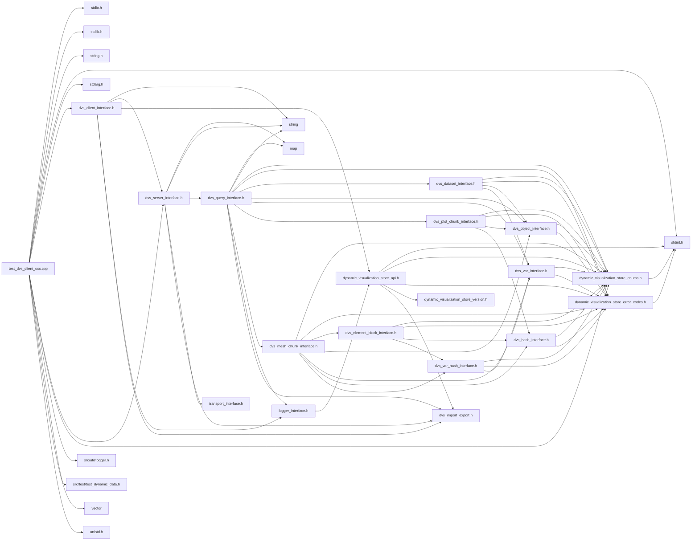

# File test\_dvs\_client\_cxx.cpp

<a id="test__dvs__client__cxx_8cpp"></a>

![][C++]

Test client to exercise the C++ API of the Dynamic Visualization Store API.

**version**\
0.1

## Includes

* <stdio.h>
* <stdlib.h>
* <string.h>
* <stdint.h>
* <stdarg.h>
* [dvs_client_interface.h](dvs__client__interface_8h.md#dvs__client__interface_8h)
* [dvs_server_interface.h](dvs__server__interface_8h.md#dvs__server__interface_8h)
* [dynamic_visualization_store_enums.h](dynamic__visualization__store__enums_8h.md#dynamic__visualization__store__enums_8h)
* src/util/logger.h
* src/test/test_dynamic_data.h
* <vector>
* <unistd.h>





## Functions

<a id="test__dvs__client__cxx_8cpp_1aae64bd0c132a92bc351c373dba929ec5"></a>
### Function logging\_function

![][public]
![][static]


```cpp
static void logging_function(void *user_data, const char *message)
```


**Parameters**:

* void * **user_data**
* const char * **message**

**Return type**: void

<a id="test__dvs__client__cxx_8cpp_1a3c04138a5bfe5d72780bb7e82a18e627"></a>
### Function main

![][public]


```cpp
int main(int argc, char **argv)
```


Main method of test client application.

**Parameters**:

* **argc**: Number of arguments
* **argv**: arguments


**Returns**:

int return value of app (unused)


**Parameters**:

* int **argc**
* char ** **argv**

**Return type**: int

## Source


```cpp
/*  *************************************************************
 *   Copyright 2017-2025 ANSYS, Inc.
 *   All Rights Reserved.
 *
 *        Restricted Rights Legend
 *
 *   Use, duplication, or disclosure of this
 *   software and its documentation by the
 *   Government is subject to restrictions as
 *   set forth in subdivision [(b)(3)(ii)] of
 *   the Rights in Technical Data and Computer
 *   Software clause at 52.227-7013.
 *  *************************************************************
 */


#include <stdio.h>
#include <stdlib.h>
#include <string.h>
#include <stdint.h>
#include <stdarg.h>

#include "dvs_client_interface.h"
#include "dvs_server_interface.h"
#include "dynamic_visualization_store_enums.h"
#include "src/util/logger.h"
#include "src/test/test_dynamic_data.h"

#include <vector>

#ifdef _WIN32
#include <Windows.h>
#else
#include <unistd.h>
#endif

static void logging_function(void* user_data, const char* message)
{
    fprintf(stderr, message);
}

int main(int argc, char** argv)
{
    uint32_t port = 50055;
    uint32_t msec_delay = 0;
    char host[512] = {0};
    strcpy(host, "127.0.0.1");
    char protocol[10] = {0};
    strcpy(protocol, "grpc");
    uint32_t width = 50;
    uint32_t height = 50;
    uint32_t depth = 50;
    uint32_t max_timesteps = 10;
    uint32_t current_rank = 0;
    uint32_t total_ranks = 1;
    uint8_t create_ghosts = 1;
    uint8_t block_for_server = 1;
    uint32_t starting_timestep = 0;
    uint32_t dedup = 1;
    bool send_structured_parts = false;
    char dataset_id[255] = {0};
    strcpy(dataset_id, "Test-C++-API");
    char secret[255] = {0};
    uint32_t plot_rank = 0;
    uint32_t server_number = 0;
    uint32_t server_verbosity = 0;
    uint32_t local_ranks = 0;
    uint32_t all_defs = false;
    char cache_uri[512] = {0};
    bool log_all = false;
    uint32_t debug_wait = 0;
    bool start_server = false;
    bool test_delete = false;
    bool allow_all_networks = false;
    bool disable_tls = false;
    bool use_tcp_sockets = false;
    char base_uds_path[1024]={0};
    int32_t conn_timeout = -1;

    uint32_t i = 1;
    while (i < argc)
    {
        if ((strcmp(argv[i], "-p") == 0 ) && (i < argc - 1))
        {
            i++;
            port = atoi(argv[i]);
        }
        else if ((strcmp(argv[i], "-h") == 0) && (i < argc - 1))
        {
            i++;
            strncpy(host, argv[i], 255);
        }
        else if ((strcmp(argv[i], "-protocol") == 0) && (i < argc - 1))
        {
            i++;
            strncpy(protocol, argv[i], 10);
            if (strcmp(protocol, "grpc") != 0 && strcmp(protocol, "null") != 0 )
            {
                fprintf(stderr, "protocol: %s invalid\n", protocol);
                exit(1);
            }
        }
        else if ((strcmp(argv[i], "-d") == 0) && (i < argc - 1))
        {
            i++;
            msec_delay = atoi(argv[i]);
        }
        else if ((strcmp(argv[i], "-s") == 0) && (i < argc - 3))
        {
            i++;
            width = atoi(argv[i++]);
            height = atoi(argv[i++]);
            depth = atoi(argv[i]);
        }
        else if ((strcmp(argv[i], "-t") == 0) && (i < argc - 1))
        {
            i++;
            max_timesteps = atoi(argv[i]);
        }
        else if ((strcmp(argv[i], "-r") == 0) && (i < argc - 2))
        {
            i++;
            current_rank = atoi(argv[i++]);
            total_ranks = atoi(argv[i]);
        }
        else if (strcmp(argv[i], "-noghost") == 0)
        {
            create_ghosts = 0;
        }
        else if (strcmp(argv[i], "-nowait") == 0)
        {
            block_for_server = 0;
        }
        else if ((strcmp(argv[i], "-start") == 0) && (i < argc - 1))
        {
            i++;
            starting_timestep = atoi(argv[i]);
        }
        else if (strcmp(argv[i], "-nodedup") == 0)
        {
            dedup = 0;
        }
        else if (strcmp(argv[i], "-id") == 0)
        {
            i++;
            memset(dataset_id, 0, 255);
            strncpy(dataset_id, argv[i], 255);
        }
        else if (strcmp(argv[i], "-secret") == 0)
        {
            i++;
            strncpy(secret, argv[i], 255);
        }
        else if (strcmp(argv[i], "-structured") == 0)
        {
            send_structured_parts = true;
        }
        else if (strcmp(argv[i], "-plot_rank") == 0)
        {
            i++;
            plot_rank = atoi(argv[i]);
        }
        else if (strcmp(argv[i], "-server") == 0 && (i < argc - 3))
        {
            i++;
            start_server = true;
            server_number = atoi(argv[i++]);
            local_ranks = atoi(argv[i++]);
            server_verbosity = atoi(argv[i]);
        }
        else if (strcmp(argv[i], "-cache_uri") == 0)
        {
            i++;
            strncpy(cache_uri, argv[i], 512);
        }
        else if (strcmp(argv[i], "-all_defs") == 0)
        {
            all_defs = true;
        }
        else if (strcmp(argv[i], "-log_all") == 0)
        {
            log_all = true;
        }
        else if (strcmp(argv[i], "-debug_wait") == 0)
        {
            i++;
            debug_wait = atoi(argv[i]);
        }
        else if (strcmp(argv[i], "-test_delete") == 0)
        {
            test_delete = true;
        }
        else if (strcmp(argv[i], "-allow_all_networks") == 0)
        {
            i++;
            allow_all_networks = true;
        }
        else if (strcmp(argv[i], "-disable_tls") == 0)
        {
            i++;
            disable_tls = true;
        }
        else if (strcmp(argv[i], "-use_tcp_sockets") == 0)
        {
            i++;
            use_tcp_sockets = true;
        }
        else if (strcmp(argv[i], "-base_uds_path") == 0){
            i++;
            strncpy(base_uds_path, argv[i], sizeof(base_uds_path)-1);
        }
        else if (strcmp(argv[i], "-conn_timeout") == 0)
        {
            i++;
            conn_timeout = atoi(argv[i]);
        }
        else
        {
            fprintf(stderr, "Unknown option: %s\n", argv[i]);
            fprintf(stderr, "Usage: %s [-p port] [-h host] [-d msec_delay] [-t num_timesteps] [-s dx dy dz] [-noghost] [-nowait] [-start t]\n", argv[0]);
            fprintf(stderr, "Options:\n");
            fprintf(stderr, "  -t timesteps         Number of timesteps to generate.  Default: %u\n", max_timesteps);
            fprintf(stderr, "  -p port              Server port to connect to.  Default: %u\n", port);
            fprintf(stderr, "  -h host              Server hostname to connect to.  Default: %s\n", host);
            fprintf(stderr, "  -protocol str        Server protocol. I.E. grpc or null. Default: grpc");
            fprintf(stderr, "  -d delay             Number of milliseconds to delay between timestep pushes.  Default: %u\n", msec_delay);
            fprintf(stderr, "  -s dx dy dz          Size of 3D hex grid (width height depth) Default: %u %u %u\n", width, height, depth);
            fprintf(stderr, "  -r x y               Rank information x=current rank (0 based), y=total number of ranks. Default: %u %u\n", current_rank, total_ranks);
            fprintf(stderr, "  -noghost             Do not create ghost elements\n");
            fprintf(stderr, "  -nowait              Do not wait for server to be available\n");
            fprintf(stderr, "  -start t             Begin timesteps with timestep Default: %u\n", starting_timestep);
            fprintf(stderr, "  -nodedup             Do not de-duplicate data on the client side Default: deduplicate\n");
            fprintf(stderr, "  -id string           Set an id/name for the dataset Default: TestID\n");
            fprintf(stderr, "  -secret string       Shared secret to use when talking with server Default: no shared secret\n");
            fprintf(stderr, "  -structured          Turn on sending structured part data Default: Don't send structured part data\n");
            fprintf(stderr, "  -plot_rank           Set the rank which should send plot data to EnSight (zero based) Default: %u\n", plot_rank);
            fprintf(stderr, "  -server n r v        Start a server using server number [n], expecting [r] local ranks for DVS connections to connect to with verbosity [v]. Local Rank Min/Max: 1/1000\n");
            fprintf(stderr, "  -cache_uri str       The URI for the server to use for the cache. Default: No cache\n");
            fprintf(stderr, "  -all_defs            Send all part/var definitions no matter the current rank. Default: No\n");
            fprintf(stderr, "  -log_all             Print out all client logging information\n. Default: No client logs");
            fprintf(stderr, "  -debug_wait ms       Wait for [ms] for debugging\n");
            fprintf(stderr, "  -test_delete         Test deleting all timesteps before each update Default: Do not test\n");
            fprintf(stderr, "  -allow_all_networks  Let the server listen to 0.0.0.0 instead of 127.0.0.1\n");
            fprintf(stderr, "  -disable_tls         Do not use certificates for the server/client handshake\n");
            fprintf(stderr, "  -use_tcp_sockets     Use TCP sockets and not unix domain sockets. On windows TCP sockets will always be used.\n");
            fprintf(stderr, "  -base_uds_path       Supply the base unix domain socket path for linux. Defaults to /tmp/greeter\n");
            fprintf(stderr, "  -conn_timeout s      Set a client timeout for blocking connection calls. Defaults to -1 (infinite)\n");
            exit(1);
        }
        i++;
    }

    if (debug_wait > 0)
    {
        #ifdef _WIN32
            Sleep(debug_wait);
        #else
            usleep(debug_wait*1000);
        #endif
    }

    char uri[1024] = {0};
    snprintf(uri, sizeof(uri), "%s://%s:%u", protocol, host, port);
#ifndef WIN32
    if (!use_tcp_sockets){
        snprintf(uri, sizeof(uri), "%s://%s:%d/?uds_path=%s", protocol, host, port, base_uds_path);
    }
#endif
    fprintf(stderr, "Connecting to: %s\n", uri);
    fprintf(stderr, "Timestep delay: %u\n", msec_delay);

    uint32_t send_vars = 1;
    uint32_t send_elems = 1;
    uint32_t send_hex_elems = 1;
    uint32_t send_nfaced_elems = 1;
    uint32_t send_pnt_elems = 1;
    uint32_t send_tri_quad_elems = 1;
    uint32_t send_nsided_elems = 0;
    uint32_t send_plots = 1;

    dvs_client_flags flags;
    if (block_for_server) flags = static_cast<dvs_client_flags>(flags | dvs_client_flags::BLOCK_FOR_SERVER);
    if (dedup) flags = static_cast<dvs_client_flags>(flags | dvs_client_flags::DEDUP);

    fprintf(stderr, "Client Flags: Blocking: %d, Dedup: %u\n", (BLOCK_FOR_SERVER & flags) > 0, (DEDUP & flags) > 0);

    DVS::IServer* server = DVS::CREATE_SERVER_INSTANCE(uri);
    if (server == nullptr)
    {
        fprintf(stderr, "Failed to create server\n");
        exit(1);
    }
    if (allow_all_networks)
    {
        server->set_option(DVS_SERVER_OPT_LISTEN_ALL_NETWORKS, "1");
    }
    if (disable_tls)
    {
        server->set_option(DVS_SERVER_OPT_DISABLE_TLS, "1");
    }
    if (use_tcp_sockets)
    {
        server->set_option(DVS_SERVER_OPT_USE_TCP_SOCKETS, "1");
    }
    if (base_uds_path)
    {
        server->set_option(DVS_SERVER_OPT_UNIX_DOMAIN_SOCKET_PATH, base_uds_path);
    }
    if (start_server)
    {
        char temp[10];
        snprintf(temp, 10, "%u", server_verbosity);
        server->set_option("VERBOSE",temp);
        if (strlen(cache_uri) > 0) server->set_option("CACHE_URI",cache_uri);
        server->startup(server_number, local_ranks);
        auto uri = server->get_uri();
        if (uri){
            fprintf(stderr, "The final uri is: %s\n", uri);
        }
    }

    DVS::IClient* client = nullptr;
    client = DVS::CREATE_CLIENT_INSTANCE(server, flags, secret);
    fprintf(stderr, "Current Client Version: %s\n", client->get_version());
    if (client == nullptr)
    {
        fprintf(stderr, "Failed to create client\n");
        exit(1);
    }

    std::map<std::string,std::string> options;
    if (conn_timeout != -1){
        options["DVS_CLIENT_TIMEOUT_S"] = std::to_string(conn_timeout);
    }
    client->set_options(options);

    dvs_log_flags log_flags = log_all ? dvs_log_flags::LOG_ALL : dvs_log_flags::LOG_UPDATE_BEG_END;
    client->set_logger(new DVS::Logger(nullptr, log_flags, logging_function));
    {
        if (part_info_num != 7 || var_info_num != 9)
        {
            fprintf(stderr, "This pseudo client code relies on part infos == 7 and var infos == 7, needs modified otherwise\n");
            exit(1);
        }

        struct TestDynamicData test;
        test_dynamic_data_init(&test, 0, current_rank, total_ranks);
        client->begin_init(dataset_id, test.current_rank, test.total_ranks, test.num_chunks);
        client->set_unit_system(test.unit_system);
        client->add_metadata(test.metadata_keys, test.metadata_vals, test.metadata_num_pairs);
        //TODO: Have this done in only the 0th rank once merging definitions is finished
        if (send_plots && current_rank == plot_rank) client->add_plot_info(test.plots, plot_info_num);

        if ((total_ranks == 1) || (total_ranks == 2) || all_defs)
        {
            //If one rank or two ranks and first rank send everything (tests second rank having no definitions)
            if (current_rank == 0 || all_defs)
            {
                client->add_part_info(test.parts, part_info_num);
                client->add_var_info(test.vars, var_info_num);
            }
        }
        else if (total_ranks == 3)
        {
            //If 3 ranks splitup definition data between first 2 ranks
            //the last rank will not have any (will receive data from others)
            if (current_rank == 0)
            {
                //Send part 0
                client->add_part_info(test.parts, 1);
                //Send vars 0->1
                client->add_var_info(test.vars, 2);
            }
            else if (current_rank == 1)
            {
                //Send parts 1->2
                client->add_part_info(&test.parts[1], part_info_num-1);
                //Send vars 2->5
                client->add_var_info(&test.vars[2], var_info_num - 2);
            }
            //Third rank will have empty definitions which should be filled in
        }
        else if (total_ranks > 3)
        {
            //If more than 3 ranks splitup data between first 3 ranks
            //other 3 ranks will not have any (will receive data from others)
            if (current_rank == 0)
            {
                //Send part 0
                client->add_part_info(test.parts, 1);
                //Send vars 0->1
                client->add_var_info(test.vars, 2);
            }
            else if (current_rank == 1)
            {
                //Send part 1
                client->add_part_info(&test.parts[1], 1);
                //Send parts 2->3
                client->add_var_info(&test.vars[2], 2);
            }
            else if (current_rank == 2)
            {
                //Send part 2
                client->add_part_info(&test.parts[2], part_info_num-2);
                //Send parts 4->5
                client->add_var_info(&test.vars[4], var_info_num - 4);
            }
        }
        else
        {
            //Situation not currently handled exit out
            fprintf(stderr, "Bad Initialization of Ranks\n");
            exit(1);
        }

        client->end_init();
    }

    uint32_t update_num = 0; // Keep a running update number for this session
    for (uint32_t i = starting_timestep; i < max_timesteps; i++)
    {
        if (i > 1 + starting_timestep && msec_delay)
        {
            #ifdef _WIN32
            Sleep(msec_delay);
            #else
            usleep(msec_delay*1000);
            #endif
        }
        if (test_delete && i != starting_timestep) {
            fprintf(stderr, "Rank: %i of %i Deleting Item\n", (current_rank+1), total_ranks);
            client->delete_item(update_num++, current_rank, "/timestep.time/gte/0.0");
        }
        fprintf(stderr, "Rank: %i of %i Sending Timestep: %i of %i\n", (current_rank+1), total_ranks, (i+1), max_timesteps);

        struct TestDynamicData test;
        test_dynamic_data_init(&test, i, current_rank, total_ranks);
        test.ghosts = create_ghosts;
        test_dynamic_data_create_mesh_and_elements(&test, width, height, depth);

        client->begin_update(update_num++, current_rank, test.current_chunk, test.time);

        if (send_structured_parts)
        {
            client->update_nodes_structured
            (
                test.parts[5]._id,
                test.pp_global_ijk_max,
                test.pp_local_ijk_min,
                test.pp_local_ijk_max,
                test.pp_origin,
                test.pp_unit_vec_i,
                test.pp_unit_vec_j,
                test.pp_unit_vec_k,
                test.pp_i_vals,
                test.pp_j_vals,
                test.pp_k_vals
            );

            client->update_nodes_structured
            (
                test.parts[6]._id,
                test.curv_global_ijk_max,
                test.curv_local_ijk_min,
                test.curv_local_ijk_max,
                test.curv_x_vals,
                test.curv_y_vals,
                test.curv_z_vals
            );
        }

        if (send_hex_elems) client->update_nodes(test.parts[0]._id, test.mesh_x_coords, test.mesh_y_coords, test.mesh_z_coords, test.mesh_coords_size);
        if (send_pnt_elems) client->update_nodes(test.parts[1]._id, test.mesh_x_coords, test.mesh_y_coords, test.mesh_z_coords, test.mesh_coords_size);
        if (send_nfaced_elems) client->update_nodes(test.parts[2]._id, test.mesh_x_coords, test.mesh_y_coords, test.mesh_z_coords, test.mesh_coords_size);
        if (send_tri_quad_elems) client->update_nodes(test.parts[3]._id, test.mesh_x_coords, test.mesh_y_coords, test.mesh_z_coords, test.mesh_coords_size);
        if (send_nsided_elems) client->update_nodes(test.parts[4]._id, test.polymesh_x_coords, test.polymesh_y_coords, test.polymesh_z_coords, test.polymesh_coords_size);

        if (send_elems)
        {
            if (send_hex_elems)
            {
                client->update_elements(test.parts[0]._id, HEXAHEDRON, test.mesh_hex_elem_coords, test.mesh_hex_elem_coords_size);
                if (test.mesh_hex_ghost_elem_coords_size > 0)
                {
                    client->update_elements(test.parts[0]._id, HEXAHEDRON_GHOST, test.mesh_hex_ghost_elem_coords, test.mesh_hex_ghost_elem_coords_size);
                }
            }

            if (send_nfaced_elems)
            {
                client->update_elements_polyhedral
                (
                    test.parts[2]._id,
                    CONVEX_POLYHEDRON,
                    test.mesh_nfaced_hex_elem_faces_per_elem,
                    test.mesh_nfaced_hex_elem_faces_per_elem_size,
                    test.mesh_nfaced_hex_elem_nodes_per_face,
                    test.mesh_nfaced_hex_elem_nodes_per_face_size,
                    test.mesh_nfaced_hex_elem_coords,
                    test.mesh_nfaced_hex_elem_coords_size
                );
                if (test.mesh_nfaced_hex_ghost_elem_coords_size > 0)
                {
                    client->update_elements_polyhedral
                    (
                        test.parts[2]._id,
                        CONVEX_POLYHEDRON_GHOST,
                        test.mesh_nfaced_hex_ghost_elem_faces_per_elem,
                        test.mesh_nfaced_hex_ghost_elem_faces_per_elem_size,
                        test.mesh_nfaced_hex_ghost_elem_nodes_per_face,
                        test.mesh_nfaced_hex_ghost_elem_nodes_per_face_size,
                        test.mesh_nfaced_hex_ghost_elem_coords,
                        test.mesh_nfaced_hex_ghost_elem_coords_size
                    );
                }
            }

            if (send_nsided_elems && current_rank == 0)
            {
                //Only send if current rank is 0 as we aren't
                //splitting this part up based on rank
                client->update_elements_polygon
                (
                    test.parts[4]._id,
                    N_SIDED_POLYGON,
                    test.polymesh_elem_nodes_per_face,
                    test.polymesh_elem_nodes_per_face_size,
                    test.polymesh_elem_nodes,
                    test.polymesh_elem_nodes_size
                );
            }

            if (send_pnt_elems) client->update_elements(test.parts[1]._id, PNT, test.mesh_point_elem_coords, test.mesh_point_elem_coords_size);

            if (send_tri_quad_elems)
            {
                client->update_elements(test.parts[3]._id, QUADRANGLE, test.mesh_quad_elem_coords, test.mesh_quad_elem_coords_size);
                client->update_elements(test.parts[3]._id, TRIANGLE, test.mesh_tri_elem_coords, test.mesh_tri_elem_coords_size);
            }
        }

        if (send_vars)
        {
            //Case vars not working correctly with DVS
            client->update_var_case(dvs_var_type::SCALAR, test.vars[6]._id, &test.case_var_value, 1);
            client->update_var_part(dvs_var_type::SCALAR, test.vars[4]._id, test.parts[0]._id, &test.part_scalar[0], 1);
            client->update_var_part(dvs_var_type::SCALAR, test.vars[4]._id, test.parts[1]._id, &test.part_scalar[1], 1);
            if (send_hex_elems) client->update_var_element(HEXAHEDRON, dvs_var_type::SCALAR, test.vars[2]._id, test.parts[0]._id, test.mesh_hex_elem_var_scalar, test.mesh_hex_elem_var_scalar_size);
            if (send_hex_elems) client->update_var_element(HEXAHEDRON, dvs_var_type::SCALAR, test.vars[5]._id, test.parts[0]._id, test.mesh_hex_elem_var_rank_scalar, test.mesh_hex_elem_var_rank_scalar_size);

            //N-FACED Elements use the same elemental vars for now as hex elements
            if (send_nfaced_elems) client->update_var_element(CONVEX_POLYHEDRON, dvs_var_type::SCALAR, test.vars[2]._id, test.parts[2]._id, test.mesh_hex_elem_var_scalar, test.mesh_hex_elem_var_scalar_size);
            if (send_nfaced_elems) client->update_var_element(CONVEX_POLYHEDRON, dvs_var_type::SCALAR, test.vars[5]._id, test.parts[2]._id, test.mesh_hex_elem_var_rank_scalar, test.mesh_hex_elem_var_rank_scalar_size);

            if (send_structured_parts)
            {
                client->update_var_element(STRUCTURED, dvs_var_type::SCALAR, test.vars[2]._id, test.parts[5]._id, test.structured_elem_var_scalar, test.structured_elem_var_scalar_size);
                client->update_var_element(STRUCTURED, dvs_var_type::SCALAR, test.vars[5]._id, test.parts[5]._id, test.structured_elem_var_scalar_rank, test.structured_elem_var_scalar_rank_size);

                client->update_var_element(STRUCTURED, dvs_var_type::SCALAR, test.vars[2]._id, test.parts[6]._id, test.structured_elem_var_scalar, test.structured_elem_var_scalar_size);
                client->update_var_element(STRUCTURED, dvs_var_type::SCALAR, test.vars[5]._id, test.parts[6]._id, test.structured_elem_var_scalar_rank, test.structured_elem_var_scalar_rank_size);
            }

            if (test.mesh_hex_ghost_elem_var_scalar_size > 0)
            {
                if (send_hex_elems) client->update_var_element(HEXAHEDRON_GHOST, dvs_var_type::SCALAR, test.vars[2]._id, test.parts[0]._id, test.mesh_hex_ghost_elem_var_scalar, test.mesh_hex_ghost_elem_var_scalar_size);
                //N-FACED Elements use the same elemental vars for now as hex elements
                if (send_nfaced_elems) client->update_var_element(CONVEX_POLYHEDRON_GHOST, dvs_var_type::SCALAR, test.vars[2]._id, test.parts[2]._id, test.mesh_hex_ghost_elem_var_scalar, test.mesh_hex_ghost_elem_var_scalar_size);
            }
            if (test.mesh_hex_ghost_elem_var_rank_scalar_size > 0)
            {
                if (send_hex_elems) client->update_var_element(HEXAHEDRON_GHOST, dvs_var_type::SCALAR, test.vars[5]._id, test.parts[0]._id, test.mesh_hex_ghost_elem_var_rank_scalar, test.mesh_hex_ghost_elem_var_rank_scalar_size);
                //N-FACED Elements use the same elemental vars for now as hex elements
                if (send_nfaced_elems) client->update_var_element(CONVEX_POLYHEDRON_GHOST, dvs_var_type::SCALAR, test.vars[5]._id, test.parts[2]._id, test.mesh_hex_ghost_elem_var_rank_scalar, test.mesh_hex_ghost_elem_var_rank_scalar_size);
            }

            if (send_pnt_elems) client->update_var_element(PNT, dvs_var_type::SCALAR, test.vars[5]._id, test.parts[1]._id, test.mesh_point_elem_var_rank_scalar, test.mesh_point_elem_var_rank_scalar_size);

            if (send_nfaced_elems) client->update_var_element(HEXAHEDRON, dvs_var_type::VECTOR, test.vars[3]._id, test.parts[0]._id, test.mesh_hex_elem_var_vector, test.mesh_hex_elem_var_vector_size);
            if (test.mesh_hex_ghost_elem_var_vector_size > 0)
            {
                if (send_nfaced_elems) client->update_var_element(HEXAHEDRON_GHOST, dvs_var_type::VECTOR, test.vars[3]._id, test.parts[0]._id, test.mesh_hex_ghost_elem_var_vector, test.mesh_hex_ghost_elem_var_vector_size);
            }

            if (send_tri_quad_elems)
            {
                client->update_var_element(QUADRANGLE, dvs_var_type::SCALAR, test.vars[2]._id, test.parts[3]._id, test.mesh_quad_elem_var_scalar, test.mesh_quad_elem_var_scalar_size);
                client->update_var_element(QUADRANGLE, dvs_var_type::SCALAR, test.vars[5]._id, test.parts[3]._id, test.mesh_quad_elem_var_rank_scalar, test.mesh_quad_elem_var_rank_scalar_size);
                client->update_var_element(TRIANGLE, dvs_var_type::SCALAR, test.vars[2]._id, test.parts[3]._id, test.mesh_tri_elem_var_scalar, test.mesh_tri_elem_var_scalar_size);
                client->update_var_element(TRIANGLE, dvs_var_type::SCALAR, test.vars[5]._id, test.parts[3]._id, test.mesh_tri_elem_var_rank_scalar, test.mesh_tri_elem_var_rank_scalar_size);
            }

            client->update_var_node(dvs_var_type::SCALAR, test.vars[0]._id, test.parts[0]._id, test.mesh_node_var_scalar, test.mesh_node_var_scalar_size);
            client->update_var_node(dvs_var_type::VECTOR, test.vars[1]._id, test.parts[0]._id, test.mesh_node_var_vector, test.mesh_node_var_vector_size);
            client->update_var_node(dvs_var_type::SCALAR, test.vars[0]._id, test.parts[2]._id, test.mesh_node_var_scalar, test.mesh_node_var_scalar_size);
            client->update_var_node(dvs_var_type::VECTOR, test.vars[1]._id, test.parts[2]._id, test.mesh_node_var_vector, test.mesh_node_var_vector_size);

            if (send_structured_parts)
            {
                client->update_var_node(dvs_var_type::SCALAR, test.vars[0]._id, test.parts[5]._id, test.structured_nodal_scalar, test.structured_nodal_scalar_size);
                client->update_var_node(dvs_var_type::SCALAR, test.vars[0]._id, test.parts[6]._id, test.structured_nodal_scalar, test.structured_nodal_scalar_size);
            }
        }

        if (send_plots && current_rank == plot_rank)
        {
            client->update_plot(test.plots[0]._id, test.plot_x_values[0], test.plot_y_values[0], test.plot_num_values);
            client->update_plot(test.plots[1]._id, test.plot_x_values[1], test.plot_y_values[1], test.plot_num_values);
            client->update_plot(test.plots[2]._id, test.plot_x_values[2], test.plot_y_values[2], test.plot_num_values);
        }
        client->end_update();

        test_dynamic_data_free(&test);
    }
    DVS::DESTROY_CLIENT_INSTANCE(client);

    if (start_server)
    {
        //If we started our own server wait for the pending timesteps to clear before tearing everything down
        //in case it was writing stuff. 

        //Not waiting isn't a problem but if we had another process connecting to this
        //process' server and sending data we might lose the last timestep since it won't be 
        //fully complete and we would not have written it yet.
        uint32_t num_pending = 1;
        uint32_t num_complete = 0;
        while (num_pending > 0) {
            dvs_ret error = server->get_timestep_count(num_pending, num_complete);
            if (error != DVS_NONE) break;
            // Avoid burning up a CPU waiting for the I/O to complete
            const uint32_t temp_delay_ms = 50;
#ifdef _WIN32
            Sleep(temp_delay_ms);
#else
            usleep(temp_delay_ms * 1000);
#endif
        }
    }
    DVS::DESTROY_SERVER_INSTANCE(server);

    return 0;
}
```


[public]: https://img.shields.io/badge/-public-brightgreen (public)
[protected]: https://img.shields.io/badge/-protected-yellow (protected)
[static]: https://img.shields.io/badge/-static-lightgrey (static)
[C++]: https://img.shields.io/badge/language-C%2B%2B-blue (C++)
[Python]: https://img.shields.io/badge/language-Python-blue (Python)
[private]: https://img.shields.io/badge/-private-red (private)
[const]: https://img.shields.io/badge/-const-lightblue (const)
[Markdown]: https://img.shields.io/badge/language-Markdown-blue (Markdown)