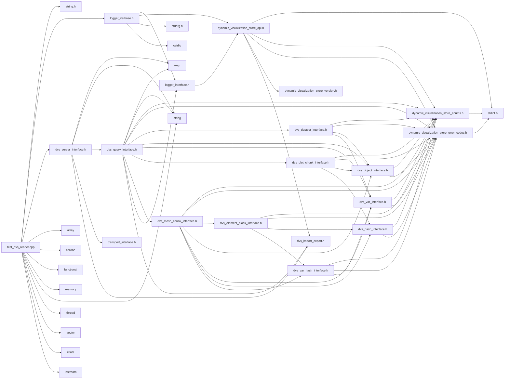

# File test\_dvs\_reader.cpp

<a id="test__dvs__reader_8cpp"></a>

![][C++]

Test client to exercise the C++ API of the Dynamic Visualization Store Reader API.


## Includes

* <string.h>
* [logger_verbose.h](logger__verbose_8h.md#logger__verbose_8h)
* [dvs_server_interface.h](dvs__server__interface_8h.md#dvs__server__interface_8h)
* <array>
* <chrono>
* <functional>
* <memory>
* <string>
* <thread>
* <vector>
* <cfloat>
* <iostream>





## Functions

<a id="test__dvs__reader_8cpp_1aae64bd0c132a92bc351c373dba929ec5"></a>
### Function logging\_function

![][public]
![][static]


```cpp
static void logging_function(void *user_data, const char *message)
```


**Parameters**:

* void * **user_data**
* const char * **message**

**Return type**: void

<a id="test__dvs__reader_8cpp_1ab872d51991472fd1587a49a1c5814bb8"></a>
### Function print

![][public]
![][static]


```cpp
static void print(const DVS::IObject *object)
```


**Parameters**:

* const [DVS::IObject](class_d_v_s_1_1_i_object.md#class_d_v_s_1_1_i_object) * **object**

**Return type**: void

<a id="test__dvs__reader_8cpp_1a2ded3fead129bdf90c4956706f1cd5a8"></a>
### Function print

![][public]
![][static]


```cpp
static void print(const DVS::IVar *var)
```


**Parameters**:

* const [DVS::IVar](class_d_v_s_1_1_i_var.md#class_d_v_s_1_1_i_var) * **var**

**Return type**: void

<a id="test__dvs__reader_8cpp_1a3c04138a5bfe5d72780bb7e82a18e627"></a>
### Function main

![][public]


```cpp
int main(int argc, char **argv)
```


Main method of test reader application.

**Parameters**:

* **argc**: Number of arguments
* **argv**: arguments


**Returns**:

int return value of app (unused)


**Parameters**:

* int **argc**
* char ** **argv**

**Return type**: int

## Source


```cpp
/**************************************************************
*
*   (C) 2024-2025 ANSYS, Inc. Unauthorized use, distribution, or duplication is prohibited.
*
*   Restricted Rights Legend
*
*   Use, duplication, or disclosure of this
*   software and its documentation by the
*   Government is subject to restrictions as
*   set forth in subdivision [(b)(3)(ii)] of
*   the Rights in Technical Data and Computer
*   Software clause at 52.227-7013.
*
**************************************************************
*/


#include <string.h>

#include "logger_verbose.h"
#include "dvs_server_interface.h"
#include <array>
#include <chrono>
#include <functional>
#include <memory>
#include <string>
#include <thread>
#include <vector>
#include <cfloat>
#include <iostream>

static void logging_function(void* user_data, const char* message)
{
    fprintf(stdout, message);
}

static void print(const DVS::IObject* object)
{
    if (object)
    {
        std::string object_name = "Unknown:";
        if (object->get_type() == DVS::IObject::PART) {
            object_name = "Part";
        }
        else if (object->get_type() == DVS::IObject::PLOT) {
            object_name = "Plot";
        }

        fprintf( stdout, "%s: Name: %s Type: %i\n", object_name.c_str(), object->get_name(), object->get_type() );
        fprintf( stdout, "Dataset Name: %s\n", object->get_dataset()->get_name());
        fprintf( stdout, "Metadata Size: %u\n", object->get_num_metadata());
        if (object->get_num_metadata()) {
            for (uint32_t metadata_idx = 0; metadata_idx < object->get_num_metadata(); metadata_idx++) {
                fprintf(stdout, "Key: %s, Val:%s ", object->get_metadata_key(metadata_idx), object->get_metadata_value(metadata_idx));
            }
            fprintf(stdout, "\n");
        }
        fprintf(stdout, "\n");
    }
}

static void print(const DVS::IVar* var)
{
    if (var)
    {
        fprintf( stdout, "Var: Name: %s, Type: %i, Location: %i, Unit Dim: %s, Unit Label: %s\n",
        var->get_name(), var->get_var_type(), var->get_var_location(), var->get_unit_dimension(), var->get_unit_label());
        fprintf(stdout, "Dataset Name: %s\n", var->get_dataset()->get_name());
        fprintf( stdout, "Metadata Size: %u\n", var->get_num_metadata());
        if (var->get_num_metadata()) {
            for (uint32_t metadata_idx = 0; metadata_idx < var->get_num_metadata(); metadata_idx++) {
                fprintf(stdout, "Key: %s, Val:%s ", var->get_metadata_key(metadata_idx), var->get_metadata_value(metadata_idx));
            }
            fprintf(stdout, "\n");
        }
        fprintf(stdout, "\n");
    }
}

int main(int argc, char** argv)
{
    DVS::IServer* server = nullptr;
    char server_uri[512] = {0};
    char server_filter[512] = {0};
    char cache_uri[512] = {0};
    uint32_t debug_wait = 0;
    uint32_t timestep_wait = 0;
    bool all_coords = false;
    bool all_connectivity = false;
    bool all_variable_data = false;
    uint32_t server_number = 0;
    uint32_t local_ranks = 1;
    uint32_t server_verbosity = 0;

    uint32_t i = 1;
    while (i < argc)
    {
        if ((strcmp(argv[i], "-cache_uri") == 0) && (i < argc - 1))
        {
            i++;
            strncpy(cache_uri, argv[i], 512);
        }
        else if ((strcmp(argv[i], "-server_uri") == 0) && (i < argc - 1))
        {
            i++;
            strncpy(server_uri, argv[i], 512);
        }
        else if ((strcmp(argv[i], "-server_filter") == 0))
        {
            i++;
            strncpy(server_filter, argv[i], 512);
        }
        else if ((strcmp(argv[i], "-all_coords") == 0))
        {
            all_coords = true;
        }
        else if ((strcmp(argv[i], "-all_conn") == 0))
        {
            all_connectivity = true;
        }
        else if ((strcmp(argv[i], "-all_vars") == 0))
        {
            all_variable_data = true;
        }
        else if (strcmp(argv[i], "-server") == 0 && (i < argc - 3))
        {
            i++;
            server_number = atoi(argv[i++]);
            local_ranks = atoi(argv[i++]);
            server_verbosity = atoi(argv[i]);
        }
        else if ((strcmp(argv[i], "-all_vars") == 0))
        {
            all_variable_data = true;
        }
        else if ((strcmp(argv[i], "-debug_wait") == 0) && (i < argc - 1))
        {
            i++;
            debug_wait = atoi(argv[i]);
        }
        else if ((strcmp(argv[i], "-timestep_wait") == 0) && (i < argc - 1))
        {
            i++;
            timestep_wait = atoi(argv[i]);
        }
        else
        {
            fprintf(stderr, "Unknown option: %s\n", argv[i]);
            fprintf(stderr, "Usage: %s [-uri str] [-debug_wait ms] \n", argv[0]);
            fprintf(stderr, "Options:\n");
            fprintf(stderr, "  -cache_uri str       The URI for the reader to use for the cache. Default: No cache\n");
            fprintf(stderr, "  -server_uri str      The URI for the reader to connect to a running DVS server. Default: no server\n");
            fprintf(stderr, "  -server n r v        Start a server using server number [n], expecting [r] local ranks for DVS connections to connect to with verbosity [v]. Local Rank Min/Max: 1/1000. Defaults to 0 1 0\n");
            fprintf(stderr, "  -server_filter       A filter to apply to the query generated from the DVS server");
            fprintf(stderr, "  -all_coords          Print the full coordinates for the mesh chunks iterated over (not a good idea for large datasets)\n");
            fprintf(stderr, "  -all_conn            Print the full connectivity for the element blocks iterated over (not a good idea for large datasets)\n");
            fprintf(stderr, "  -all_vars            Print the full variable values for mesh chunks and element blocks (not a good idea for large datasets)\n");
            fprintf(stderr, "  -debug_wait s        Wait for [s] for debugging\n");
            fprintf(stderr, "  -timestep_wait s     Wait for [s] for eventual new timesteps\n");
            exit(1);
        }
        i++;
    }

    if (debug_wait > 0) {
        std::this_thread::sleep_for(std::chrono::seconds(debug_wait));
    }

    std::unique_ptr<DVS::IQuery, std::function<void(DVS::IQuery*)>> dataset_query(DVS::CREATE_QUERY_INSTANCE(),
                                                                                  [](DVS::IQuery* p){p->release();});
    if (strlen(server_uri) > 0){
        server = DVS::CREATE_SERVER_INSTANCE(server_uri);
        server->startup_unthreaded(server_number, local_ranks);
        server->update();
        char temp[10];
        snprintf(temp, 10, "%u", server_verbosity);
        server->set_option("VERBOSE",temp);
        DVS::IQuery* server_query;
        server_query = server->create_query(std::string(server_filter));
        dataset_query.reset(server_query);
    }
    dataset_query->set_logger(new DVS::LoggerVerbose(nullptr, dvs_verbosity::DVS_VERBOSE, &logging_function));
    dvs_ret err;
    if (!server){
        err = dataset_query->add_uri(cache_uri);
        if (DVS_NONE !=  err) {
            return err;
        }
    }


    fprintf(stdout, "---------------------------\n");
    fprintf(stdout, "Listing All Timesteps for Query\n");
    fprintf(stdout, "---------------------------\n");
    uint32_t num_timesteps = 0;
    if (server){
        bool flag = true;
        uint32_t pending, complete;
        while (flag){
            std::this_thread::sleep_for(std::chrono::seconds(timestep_wait));
            server->get_timestep_count(pending, complete);
            if (pending > 0){
                server->update();
                dataset_query->clear_data();
                auto server_query = server->create_query(std::string(server_filter));
                dataset_query.reset(server_query);
            }
            else{
                flag = false;
            }
        }
    }

    err = dataset_query->get_num_timesteps(num_timesteps);
    if (DVS_NONE != err) {
        fprintf(stdout, "Error getting number of timesteps\n");
        return err;
    }


    std::vector<float> timesteps(num_timesteps, 0.f);
    dataset_query->get_timesteps(timesteps.data());

    fprintf(stdout, "Timesteps: ");
    for (auto time : timesteps) {
        fprintf (stdout, " %f", time);
    }
    fprintf(stdout, "\n");

    fprintf(stdout, "---------------------------\n");
    fprintf(stdout, "Listing All Ranks for Query\n");
    fprintf(stdout, "---------------------------\n");
    uint32_t num_ranks = 0;
    err = dataset_query->get_num_ranks(num_ranks);
    if (DVS_NONE != err) {
        fprintf(stdout, "Error getting number of ranks\n");
        return err;
    }
    std::vector<uint32_t> global_ranks(num_ranks, 0);
    dataset_query->get_ranks(global_ranks.data());
    for (auto rank : global_ranks) {
        fprintf(stdout, "%u ", rank);
    }
    fprintf(stdout, "\n");

    fprintf(stdout, "---------------------------\n");
    fprintf(stdout, "Listing Max Chunks for Query\n");
    fprintf(stdout, "---------------------------\n");

    uint32_t num_chunks_per_rank = 0;
    err = dataset_query->get_num_chunks_per_rank(num_chunks_per_rank);
    if (DVS_NONE != err) {
        fprintf(stdout, "Error getting number of chunks per rank\n");
        return err;
    }
    std::vector<uint32_t> global_chunk_max(num_chunks_per_rank, 0);
    dataset_query->get_chunks_per_rank(global_chunk_max.data());
    for (auto chunk : global_chunk_max) {
        fprintf(stdout, "%u ", chunk);
    }
    fprintf(stdout, "\n");

    fprintf(stdout, "---------------------------\n");
    fprintf(stdout, "Listing All Parts for Query\n");
    fprintf(stdout, "---------------------------\n");
    uint32_t num_parts = 0;
    err = dataset_query->get_num_parts(num_parts);
    if (DVS_NONE != err) {
        fprintf(stdout, "Error getting number of parts\n");
        return err;
    }
    for (uint32_t part_index = 0; part_index < num_parts; part_index++)
    {
        auto part = dataset_query->get_part(part_index);
        if (!part) continue;
        print(part);
    }
    fprintf(stdout, "---------------------------\n");
    fprintf(stdout, "Listing All Plots for Query\n");
    fprintf(stdout, "---------------------------\n");
    uint32_t num_plots = 0;
    err = dataset_query->get_num_plots(num_plots);
    if (DVS_NONE != err) {
        fprintf(stdout, "Error getting number of plots\n");
        return err;
    }
    for (uint32_t plot_index = 0; plot_index < num_plots; plot_index++)
    {
        auto plot = dataset_query->get_plot(plot_index);
        if (!plot) continue;
        print(plot);
    }
    fprintf(stdout, "---------------------------\n");
    fprintf(stdout, "Listing All Vars for Query\n");
    fprintf(stdout, "---------------------------\n");
    uint32_t num_vars = 0;
    err = dataset_query->get_num_variables(num_vars);
    if (DVS_NONE != err) {
        fprintf(stdout, "Error getting number of vars\n");
        return err;
    }
    for (uint32_t var_index = 0; var_index < num_vars; var_index++)
    {
        auto var = dataset_query->get_variable(var_index);
        if (!var) continue;
        print(var);
    }
    fprintf(stdout, "---------------------------\n");
    fprintf(stdout, "Listing All Case Variables for Query\n\n");
    num_vars = 0;
    err = dataset_query->get_num_variables(num_vars);
    if (DVS_NONE != err) {
        fprintf(stdout, "Error getting number of vars for case vars\n");
        return err;
    }
    for (uint32_t var_index = 0; var_index < num_vars; var_index++)
    {
        auto var = dataset_query->get_variable(var_index);
        if (var && var->get_var_location() == dvs_var_location::CASE) {
            const DVS::IDataset* dataset = var->get_dataset();
            std::vector<float> var_value(var->get_float_count_per_value());
            for (float timestep : timesteps) {
                if (DVS_NONE == dataset_query->get_variable_data(dataset, var, timestep, var_value.data())) {
                    //Only scalars are supported for case/part variables right now so we
                    //can just look at the first value
                    fprintf(stdout, "Dataset: %s, Var: %s, Time: %f, Value: %f\n",
                            dataset->get_name(), var->get_name(), timestep, var_value[0]);
                }
                else {
                    fprintf(stdout, "Dataset: %s, Var: %s, Time: %f, No Value Found\n",
                            dataset->get_name(), var->get_name(), timestep);
                }
            }
        }
    }
    fprintf(stdout, "---------------------------\n");
    fprintf(stdout, "Listing All Part Variables for Query\n\n");
    num_vars = 0;
    err = dataset_query->get_num_variables(num_vars);
    if (DVS_NONE != err) {
        fprintf(stdout, "Error getting number of vars for part vars\n");
        return err;
    }
    for (uint32_t var_index = 0; var_index < num_vars; var_index++)
    {
        auto var = dataset_query->get_variable(var_index);
        if (var && var->get_var_location() == dvs_var_location::PART) {
            auto dataset = var->get_dataset();
            std::vector<float> var_value(var->get_float_count_per_value());
            for (float timestep : timesteps) {
                for (uint32_t part_index = 0; part_index < dataset->get_num_parts(); part_index++) {
                    const DVS::IObject* part = dataset->get_part(part_index);
                    if (!part) {
                        continue;
                    }
                    if (DVS_NONE == dataset_query->get_variable_data(part, var, timestep, var_value.data())) {
                        //Only scalars are supported for case/part variables right now so we
                        //can just look at the first value
                        fprintf(stdout, "Dataset: %s, Part: %s, Var: %s, Time: %f, Value: %f\n",
                                dataset->get_name(), part->get_name(), var->get_name(), timestep, var_value[0]);
                    }
                    else {
                        fprintf(stdout, "Dataset: %s, Part: %s, Var: %s, Time: %f, No Value Found\n",
                                dataset->get_name(), part->get_name(), var->get_name(), timestep);
                    }
                }
            }
        }
    }
    fprintf(stdout, "---------------------------\n");
    fprintf(stdout, "Listing All Datasets for Query\n");
    uint32_t num_datasets = 0;
    err = dataset_query->get_num_datasets(num_datasets);
    if (DVS_NONE != err) {
        fprintf (stdout, "Error getting number of datasets\n");
        return err;
    }
    for (uint32_t dataset_idx = 0; dataset_idx < num_datasets; dataset_idx++)
    {
        DVS::IDataset* dataset = dataset_query->get_dataset(dataset_idx);
        if (dataset)
        {
            fprintf(stdout, "---------------------------\n");
            fprintf(stdout, "Dataset: %s Units System: %s\n",
                    dataset->get_name(), dataset->get_unit_system() );
            for (uint32_t cur_pair = 0; cur_pair < dataset->get_num_metadata(); cur_pair++) {
                fprintf(stdout, "Key: %s, Val: %s\n", dataset->get_metadata_key(cur_pair), dataset->get_metadata_value(cur_pair));
            }
            fprintf(stdout, "\n");

            std::vector<uint32_t> ranks(dataset->get_num_ranks(), 0);
            dataset->get_ranks(ranks.data());

            fprintf(stdout, "Ranks: ");
            for (auto rank : ranks) {
                fprintf(stdout, " %u", rank);
            }
            fprintf(stdout, "\n");

            std::vector<uint32_t> chunks(dataset->get_num_chunks_per_rank(), 0);
            dataset->get_chunks_per_rank(chunks.data());
            fprintf(stdout, "Chunks: ");
            for (auto chunk : chunks) {
                fprintf(stdout, " %u", chunk);
            }
            fprintf(stdout, "\n");

            for (uint32_t part_idx = 0; part_idx < dataset->get_num_parts(); part_idx++) {
                const DVS::IObject* part = dataset->get_part(part_idx);
                if (!part) continue;
                print(part);
            }

            for (uint32_t plot_idx = 0; plot_idx < dataset->get_num_plots(); plot_idx++) {
                const DVS::IObject* plot = dataset->get_plot(plot_idx);
                if (!plot) continue;
                print(plot);
            }

            for (uint32_t var_idx = 0; var_idx < dataset->get_num_variables(); var_idx++) {
                const DVS::IVar* var = dataset->get_var(var_idx);
                if (!var) continue;
                print(var);
            }
        }
    }

    fprintf(stdout, "---------------------------\n");
    fprintf(stdout, "Listing All Mesh Chunks for Query\n");
    fprintf(stdout, "---------------------------\n");
    uint32_t num_mesh_chunks = 0;
    err = dataset_query->get_num_mesh_chunks(num_mesh_chunks);
    if (DVS_NONE != err) {
        fprintf(stdout, "Error getting number of mesh chunks\n");
        return err;
    }
    for (uint32_t index = 0; index < num_mesh_chunks; index++) {
        DVS::IMeshChunk* mesh_chunk = dataset_query->get_mesh_chunk(index);
        if (mesh_chunk) {
            DVS::IMeshChunk::MeshType type = mesh_chunk->get_type();
            const DVS::IObject* part = mesh_chunk->get_object();
            float time = mesh_chunk->get_time();
            uint32_t rank = mesh_chunk->get_rank();
            uint32_t chunk = mesh_chunk->get_chunk();

            std::string coords_hash(mesh_chunk->get_hash_size(), 0);
            if (coords_hash.empty() || DVS_NONE != mesh_chunk->get_hash(&(coords_hash[0]))) {
                fprintf(stdout, "ERROR: Could not load coordinates hash\n");
            }

            fprintf(stdout, "Mesh Chunk %u Type: %i Part: %s Rank: %u Chunk: %u Time: %f Hash: %s\n",
                    index, type, part->get_name(), rank, chunk, time, coords_hash.c_str());

            std::array<uint32_t,3> num_coords;

            dvs_ret coord_ret = DVS_NONE;

            if (type == DVS::IMeshChunk::MeshType::UNSTRUCTURED) {
                coord_ret = mesh_chunk->get_coords_size(num_coords[0]);
                //Coords of all axis match for unstructured
                num_coords[1] = num_coords[2] = num_coords[0];
            }
            else if (type == DVS::IMeshChunk::MeshType::CURVILINEAR) {
                coord_ret = mesh_chunk->get_coords_curv_size(num_coords[0]);
                //Coords of all axis match for curvilinear
                num_coords[1] = num_coords[2] = num_coords[0];
            }
            else if (type == DVS::IMeshChunk::MeshType::PARALLELEPIPED) {
                coord_ret = mesh_chunk->get_coords_parallele_size(num_coords[0], num_coords[1], num_coords[2]);
            }
            if (coord_ret != DVS_NONE) {
                fprintf(stdout, "ERROR: %d Loading Coords Size\n", coord_ret);
            }
            else {
                fprintf(stdout, "Size of coords arrays: X(I): %d Y(J): %d Z(K): %d\n", num_coords[0], num_coords[1], num_coords[2]);
            }
            if (coord_ret == DVS_NONE && all_coords) {

                std::vector<float> x_coords(num_coords[0]);
                std::vector<float> y_coords(num_coords[1]);
                std::vector<float> z_coords(num_coords[2]);

                //The vars are for structured data if needed
                std::array<float,3> origin;
                std::array<float,3> dir_vec_i, dir_vec_j, dir_vec_k;
                std::array<float,3> local_ijk_min, local_ijk_max, global_ijk_max;

                if (type == DVS::IMeshChunk::MeshType::UNSTRUCTURED) {
                    coord_ret = mesh_chunk->get_coords(x_coords.data(), y_coords.data(), z_coords.data());

                    //Validating the coords match if interleaved
                    std::vector<float> interleaved(num_coords[0]+num_coords[1]+num_coords[2]);
                    auto interleaved_ret = mesh_chunk->get_coords_interleaved(interleaved.data());
                    if (coord_ret == DVS_NONE && interleaved_ret == DVS_NONE) {
                        bool good_values = x_coords[0] == interleaved[0];
                        good_values &= y_coords[0] == interleaved[1];
                        good_values &= z_coords[0] == interleaved[2];
                        for (uint32_t i = 1; i < num_coords[0] && good_values; i++) {
                            good_values &= x_coords[i] == interleaved[i*3];
                            good_values &= y_coords[i] == interleaved[i*3+1];
                            good_values &= z_coords[i] == interleaved[i*3+2];
                        }
                        if (!good_values) {
                            fprintf(stdout, "ERROR: Interleaved coords don't match non-interleaved\n");
                        }
                    }
                    else if (interleaved_ret != DVS_NONE) {
                        //Error message for coord_ret handled later
                        fprintf(stdout, "ERROR: %d, Getting interleaved coords\n", interleaved_ret);
                    }
                }
                else if (type == DVS::IMeshChunk::MeshType::CURVILINEAR) {
                    coord_ret = mesh_chunk->get_coords_curv(local_ijk_min.data(),
                                                            local_ijk_max.data(),
                                                            global_ijk_max.data(),
                                                            x_coords.data(),
                                                            y_coords.data(),
                                                            z_coords.data());
                    if (coord_ret == DVS_NONE) {
                        //Error message for coord_ret handled later
                        fprintf(stdout, "LocalIJKMin: %f %f %f\n", local_ijk_min[0], local_ijk_min[1], local_ijk_min[2]);
                        fprintf(stdout, "LocalIJKMax: %f %f %f\n", local_ijk_max[0], local_ijk_max[1], local_ijk_max[2]);
                        fprintf(stdout, "GlobalIJKMax: %f %f %f\n", global_ijk_max[0], global_ijk_max[1], global_ijk_max[2]);
                    }

                    //Validating the coords match if interleaved
                    std::vector<float> interleaved(num_coords[0]+num_coords[1]+num_coords[2]);
                    std::array<float,3> local_ijk_min_2, local_ijk_max_2, global_ijk_max_2;
                    auto interleaved_ret = mesh_chunk->get_coords_curv_interleaved(local_ijk_min_2.data(),
                                                                                   local_ijk_max_2.data(),
                                                                                   global_ijk_max_2.data(),
                                                                                   interleaved.data());
                    if (coord_ret == DVS_NONE && interleaved_ret == DVS_NONE) {
                        bool good_values = x_coords[0] == interleaved[0];
                        good_values &= y_coords[0] == interleaved[1];
                        good_values &= z_coords[0] == interleaved[2];
                        for (uint32_t i = 1; i < num_coords[0] && good_values; i++) {
                            good_values &= x_coords[i] == interleaved[i*3];
                            good_values &= y_coords[i] == interleaved[i*3+1];
                            good_values &= z_coords[i] == interleaved[i*3+2];
                        }
                        for (uint32_t i = 0; i < 3 && good_values; i++) {
                            good_values &= local_ijk_min[i] == local_ijk_min_2[i];
                            good_values &= local_ijk_max[i] == local_ijk_max_2[i];
                            good_values &= global_ijk_max[i] == global_ijk_max_2[i];
                        }
                        if (!good_values) {
                            fprintf(stdout, "ERROR: Interleaved curv coords don't match non-interleaved\n");
                        }
                    }
                    else if (interleaved_ret != DVS_NONE) {
                        //Error message for coord_ret handled later
                        fprintf(stdout, "ERROR: %d, Getting interleaved curv coords\n", interleaved_ret);
                    }
                }
                else if (type == DVS::IMeshChunk::MeshType::PARALLELEPIPED) {
                    coord_ret = mesh_chunk->get_coords_parallele(origin.data(),
                                                                 dir_vec_i.data(),
                                                                 dir_vec_j.data(),
                                                                 dir_vec_k.data(),
                                                                 local_ijk_min.data(),
                                                                 local_ijk_max.data(),
                                                                 global_ijk_max.data(),
                                                                 x_coords.data(),
                                                                 y_coords.data(),
                                                                 z_coords.data());
                    if (coord_ret == DVS_NONE) {
                        fprintf(stdout, "Origin: %f %f %f\n", origin[0], origin[1], origin[2]);
                        fprintf(stdout, "DirVecI: %f, %f, %f\n", dir_vec_i[0], dir_vec_i[1], dir_vec_i[2]);
                        fprintf(stdout, "DirVecJ: %f, %f, %f\n", dir_vec_j[0], dir_vec_j[1], dir_vec_j[2]);
                        fprintf(stdout, "DirVecK: %f, %f, %f\n", dir_vec_k[0], dir_vec_k[1], dir_vec_k[2]);
                        fprintf(stdout, "LocalIJKMin: %f %f %f\n", local_ijk_min[0], local_ijk_min[1], local_ijk_min[2]);
                        fprintf(stdout, "LocalIJKMax: %f %f %f\n", local_ijk_max[0], local_ijk_max[1], local_ijk_max[2]);
                        fprintf(stdout, "GlobalIJKMax: %f %f %f\n", global_ijk_max[0], global_ijk_max[1], global_ijk_max[2]);
                    }
                }

                if (coord_ret == DVS_NONE) {
                    fprintf(stdout, "X:");
                    for (uint32_t i = 0; i < num_coords[0]; i++) {
                        fprintf(stdout, " %f", x_coords[i]);
                    }
                    fprintf(stdout, "\n");

                    fprintf(stdout, "Y:");
                    for (uint32_t i = 0; i < num_coords[1]; i++) {
                        fprintf(stdout, " %f", y_coords[i]);
                    }
                    fprintf(stdout, "\n");

                    fprintf(stdout, "Z:");
                    for (uint32_t i = 0; i < num_coords[2]; i++) {
                        fprintf(stdout, " %f", z_coords[i]);
                    }
                    fprintf(stdout, "\n");
                }
                else {
                    fprintf(stdout, "ERROR: %d, Getting coords\n", coord_ret);
                }
            }

            uint32_t num_nodal_vars = 0;
            if (DVS_NONE != mesh_chunk->get_num_variables(num_nodal_vars)) {
                fprintf(stdout, "ERROR: Could not get num nodal vars\n");
            }
            for (uint32_t var_index = 0; var_index < num_nodal_vars; var_index++) {
                auto var = mesh_chunk->get_variable(var_index);
                if (var->get_var_location() != dvs_var_location::NODE) {
                    fprintf(stdout, "ERROR: Var is not nodal and should be\n");
                }

                uint32_t num_var_values = 0;
                if (DVS_NONE != mesh_chunk->get_variable_size(var_index, num_var_values)) {
                    fprintf(stdout, "ERROR: Could not get nodal var data\n");
                }

                std::string nodal_var_hash_1(mesh_chunk->get_var_hash_size(var_index), 0);
                std::string nodal_var_hash_2(mesh_chunk->get_var_hash_size(var), 0);
                if (nodal_var_hash_1.empty() || DVS_NONE != mesh_chunk->get_var_hash(var_index, &(nodal_var_hash_1[0]))) {
                    fprintf(stdout, "ERROR: Could not get nodal var hash 1\n");
                }
                if (nodal_var_hash_2.empty() || DVS_NONE != mesh_chunk->get_var_hash(var, &(nodal_var_hash_2[0]))) {
                    fprintf(stdout, "ERROR: Could not get nodal var hash 2\n");
                }
                if (nodal_var_hash_1 != nodal_var_hash_2) {
                    fprintf(stdout, "ERROR: Nodal var hashes do not match\n");
                }

                fprintf(stdout, "Nodal Var: %s, Num Values: %u, Hash: %s\n", var->get_name(), num_var_values, nodal_var_hash_1.c_str());
                if (all_variable_data) {
                    float min = FLT_MAX-1;
                    float max = -1*min;
                    std::vector<float> var_data(num_var_values);
                    if (DVS_NONE != mesh_chunk->get_variable_data(var_index, var_data.data())) {
                        fprintf(stdout, "ERROR: Could not get nodal var data\n");
                    }
                    fprintf(stdout, "VarData:");
                    for (const auto& val : var_data) {
                        fprintf(stdout, " %f", val);
                        if (val < min) {
                            min = val;
                        }
                        if (val > max) {
                            max = val;
                        }
                    }
                    fprintf(stdout, "\n");
                    fprintf(stdout, "Min: %f, Max: %f\n", min, max);
                }
            }

            fprintf(stdout, "*******************************\n"
                            "Mesh Chunk: Test New Interfaces for Floats\n"
                            "*******************************\n");
            uint32_t num_nodal_vars_floats = 0;
            if (DVS_NONE != mesh_chunk->get_num_variables(num_nodal_vars_floats, DVS::VAR_TYPE::FLOAT)) {
                fprintf(stdout, "ERROR: Could not get num nodal vars\n");
            }
            for (uint32_t var_index = 0; var_index < num_nodal_vars_floats; ++var_index) {
                auto var = mesh_chunk->get_variable(var_index, DVS::VAR_TYPE::FLOAT);
                if (var->get_var_location() != dvs_var_location::NODE) {
                    fprintf(stdout, "ERROR: Var is not nodal and should be\n");
                }

                uint32_t num_var_values = 0;
                if (DVS_NONE != mesh_chunk->get_variable_size(var_index, num_var_values, DVS::VAR_TYPE::FLOAT)) {
                    fprintf(stdout, "ERROR: Could not get nodal var data\n");
                }

                std::string nodal_var_hash_1(mesh_chunk->get_var_hash_size(var_index, DVS::VAR_TYPE::FLOAT), 0);
                std::string nodal_var_hash_2(mesh_chunk->get_var_hash_size(var), 0);
                if (nodal_var_hash_1.empty() || DVS_NONE != mesh_chunk->get_var_hash(var_index, &(nodal_var_hash_1[0]), DVS::VAR_TYPE::FLOAT)) {
                    fprintf(stdout, "ERROR: Could not get nodal var hash 1\n");
                }
                if (nodal_var_hash_2.empty() || DVS_NONE != mesh_chunk->get_var_hash(var, &(nodal_var_hash_2[0]))) {
                    fprintf(stdout, "ERROR: Could not get nodal var hash 2\n");
                }
                if (nodal_var_hash_1 != nodal_var_hash_2) {
                    fprintf(stdout, "ERROR: Nodal var hashes do not match\n");
                }

                fprintf(stdout, "Nodal Var: %s, Num Values: %u, Hash: %s\n", var->get_name(), num_var_values, nodal_var_hash_1.c_str());
                if (all_variable_data) {
                    float min = FLT_MAX-1;
                    float max = -1*min;
                    std::vector<float> var_data(num_var_values);
                    if (DVS_NONE != mesh_chunk->get_variable_data(var_index, var_data.data())) {
                        fprintf(stdout, "ERROR: Could not get nodal var data\n");
                    }
                    fprintf(stdout, "VarData:");
                    for (const auto& val : var_data) {
                        std::cout << " " << val;
                        if (val < min) {
                            min = val;
                        }
                        if (val > max) {
                            max = val;
                        }
                    }
                    fprintf(stdout, "\n");
                    std::cout << "Min: " << min << ", Max: " << max << std::endl;
                }
            }

            fprintf(stdout, "*******************************\n"
                            "Mesh Chunk: Test New Interfaces for Int64s\n"
                            "*******************************\n");
            uint32_t num_nodal_vars_int64s = 0;
            if (DVS_NONE != mesh_chunk->get_num_variables(num_nodal_vars_int64s, DVS::VAR_TYPE::INT64)) {
                fprintf(stdout, "ERROR: Could not get num nodal vars\n");
            }
            for (uint32_t var_index = 0; var_index < num_nodal_vars_int64s; ++var_index) {
                auto var = mesh_chunk->get_variable(var_index, DVS::VAR_TYPE::INT64);
                if (var->get_var_location() != dvs_var_location::NODE) {
                    fprintf(stdout, "ERROR: Var is not nodal and should be\n");
                }

                uint32_t num_var_values = 0;
                if (DVS_NONE != mesh_chunk->get_variable_size(var_index, num_var_values, DVS::VAR_TYPE::INT64)) {
                    fprintf(stdout, "ERROR: Could not get nodal var data\n");
                }

                std::string nodal_var_hash_1(mesh_chunk->get_var_hash_size(var_index, DVS::VAR_TYPE::INT64), 0);
                std::string nodal_var_hash_2(mesh_chunk->get_var_hash_size(var), 0);
                if (nodal_var_hash_1.empty() || DVS_NONE != mesh_chunk->get_var_hash(var_index, &(nodal_var_hash_1[0]), DVS::VAR_TYPE::INT64)) {
                    fprintf(stdout, "ERROR: Could not get nodal var hash 1\n");
                }
                if (nodal_var_hash_2.empty() || DVS_NONE != mesh_chunk->get_var_hash(var, &(nodal_var_hash_2[0]))) {
                    fprintf(stdout, "ERROR: Could not get nodal var hash 2\n");
                }
                if (nodal_var_hash_1 != nodal_var_hash_2) {
                    fprintf(stdout, "ERROR: Nodal var hashes do not match\n");
                }

                fprintf(stdout, "Nodal Var: %s, Num Values: %u, Hash: %s\n", var->get_name(), num_var_values, nodal_var_hash_1.c_str());
                if (all_variable_data) {
                    int64_t min = INT64_MAX-1;
                    int64_t max = -1*min;
                    std::vector<int64_t> var_data(num_var_values);
                    if (DVS_NONE != mesh_chunk->get_variable_data(var_index, var_data.data())) {
                        fprintf(stdout, "ERROR: Could not get nodal var data\n");
                    }
                    fprintf(stdout, "VarData:");
                    for (const auto& val : var_data) {
                        std::cout << " " << val;
                        if (val < min) {
                            min = val;
                        }
                        if (val > max) {
                            max = val;
                        }
                    }
                    fprintf(stdout, "\n");
                    std::cout << "Min: " << min << ", Max: " << max << std::endl;
                }
            }


            uint32_t num_element_blocks = 0;
            if (DVS_NONE != mesh_chunk->get_num_element_blocks(num_element_blocks)) {
                fprintf(stdout, "ERROR: Could not get number of element blocks\n");
            }
            std::vector<dvs_element_type> element_block_types(num_element_blocks);
            mesh_chunk->get_element_block_types(element_block_types.data());
            for (const auto& elem_type : element_block_types) {
                auto elem_block = mesh_chunk->get_element_block_by_type(elem_type);
                if (elem_block) {
                    switch(elem_block->get_element_type())
                    {
                        case N_SIDED_POLYGON:
                        case N_SIDED_POLYGON_GHOST:
                        {
                            uint32_t dummy = 0;
                            uint32_t num_elements = 0;
                            uint32_t nodes_per_polygon_size = 0;
                            uint32_t indices_size = 0;
                            if (DVS_NONE != elem_block->get_num_elements(num_elements)) {
                                fprintf(stdout, "ERROR getting number of elements\n");
                            }
                            if (DVS_NONE == elem_block->get_nodes_per_element(dummy)) {
                                fprintf(stdout, "ERROR get_nodes_per_element should be invalid for this type\n");
                            }
                            if (DVS_NONE == elem_block->get_connectivity_size(dummy)) {
                                fprintf(stdout, "ERROR get_connectivity_size should be invalid for this type\n");
                            }
                            if (DVS_NONE == elem_block->get_connectivity(nullptr)) {
                                fprintf(stdout, "ERROR get_connectivity should be invalid for this type\n");
                            }
                            if (DVS_NONE == elem_block->get_connectivity_polyhedral_size(dummy, dummy, dummy)) {
                                fprintf(stdout, "ERROR get_connectivity_polyhedral_size should be invalid for this type\n");
                            }
                            if (DVS_NONE == elem_block->get_connectivity_polyhedral(nullptr,nullptr,nullptr)) {
                                fprintf(stdout, "ERROR get_connectivity_polyhedral should be invalid for this type\n");
                            }

                            if (DVS_NONE != elem_block->get_connectivity_polygon_size(nodes_per_polygon_size, indices_size)) {
                                fprintf(stdout, "ERROR with get_connectivity_polygon_size()\n");
                            }

                            std::string conn_hash(elem_block->get_hash_size(), 0);
                            if (conn_hash.empty() || elem_block->get_hash(&(conn_hash[0]))) {
                                fprintf(stdout, "ERROR: Could not load connectivity hash\n");
                            }
                            fprintf(stdout, "- Unstructured Polygon Element: Type: %i, Ghost: %u, Number of Elements: %u, Nodes Per Poly: %u,  Indices Size: %u, Hash: %s\n",
                                    elem_type, elem_block->get_is_ghost(), num_elements, nodes_per_polygon_size, indices_size, conn_hash.c_str());


                            if (DVS_NONE != elem_block->get_connectivity_polygon(nullptr, nullptr)) {
                                fprintf(stdout, "ERROR get_connectivity_polygon\n");
                            }

                            if (all_connectivity) {
                                std::vector<uint32_t> nodes_per_polygon(nodes_per_polygon_size);
                                std::vector<uint32_t> indices(indices_size);

                                if (DVS_NONE != elem_block->get_connectivity_polygon(nodes_per_polygon.data(),
                                                                                     indices.data())) {
                                    fprintf(stdout, "ERROR get_connectivity_polygon\n");
                                }
                                else {
                                    fprintf(stdout, "NPP:");
                                    for (const auto& nodes : nodes_per_polygon) {
                                        fprintf(stdout, " %u", nodes);
                                    }
                                    fprintf(stdout, "\n");
                                    fprintf(stdout, "Indices:");
                                    for (const auto& index : indices) {
                                        fprintf(stdout, " %u", index);
                                    }
                                    fprintf(stdout, "\n");
                                }
                            }
                            break;
                        }
                        case CONVEX_POLYHEDRON:
                        case CONVEX_POLYHEDRON_GHOST:
                        {
                            uint32_t dummy = 0;
                            uint32_t num_elements = 0;
                            uint32_t faces_per_elem_size = 0;
                            uint32_t nodes_per_face_size = 0;
                            uint32_t indices_size = 0;
                            if (DVS_NONE != elem_block->get_num_elements(num_elements)) {
                                fprintf(stdout, "ERROR getting number of elements\n");
                            }
                            if (DVS_NONE == elem_block->get_nodes_per_element(dummy)) {
                                fprintf(stdout, "ERROR get_nodes_per_element should be invalid for this type\n");
                            }
                            if (DVS_NONE == elem_block->get_connectivity_size(dummy)) {
                                fprintf(stdout, "ERROR get_connectivity_size should be invalid for this type\n");
                            }
                            if (DVS_NONE == elem_block->get_connectivity_polygon_size(dummy, dummy)) {
                                fprintf(stdout, "ERROR get_connectivity_polygon_size should be invalid for this type\n");
                            }

                            if (DVS_NONE != elem_block->get_connectivity_polyhedral_size(faces_per_elem_size, nodes_per_face_size, indices_size)) {
                                fprintf(stdout, "ERROR with get_connectivity_polyhedral_size\n");
                            }

                            std::string conn_hash(elem_block->get_hash_size(), 0);
                            if (conn_hash.empty() || elem_block->get_hash(&(conn_hash[0]))) {
                                fprintf(stdout, "ERROR: Could not load connectivity hash\n");
                            }

                            fprintf(stdout, "- Unstructured Polyhedral Element: Type: %i, Ghost: %u, Number of Elements: %u, FPE: %u NPF: %u Indices: %u, Hash: %s\n",
                                    elem_type, elem_block->get_is_ghost(), num_elements, faces_per_elem_size, nodes_per_face_size, indices_size, conn_hash.c_str());

                            if (DVS_NONE != elem_block->get_connectivity_polyhedral(nullptr, nullptr, nullptr)) {
                                fprintf(stdout, "ERROR get_connectivity_polyhedral\n");
                            }

                            if (all_connectivity) {
                                std::vector<uint32_t> faces_per_element(faces_per_elem_size);
                                std::vector<uint32_t> nodes_per_face(nodes_per_face_size);
                                std::vector<uint32_t> indices(indices_size);

                                if (DVS_NONE != elem_block->get_connectivity_polyhedral(faces_per_element.data(),
                                                                             nodes_per_face.data(),
                                                                             indices.data())) {
                                    fprintf(stdout, "ERROR get_connectivity_polyhedral\n");
                                }
                                else {
                                    fprintf(stdout, "FPE:");
                                    for (const auto& faces : faces_per_element) {
                                        fprintf(stdout, " %u", faces);
                                    }
                                    fprintf(stdout, "\n");
                                    fprintf(stdout, "NPF:");
                                    for (const auto& nodes : nodes_per_face) {
                                        fprintf(stdout, " %u", nodes);
                                    }
                                    fprintf(stdout, "\n");
                                    fprintf(stdout, "Indices:");
                                    for (const auto& index : indices) {
                                        fprintf(stdout, " %u", index);
                                    }
                                    fprintf(stdout, "\n");
                                }
                            }
                            break;
                        }
                        case STRUCTURED:
                        {
                            uint32_t dummy = 0;
                            uint32_t num_elements = 0;
                            uint32_t nodes_per_element = 0;
                            if (DVS_NONE != elem_block->get_num_elements(num_elements)) {
                                fprintf(stdout, "ERROR get_num_elements\n");
                            }
                            if (DVS_NONE != elem_block->get_nodes_per_element(nodes_per_element)) {
                                fprintf(stdout, "Error get_nodes_per_element\n");
                            }
                            if (DVS_NONE == elem_block->get_connectivity_size(dummy)) {
                                fprintf(stdout, "Error get_connectivity_size should be invalid for this type\n");
                            }
                            if (DVS_NONE == elem_block->get_connectivity(nullptr)) {
                                fprintf(stdout, "Error get_connectivity should be invalid for this type\n");
                            }
                            if (DVS_NONE == elem_block->get_connectivity_polygon_size(dummy,dummy)) {
                                fprintf(stdout, "Error get_connectivity_polygon_size should be invalid for this type\n");
                            }
                            if (DVS_NONE == elem_block->get_connectivity_polygon(nullptr,nullptr)) {
                                fprintf(stdout, "Error get_connectivity_polygon should be invalid for this type\n");
                            }
                            if (DVS_NONE == elem_block->get_connectivity_polyhedral_size(dummy,dummy,dummy)) {
                                fprintf(stdout, "Error get_connectivity_polyhedral_size should be invalid for this type\n");
                            }
                            std::string conn_hash(elem_block->get_hash_size(), 0);
                            if (conn_hash.empty() || elem_block->get_hash(&(conn_hash[0]))) {
                                fprintf(stdout, "ERROR: Could not load connectivity hash\n");
                            }
                            fprintf(stdout, "- Structured Element: Type: %i NPE: %u Hash: %s\n", elem_type, nodes_per_element, conn_hash.c_str());
                            break;
                        }
                        case UNDEFINED:
                        case UNDEFINED_PARALLELEPIPED:
                        case UNDEFINED_CURVILINEAR:
                            fprintf(stdout, "ERROR, undefined element type found\n");
                            break;

                        default:
                        {
                            uint32_t dummy = 0;
                            uint32_t num_elements = 0;
                            uint32_t nodes_per_elem = 0;
                            uint32_t indices_size = 0;
                            if (DVS_NONE != elem_block->get_num_elements(num_elements)) {
                                fprintf(stdout, "ERROR getting number of elements\n");
                            }
                            if (DVS_NONE != elem_block->get_nodes_per_element(nodes_per_elem)) {
                                fprintf(stdout, "ERROR getting nodes per element\n");
                            }

                            if (DVS_NONE == elem_block->get_connectivity_polygon_size(dummy, dummy)) {
                                fprintf(stdout, "ERROR get_connectivity_polygon_size should be invalid for this type\n");
                            }
                            if (DVS_NONE == elem_block->get_connectivity_polygon(nullptr, nullptr)) {
                                fprintf(stdout, "ERROR get_connectivity_polygon should be invalid for this type\n");
                            }
                            if (DVS_NONE == elem_block->get_connectivity_polyhedral_size(dummy, dummy, dummy)) {
                                fprintf(stdout, "ERROR get_connectivity_polyhedral_size should be invalid for this type\n");
                            }
                            if (DVS_NONE == elem_block->get_connectivity_polyhedral(nullptr, nullptr, nullptr)) {
                                fprintf(stdout, "ERROR get_connectivity_polyhedral should be invalid for this type\n");
                            }

                            if (DVS_NONE != elem_block->get_connectivity_size(indices_size)) {
                                fprintf(stdout, "ERROR get_connectivity_size\n");
                            }

                            std::string conn_hash(elem_block->get_hash_size(), 0);
                            if (conn_hash.empty() || elem_block->get_hash(&(conn_hash[0]))) {
                                fprintf(stdout, "ERROR: Could not load connectivity hash\n");
                            }

                            fprintf(stdout, "- Unstructured Basic Element: Type: %i, Ghost: %u, Number of Elements: %u, Nodes Per Elem: %u, Indices Size: %u, Hash: %s\n",
                            elem_type, elem_block->get_is_ghost(), num_elements, nodes_per_elem, indices_size, conn_hash.c_str());

                            if (DVS_NONE != elem_block->get_connectivity(nullptr)) {
                                fprintf(stdout, "ERROR get_connectivity\n");
                            }

                            if (all_connectivity) {
                                std::vector<uint32_t> indices(indices_size);
                                if (DVS_NONE != elem_block->get_connectivity(indices.data())) {
                                    fprintf(stdout, "ERROR get_connectivity\n");
                                }
                                else {
                                    fprintf(stdout, "Indices:");
                                    for (const auto& index : indices) {
                                        fprintf(stdout, " %u", index);
                                    }
                                    fprintf(stdout, "\n");
                                }
                            }
                            break;
                        }
                    }

                    uint32_t num_elemental_vars = 0;
                    if (DVS_NONE != elem_block->get_num_variables(num_elemental_vars)) {
                        fprintf(stdout, "ERROR: Could not get num elemental vars\n");
                    }
                    
                    for (uint32_t var_index = 0; var_index < num_elemental_vars; var_index++) {
                        auto var = elem_block->get_variable(var_index);
                        if (var->get_var_location() != dvs_var_location::ELEMENT) {
                            fprintf(stdout, "ERROR: Var is not elemental and should be\n");
                        }

                        uint32_t num_elem_var_values = 0;
                        if (DVS_NONE != elem_block->get_variable_data(var_index, &num_elem_var_values, nullptr)) {
                            fprintf(stdout, "ERROR: Could not get elemental var data\n");
                        }
                        std::string elem_var_hash_1(elem_block->get_var_hash_size(var_index), 0);
                        std::string elem_var_hash_2(elem_block->get_var_hash_size(var), 0);
                        if (elem_var_hash_1.empty() || DVS_NONE != elem_block->get_var_hash(var_index, &(elem_var_hash_1[0]))) {
                            fprintf(stdout, "ERROR: Could not get elem var hash 1\n");
                        }
                        if (elem_var_hash_2.empty() || DVS_NONE != elem_block->get_var_hash(var, &(elem_var_hash_2[0]))) {
                            fprintf(stdout, "ERROR: Could not get elem var hash 2\n");
                        }
                        if (elem_var_hash_1 != elem_var_hash_2) {
                            fprintf(stdout, "ERROR: Elem var hashes do not match\n");
                        }
                        fprintf(stdout, "Elemental Var: %s, Num Values: %u, Hash: %s\n", var->get_name(), num_elem_var_values, elem_var_hash_1.c_str());

                        if (all_variable_data) {
                            std::vector<float> elem_var_data(num_elem_var_values);
                            float min = FLT_MAX-1;
                            float max = -1*min;
                            if (DVS_NONE != elem_block->get_variable_data(var_index, nullptr, elem_var_data.data())) {
                                fprintf(stdout, "ERROR: Could not get elemental var data\n");
                            }
                            fprintf(stdout, "VarData:");
                            for (const auto& val : elem_var_data) {
                                fprintf(stdout, " %f", val);
                                if (val < min) {
                                    min = val;
                                }
                                if (val > max) {
                                    max = val;
                                }
                            }
                            fprintf(stdout, "\n");
                            fprintf(stdout, "Min: %f, Max: %f\n", min, max);
                        }
                    }
                    

                    fprintf(stdout, "*******************************\n"
                                    "Elem Block: Test New Interfaces for Floats\n"
                                    "*******************************\n");
                    uint32_t num_elemental_vars_floats = 0;
                    if (DVS_NONE != elem_block->get_num_variables(num_elemental_vars_floats, DVS::VAR_TYPE::FLOAT)) {
                        fprintf(stdout, "ERROR: Could not get num elemental vars\n");
                    }
                    for (uint32_t var_index = 0; var_index < num_elemental_vars_floats; var_index++) {
                        auto var = elem_block->get_variable(var_index, DVS::VAR_TYPE::FLOAT);
                        if (var->get_var_location() != dvs_var_location::ELEMENT) {
                            fprintf(stdout, "ERROR: Var is not elemental and should be\n");
                        }

                        uint32_t num_elem_var_values = 0;
                        if (DVS_NONE != elem_block->get_variable_size(var_index, num_elem_var_values, DVS::VAR_TYPE::FLOAT)) {
                            fprintf(stdout, "ERROR: Could not get elemental var data\n");
                        }
                        std::string elem_var_hash_1(elem_block->get_var_hash_size(var_index, DVS::VAR_TYPE::FLOAT), 0);
                        std::string elem_var_hash_2(elem_block->get_var_hash_size(var), 0);
                        if (elem_var_hash_1.empty() || DVS_NONE != elem_block->get_var_hash(var_index, &(elem_var_hash_1[0]), DVS::VAR_TYPE::FLOAT)) {
                            fprintf(stdout, "ERROR: Could not get elem var hash 1\n");
                        }
                        if (elem_var_hash_2.empty() || DVS_NONE != elem_block->get_var_hash(var, &(elem_var_hash_2[0]))) {
                            fprintf(stdout, "ERROR: Could not get elem var hash 2\n");
                        }
                        if (elem_var_hash_1 != elem_var_hash_2) {
                            fprintf(stdout, "ERROR: Elem var hashes do not match\n");
                        }
                        fprintf(stdout, "Elemental Var: %s, Num Values: %u, Hash: %s\n", var->get_name(), num_elem_var_values, elem_var_hash_1.c_str());

                        if (all_variable_data) {
                            std::vector<float> elem_var_data(num_elem_var_values);
                            float min = FLT_MAX-1;
                            float max = -1*min;
                            if (DVS_NONE != elem_block->get_variable_data(var_index, elem_var_data.data())) {
                                fprintf(stdout, "ERROR: Could not get elemental var data\n");
                            }
                            fprintf(stdout, "VarData:");
                            for (const auto& val : elem_var_data) {
                                fprintf(stdout, " %f", val);
                                if (val < min) {
                                    min = val;
                                }
                                if (val > max) {
                                    max = val;
                                }
                            }
                            fprintf(stdout, "\n");
                            fprintf(stdout, "Min: %f, Max: %f\n", min, max);
                        }
                    }


                    fprintf(stdout, "*******************************\n"
                                    "Elem Block: Test New Interfaces for INT64S\n"
                                    "*******************************\n");
                    uint32_t num_elemental_vars_int64s = 0;
                    if (DVS_NONE != elem_block->get_num_variables(num_elemental_vars_int64s, DVS::VAR_TYPE::INT64)) {
                        fprintf(stdout, "ERROR: Could not get num elemental vars\n");
                    }
                    for (uint32_t var_index = 0; var_index < num_elemental_vars_int64s; var_index++) {
                        auto var = elem_block->get_variable(var_index, DVS::VAR_TYPE::INT64);
                        if (var->get_var_location() != dvs_var_location::ELEMENT) {
                            fprintf(stdout, "ERROR: Var is not elemental and should be\n");
                        }

                        uint32_t num_elem_var_values = 0;
                        if (DVS_NONE != elem_block->get_variable_size(var_index, num_elem_var_values, DVS::VAR_TYPE::INT64)) {
                            fprintf(stdout, "ERROR: Could not get elemental var data\n");
                        }
                        std::string elem_var_hash_1(elem_block->get_var_hash_size(var_index, DVS::VAR_TYPE::INT64), 0);
                        std::string elem_var_hash_2(elem_block->get_var_hash_size(var), 0);
                        if (elem_var_hash_1.empty() || DVS_NONE != elem_block->get_var_hash(var_index, &(elem_var_hash_1[0]), DVS::VAR_TYPE::INT64)) {
                            fprintf(stdout, "ERROR: Could not get elem var hash 1\n");
                        }
                        if (elem_var_hash_2.empty() || DVS_NONE != elem_block->get_var_hash(var, &(elem_var_hash_2[0]))) {
                            fprintf(stdout, "ERROR: Could not get elem var hash 2\n");
                        }
                        if (elem_var_hash_1 != elem_var_hash_2) {
                            fprintf(stdout, "ERROR: Elem var hashes do not match\n");
                        }
                        fprintf(stdout, "Elemental Var: %s, Num Values: %u, Hash: %s\n", var->get_name(), num_elem_var_values, elem_var_hash_1.c_str());

                        if (all_variable_data) {
                            std::vector<int64_t> elem_var_data(num_elem_var_values);
                            int64_t min = INT64_MAX-1;
                            int64_t max = -1*min;
                            if (DVS_NONE != elem_block->get_variable_data(var_index, elem_var_data.data())) {
                                fprintf(stdout, "ERROR: Could not get elemental var data\n");
                            }
                            fprintf(stdout, "VarData:");
                            for (const auto& val : elem_var_data) {
                                std::cout << " " << val;
                                if (val < min) {
                                    min = val;
                                }
                                if (val > max) {
                                    max = val;
                                }
                            }
                            fprintf(stdout, "\n");
                            std::cout << "Min: " << min << ", Max: " << max << std::endl;
                        }
                    }


                }
            } // For elem block types
        }
        fprintf (stdout, "\n");
    } // For mesh chunks

    fprintf(stdout, "---------------------------\n");
    fprintf(stdout, "Listing All Plot Chunks for Query\n");
    fprintf(stdout, "---------------------------\n");

    uint32_t num_plot_chunks = 0;
    err = dataset_query->get_num_plot_chunks(num_plot_chunks);
    if (DVS_NONE != err) {
        fprintf(stdout, "Error getting number of plot chunks\n");
        return err;
    }
    for (uint32_t plot_index = 0; plot_index < num_plot_chunks; plot_index++) {
        auto plot = dataset_query->get_plot_chunk(plot_index);
        if (plot) {
            auto plot_def = plot->get_object();
            std::string name;
            if (plot_def) {
                name = plot_def->get_name();
            }
            else {
                fprintf(stdout, "ERROR: No plot definition for plot data\n");
            }
            float time = plot->get_time();
            uint32_t rank = plot->get_rank();

            std::string hash(plot->get_hash_size(), 0);
            if (hash.empty() || DVS_NONE != plot->get_hash(&(hash[0]))) {
                fprintf(stdout, "ERROR: Could not get plot hash\n");
            }

            fprintf(stdout, "Plot: %s, Time: %f, Rank: %d, Hash: %s\n",
                    name.c_str(), time, rank, hash.c_str());

            uint32_t num_values = 0;
            if (DVS_NONE != plot->get_data(&num_values, nullptr, nullptr)) {
                fprintf(stdout, "ERROR: Could not get plot number of values\n");
            }

            if (num_values > 0) {
                std::vector<float> x_values(num_values);
                std::vector<float> y_values(num_values);

                if (DVS_NONE != plot->get_data(nullptr, x_values.data(), y_values.data())) {
                    fprintf(stdout, "ERROR: Could not get plot data values\n");
                }

                fprintf(stdout, "X Values:");
                for (uint32_t i = 0; i < num_values; i++) {
                    fprintf(stdout, " %f", x_values[i]);
                }
                fprintf(stdout, "\n");

                fprintf(stdout, "Y Values:");
                for (uint32_t i = 0; i < num_values; i++) {
                    fprintf(stdout, " %f", y_values[i]);
                }
                fprintf(stdout, "\n");
            }
        }
    }

    return 0;


}
```


[public]: https://img.shields.io/badge/-public-brightgreen (public)
[protected]: https://img.shields.io/badge/-protected-yellow (protected)
[static]: https://img.shields.io/badge/-static-lightgrey (static)
[C++]: https://img.shields.io/badge/language-C%2B%2B-blue (C++)
[Python]: https://img.shields.io/badge/language-Python-blue (Python)
[private]: https://img.shields.io/badge/-private-red (private)
[const]: https://img.shields.io/badge/-const-lightblue (const)
[Markdown]: https://img.shields.io/badge/language-Markdown-blue (Markdown)