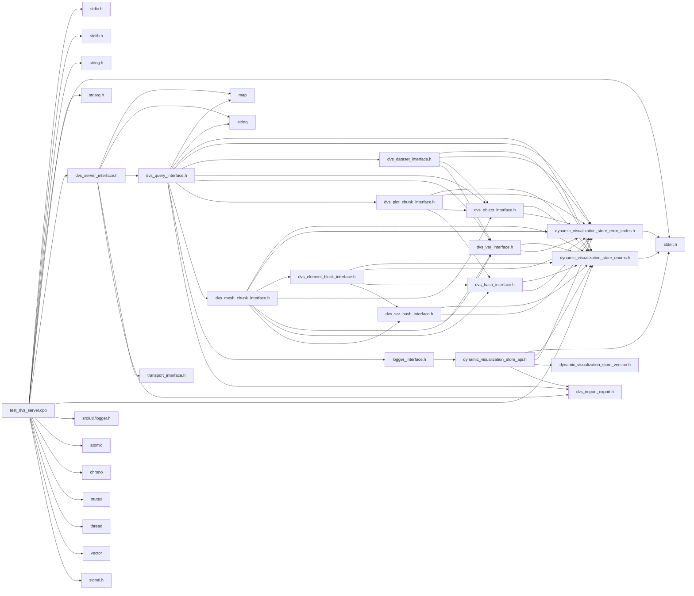

# File test\_dvs\_server.cpp

<a id="test__dvs__server_8cpp"></a>

![][C++]

Test server to provide example of create a simple server application.

This application is to be used as an example when getting started. It will start a server, and run until either ctrl-c is pressed or no new data has been received for 15 seconds (by default)


**version**\
0.1

## Includes

* <stdio.h>
* <stdlib.h>
* <string.h>
* <stdint.h>
* <stdarg.h>
* [dvs_server_interface.h](dvs__server__interface_8h.md#dvs__server__interface_8h)
* [dynamic_visualization_store_enums.h](dynamic__visualization__store__enums_8h.md#dynamic__visualization__store__enums_8h)
* src/util/logger.h
* <atomic>
* <chrono>
* <mutex>
* <thread>
* <vector>
* <signal.h>





## Variables

<a id="test__dvs__server_8cpp_1a8dd455a5b6ea0edf8a117ad9a057eb19"></a>
### Variable s\_terminate

![][public]
![][static]


```cpp
std::atomic<bool> s_terminate {false}
```


**Type**: std::atomic< bool >

<a id="test__dvs__server_8cpp_1af9d34f3b474b525c422212514b40896b"></a>
### Variable s\_server\_mutex

![][public]
![][static]


```cpp
std::mutex s_server_mutex
```


**Type**: std::mutex

<a id="test__dvs__server_8cpp_1af825fb3955acf6ace85703c966b9fc0d"></a>
### Variable s\_server

![][public]
![][static]


```cpp
DVS::IServer* s_server {nullptr}
```


**Type**: [DVS::IServer](class_d_v_s_1_1_i_server.md#class_d_v_s_1_1_i_server) *

## Functions

<a id="test__dvs__server_8cpp_1a89a8322bea357674e81ba9cbdefe0378"></a>
### Function signal\_callback\_handler

![][public]


```cpp
void signal_callback_handler(int signum)
```


Simple signal handler to handle signal.

**Parameters**:

* **signum**: signal being handled


**Parameters**:

* int **signum**

**Return type**: void

<a id="test__dvs__server_8cpp_1a3c04138a5bfe5d72780bb7e82a18e627"></a>
### Function main

![][public]


```cpp
int main(int argc, char **argv)
```


Main method of test client application.

**Parameters**:

* **argc**: Number of arguments
* **argv**: arguments


**Returns**:

int return value of app (unused)


**Parameters**:

* int **argc**
* char ** **argv**

**Return type**: int

## Source


```cpp
/*  *************************************************************
 *   Copyright 2017-2025 ANSYS, Inc.
 *   All Rights Reserved.
 *
 *        Restricted Rights Legend
 *
 *   Use, duplication, or disclosure of this
 *   software and its documentation by the
 *   Government is subject to restrictions as
 *   set forth in subdivision [(b)(3)(ii)] of
 *   the Rights in Technical Data and Computer
 *   Software clause at 52.227-7013.
 *  *************************************************************
 */


#include <stdio.h>
#include <stdlib.h>
#include <string.h>
#include <stdint.h>
#include <stdarg.h>

#include "dvs_server_interface.h"
#include "dynamic_visualization_store_enums.h"
#include "src/util/logger.h"

#include <atomic>
#include <chrono>
#include <mutex>
#include <thread>
#include <vector>
#include <signal.h>

static std::atomic<bool> s_terminate{false};
static std::mutex s_server_mutex;
static DVS::IServer* s_server{nullptr};

void signal_callback_handler(int signum)
{
    fprintf(stdout, "Caught Signal: %i\n", signum);
    s_terminate = true;
    std::lock_guard<std::mutex> lock(s_server_mutex);
    if (s_server)
    {
        s_server->terminating();
    }
}

int main(int argc, char** argv)
{
    //Register a signal handler instead of just killing the app so
    //we can shutdown gracefully
    signal(SIGINT, signal_callback_handler);

    uint32_t port = 50055;
    uint32_t delay_ms = 500;
    char host[512] = {0};
    strcpy(host, "127.0.0.1");
    char protocol[10] = {0};
    strcpy(protocol, "grpc");

    char secret[255] = {0};
    char cache_uri[512] = {0};
    char dvs_file_loc[1024] = {0};
    uint32_t debug_wait_sec = 0;
    uint32_t server_number = 0;
    uint32_t local_ranks = 1;
    uint32_t server_verbosity = 3;
    uint32_t timeout_sec = 15;
    bool allow_all_networks = false;
    bool disable_tls = false;
    bool use_tcp_sockets = false;
    char base_uds_path[1024]={0};

    uint32_t i = 1;
    while (i < argc)
    {
        if ((strcmp(argv[i], "-p") == 0 ) && (i < argc - 1))
        {
            i++;
            port = atoi(argv[i]);
        }
        else if ((strcmp(argv[i], "-h") == 0) && (i < argc - 1))
        {
            i++;
            strncpy(host, argv[i], 255);
        }
        else if ((strcmp(argv[i], "-protocol") == 0) && (i < argc - 1))
        {
            i++;
            strncpy(protocol, argv[i], 10);
            if (strcmp(protocol, "grpc") != 0 && strcmp(protocol, "null") != 0 )
            {
                fprintf(stderr, "protocol: %s invalid\n", protocol);
                exit(1);
            }
        }
        else if ((strcmp(argv[i], "-d") == 0) && (i < argc - 1))
        {
            i++;
            delay_ms = atoi(argv[i]);
        }
        else if (strcmp(argv[i], "-secret") == 0)
        {
            i++;
            strncpy(secret, argv[i], 255);
        }
        else if (strcmp(argv[i], "-server") == 0 && (i < argc - 3))
        {
            i++;
            server_number = atoi(argv[i++]);
            local_ranks = atoi(argv[i++]);
            server_verbosity = atoi(argv[i]);
        }
        else if (strcmp(argv[i], "-cache_uri") == 0)
        {
            i++;
            strncpy(cache_uri, argv[i], 512);
        }
        else if (strcmp(argv[i], "-debug_wait") == 0)
        {
            i++;
            debug_wait_sec = atoi(argv[i]);
        }
        else if (strcmp(argv[i], "-timeout") == 0)
        {
            i++;
            timeout_sec = atoi(argv[i]);
        }
        else if (strcmp(argv[i], "-dvs_file") == 0)
        {
            i++;
            strncpy(dvs_file_loc, argv[i], sizeof(dvs_file_loc)-1);
        }
        else if (strcmp(argv[i], "-allow_all_networks") == 0)
        {
            i++;
            allow_all_networks = true;
        }
        else if (strcmp(argv[i], "-disable_tls") == 0)
        {
            i++;
            disable_tls = true;
        }
        else if (strcmp(argv[i], "-use_tcp_sockets") == 0)
        {
            i++;
            use_tcp_sockets = true;
        }
        else if (strcmp(argv[i], "-base_uds_path") == 0){
            i++;
            strncpy(base_uds_path, argv[i], sizeof(base_uds_path)-1);
        }
        else
        {
            fprintf(stderr, "Unknown option: %s\n", argv[i]);
            fprintf(stderr, "Usage: %s [-p port] [-h host] [-d ms delay] [-s dx dy dz] \n", argv[0]);
            fprintf(stderr, "Options:\n");
            fprintf(stderr, "  -p port              Server port to connect to.  Default: %u\n", port);
            fprintf(stderr, "  -h host              Server hostname to connect to.  Default: %s\n", host);
            fprintf(stderr, "  -protocol str        Server protocol. I.E. grpc or null. Default: grpc");
            fprintf(stderr, "  -d delay(ms)         Milliseconds to delay between server updates.  Default: %u\n", delay_ms);
            fprintf(stderr, "  -secret string       Shared secret to use when talking with server Default: no shared secret\n");
            fprintf(stderr, "  -server n r v        Start a server using server number [n], expecting [r] local ranks for DVS connections to connect to with verbosity [v]. Local Rank Min/Max: 1/1000\n");
            fprintf(stderr, "  -cache_uri str       The URI for the server to use for the cache. Default: No cache\n");
            fprintf(stderr, "  -dvs_file str        Set a location for the dvs files to be created Default: ./\n");
            fprintf(stderr, "  -timeout sec         Shutdown the server if no new data has been received within timeout. Default: %u sec\n", timeout_sec);
            fprintf(stderr, "  -debug_wait s        Wait for [s] for debugging\n");
            fprintf(stderr, "  -allow_all_networks  Let the server listen to 0.0.0.0 instead of 127.0.0.1\n");
            fprintf(stderr, "  -disable_tls         Do not use certificates for the server/client handshake\n");
            fprintf(stderr, "  -use_tcp_sockets     Use TCP sockets and not unix domain sockets. On windows TCP sockets will always be used.\n");
            fprintf(stderr, "  -base_uds_path       Supply the base unix domain socket path for linux. Defaults to /tmp/greeter\n");
            exit(1);
        }
        i++;
    }

    //This is just used for debugging/attaching to the app if some problem arises
    if (debug_wait_sec > 0) {
        std::this_thread::sleep_for(std::chrono::seconds(debug_wait_sec));
    }

    char uri[1024] = {0};
    snprintf(uri, sizeof(uri), "%s://%s:%u", protocol, host, port);
    //The server URI is used to setup the protocol host and port of the server
    //(where and how clients need to connect). It will be something like:
    //grpc:://localhost:50055
#ifndef WIN32
    if (!use_tcp_sockets){
        snprintf(uri, sizeof(uri), "%s://%s:%d/?uds_path=%s", protocol, host, port, base_uds_path);
    }
#endif
    fprintf(stderr, "Server URI: %s\n", uri);
    fprintf(stderr, "Update Delay(ms): %u\n", delay_ms);

    {
        std::lock_guard<std::mutex> lock(s_server_mutex);
        s_server = DVS::CREATE_SERVER_INSTANCE(uri);
    }
    if (s_server == nullptr)
    {
        fprintf(stderr, "Failed to create server\n");
        exit(1);
    }
    char temp[10];
    snprintf(temp, 10, "%u", server_verbosity);
    s_server->set_option("VERBOSE",temp);
    if (strlen(cache_uri) > 0)
    {
        //If not using a cache_uri the cache will be all in memory, not
        //really useful for this specific test server app but showing a simple example.
        //In the future you will be able to use the DVS Reader API to read data from
        //memory using this instead of needing to read data from the cache.

        //The cache URI should be something like: hdf5://localhost/D:/my_cache
        s_server->set_option("CACHE_URI",cache_uri);
    }

    if (strlen(dvs_file_loc) > 0)
    {
        //The DVS file location let's you point the location of the auto created
        //.dvs files to another location, absolute or relative to the cache_uri location
        s_server->set_option("DVS_FILE_LOCATION", dvs_file_loc);
    }

    if (strlen(secret) > 0)
    {
        //This is needed if wanting to use a simple secret to allow clients
        //to connect to you. The clients will also need this secret.
        s_server->set_option("SERVER_SECURITY_SECRET", secret);
    }

    if (allow_all_networks)
    {
        s_server->set_option(DVS_SERVER_OPT_LISTEN_ALL_NETWORKS, "1");
    }
    if (disable_tls)
    {
        s_server->set_option(DVS_SERVER_OPT_DISABLE_TLS, "1");
    }
    if (use_tcp_sockets)
    {
        s_server->set_option(DVS_SERVER_OPT_USE_TCP_SOCKETS, "1");
    }
    if (base_uds_path)
    {
        s_server->set_option(DVS_SERVER_OPT_UNIX_DOMAIN_SOCKET_PATH,  base_uds_path);
    }

    auto begin = std::chrono::system_clock::now();

    //The startup_unthreaded call will start/initialize the server and block until
    //a all clients have initialized the dataset and sent a single timestep. A call
    //to s_server->terminating() can be seen above in the signal handler to allow you
    //to exit this call early.
    s_server->startup_unthreaded(server_number, local_ranks);
    uint32_t size;
    auto _uri = s_server->get_uri();
    if (_uri){
        fprintf(stderr, "Actual Server URI: %s\n", _uri);
    }
    //For this example we are going to quit early if number pending or number complete have not
    //changed within timeout_sec seconds.
    uint32_t num_pending = 0;
    uint32_t num_complete = 0;
    auto start_time = std::chrono::system_clock::now();

    while (!s_terminate) {
        //This is the main control loop of the server. DVS::IServer::update() just
        //needs to be called in a loop to handle the server state until the server
        //should be terminated.
        //Note: update() will flush data to the cache so shutting down / exiting mid
        //update will likely cause cache corruption.
        dvs_ret ret_val = s_server->update();
        // Avoid burning up a CPU waiting for the I/O to complete
        std::this_thread::sleep_for(std::chrono::milliseconds(delay_ms));

        uint32_t cur_num_pending = 0;
        uint32_t cur_num_complete = 0;
        s_server->get_timestep_count(cur_num_pending, cur_num_complete);
        if (cur_num_pending == num_pending && cur_num_complete == num_complete) {
            //If our values haven't changed check to see if we should time out
            std::chrono::duration<double> elapsed_seconds = std::chrono::system_clock::now() - start_time;
            if (elapsed_seconds.count() > timeout_sec) {
                //Terminate the server and quit out
                s_server->terminating();
                s_terminate = true;
            }
        }
        else {
            //We are different so reset our counters
            start_time = std::chrono::system_clock::now();
            num_pending = cur_num_pending;
            num_complete = cur_num_complete;
        }
    }

    num_pending = 1;
    num_complete = 0;
    while (num_pending > 0) {
        //This loop may or may not need to be done by a application. But is here
        //to show potential cleanup when terminating early. If terminating you may
        //want to finish the current in flight timestep. Since the server has been
        //told it is terminating in the signal handler above it will not accept new
        //timesteps but will allow pending timesteps to still complete.

        //Note: A user probably will want to do more due dilligence than this when
        //shutting down. A timestep that is waiting on a client that is hung or crashed
        //will never flip from pending->complete currently. This could cause this loop
        //to be infinite waiting on a client who will never send its data.
        dvs_ret error = s_server->update();
        if (error != DVS_NONE) {
            break;
        }
        //If the update() call above isn't called in this loop num_pending will
        //never change also calling this loop to be infinite. We must update the server
        //to get timestep state changes.
        error = s_server->get_timestep_count(num_pending, num_complete);
        if (error != DVS_NONE) {
            break;
        }
        // Avoid burning up a CPU waiting for the I/O to complete
        std::this_thread::sleep_for(std::chrono::milliseconds(delay_ms));
    }

    std::chrono::duration<double> end_time = std::chrono::system_clock::now() - begin;
    fprintf(stderr, "Total Server Time: %f\n", (end_time.count()-timeout_sec));

    //Destroy the server on exit, guarding against the s_server destruction here
    //in case the signal handler above is triggered.
    std::lock_guard<std::mutex> lock(s_server_mutex);
    DVS::DESTROY_SERVER_INSTANCE(s_server);
    s_server = nullptr;

    return 0;
}
```


[public]: https://img.shields.io/badge/-public-brightgreen (public)
[protected]: https://img.shields.io/badge/-protected-yellow (protected)
[static]: https://img.shields.io/badge/-static-lightgrey (static)
[C++]: https://img.shields.io/badge/language-C%2B%2B-blue (C++)
[Python]: https://img.shields.io/badge/language-Python-blue (Python)
[private]: https://img.shields.io/badge/-private-red (private)
[const]: https://img.shields.io/badge/-const-lightblue (const)
[Markdown]: https://img.shields.io/badge/language-Markdown-blue (Markdown)