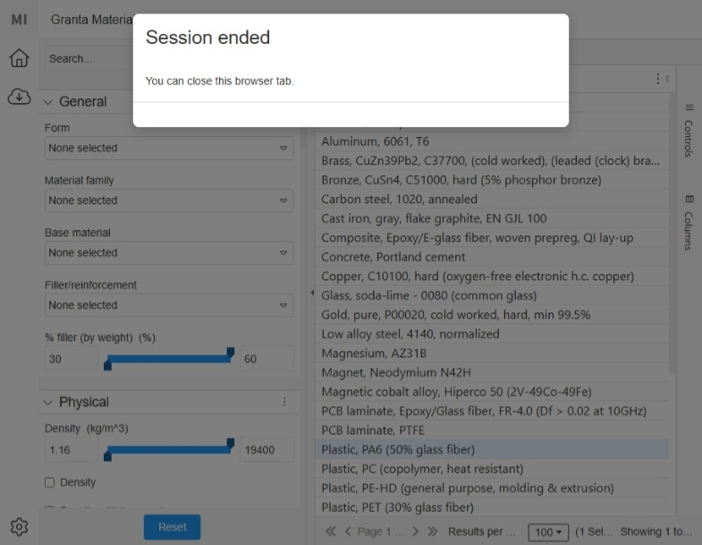

# Ending a session

To end a Granta Material Picker session, send an HTTP `DELETE` request to the session URL. For example:

<!-- :::code source="../../SampleHostApps/NoHost/SimpleExample.py" language="python" range="37-38"::: -->
```python
requests.delete(f"{sessions_endpoint}{post_session_resp['id']}", json={}, headers=auth_header, verify=0)
```

Ending a session disables the controls in the Granta Material Picker tab and displays the following message:



Materials are no longer available on the data endpoints.

If you do not end the session, it remains active and can be used to transfer additional material models. 