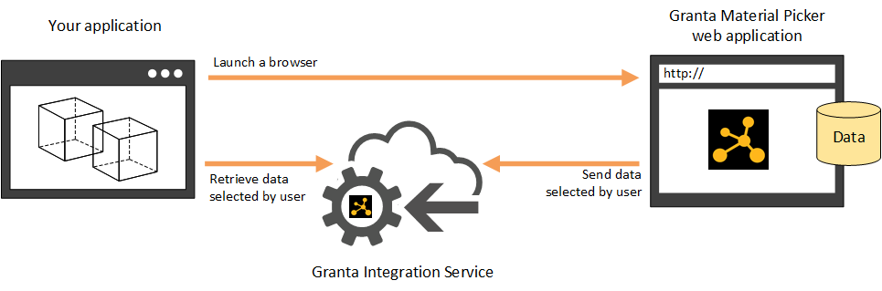

# User guide

From the perspective of your application, interacting with Granta Connected Data involves three main concepts:

- Granta Integration Service
- Granta Material Picker
- Material models

## Granta Integration Service
The Granta Integration Service hosts the web API that your application communicates with. Any data sent to and from the Granta Material Picker is stored here in your session.
  
## Granta Material Picker
This is a web application that allows data to be selected for import to your application.

    

## Material models
  Material models are data in a set JSON format. They are selected in the Granta Material Picker. The information in these models should be used to add materials data to a project or material library in your simulation application.
