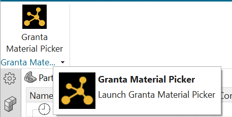
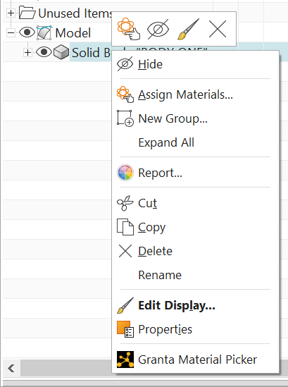

# Creating a plugin

Creating a plugin that works within your host application requires specific knowledge about that application. 
However, the following concepts are always required.

## Choosing the environment
You must decide which environment you are pointing your plugin at. In all the following code samples, we use the placeholder
`_`*cloudserver.com*`_` which should be replaced with the URL of the environment you would like to use. The production environment is [https://grantamaterials.ansys.com/](https://grantamaterials.ansys.com/)


## Setting the launch point

Choose a suitable location in your application to add the option that launches Granta Material Picker. For example, a toolbar button or context menu:





**Note:** In addition to the launching point, you might also want to allow the destination path for incoming materials to be set.

## Authenticating

To connect to Granta Material Picker, you must provide a valid access token. For more information, see [Authentication](./authentication.md).
  
## Creating an integration service session

Create a session for the Integration Service by sending an HTTP `POST` request to the `/sessions` endpoint.

Here is an example request payload:

```json
{
  "name": "My Application",
  "settings": {
    "title": "My Application",
    "packageName": "MyPackageName",
    "unitSystem": "metric",
    "pollSeconds": 60
  }
}
```

The response is a JSON object containing a uid key:

`"uid": "6bd31d4e-86ff-4b14-8fea-e74386d49e8b"`

Ensure that the ID of this session is stored for future usage.
  
## Launch a browser
Your end user must be prompted to select some material models. Do this by launching a browser at the URL of the cloud instance, and append your session ID. Use the format:


`https://`_`cloudserver.com`_`/grantami/#/granta-material-picker?sessionId=<sessionid>`

Where _`cloudserver.com`_ is the URL of the instance that you want to code against (either Staging or Production).


```python
import webbrowser
webbrowser.open("https://cloudserver.com/grantami/#/granta-material-picker?sessionId=84286fdbd31d7c2c6d0665f7e8380fa3")
```

## Receiving model data
There are two ways to receive the selected material model data.

The preferred approach is to listen for Server-Sent Events (SSE) using the session data `SSE` endpoint. Sending an HTTP `GET` request to `/sessions/{session_uid}/data/SSE` acts as an event source and returns data as soon as materials are available. For an example, see [Using SSEs](./sse-example.md).

A simpler approach is to send a `GET` request for your session data. `GET` requests to the `/sessions/{session_uid}/data` endpoint wait for the value specified by `pollSeconds` in the session options.


## Ending your session (optional)

Depending on your workflow, you might want to prevent further material selection in Granta Material Picker. For example, you may end the session once enough materials have been selected and no further materials are required.
For more information, see [Ending a session](./ending-a-session.md).