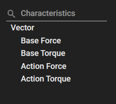

# Operation API using the Python language

The Ansys Motion Standalone Postprocessor C# library can be used in the python code by using [Python.NET](https://pythonnet.github.io/) or [IronPython](https://ironpython.net/).

## System requirements

The Operation API uses the IronPython 2.7.12 engine.
Since the engine is included within the Motion Postprocessor, no additional installation is required.

## How to execute the Operation API

To run the Operation API, activate Python Script from the Import menu.
- Make the file includes operation script.
- Import the file on Postprocessor.(Dropdown menu -> Import -> Python Script)


## How to write an API example?
To write the script, the following content needs to be added.
- You need to import the 'OperationAPI.py' file. This file contains all the necessary content to run the example.
- **'examples/Modules/OperationAPI.py'** is included in **'Install_Path\Motion\Document\Postprocessor API for Python.zip'**.

```python
# Refer to the OperationAPI.py file
import sys

# The current_dir variable indicates the directory of the current file.
# You must add the path to the folder containing 'OperationAPI.py' to this current director path.
current_dir = __file__.rsplit('\\', 1)[0]
external_modules_path = current_dir + "\\Modules"
sys.path.append(external_modules_path)

from OperationAPI import *
```

## How to input the value of the target into the function parameter?

* Through the Operation API, when creating Add Curve, Contour, and VectorDisplay, the following information must be known:
This includes information about the target, Characteristic, and Component. This information can be found by referring to the UI.


```python
# Contour
# Set array about result file
filepaths = List[str]()
filepaths.Add(result_file_path)

# Open about result files
applicationHandler.AddDocument(filepaths)

# GetAnalysisResult
document = applicationHandler.GetDocument(result_file_path)
dynamic_analysis = document.GetAnalysisResultViewModel(AnalysisResultType.Dynamics)

# Create Contour
# It returns the objects available for contouring that correspond to the MappingType.
contactEntities = dynamic_analysis.GetContourables(ContourMappingType.Contact)

# Target - Entities corresponding to ContourMappingType 
# MappingType - FENode, FEElement, BeamGroup, Contact, ChainedSystem, Usersubroutine, FEElementNode
# Characteristic - Characteristics corresponding to the MappingType visible in the UI
# Component - Component corresponding to the Characteristics visible in the UI
contour = dynamic_analysis.CreateContour(contactEntities, ContourMappingType.Contact, "Normal Force", "Average")

# It returns the objects available for contouring that correspond to the MappingType.
nodeEntities = dynamic_analysis.GetContourables(ContourMappingType.FENode)
contour = dynamic_analysis.CreateContour(contactEntities, ContourMappingType.FENode, "Top Stress", "X")
```

```python
# Create Vector Display
# Target - The name of the target entity for the Vector Display
# Characteristic - The name of the characteristic. Refer to the UI for Vector Display for available characteristics.
vector = analysis.CreateVectorDisplay("Translational", "Base Force")
```


```python
# Add Curve
chart = page.CreateChart("Chart")

# Set array about combination of characteristic and component
curvePaths = List[str]()
curvePaths.Add(r'Displacement/Magnitude')
curvePaths.Add(r'Displacement/Z')

# Set a Curve Parameter
parameters = PlotParameters()
parameters.Paths = curvePaths
parameters.Target = "Rigid"

# Rigid
curves = chartView.AddCurves(result_file_path, parameters)

# Marker
parameters.Target = "Rigid/CM"
curves = chartView.AddCurves(result_file_path, parameters)

# Node
parameters.Target = "Nodal/Node/7"
curves = chartView.AddCurves(result_file_path, parameters)

# Element
curvePaths = List[str]()
curvePaths.Add(r'Top Stress/X')
parameters.Target = "Nodal/Element/25"
curves = chartView.AddCurves(result_file_path, parameters)

```

## Example
The Operation API can manage tasks from start to finish, centered around the ApplicationHandler class.
This class implements the main functionlities of the API and helps users controls the entire flow, including the initialization and termination of the API.
By using the ApplicationHandler class, you can gain a comprehensive understanding of the overall behavior of the API and efficiently handle the necessary tasks.

* The examples provided below can be found within the **'Install_Path\Motion\Document\Postprocessor API for Python.zip'** compressed file.
* After unzipping the **'Install_Path\Motion\Document\Postprocessor API for Python.zip'** file, you can find the example file at the following path: **'examples/OperationAPIUsingThePythonLanguage.py'**

```python
# OperationAPIUsingThePythonLanguage.py
import sys
current_dir = __file__.rsplit('\\', 1)[0]
external_modules_path = current_dir + "\\Modules"
sys.path.append(external_modules_path)
from OperationAPI import *

# Start the headless application interface
applicationHandler = ApplicationHandler()

# The flag determines whether a MessageBox is displayed or hidden during API operation.
# When a MessageBox is shown, the API operation is blocked until the MessageBox is closed.
applicationHandler.IsShowMessageBox = False

# Import result file
result_file_path = get_result_file_path()

paths = List[str](1)
paths.Add(result_file_path)
applicationHandler.AddDocument(paths)

```
## See also
* [Python.NET](https://pythonnet.github.io/)
* [IronPython](https://ironpython.net/)
* [Reference](lib/VM.md)
	* [VM](lib/VM.md)	 
	* [VM.API.Post.Operations](lib/VM.API.Post.Operations.md)
	* [VM.Operations.Post](lib/VM.Operations.Post.Interfaces.md)
		* [VM.Operations.Post.Interfaces](lib/VM.Operations.Post.Interfaces.md)