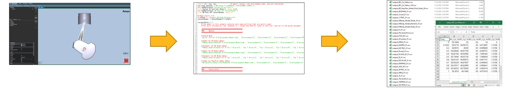

# Result File Reader using the Python language

The Ansys Motion Standalone Postprocessor C# library can be used in the python code by using [Python.NET](https://pythonnet.github.io/) or [IronPython](https://ironpython.net/).

## System requirements

If you are using CPython, you will need to install Python.NET first.
```
pip install pythonnet
```

* PythonNet only support Python  3.7 - 3.11. If you are using Ironpython or run the Python script from the Scripting menu of Ansys Workbench, PythonNet may not be required.

## How to execute Result File Reader

The Postprocessor API is a functionality that allows you to access Ansys Motion analysis results independently of the postprocessor and extract the desired results. The Postprocessor API can be used for process automation, integration with other processes, and integration with design optimization tools.



## How to write an API example?
To write the script, the following content needs to be added.
- You need to import the ResultFileReaderAPI.py file. This file contains all the necessary content to run the example.
- **'examples/Modules/ResultFileReaderAPI.py'** is included in **'Install_Path\Motion\Document\Postprocessor API for Python.zip'**.

```python
# Refer to the ResultFileReaderAPI.py file
import sys

# The current_dir variable indicates the directory of the current file.
# You must add the path to the folder containing 'ResultFileReaderAPI.py' to this current director path.
current_dir = __file__.rsplit('\\', 1)[0]
external_modules_path = current_dir + "\\Modules"
sys.path.append(external_modules_path)

from ResultFileReaderAPI import *
```

## How to input the value of the target into the function parameter?

Through the Operation API, when creating Add Curve, Contour, and VectorDisplay, the following information must be known: This includes information about the target, Characteristic, and Component. This information can be found by referring to the UI.

For more details, please refer to this [here](./getting_started_operation_api_using_py.md#how-to-input-the-value-of-the-target-into-the-function-parameter) link.

## Example

The following sample code demonstrates how to use Result File Reader API :

* The examples provided below can be found within the **'Install_Path\Motion\Document\Postprocessor API for Python.zip'** compressed file.
* After unzipping the **'Install_Path\Motion\Document\Postprocessor API for Python.zip'** file, you can find the example file at the following path: **'examples/ResultFileReaderUsingThePythonLanguage.py'**

```python
# ResultFileReaderUsingThePythonLanguage.py
import sys
from pathlib import Path

# Get the current file's path and set the path for external modules.
current_dir = Path(__file__).resolve().parent
external_modules_path = Path(current_dir, r'./Modules').resolve()
sys.path.append('{0}'.format(external_modules_path))

# Import necessary modules
from ResultFileReaderAPI import *

# Import result file
outputReader = OutputReader(get_result_file_path())

# Close
outputReader.Close()

```

## See also
* [Python.NET](https://pythonnet.github.io/)
* [IronPython](https://ironpython.net/)
* [Reference](lib/VM.md)
	* [VM](lib/VM.md)	 
	* [VM.Post.API.OutputReader](lib/VM.Post.API.OutputReader.md)