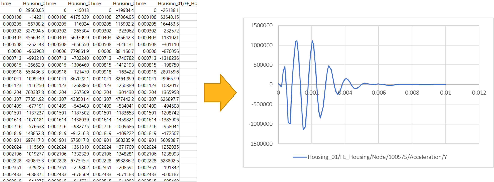

# Example
The following sample code illustrates how to create a simple example.

* The examples provided below can be found within the 'Install_Path\Motion\Document\Postprocessor API for Python.zip' compressed file.

## Create a Coordinate System
The Coordinate system can be created from various entities in the result as below, and this example describes how to create the Coordinate System.
* Rigid Body
* FE Node
* Marker
```python
# Example_ResultFileReaderAPI_CoordinateSystem.py
import sys
from pathlib import Path

current_dir = Path(__file__).resolve().parent

external_modules_path = Path(current_dir, r'../../Modules').resolve()
sys.path.append('{0}'.format(external_modules_path))

from ResultFileReaderAPI import *

# Import result file
outputReader = OutputReader(get_result_file_path())

# newName - Specifies the name of the marker.
# parentFullName - Specifies the name of parent.
# Rigid Body
crank_csys = outputReader.CreateCoordinateSystem("Crank_CSYS", "Crank")
crank_csys.TransformationOffsetParameters.Angle = Vector(0, 10, 0)
crank_csys.TransformationOffsetParameters.Position = Vector(10, 10, 10)
crank_csys.TransformationOffsetParameters.RotationAxis = RotationAxes.XYZ # XYX, XYZ, XZX, XZY, YXY, YXZ, YZX, YZY, ZXY, ZXZ, ZYX, ZYZ
crank_csys.TransformationOffsetParameters.RotationType = RotationTypes.FixedAngle # EulerAngle, FixedAngle

# The GeneralMarkerType property indicates Type attribute as displayed in the user interface.
# Accepted input values are defined by the GeneralMarkerType enumeration.
# The GeneralMarkerType ρ property must be one of the following: CARTESIAN, CYLINDRICAL, SPHERICAL
crank_csys.GeneralMarkerType = GeneralMarkerType.CYLINDRICAL

if crank_csys.GeneralMarkerType == GeneralMarkerType.SPHERICAL:
    # The PrimaryAxis property indicates Axis ρ. Accepted input values are defined by the CoordinateType enumeration.
    # The Axis ρ property must be one of the following: X, Y, Z
    crank_csys.PrimaryAxis = CoordinateType.X
    # The PrimaryAxis property indicates Axis Ø. Accepted input values are defined by the CoordinateType enumeration.
    # The Axis Ø property must be one of the following: X, Y, Z    
    crank_csys.SecondaryAxis = CoordinateType.Y
elif crank_csys.GeneralMarkerType == GeneralMarkerType.CYLINDRICAL:
    # The PrimaryAxis property indicates Axis R. Accepted input values are defined by the CoordinateType enumeration.
    # The Axis R property must be one of the following: X, Y, Z
    crank_csys.PrimaryAxis = CoordinateType.Z
    # The SecondaryAxis property indicates Axis Z. Accepted input values are defined by the CoordinateType enumeration.
    # The Axis Z property must be one of the following: X, Y, Z    
    crank_csys.SecondaryAxis = CoordinateType.X

# Rigid Body
print (f"Marker Name : {crank_csys.FullName}")

# FE Node
fenode_csys = outputReader.CreateCoordinateSystem("NodeCSYS", "FEBody_01/Node/754")
print (f"Marker Name : {fenode_csys.FullName}")

# Marker
marker_csys = outputReader.CreateCoordinateSystem("MarkerCSYS", "Crank/CM")
print (f"Marker Name : {marker_csys.FullName}")

# Close
outputReader.Close() 

```

## Plot
It is the simplest example of a Python script to print plot data.
* For combinations of paths(Characteristic, Component), refer to Notes in [Getting Started with the Python language](getting_started_operation_api_using_py.md).



```python
# Example_ResultFileReader_Plot.py
import sys
from pathlib import Path

current_dir = Path(__file__).resolve().parent

external_modules_path = Path(current_dir, r'../../Modules').resolve()
sys.path.append('{0}'.format(external_modules_path))

from ResultFileReaderAPI import *

# Import result file
outputReader = OutputReader(get_result_file_path())

# Get Curves
paths = List[str]() 
paths.Add("Acceleration/Y")

plotParameter = PlotParameters()
plotParameter.Target = "Crank"
plotParameter.Paths = paths

results = outputReader.GetCurves(plotParameter)

for result in results :
    print(['Time\t', "Y", '\n'])
    for plotData in result.Value :
        print([str(plotData.X), '\t', str(plotData.Y), '\n'])
 
# Close
outputReader.Close()

```

## Contour Export
Export contour results to a file
* For combinations of paths(Characteristic, Component), refer to Note in [Result File Reader using Python language](getting_started_result_file_reader_using_py.md).

```python
# Example_ResultFileReaderAPI_Contour.py
import struct, os, sys
from pathlib import Path

current_dir = Path(__file__).resolve().parent

external_modules_path = Path(current_dir, r'../../Modules').resolve()
sys.path.append('{0}'.format(external_modules_path))

from ResultFileReaderAPI import *

# Import result file
outputReader = OutputReader(get_result_file_path())

output_dir = get_output_directory()
export_result_file_path = os.path.join(output_dir, r'ExportContourResultToFile.txt')

# State ID Array
stateids = outputReader.GetStateIDArray()
path = "Top Stress/X"

# GetGeometryInfoArray
geometries = outputReader.GetGeometryInfoArray()

# Find Item
febody = next((item for item in geometries if item.FullName == "FEBody_01"), None)

# resultpath - Specifies the file path to export
# mode - Specifies how the operating system should open a file.
# stateids - Specifies the id list of the states to time.
# fullName - Specifies the names of the entities.
# type - Specifies the type of the target for displaying contour(None, FENode, FEElement, FEElementNode, FEMaterial, BeamGroup, Contact, ChainedSystem, Usersubroutine).
# path - Specifies the path of result to save.
# analysisResultType - Specifies the type of analysis result type for displaying contour.
# formatType - Specifies a file format type.
outputReader.ExportContourResultToFile(export_result_file_path, FileMode.Create, stateids, febody.FullName, ContourMappingType.FENode, path, analysisResultType = AnalysisResultType.Dynamics, formatType = FileFormatType.BINARY)

stateids = outputReader.GetStateIDArray()
totalsteps = len(list(stateids))
datapart = outputReader.GetGeometryInfo(febody.FullName)
nnodes = datapart.NodesCount
timearray = outputReader.GetReferenceTimeArray()

print('===================== Top Stress X =======================:')
print('total steps :', totalsteps)
print('total nodes :', nnodes)
with open(export_result_file_path, 'rb') as file:
    for id in stateids:
        print('===================== state id =======================:', id)
        print('===================== ref time =======================:', timearray[id-1])
        double_values = struct.unpack('d' * nnodes, file.read(struct.calcsize('d') * nnodes))
        
        print(*double_values, sep=',')
        print(f"\n")

# Close
outputReader.Close()

```

## Vector Export
Export vector results to a file
```python
# Example_ResultFileReaderAPI_ExportVectorFile.py
import os, sys
from pathlib import Path

current_dir = Path(__file__).resolve().parent

external_modules_path = Path(current_dir, r'../../Modules').resolve()
sys.path.append('{0}'.format(external_modules_path))

from ResultFileReaderAPI import *

# Import result file
outputReader = OutputReader(get_result_file_path())

stateids = outputReader.GetStateIDArray()

# target - Specifies the name of vector displayable entity
# path - Specifies characteristc on vector display
target = "TJ_01"
path = "Base Force"

targets = List[IVectorDisplay]()
vector = outputReader.CreateVector("vector", target, path)
targets.Add(vector)
print ("===ExportVectorDisplayToFile===")

output_dir = get_output_directory()
export_vector_file_path = os.path.join(output_dir, r'ExportVectorDisplayToFile_Targets.txt')
outputReader.ExportVectorDisplayToFile(export_vector_file_path, stateids, targets, True, True, True, AnalysisResultType.Dynamics)

export_vector_file_path = os.path.join(output_dir, r'ExportVectorDisplayToFile_Target.txt')
outputReader.ExportVectorDisplayToFile(export_vector_file_path, stateids, "TJ_01", "Base Force", True, True, True, AnalysisResultType.Dynamics)

# Close
outputReader.Close()

```

## Get Vector
Get results from the Vector.
* Refer to the Notes at location [Result File Reader using Python language](getting_started_result_file_reader_using_py.md) for the path(Characteristics) of the vector.

```python
# Example_ResultFileReader_Vector.py
import sys
from pathlib import Path

current_dir = Path(__file__).resolve().parent

external_modules_path = Path(current_dir, r'../../Modules').resolve()
sys.path.append('{0}'.format(external_modules_path))

from ResultFileReaderAPI import *

# Import result file
outputReader = OutputReader(get_result_file_path())

print ("===GetVector===")
# target - Specifies the name of vector displayable entity
# path - Specifies characteristc on vector display
vectors = outputReader.GetVector("TJ_01", "Action Force")
for vector in vectors:
    print(f"Vector : {vector.Key}")
    animation_data = vector.Value

    positions = len(list(animation_data.Positions))
    for i in range(positions):
        first_positions = len(list(animation_data.Positions[i]))
        for j in range(first_positions):
            second_positions = list(animation_data.Positions[i][j])
            print("Positions :", *second_positions, sep=',')

    vectors = len(list(animation_data.Vectors))
    for i in range(vectors):
        first_vectors = len(list(animation_data.Vectors[i]))
        for j in range(first_vectors):
            second_vectors = list(animation_data.Vectors[i][j])
            print("Vectors :", *second_vectors, sep=',')
# Close
outputReader.Close()

```