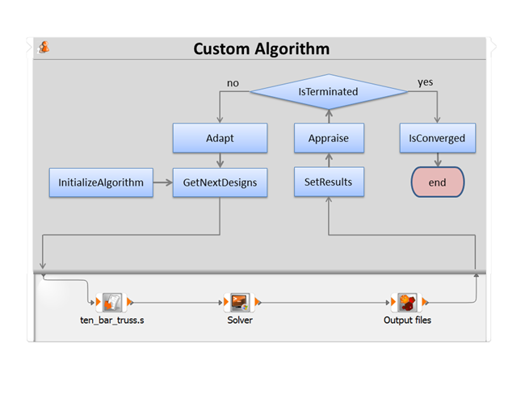

# Algorithms

You can extend the algorithms by using common script interfaces.

To use custom script algorithms, the scripts must fulfill the naming conventions `*_ca.py` or `*_algo.py` and should be placed in any of the following locations:
- `[installation path]/scripting/algorithmns`
- Directories specified by configuration settings.
- Directories specified by the environment variable `OSL_ALT_CA_SEARCH_DIRS`, separated by the native environment separator (`;` on Windows or `:` on Linux).

Custom script algorithms found in these locations are loaded when the application starts and are then available for use.

Optionally, the following file types with the same filename and in the same directory can be used as:
- Node icon (`.svg, .jpg, .png, .jpeg, .ico, .bmp`)
- Documentation page in the help system (`.html`)
- [Configuration](opti_api_python_nodes_config_files.md) (`.cfg`)
- [Algorithm settings user interface declaration file](opti_api_python_qml.md) (`.qml`)

The following functions are required in the Python script:

## `GetMaxNumberOfDesigns(kwargs)`
Returns the maximum number of design evaluations requested by the algorithm before termination.
- **Inputs:**
  - `settings`: PyOSDesignPoint with algorithm settings. Access input using `kwargs["settings"]`.
- **Outputs:**
  - unsigned int: Maximum number of expected design evaluations.

## `InitializeAlgorithm(args)`
Initializes the algorithm with the input values.
- **Inputs:**
  - `parameters`: PyParameterManager with parametrization
  - `start designs`: PyOSDesignContainer with start designs
  - `responses`: PyOSDesignPoint with defined responses
  - `criteria`: PyOSCriterionContainer with defined criteria
  - `seed`: integer with seed used
  - `settings`: PyOSDesignPoint with algorithm settings
  - `PyOSDesignPoint` - optiSLang variables:
    - `OSL_PROJECT_WORKING_DIR` - Absolute path of the current project (`*.opd`).
    - `OSL_PROJECT_FILE_DIR` - Absolute path of the current directory containing the project file (`*.opf`).
    - `OSL_PROJECT_DIR`: absolute path of the current project (`*.opd`). ***Deprecated***
    - `OSL_WORKING_DIR`: absolute path of the current working directory
    - `OSL_CUSTOM_SCRIPT_DIR`: absolute path of the current script file
    - `OSL_RLS_VER`: version number
    - `OSL_RLS_REV`: revision number
    - `OSL_RLS_FLG`: is empty unless a specific version is used
- **Outputs:**
  - bool: Success value of the initialization

## `GetNextDesigns(args)`
Returns the next designs that must be calculated by the solver.
- **Inputs:**
  - `PyOSDesignPoint`: optiSLang variables:
    - `OSL_PROJECT_WORKING_DIR` - Absolute path of the current project (`*.opd`).
    - `OSL_PROJECT_FILE_DIR` - Absolute path of the current directory containing the project file (`*.opf`).
    - `OSL_PROJECT_DIR`: absolute path of the current project (`*.opd`). ***Deprecated***
    - `OSL_WORKING_DIR`: absolute path of the current working directory
    - `OSL_CUSTOM_SCRIPT_DIR`: absolute path of the current script file
    - `OSL_RLS_VER`: version number
    - `OSL_RLS_REV`: revision number
    - `OSL_RLS_FLG`: empty unless a specific version is used
- **Outputs:**
  - `next designs`: PyOSDesignContainer with expected designs

## `SetResults(args)`
Sets the results calculated by the solver.
- **Inputs:**
  - `designs`: PyOSDesignContainer with expected designs including calculated responses
  - `PyOSDesignPoint`: optiSLang variables:
    - `OSL_PROJECT_WORKING_DIR` - Absolute path of the current project (`*.opd`).
    - `OSL_PROJECT_FILE_DIR` - Absolute path of the current directory containing the project file (`*.opf`).
    - `OSL_PROJECT_DIR`: absolute path of the current project (`*.opd`). ***Deprecated.***
    - `OSL_WORKING_DIR`: absolute path of the current working directory
    - `OSL_CUSTOM_SCRIPT_DIR`: absolute path of the current script file
    - `OSL_RLS_VER`: version number
    - `OSL_RLS_REV`: revision number
    - `OSL_RLS_FLG`: empty unless a specific version is used
- **Outputs:**
  - bool: Success value of the function

## `Appraise(args)`
Appraises the last set results.
- **Inputs:**
  - `PyOSDesignPoint`: optiSLang variables:
    - `OSL_PROJECT_WORKING_DIR` - Absolute path of the current project (`*.opd`).
    - `OSL_PROJECT_FILE_DIR` - Absolute path of the current directory containing the project file (`*.opf`).
    - `OSL_PROJECT_DIR`: absolute path of the current project (`*.opd`). ***Deprecated.***
    - `OSL_WORKING_DIR`: absolute path of the current working directory
    - `OSL_CUSTOM_SCRIPT_DIR`: absolute path of the current script file
    - `OSL_RLS_VER`: version number
    - `OSL_RLS_REV`: revision number
    - `OSL_RLS_FLG`: empty unless a specific version is used
- **Outputs:**
  - bool: Success value of the function (not the appraisal itself)

## `Adapt(args)`
Adapts the next designs expected to be calculated by the solver.
- **Inputs:**
  - `parameters`: PyParameterManager with parametrization
  - `start designs`: PyOSDesignContainer with start designs
  - `responses`: PyOSDesignPoint with defined responses
  - `criteria`: PyOSCriterionContainer with defined criteria
  - `seed`: integer with seed used by optiSLang
  - `settings`: PyOSDesignPoint with algorithm settings
  - `PyOSDesignPoint`: optiSLang variables:
    - `OSL_PROJECT_WORKING_DIR` - Absolute path of the current project (`*.opd`).
    - `OSL_PROJECT_FILE_DIR` - Absolute path of the current directory containing the project file (`*.opf`).
    - `OSL_PROJECT_DIR`: absolute path of the current project (`*.opd`). ***Deprecated.***
    - `OSL_WORKING_DIR`: absolute path of the current working directory
    - `OSL_CUSTOM_SCRIPT_DIR`: absolute path of the current script file
    - `OSL_RLS_VER`: version number
    - `OSL_RLS_REV`: revision number
    - `OSL_RLS_FLG`: empty unless a specific version is used
- **Outputs:**
  - bool: Success value of the adaption

## `IsTerminated(args)`
Decides if the algorithm is terminated.
- **Inputs:**
  - `PyOSDesignPoint`: optiSLang variables:
    - `OSL_PROJECT_WORKING_DIR` - Absolute path of the current project (`*.opd`).
    - `OSL_PROJECT_FILE_DIR` - Absolute path of the current directory containing the project file (`*.opf`).
    - `OSL_PROJECT_DIR`: absolute path of the current project (`*.opd`). ***Deprecated.***
    - `OSL_WORKING_DIR`: absolute path of the current working directory
    - `OSL_CUSTOM_SCRIPT_DIR`: absolute path of the current script file
    - `OSL_RLS_VER`: version number
    - `OSL_RLS_REV`: revision number
    - `OSL_RLS_FLG`: empty unless a specific version is used
- **Outputs:**
  - bool: Termination state

## `IsConverged(args)`
Decides if the algorithm is converged.
- **Inputs:**
  - `PyOSDesignPoint`: optiSLang variables:
    - `OSL_PROJECT_WORKING_DIR` - Absolute path of the current project (`*.opd`).
    - `OSL_PROJECT_FILE_DIR` - Absolute path of the current directory containing the project file (`*.opf`).
    - `OSL_PROJECT_DIR`: absolute path of the current project (`*.opd`). ***Deprecated.***
    - `OSL_WORKING_DIR`: absolute path of the current working directory
    - `OSL_CUSTOM_SCRIPT_DIR`: absolute path of the current script file
    - `OSL_RLS_VER`: version number
    - `OSL_RLS_REV`: revision number
    - `OSL_RLS_FLG`: empty unless a specific version is used
- **Outputs:**
  - bool: Convergency state

## `GetSettings(args)`
Returns the internally used algorithm settings to show them in the dialog.
- **Inputs:**
  - `PyOSDesignPoint`: optiSLang variables:
    - `OSL_PROJECT_WORKING_DIR` - Absolute path of the current project (`*.opd`).
    - `OSL_PROJECT_FILE_DIR` - Absolute path of the current directory containing the project file (`*.opf`).
    - `OSL_PROJECT_DIR`: absolute path of the current project (`*.opd`). ***Deprecated.***
    - `OSL_WORKING_DIR`: absolute path of the current working directory
    - `OSL_CUSTOM_SCRIPT_DIR`: absolute path of the current script file
    - `OSL_RLS_VER`: version number
    - `OSL_RLS_REV`: revision number
    - `OSL_RLS_FLG`: empty unless a specific version is used
- **Outputs:**
  - list (PyOSDesignPoint): Internal settings (name and value pairs)

## `CheckSettings(args)`
Checks the internally used algorithm settings.
- **Inputs:**
  - `PyOSDesignPoint`: Algorithm settings
  - `PyOSDesignPoint`: optiSLang variables:
    - `OSL_PROJECT_WORKING_DIR` - Absolute path of the current project (`*.opd`).
    - `OSL_PROJECT_FILE_DIR` - Absolute path of the current directory containing the project file (`*.opf`).
    - `OSL_PROJECT_DIR`: absolute path of the current project (`*.opd`). ***Deprecated.***
    - `OSL_WORKING_DIR`: absolute path of the current working directory
    - `OSL_CUSTOM_SCRIPT_DIR`: absolute path of the current script file
    - `OSL_RLS_VER`: version number
    - `OSL_RLS_REV`: revision number
    - `OSL_RLS_FLG`: empty unless a specific version is used
- **Outputs:**
  - bool: Success value of the check

## `IsOptimization(args)`
Decides if the algorithm uses optimization parameters. 

- **Inputs:**
  - `PyOSDesignPoint`: optiSLang variables:
    - `OSL_PROJECT_WORKING_DIR` - Absolute path of the current project (`*.opd`).
    - `OSL_PROJECT_FILE_DIR` - Absolute path of the current directory containing the project file (`*.opf`).
    - `OSL_PROJECT_DIR`: absolute path of the current project (`*.opd`). ***Deprecated.***
    - `OSL_WORKING_DIR`: absolute path of the current working directory
    - `OSL_CUSTOM_SCRIPT_DIR`: absolute path of the current script file
    - `OSL_RLS_VER`: version number
    - `OSL_RLS_REV`: revision number
    - `OSL_RLS_FLG`: empty unless a specific version is used
- **Outputs:**
  - `bool` - which is `true` if the algorithm uses optimization parameters

## `IsStochastic(args)`

Decides if the algorithm uses stochastic parameters. 

- **Inputs:**
  - `PyOSDesignPoint`: optiSLang variables:
    - `OSL_PROJECT_WORKING_DIR` - Absolute path of the current project (`*.opd`).
    - `OSL_PROJECT_FILE_DIR` - Absolute path of the current directory containing the project file (`*.opf`).
    - `OSL_PROJECT_DIR`: absolute path of the current project (`*.opd`). ***Deprecated.***
    - `OSL_WORKING_DIR`: absolute path of the current working directory
    - `OSL_CUSTOM_SCRIPT_DIR`: absolute path of the current script file
    - `OSL_RLS_VER`: version number
    - `OSL_RLS_REV`: revision number
    - `OSL_RLS_FLG`: empty unless a specific version is used
- **Outputs:**
  - `bool` - which is `true` if the algorithm uses stochastic parameters

The basic relationship between functions and the algorithm is shown in the following workflow:

