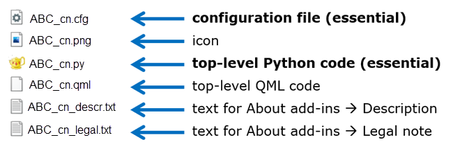

# Basic Node
The following topics describe the framework for creating a Python-based node plugin.
## Table of Contents

- [Basic Requirements](#basic-requirements)
- [Functions to Implement](#functions-to-implement)
- [Data Exchange](#data-exchange)
- [Essential and Additional Files](#essential-and-additional-files)

## Basic Requirements
The following requirements must be met for optiSLang to detect, load, and execute a plugin you provide.

- Use the following naming convention for the script files: `*_cn.py`.
- The [required functions](#functions-to-implement) must be implemented in **one** script file.
- Place the scripts in a directory scanned by optiSLang. Custom nodes found in any of these locations are loaded when the application starts and are then available within optiSLang. There are several location options:
    - The default custom node plugin folder belonging to the installation: `[installation path]/scripting/node`
    - An alternative customized integrations directory specified in the `SC_AlternativeCIDirectories` entry of the optiSLang configuration file.
    - An alternative customized integrations directory specified by the environment variable `OSL_ALT_CN_SEARCH_DIRS`

## Functions to Implement
You can add a plugin for extending optiSLang by providing a Python file following a special naming convention and by implementing a set of functions within it following special naming and signature conventions.

The following are the available functions forming the interface and indicate where implementation is necessary or optional.
- **Required:**
    - [`execute`](#execute)
- **Optional:**
    - [`default_settings`](#default_settings)
    - [`execute_custom`](#execute_custom)
    - [`check`](#check)
    - [`reset`](#reset)
    - [`reset_hid`](#reset_hid)
    - [`initialize`](#initialize)
    - [`shutdown`](#shutdown)
    - [`get_required_license_caps`](#get_required_license_caps)

The `execute_custom` function is only required when you need advanced interactivity for user interfaces with QML-based settings. Otherwise, it is optional.

You do not need to declare anywhere explicitly the set of functions you are implementing. The code in the top-level `cn.py` file is the declaration. Based on the presence of function implementation, optiSLang creates the nodes. When you add or remove functions, you can trigger optiSLang to rescan the libraries by closing and restarting it.

The following functions are available:

### execute
This function is used to call your solver.

**Incoming Arguments**
- [Common Incoming Key Word Arguments (KWARGs)](#table-1-common-incoming-key-word-arguments-kwargs)
- [Additional Incoming KWARGs for the Execute Function](#table-2-additional-incoming-kwargs-for-the-execute-function)

**Return Values**
- A list of [HidSpecificOutputData](#table-6-hidspecificoutputdata-attributes).

### default_settings
This function defines the set of default settings associated with each new node instance. In a dictionary, you supply name-value pairs. The value type is important, for example, by forwarding a boolean value this setting is determined to be a boolean switch. Your code should then not set any other value type later. Without supplying any QML code for drawing user interface elements, optiSLang will add generic user interface elements, and these are determined by the value type given here. For instance, a boolean value induces optiSLang to display a check box in the node edit dialog box, whereas for string values a text entry field is created. The value types supported are boolean, integer, float, and string.

This function returns a list of zero to two elements, where each element can be either a Python object or a list of tuples. If you intend to use the generic settings user interface only, a planar dictonary (name-value pairs) or a list of tuples is supported. If you intended to use QML code, the elements can be nested Python objects. By providing a list of tuples, you can preserve the order of the given settings. The first element is always treated as a set of settings that require a node reset when manipulated in the user interface (`modifying_settings`). The second element is treated as a set of settings where you do not need to reset the node after they are manipulated in the user interface (`non_modifying_settings`).

Note: In `default_settings`, you define the sequence of setting names and value types for your new node type. In all other functions, the settings container stored with the node is input using arguments. Wherever settings are consumed, you assume the same dictionary/list structure (the same sequence of names and value types).

**Incoming Arguments**
- [Common Incoming Key Word Arguments (KWARGs)](#table-1-common-incoming-key-word-arguments-kwargs)

**Return Values**
- List with zero to two elements containing `modifying_settings` and/or `non_modifying_settings` as Python objects or lists of tuples.

### execute_custom
This function serves as flexible, general-purpose, signal and information channel between the QML layer and the Python layer. When you access tabs, entries, and buttons in the QML-based settings user interface, the QML layer is running the process. If you need logic evaluation or other small computations, the QML layer allows for lines of JavaScript. However, if you cannot solve all settings-related work steps in the QML layer, then the `execute_custom` function allows you to trigger work in the Python layer and collect work results from there.

The execute_custom function can be triggered from the QML layer using the following:

```
backend.executeCustom(JSON.stringify(info_container))
```

Information exchange between the QML and Python layers using `execute_custom` occurs using JSON which is represented as a dictionary on the Python side.

The function can be used for as many types of tasks as needed, and as often as needed. Various different QML user interface elements created by you can trigger `execute_custom`, and in the QML code you can put together any kind of cargo-containing JSON to pass over to the Python layer. At the same time, in the Python layer, inside `execute_custom` you can trigger any kind of work on the Python side. When a task is resolve, you can send the result of the Python work back to the QML layer in the same way. A dictionary is used for the communication back to the QML layer.

**Incoming Arguments**
- [Common Incoming Key Word Arguments (KWARGs)](#table-1-common-incoming-key-word-arguments-kwargs)
- `custom_execution_arguments`: Dictionary of settings currently stored with the QML backend.

**Return Values**
- Return cargo, can represent a JSON dictionary.

### check
This function is called at the start of execution. You can use it to check if there are any issues preventing successful execution, and if there are, provide an early stop to prevent a potential time-consuming run.

**Incoming Arguments**
- [Common Incoming Key Word Arguments (KWARGs)](#table-1-common-incoming-key-word-arguments-kwargs)

**Return Values**
- `RunStatus`: An object for documenting success and logging.

### reset
This function is called when the node is reset.

**Incoming Arguments**
- [Common Incoming Key Word Arguments (KWARGs)](#table-1-common-incoming-key-word-arguments-kwargs)
- `working_directories`: Working directories (as string) per HID.

**Return Values**
- `RunStatus`: An object for documenting success and logging.

### reset_hid
This function is called when the node is reset for a single HID.

**Incoming Arguments**
- [Common Incoming Key Word Arguments (KWARGs)](#table-1-common-incoming-key-word-arguments-kwargs)
- `hid`: Hierarchical ID of a design variation, for example, `[0.99.4]`.

**Return Values**
- `RunStatus`: An object for documenting success and logging.

### initialize
You can use the initialize and shutdown functions to create and close a Python work environment. In some use cases, it can be difficult to use separate, atomic, agnostic functions, so it may be easier to work in a session-based manner. Initialize and shutdown allow you to, for example, avoid loading a heavy solver program multiple times during the lifecycle for one design and repeatedly for many designs by keeping a session/connection with one solver program instance alive all the time.

In the initialize function, you can generate a set of global variables which you can use in all other functions. A variable name can handle to simple things like numbers or strings, or, it can handle to more complex things like an open file, a spawned sub-process, an object of a class you write for managing solver program sessions, and so on.

You can find a simple demo exploiting the initialize-shutdown mechanism in the [integration examples package](opti_api_python_nodes_integration_demos.md).

**Incoming Arguments**
- [Common Incoming Key Word Arguments (KWARGs)](#table-1-common-incoming-key-word-arguments-kwargs)

**Return Values**
- Returns nothing or None.

### shutdown
You can use the initialize and shutdown functions to create and close a Python work environment. In some use cases, it can be difficult to use separate, atomic, agnostic functions, so it may be easier to work in a session-based manner. The shutdown function allows you to close logs, any other open files, terminate sub-processes, close client program sessions, remote connections, and so on. In short, close down and tidy up the session workspace you have created with INI and which has evolved over many cycles of calling the other elementary integration functions.

**Incoming Arguments**
- [Common Incoming Key Word Arguments (KWARGs)](#table-1-common-incoming-key-word-arguments-kwargs)

**Return Values**
- Returns nothing or None.

### get_required_license_caps
This function provides the license capabilities of the node plugin.

**Incoming Arguments**
- [Common Incoming Key Word Arguments (KWARGs)](#table-1-common-incoming-key-word-arguments-kwargs)

**Return Values**
- List of license capabilities as strings.

## Data Exchange
Data exchange is done using exported optiSLang built-in types, lists, and dictionaries.

- [HidSpecificInputData](#table-5-hidspecificinputdata-attributes): An aggregate of various input data which may differ for each Hierarchical ID (HID). See .
- [HidSpecificOutputData](#table-6-hidspecificoutputdata-attributes): An aggregate of various output data which may differ for each HID.
- `RunStatus`: An object for documenting success and logging.

The following tables describe the standardized data structures of important objects transferred to several of the plugin functions where they are received in a structure of arguments.

**Table 1: Common Incoming Key Word Arguments (KWARGs)**

| Name | Type | Description |
|------|------|-------------|
| project_working_directory | String | Path of the project's working directory. |
| modifying_settings | Python object | User interface editable settings that require a node reset if changed. |
| non_modifying_settings | Python object | User interface editable settings that do not require a node reset if changed. |
| properties | Dictionary | Properties of the node (for example, `read_mode`). |
| node_name | String | The current node's name. |
| osl_variables | Dictionary | Dictionary of optiSLang variables. Does not vary per HID. |
| reference_file | String | Optional: Path to the reference file.<br>Only available if `FileBased` is not set to `false` in the [configuration file](opti_api_python_nodes_config_files.md). |
| reference_file_is_relative_to_working_directory | Bool | Optional: Whether or not the path to reference file is relative to the working directory.<br>Only available if `FileBased` is not set to `false` in the [configuration file](opti_api_python_nodes_config_files.md). |

**Table 2: Additional Incoming KWARGs for the Execute Function**

| Name | Type | Description |
|------|------|-------------|
| input_container | List of `HidSpecificInputData` | Aggregate of arguments per HID. |

**Table 3: optiSLang Variables That Do Not Vary Per HID**

| Name | Type | Description |
|------|------|-------------|
| OSL_PROJECT_WORKING_DIR | Absolute path of the current project (`*.opd`).|
| OSL_PROJECT_FILE_DIR | Absolute path of the current directory containing the project file (`*.opf`)|
| OSL_PROJECT_DIR<br>***Deprecated.*** | String | Absolute path of the current project (`*opd`). ***Deprecated.*** |
| OSL_NODE_NAME | String | Name of the current node. |
| OSL_HOME | String | Absolute path of the directory containing the optiSLang executable. |
| OSL_RLS_VER | String | The version number of optiSLang. |
| OSL_RLS_REV | String | The revision number of optiSLang. |
| OSL_RLS_FLG | String | A version suffix which is normally empty unless a specific build is set. |

**Table 4: optiSLang Variables that Vary Per HID in Execute Function**

| Name | Type | Description |
|------|------|-------------|
| OSL_DESIGN_NO | String | Design number. |
| OSL_DESIGN_NAME | String | Design directory name (for example, Design_0001). |
| OSL_DESIGN_DIR | String | Absolute path of the current design directory. |

**Table 5: HidSpecificInputData Attributes**

| Name | Type | Description |
|------|------|-------------|
| hid | HID | Hierarchical ID of a design variation, for example, `[0.99.4]`. |
| hierarchy | Dictionary | The node's position within the surrounding systems. |
| input_slot_values | Dictionary | The values of the input slots. |
| osl_variables | Dictionary | Dictionary of optiSLang variables that vary per HID. |
| working_directory | String | The nodes working directory. |
| reference_file | String | Optional: Path to the reference file.<br>Only available if `FileBased` is not set to `false` in the [configuration file](opti_api_python_nodes_config_files.md). |
| reference_file_is_relative_to_working_directory | Bool | Optional: Whether or not the path to reference file is relative to the working directory.<br>Only available if `FileBased` is not set to `false` in the [configuration file](opti_api_python_nodes_config_files.md). |

**Table 6: HidSpecificOutputData Attributes**

| Name | Type | Description |
|------|------|-------------|
| hid | HID | Hierarchical ID of a design variation, for example, `[0.99.4]`. |
| output_slot_values | Dictionary | A dictionary of name-value pairs that should be written to the output slots specified in the configuration file. |
| status | RunStatus | An object for documenting success and logging. |

## Essential and Additional Files
The following image shows a standard set of files for creating a Python-based integration node.



In the Python code inside the `*_cn.py` file, you can import other libraries, allowing you to add a larger package of files to a complex integration plugin. With each additional `*_cn.py` file, you provide an additional node in optiSLang’s module library. For the sake of organizational clarity, modularity, reusability, and testability, it can be beneficial to keep only small portions of code in the `*_cn.py` files and concentrate the function and class definitions in a library of one or several files to import from. This way, you can create multiple nodes which build on a common modular library.

### Node Python Script (Essential)
This file is the only truly essential one. This file, when it contains a viable set of implemented functions can be sufficient to create a simple custom integration node.

File name convention: `*_cn.py`

### Configuration File (Essential)
The configuration file allows you to set options determining the general function and appearance of your integration plugin.

File name convention: `*_cn.json`

For more details, see Configuration Files for Nodes.

### Icon File
You can provide an icon for optiSLang to display on the node and make them easily recognizable. Accepted file types are `.svg`, `.ico`, `.png`, `.jpg`, `.jpeg`, and `.bmp`. Use the alpha channel for transparency. optiSLang uses color shading for depicting states, for example, running nodes are blue, failure states appear reddish. Those color messages are blocked if the quadratic icon does not contain transparent areas.

File name convention: `*_cn.svg`, `*_cn.ico`, `*_cn.png`, `*_cn.jpg`, *`_cn.jpeg`, `*_cn.bmp`

### QML Files
These file enables you to design a graphical user interface for settings using the Qt markup language (QML). The settings user interface is embedded in the central area of the node edit dialog box. QML files are optional.

When you implement a QML-based settings user interface, you can offer fields and buttons with Qt-powered file and directory browser capabilities for a path setting. This compares to a simple string entry field displayed by the edit dialog box when you are not using QML. Check out the different demonstrators to see the differences.

If not present, then optiSLang falls back to displaying a vertical stacking of generic user interface elements. Working with that fallback level, you cannot control the logic of settings combinations or range of useful values. If a user enters an impossible combination of values in the edit dialog box, the only way of showing the problem is to throw an error in the CI code at runtime.

The demonstrator examples show you the benefits you can gain by designing a QML-based settings user interface. The settings are structured into groups, their activation states are interdependent, you can pull up file browse dialogs, you can work with sizable and scrollable areas and grid layouts.

File name convention: `*_cn.qml`

### Description File
This is an optional file. You can use it to write a description of your plugin which is displayed in optiSLang's **About Add-Ins** dialog box. There is no file name convention; the file name is specified in the configuration file.

### Legal Note File
This is an optional file. You can use it to write a legal note of your plugin which is displayed in optiSLang's **About Add-Ins** dialog box. There is no file name convention; the file name is specified in the configuration file.
