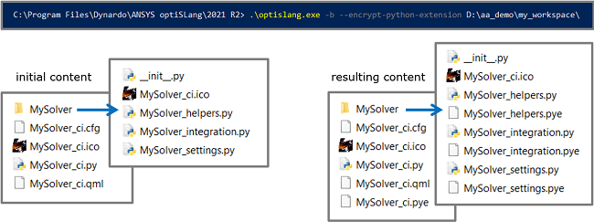

# Generating Encrypted File Sets
optiSLang allows you to run an encryption tool as a batch option. From every Python script, it generates an encrypted `*.pye` file. When you share or release your plugin, you can pick from each Python script either the open or the encrypted version when wrapping up the package.


```
C:\Program Files\Dynardo\ANSYS optiSLang\2022 R1\optislang.exe -b --encrypt-python-extension 
D:\aa_demo\my_workspace
```