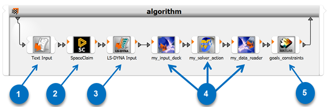
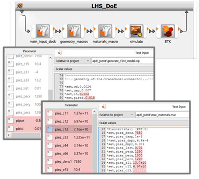
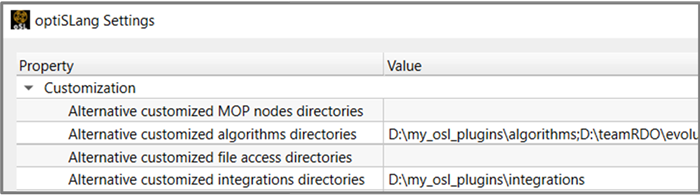
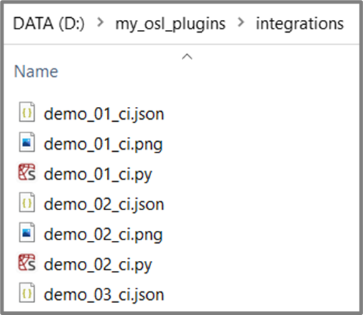
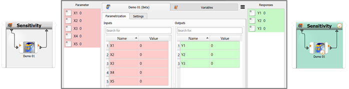
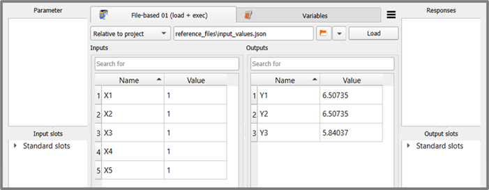
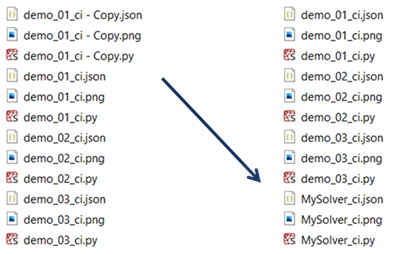
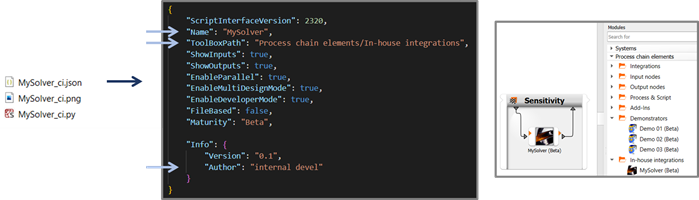

#  Integration plugin demonstrators
optiSLang allows you to create integration nodes tailored for the needs, workflows, and specific use cases in your company, institution, team, or user community. Python programmers can easily create these integration nodes using the optiSLang framework for customized integration (CI) plugins.

| Number | Description                                 |
|--------|---------------------------------------------|
| 1      | Built-in generic text file manipulator node |
| 2      | Built-in service-based integration          |
| 3      | Built-in text-based integration             |
| 4      | Custom Python-based integration plugin nodes |
| 5      | Built-in COM-based integration              |

Integration nodes can be:

- Input integration: optiSLang manipulates parameter values in a text file serving as the input deck, or calls a program that communicates new parameter values and manipulates a solver project.
- Solver integration: optiSLang calls, for example, a user written Python subroutine, any kind of sub-processes, or an external/solver program.
- Output integration: optiSLang loads output/result files, extracts numbers, and forwards a registered selections of design output/response values.
- Any combination of the input, solver, and output functions.

Extending optiSLang's module library by adding integration nodes can help make recurring workflow creation and setup very simple and fast. The following image demonstrates how you can minimize repeated setup work.

|Generic Integration Nodes	| Custom Integration Nodes|
|-----|-----|
|||
|- Marking many parameters - Searching through many lines of text - Working through several files - Registering raw unscaled numbers|- Pick one file and multiple files can be scanned - Drag and drop registration from a ready-made list - Listing contains only relevant pre-selection - You can add in further functions such as scaling, grouping, and relabelling|

While the image above references input integration, you can address similar work minimization potentials using solver calls and output integration. Output data scanning can stretch over multiple files automatically, and involve custom postprocessing steps. User interface elements for determining integration options can be useful for all three basic functions. However, for spawning or controlling solver processes, thoughtfully designed user interface elements can be of huge benefit to a user group. For example, offering a choice of cluster queues in a simple drop-down menu while hiding most of the submission formalities in the Python code. One solver expert can devise intricate command line argument combinations, and the entire user group can use two or three mouse clicks in the tailor-made node edit dialog box.

This section contains a tutorial-like suite of demonstrators as additional help for plugin authors who are providing extensions to optiSLang by coding against the [Python-Based Plugin API](opti_api_python_based_plugins.md).

For more information, see the following topics:
- [Introduction to integration plugin demonstrators](#introduction-to-integration-plugin-demonstrators)
- [Setup](#setup)
- [Minimalistic demos](#minimalistic-demos)
- [File-based demos](#file-based-demos)
- [Special demos](#special-demos)

##  Introduction to integration plugin demonstrators
If you are interested in developing your own Python-based integration node plugin, the best place to start is here. You can browse through the descriptions and codes of a large suite of smaller and larger plugin demonstrators. Hands-on experience is only a few mouse-clicks away, just create the nodes in the scenery and drop them into a parametric system of your choice. They will run out of the box with few prerequisits. Hands-on experimentation is highly recommended as the quickest way to learn and understand what the various functional parts of the code are made for.

The demo suite for integration node plugins is divided into three segments:
1. mini demos
2. file-based demos
3. special demos

A series of minimalistic demos is highlighting one feature per demo. A second short series of demos dealing with file-based integration nodes starts out in the one-feature-per demo style and introduces to crucial features for dealing with solvers needing a project file or data exchange via input and output files in general. Features like QML-based settings GUIs, readiness for read mode, or reset functions need to be combined to provide powerful and convenient integration nodes able to most efficiently control parametric studies in the file-based paradigm. Finally, a third series of demonstrators contains examples which are complex or special, so that they do not fit the illustrative spotlight style of the other demos.

The demo nodes illustrate how to write code against the [Python-Based Plugin API](opti_api_python_based_plugins.md).

## Setup

See the following topics:

- [How to load, set up, and use the demo node](#how-to-load-set-up-and-use-the-demo-node)
- [Additional steps for using file-based demo nodes](#additional-steps-for-using-file-based-demo-nodes)
- [How to derive your own plugin node](#how-to-derive-your-own-plugin-node)

### How to load, set up, and use the demo node
[Download the demonstrator package.](https://ansyshelp.ansys.com/Views/Secured/Doc_Assets/Release/v251/optiSLang_integration_demos.zip)

After unpacking the demonstrator package into a convenient location, you need to put that folder on optiSLang’s scan list of integration plugins. This can be done by adding the folder path under **Customization – Alternative customized integration directories** in global settings. (This corresponds to the key `SC_AlternativeCIDirectories` in the optiSLang configuration file.) An alternative way to control the reach of the plugin scan exists via setting an environment variable `OSL_ALT_CI_SEARCH_DIRS`.

Please note that, as optiSLang scans plugin folders only during startup, it may be necessary to close all running instances and restart the program. After being scanned and loaded, the demonstrator nodes will appear in the modules library, and you will be able to instantiate nodes by drag-and-dropping them into the scenery.

For many demos it is in principle only necessary to register parameters on the input side. Registering outputs is generally optional for integration nodes. Once required inputs are registered, the nodes can be successfully executed.

Using a node for running only one single design is always a weaker test than running multiple parameter variations. In practice, it makes therefore sense to skip the plain parametric system and pick some algorithm system. Either a sensitivity or a robustness system will make a lot of sense for most prospective plugin authors as the default toy during development work because a small sample size can be configured (dynamic or as start designs table) and wait and process times for subsequent algorithm iterations avoided. Another important drag factor which should be switched off: the **auto-save** function in project settings.

Once a demo node has proven to be able to produce successful designs, you're invited to conduct further experiments. Some ideas: unregistering parameters, reregistering them as slots, increasing the degree of parallelism (DoP) or the multi-design group size, packing more nodes into the parametric system, creative wire connections, conditional execution options, computing derived output quantities in a calculator tab of a node edit window, and so on.

### Additional steps for using file-based demo nodes
The additional steps have to do with putting in place a useful work folder structure with contents representing a "solved reference project with output data" to which a file-based node can be linked.

For working with the demo nodes in the second series labeled "file-based", a possible folder structure with a freshly created optiSLang project besides the full reference folder can look like this:

The two files in the reference folder are representing a "solved project" with output data being available. The file `input_values.json` represents a **project file** or **input deck**. The file `result_data.json` represents output of a solved project. If you set up a demo node by linking it with a matching input deck, you will generally be able to see the listings of detected inputs and outputs.

Now you are ready to register parameters and responses (or also slot connections) and start experimenting with the demo nodes.

### How to derive your own plugin node
Once you add the line p`rint('Hello!')` anywhere in the code of a demo node, you become an optiSLang plugin developer. Taking one of the demo nodes and starting with incremental modifications is indeed an easy way to start developing own integration plugins.

If you want to systematically derive your own plugin node from one of the demo nodes, the sequence of steps could begin with copying the files, renaming them, and setting up a dedicated new plugin folder for your work.

As a next step, you should open the JSON configuration file and update all relevant entries. By using a new icon and coining a useful new value for the entry `ToolBoxPath` in the config file, you can make it easier for your colleagues and yourself to spot and pick the new plugin in the modules library.

Now you are all set for starting your own plugin development. You have a functional integration node, and by incremental small step-by-step modifications you can bring it closer and closer to your final application needs. The advantage of this approach is that incremental changes are easier to debug than a plugin written from scratch.

