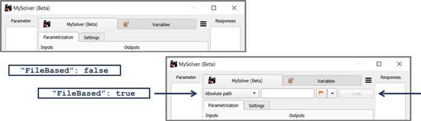
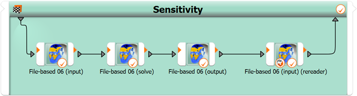

# File-based demos
If you switch the config file entry `FileBased` from "false" to "true", the reference file entry with browser button appears prominently at the top of the node edit dialog.

If you seek to find out in experiments what happens when the `FileBased` flag is modified in the config file or when you switch from normal reference file mode to feeding the file via the `IPath` slot connection, you can use the last one of the mini demos which is tailored for empirically answering these questions.

If you have decided to write an integration node in the file-based paradigm, please take note of the demonstrator suite described here, which highlights a few crucial aspects.

- [File-based 1 (most simple = load and execute)](#file-based-1-most-simple--load-and-execute)
- [File-based 2 (separate nodes)](#file-based-2-separate-nodes)
- [File-based 3 (with settings)](#file-based-3-with-settings)
- [File-based 4 (read mode)](#file-based-4-read-mode)
- [File-based 5 (adapted parameter values)](#file-based-5-adapted-parameter-values)
- [File-based 6 (separate nodes)](#file-based-6-separate-nodes)
- [File-based 7 (QML settings)](#file-based-7-qml-settings)

## File-based 1 (most simple = load and execute)
By leveraging the module `json` of the Python Standard Library, the necessity of writing out explicit file parsing functions is avoided and the amount of additional code can be kept relatively small.

In the `load` function, parametrizable inputs are sought in the project file and potentially useful output data are scanned in result files belonging to the referenced project file. The scope of the scans in `load` is wide: let's see what we can find. In the execute function the scope is limited: only what's registered is relevant. There, the tasks are writing and accessing only registered inputs and outputs: writing for new parameter values, reading for solver output data per demanded design variation.

The paradigm label "file-based" does not mean that we always have to think in the framework of text file parsing; it just means that we are working with a solver which expects a project file for solving design variations and which offers to us a reference project file for inspection. Therefore, when you look at the additional code leveraging the json module, you can think of it in either of two frameworks: the one is the framework of parsing and manipulating text files; the other is viewing the json module as a **solver API**, or simply the API we were given / we have at our disposal to access, interpret, and manipulate the project and data files used by the solver.

## File-based 2 (separate nodes)
For the sake of generalism and a steep (quick) learning curve, all demo subseries have so far only shown general-purpose allrounder nodes covering all three subtasks input deck preparation, solver call, and output collection under one single umbrella. However, if we look at what is in today's standard collection of integration nodes inside the module library of optiSLang, we see that specialized nodes covering only one or two of the three subtasks are relevant in many use cases and workflows.

This demo represents a minimal example of providing three separate nodes for the three elementary tasks of solver integration: putting in place **input** in the design directory (that is, generating a variation file of the input deck containing the new demanded parameter combination), triggering the **solver process**, and collecting **output** (that is, reading and parsing files and collecting data as registered). You can compare it to [File-based 6](#file-based-6-separate-nodes) further below, where the separation into single-purpose nodes will be repeated on a level of slightly increased complexity after having been introduced to the two features **read mode** and **a posteriori adaptation of de facto parameter values**.

## File-based 3 (with settings)
The function `default_settings` is implemented, and the corresponding widget area in the node edit dialog is filled with generic GUI elements. Compare it with a diff tool to [File-based 1](#file-based-1-most-simple--load-and-execute) to highlight the small amount of additional code.

Note: There is a shortcoming in oSL 23.2.0 whereby a numeric setting declared with a float number will accidentally be turned into an integer if there are only zeros behind the decimal point. In order to work around this problem, the default value (that is, factory value defined in the function `default_settings`) should not be a round number.

## File-based 4 (read mode)

optiSLang offers as valuable features the **read mode** checkbox of nodes, the parametric system derivative for **reevaluation**, and the **reevaluation wizard**. In order to support this feature bundle, you have to program two different node behaviors at evaluation time. In normal mode, new parameter values are written or sent while new response data are read. In read mode, both parameter and response values are read from the data content of design directories. For the read mode to be really passive, solver actions generally have to be suppressed, of course. Compare it with a diff tool to [File-based 3 (with settings)](#file-based-3-with-settings) to highlight the small amount of additional code.

## File-based 5 (adapted parameter values)
Think of it as turning the **read mode** for input values also active in normal mode. Why would you do that? What is the purpose?

Sometimes when you demand certain parameter combinations from a solver, the solver adopts only part of it. A subset of the demanded values may not be updated at all, or the update value is shifted by a delta from the demanded value. As examples you can think of an intelligent geometry engine which rejects infeasible paramameter combinations while trying to get as close as possible to the demanded values. A certain dimension may be chosen too large, it deos not fit, and the geometry engine sets the largest possible value which still fits. As a different example we can think of a solver which has a coarser numerical resolution for parameters than the float precision supported by optiSLang and Python which can lead to numbers being rounded on the fly when the solver goes to work.

When you want to draw conclusions from your parametric study, the truth value of your conclusions takes a hit if the truth value of the declared parameter values is damaged. There is no need to accept this damage. When the modified parameter values are known, the damage can be repaired. The quality of the sampling may be reduced by the change in coordinate positions, but the truth of the point coordinates can be restored. A bundle of features in optiSLang allows you and often ensures that a database with true de facto point positions is forwarded from a parametric study, be it sampling or optimization run or else.

If parameter value modification during solver run is in the range of the possible, then as plugin author you should support the truth restoration features by implementing a routine of parameter value re-reading after solver actions. The found values can then simply be attached to result design containers under the attribute label `adapted_parameter_values`.

## File-based 6 (separate nodes)
After having been introduced to the two features **read mode** and **a posteriori adaptation of de facto parameter values**, this demonstration repeats the split into three single-purpose nodes for the elementary subtasks of solver integration. If you compare with the previous demo, you can see that supporting the read mode feature is much less complex in separate single-purpose nodes as it is in the case of an allrounder node.

Naturally, you get less for less work, so, what is missing in functionality in comparison to the previous demo is the double checking after the solver actions. In the case of a separation between input and solve tasks into two nodes, this safety feature cannot be provided to users with out-of-the-box feel. However, it can still be implemented manually via graphical programming with nodes. Users can consciously put a copy of the input setter node at the end of the node chain and switch it into read mode, so that it turns into an input values double-checking node. This is how it can look like:

Is this borderline misuse? What is misuse at all? optiSLang is not a single-purpose special-discipline solver. optiSLang is a framework for creative graphical programming with users from many disciplines and communities who are constantly trying to stretch implemented automation functionalities - whereby justifications are very often quite reasonably given. The image above can be taken as occasion to underline again, that plugin authors do well by broadening, challenging, updating their perspectives constantly. Conscious habits of curious explorative testing, empirical probing, and discussing with others can play important roles. It is a dubious mindset of programmers, that users ought to generally behave. It is a better mindset to welcome and support creative users in newly created code in the most logical, consistent, efficient, elegant, and verbose manner possible while keeping a careful eye on the cleanliness, structural clarity, extendability, and maintainability of the ecosystem.

## File-based 7 (QML settings)
Settings are not only declared in the function `default_settings`. But instead of relying on the simple generic GUI elements, a QML file is added and leveraged for layout and control of better fitting GUI elements. The QML code allows interactivity, interdependency, consistency enforcement, documentation by tooltips. For example, to show interdependence, the spin boxes for setting the number of rounding digits become disabled if rounding is switched off by check box.