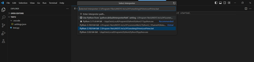

# Getting started

Prime Mesh Python client library 2025 R2 is a modified version of the PyPrimeMesh. You can access the latest Prime Mesh Python client library from  the latest Ansys package.
For more information on getting a licensed copy of Ansys, visit the [Ansys website](https://www.ansys.com/).


## Installation

Install the latest Prime Mesh Python client library from [Ansys Customer Site](https://support.ansys.com/Home/HomePage).


## Run a Python script in batch

To run a PyPrimeMesh Python script directly on the server from a Linux or Windows console:
 
Here is a Windows code example to run a Python script directly from the command line:
 
```shell-session
"%AWP_ROOT<version>%\meshing\Prime\runPrime.bat" my_script.py
```

##  Run a Python script in batch on HPC job scheduler

To run the PyPrimeMesh Python script with SLURM HPC job scheduler while launching the Ansys Prime Server,
use the following argument:

```shell-session
import ansys.meshing.prime as prime
client = prime.launch_prime(scheduler='slurm', n_procs = 4)
model = client.model

```

You can run the PyPrimeMesh Python script with SLURM from the command line as follows:

```shell-session
"%AWP_ROOT<version>%\meshing\Prime\runPrime.bat" my_slurm_script.py
```


## Accessing Prime Mesh Python client library through Visual Studio Code (VS Code)

You can access Prime Mesh Python client through VS code and work on it as follows:
 

1. Install 2024R1 Service Pack 1 package or later.

2. Close all instances of VS Code. 

3. Create a new folder in your machine for your work. 

4. Open VS Code. 

5. Click File > Open Folder and select the newly created folder from the location. 

6. Install Microsoft Python Extension in VS Code if you have not installed it. 

7. In the VS Code, click the Search bar and select Show and Run Commands > Python: Select 
   Interpreter. 

8. In Windows OS, click Enter Interpreter Path and click Find to select runPrime.bat as 
   interpreter from the latest package installed location. 

    

   Example: C:\Program Files\ANSYS Inc\v252\meshing\Prime\runPrime.bat 

   In Linux OS, press Ctrl + Shift + P to view the search bar and type Python: Select 
   Interpreter and select it.
     
    Example:/ANSYS_Inc/v252/meshing/Prime/runPrime.sh

9. In VS Code, create a new folder with name .vscode. 
 
10. Create a settings.json file with the following content: 
    
    In Windows OS,

    ```python
    {
        "python.autoComplete.extraPaths": [
            "C:\\Program Files\\ANSYS Inc\\v252\\meshing\\site"
        ],
        "python.analysis.extraPaths": [
            "C:\\Program Files\\ANSYS Inc\\v252\\meshing\\site"
        ],
    }
    ```

    In Linux OS,

    ```python
    {
        "python.autoComplete.extraPaths": [
            "\ansys_inc\v252\meshing\site"
        ],
        "python.analysis.extraPaths": [
            "\ansys_inc\v252\meshing\site"
        ],
    }
    ```

    **Note:** Environment variables do not work in the above file. Hence, provide full paths. 

11. Run a simple test file to ensure that the installed build works. 

```python
    import ansys.meshing.prime as prime
    with prime.launch_prime() as client:
        model = client.model
    print (prime.__version__)
```