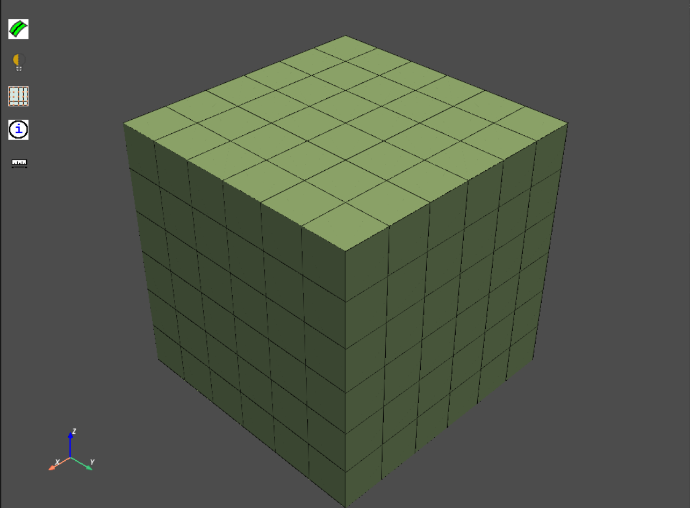
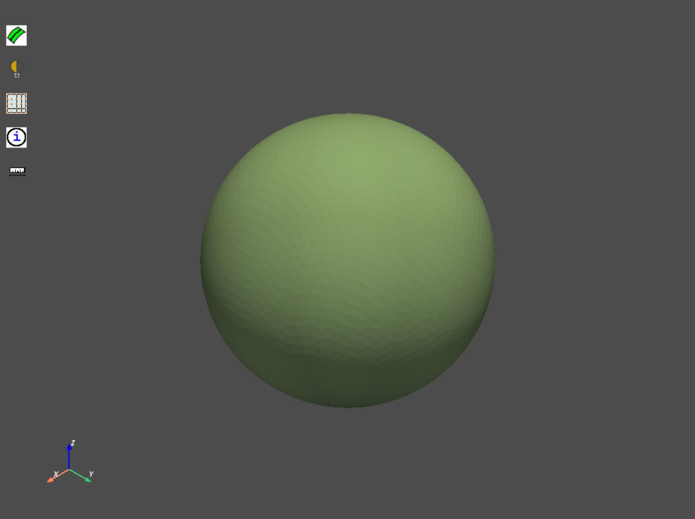
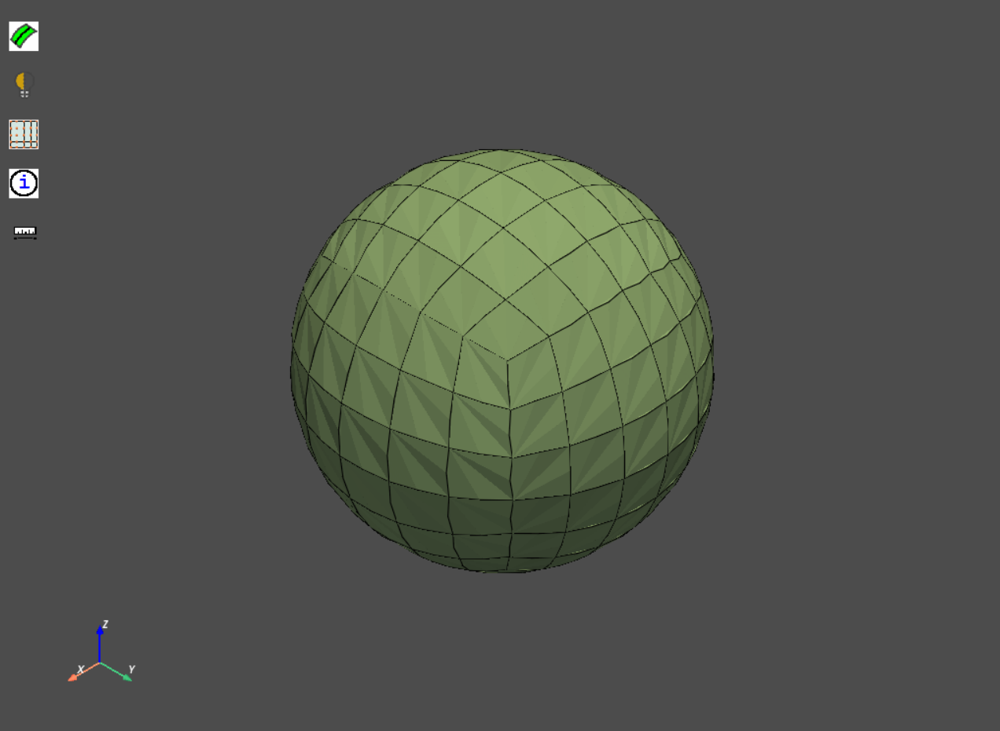

# Match morphing

[`Morpher.match_morph()`](./../api/_autosummary/ansys.meshing.prime.Morpher.match_morph.md#ansys.meshing.prime.Morpher.match_morph) method performs face to face entity matching, providing the ability to match face pairs using match pairs.
The method allows the source face to match with the corresponding target face. [`MatchPair`](./../api/_autosummary/ansys.meshing.prime.MatchPair.md#ansys.meshing.prime.MatchPair) allows you to specify sources and targets for
match morphing.

#### NOTE
Match pairs should have the same type of entities for matching.

[`Morpher.match_morph()`](./../api/_autosummary/ansys.meshing.prime.Morpher.match_morph.md#ansys.meshing.prime.Morpher.match_morph) performs the following:

- Matches the boundaries of the source and targets using the specified boundary condition pairs.
- Matches the source entities to the target entities using the specified match pairs.
- Ensures the adjacent entities to the boundaries of the matched entities are adjusted to provide a quality mesh.

The below example shows how to match morph a cube of hexahedral mesh with quadratic elements to the shape of a sphere:

Get the source and target faces from the source part and target part respectively.

```python
source_part = model.get_part_by_name("hex-mesh")
target_part = model.get_part_by_name("sphere-topo")
source = target_part.get_face_zonelets()
target = source_part.get_topo_faces()
```



**Source part (mesh)**



**Target part (topology)**

Initialize match morph parameters, morpher boundary condition parameters and morpher solver parameters.

```python
match_morph_params = prime.MatchMorphParams(model=model)
bc_params = prime.MorphBCParams(
    model=model,
    morph_region_method=prime.BCsVolumetricModality.ALL,
    morphable_layers=1,
    morph_region_box_extension=0,
)
solver_params = prime.MorphSolveParams(model=model)
```

Set the source and target pairs for matching and specify the entity type of target surfaces.

```python
match_pairs = []
match_pair = prime.MatchPair(
    model=model,
    source_surfaces=source,
    target_surfaces=target,
    target_type=prime.MatchPairTargetType.TOPOFACE,
)
match_pairs = [match_pair]
```

Perform match morphing using the match pairs, match morph parameters, boundary condition parameters and solver parameters.

```python
morpher = prime.Morpher(model=model)
morpher.match_morph(
    part_id=source_part.id,
    match_pairs=match_pairs,
    match_morph_params=match_morph_params,
    bc_params=bc_params,
    solve_params=solver_params,
)
```



**Mesh morphed and displayed (topology deleted)**