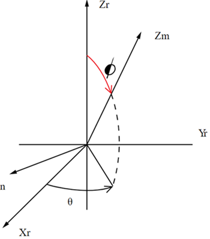

# Joint

ID table: `CS_Joint`

### Constants

For the joint type (`E_JointType`):

`E_2DSlotJoint`, `E_BushingJoint`, `E_CylindricalJoint`, `E_GeneralJoint`,
`E_FixedJoint`, `E_FreeJoint`, `E_PlanarJoint`, `E_PointOnCurveJoint`,
`E_RevoluteJoint`, `E_ScrewJoint`, `E_SingleRotationGeneralJoint`,
`E_SlotJoint`, `E_SphericalJoint`, `E_TranslationalJoint`,
`E_TwoRotationGeneralJoint`, `E_UniversalJoint`,

### Members

`Name`

Name of the joint

`ReferenceCoordinateSystem`

Joint reference coordinate system

Example:

    J1 = CS_Joint.Find(_jid)
    CSR = J1.ReferenceCoordinateSystem

`MovingCoordinateSystem`

Joint moving coordinate system

Example:

    J1 = CS_Joint.Find(_jid)
    CSM = J1. MovingCoordinateSystem

`Type`

Joint type

`IsRevert`

The internal representation of the joint can use flipped reference and mobile
coordinate systems. In that case, all the joint results (for example, forces,
moments, rotation, velocities and acceleration) must be multiplied by -1 to go
from their internal representation to the user representation. As transient
values of joint measures are giving the internal representation, use this
`IsRevert` information to know if results should be negated.

`AccelerationFromVelocitiesDerivatives`

When extracting joint degrees of freedom on joints that return true,
accelerations should be done using the time derivatives of the joint velocity
measure. On joints that return false, joint DOF derivatives should be
extracted using the joint acceleration measure. It is important to check this
flag first. Use of the wrong method to query joint acceleration can result in
failure or incorrect results.

Example:

    if Universal.AccelerationFromVelocitiesDerivatives:
     UniversalAccelerationValues=UniversalVelocityM.FillDerivativesThroughTime()
    else:
     UniversalAcceleration = Universal.GetAcceleration()
     UniversalAccelerationValues=UniversalAcceleration.FillValuesThroughTime()

`Stops`

Returns the list of the stops defined on the joint.

### Member functions

`GetVelocity()`

Returns the joint velocity measure. The size of this measure is the number of
degrees of freedom of the joint. The derivatives of this measure give access
to the joint accelerations.

`GetRotation()`

Returns the joint rotation measure. The type of measure depends on the joint
number of rotational degrees of freedom (`E_1DRotationMeasure`,
`E_3DRotationMeasure`, `E_UniversalAngles`). These rotations components are
relative to the reference coordinate system of the joint.

`GetTranslation()`

Returns the joint translation measure. The length of this measure is the
number of translational degrees of freedom of the joint. The translation
components are expressed in the reference coordinate system of the joint.

`GetForce()`

Returns the joint force measure. The length of this measure is always 6 (3
forces components, 3 torque component). This force measure is the total
force/moment, including constraint forces/moment, external forces/moment
applied to the joint, and joint internal forces/moment, such as elastic moment
in a revolute joint that has a stiffness on the Z rotation axis. The force
measure components are expressed in the global coordinate system. Note that
the sign convention is different from the sign convention used in the Joint
Probes in Mechanical.

`GetAcceleration()`

Returns the joint acceleration measures on the joints that are constraint
equations based. See the `AccelerationFromVelocitiesDerivatives` member to see
when this function should be used.

Example:

    J1 = CS_Joint.Find(_jid)
    jointRotation = J1.GetRotation()
    jointVelocity = J1.GetVelocity()
    jointAcceleration = J1.GetAcceleration()
    jointForce = J1.GetForce()

`SetFrictionVariable(var)`

Replaces the constant value already given to the friction coefficient with the
expression given by `var`.

Example:

    Joint = CS_Joint.Find(_jid)
    Var = CS_Variable()
    u0 = 0.1
    u1 = 0.2
    alpha = 0.5
    Var.SetFunc('u0+u1exp(-alpha*time)',0)
    Var.AddInputMeasure(Joint.GetVelocity())
    Joint.SetFrictionVariable(Var)

The command has no effect if no value for the friction coefficient has been
provided in the UI. For more information, see online help for Joint Friction.

`SetFrictionTolerance(tol)`

Sets the friction tolerance.

Example:

    Joint = CS_Joint.Find(_jid)
    Joint = Joint.SetFrictionTolerance(1e-4)

### Derived classes

On `SphericalJoint, SlotJoint, BushingJoint, FreeJoint, GeneralJoint`.

##### Member function

`AddStop(angle_max, restitution_factor)`

Adds a spherical stop to a joint that has three rotations. A spherical stop
constrains the motion of the X and Y rotational degrees of freedom, to give to
the joint the behavior of a loose revolute joint, with a rotational gap. This
will allow easier handling of over-constrained systems and building higher
fidelity models without having to use contact.

`angle_max`

The angle between the reference coordinate system Zr axis and the moving
coordinate system Zm. Zr is the natural revolute axis.

`restitution_factor`

The restitution factor, similar to other joint stops.

##### On cylindrical joint

`ReplaceByScrew(pitch)`

Creates a relation between the translational and the rotational degrees of
freedom of a cylindrical joint.

**Note**

* The pitch is in the current length unit. Any stop and/or lock defined on the original cylindrical joint is not transferred to the screw joint. Similarly, any constraint equation defined on the original cylindrical joint is not converted and so will prevent a proper solution.
* The ReplaceByScrew command is deprecated. It is replaced by the [Screw Joint]() provided in the Mechanical UI.

##### On bushing joint

`GetBushingAngles()`

Returns the measure of the joint angles. This measure is used to compute the
forces and torques developed in the joint. Note that this is only available
for post-processing operations, as the measure does not exist before the solve
has been performed.

##### Creating new joints

The following joint can be created by commands:

`CS_GeneralJoint(from, to, FreeX, FreeY, FreeZ, FreeRX, FreeRY, FreeRZ)`  
  
Where `from` and `to` are of type `CS_BodyCoordinateSystem` and `Free*` are
integers where 0 is no available motion and nonzero is available motion.
Selecting two free rotations is not allowed.
