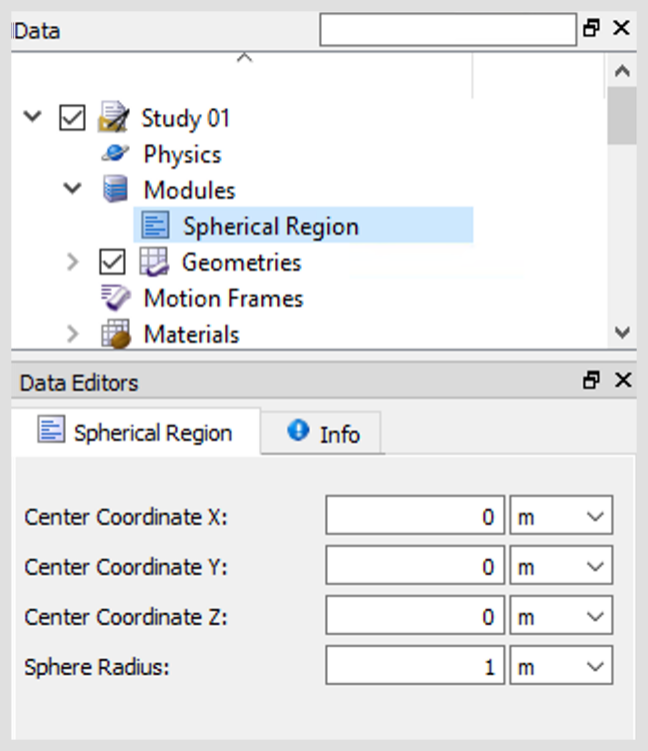
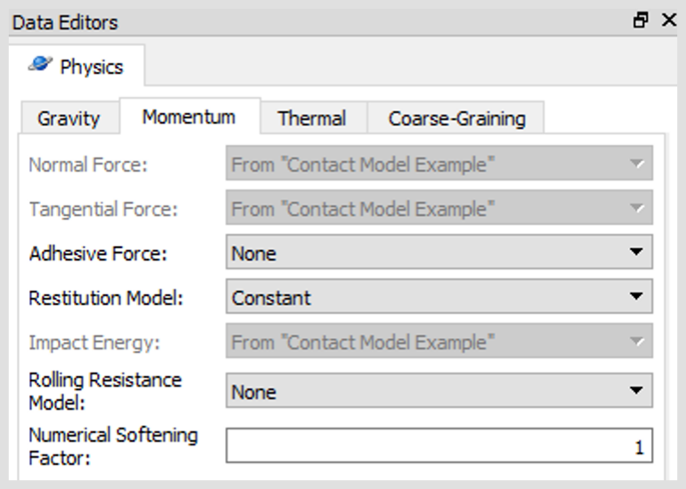
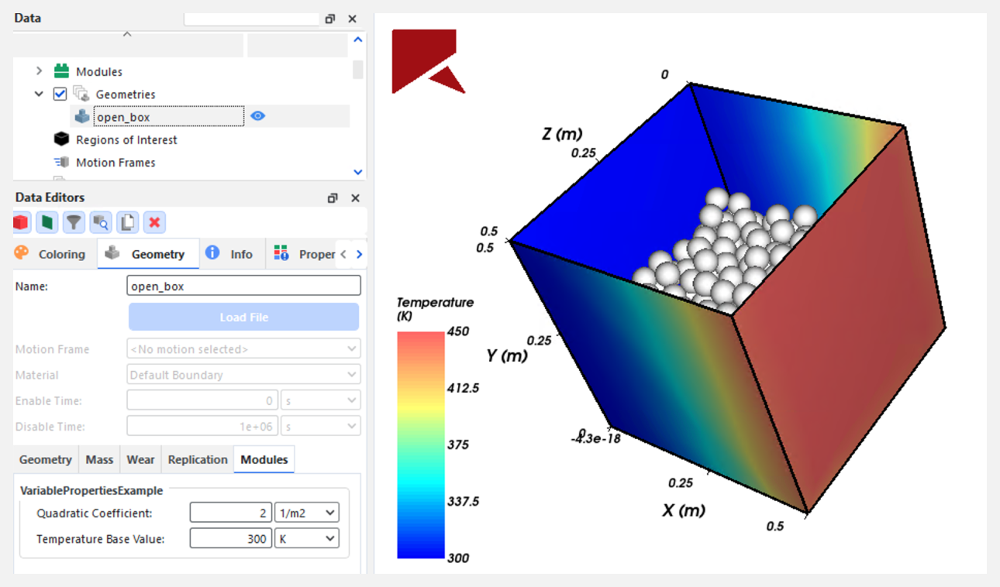

# Usage examples

<p id="usage_examples">


The first section of this chapter provides a step-by-step description of
the implementation of a simple but fully functional module using
the Rocky Solver SDK. The whole process is covered, from the
implementation of all the required source files, until the execution of
the compiled module. The second section describes the code associated to
a custom module that implements a contact model.

## A simple custom module

This section describes the implementation of the code of a simple module
in order to illustrate the use of the Rocky Solver SDK. The
example module is called `Spherical Region`. Its only purpose
is to allow users to define a region of spherical shape inside
the simulation domain, and mark all particles located inside this region
at any given time.

The source files detailed below should be saved in the following
directory structure:

```
spherical_region/
    CMakeLists.txt
    spherical_region.cu
    spherical_region.plugin
    spherical_region.py
    spherical_region.pdf
```

The following sections reproduce and describe the content of each one of
the four source files. For a walk-through example of setting up and
using this simple custom module, refer to *Tutorial 23: Rocky Solver SDK*.

### File spherical_region.plugin

```
[Core]
Name = Spherical Region
Module = spherical_region

[Documentation]
Author = Rocky user
Version = 1.0
Website = user@domain.org
Description = Marks particles inside a spherical region
```

The purpose of this file is to give Rocky general information about the
module. For instance, line 2 defines the name of the module as it must
be displayed in the Rocky UI. Similarly, line 3 gives the name of the
compiled library file of the module in the filesystem. The data in the
block between lines 5 and 9 is displayed within the
**Info** tab associated to the module in the Rocky UI.

### File spherical_region.py

This is a Python file that specifies which are the module parameters
that must be displayed in the Rocky UI*. When a project is set up in
Rocky and the module is enabled, users will be able to enter values for
all parameters defined in this file, through the Rocky UI. Refer to chapter [Module specification(module_specification.md)
for a complete description of how different types of data can be specified by means of this file.

```
1	from pathlib import Path
2
3	from yapsy.IPlugin import IPlugin
4
5	from rocky20.addins.addin_models import container_model, data_model
6	from rocky20.addins.addin_specs import RockyAddinSpecs
7	from rocky20.addins.addin_types import Quantity
8
9	NAME = 'Spherical Region'
10
11
12	@data_model(icon=None, caption=NAME)
13	class SphericalRegionModel:
14	    center_x = Quantity(value=0.0, unit='m', caption='Center Coordinate X')
15	    center_y = Quantity(value=0.0, unit='m', caption='Center Coordinate Y')
16	    center_z = Quantity(value=0.0, unit='m', caption='Center Coordinate Z')
17	    radius = Quantity(value=1.0, unit='m', caption='Sphere Radius')
18
19
20	class SphericalRegionSpecs(RockyAddinSpecs):
21
22	    name = NAME
23
24	    model = SphericalRegionModel
25
26	    @classmethod
27	    def CreateAddin(cls):
28	        return cls.CreateDynamicAddin(Path(__file__).parent, 'spherical_region')
29
30
31	class SphericalRegionModule(IPlugin):
32	    def get_addin_specs(self):
33	        return SphericalRegionSpecs
```

SDK utilities necessary for specifying the module data are imported in
the block between lines 1 and 5. Line 7 defines the name of the module
that Rocky must show in the UI. Beginning at line 10, the auxiliary
class `SphericalRegionModel` is defined, which includes the
specification of the four parameters that the model needs.
They are the three Cartesian coordinates of the sphere center and the sphere radius.

Between lines 18 and 26, the `SphericalRegionSpecs` class is defined, which in this case
includes only the definition of the name of the module and the
specification of the parameters previously included in the `SphericalRegionModel` class.
Additionally, the `CreateAddin` method is defined, which handles the loading of the
compiled library file for the module when the simulation starts.

Finally, at line 29, the definition of the `SphericalRegionModule` class is included. Only
one method is implemented in this class, `get_addin_specs`, which makes available all
the specifications made previously in the file.

### File spherical_region.pdf

This is an optional help file that may include usage instructions and/or
technical details about the implementation of the module. If included,
Rocky will automatically link it to a special icon displayed in the UI
that will allow users of the module to open the file.

### File CMakeLists.txt

This file includes compilation, linkage and install instructions in the
CMake language, needed to build the module. Several commands defined by
the Rocky SDK are used in order to simplify this file. The content of
this file must be practically the same reproduced below for any custom
module implemented using the Rocky Solver SDK. Users only have to replace the
actual name of the compiled library at line 3 and define the `ROCKY_PLUGINS_PATH`
environment variable with the directory in which the compiled modules
must be installed, if this definition has not been made previously.

```
find_package(RockySDK REQUIRED)

set(PKG_NAME "spherical_region")

cuda_add_library(${PKG_NAME} SHARED ${PKG_NAME}.cu)
target_link_libraries(${PKG_NAME} ${RockySDK_LIBRARIES})

set(ASSETS_LIST "${PKG_NAME}.plugin" "${PKG_NAME}.py")

install_rocky_plugin(${PKG_NAME} ASSETS_LIST)
```

If the module includes a help `pdf` file, the line 8 must include this file
in the list of module assets, in the following way:

```
set(ASSETS_LIST "${PKG_NAME}.plugin" "${PKG_NAME}.py" "${PKG_NAME}.pdf")
```

On the other hand, if for some reason the module must be installed in a
directory different from the one pointed to by the environment variable
`ROCKY_PLUGINS_PATH`, the following additional line can be inserted between lines 3 and 5:

```
set(ROCKY_PLUGIN_INSTALLATION_DIR ${CMAKE_CURRENT_SOURCE_DIR}/custom_path/)
```


where `custom_path` is the path of the folder where the module must be installed,
relative to the source directory being processed.

### File spherical_region.cu

This file includes the C++ code that implements the intended
functionality of the module during the execution of a simulation. Every
function defined in this file must be executed at strategic points when
a simulation is running in Rocky. These points are defined via the
simulation [hooks](glossary.md#hook) described in the chapter [Solver Hooks](solver_hooks.md), and must therefore be chosen carefully by
taking into account what operations the module must perform and what
information provided by Rocky will be necessary for their execution. In
order to interact with Rocky, the Solver SDK classes and methods described in
chapter [Class Reference](class_reference_index.md) must be used.

```
1   #define ROCKY_CUDA_API
2
3   #include <rocky20/api/rocky_api.h>
4
5   struct ModuleData
6   {
7       double3 sphere_center;
8       double sphere_radius;
9      int scalar_index;
10  };
11
12  ROCKY_PLUGIN("Spherical Region", "0.0.0")
13
14
15  ROCKY_PLUGIN_CONFIGURE(input_data, data)
16  {
17      ModuleData* module_data = new ModuleData();
18      auto model_properties = input_data.get_model();
19      module_data->sphere_center.x = model_properties.get_double("center_x");
20      module_data->sphere_center.y = model_properties.get_double("center_y");
21      module_data->sphere_center.z = model_properties.get_double("center_z");
22      module_data->sphere_radius = model_properties.get_double("radius");
23      data = static_cast<void*>(module_data);
24  }
25
26  ROCKY_PLUGIN_SETUP(model, data)
27  {
28      ModuleData* module_data = static_cast<ModuleData*>(data);
29      auto scalars = model.get_particle_scalars();
30      module_data->scalar_index = scalars.add("Inside Sphere Flag", "-");
31  }
32
33  ROCKY_PLUGIN_NON_DIMENSIONALIZE(model, data)
34  {
35      ModuleData* module_data = static_cast<ModuleData*>(data);
36      module_data->sphere_center.x /= model.get_length_factor();
37      module_data->sphere_center.y /= model.get_length_factor();
38      module_data->sphere_center.z /= model.get_length_factor();
39      module_data->sphere_radius /= model.get_length_factor();
40  }
41
42  ROCKY_PLUGIN_INITIALIZE_CUDA(model, host_data, device_id, device_data)
43  {
44      auto h_data = static_cast<ModuleData*>(host_data);
45
46      ModuleData* d_data = nullptr;
47      CUDA_MALLOC_TYPE(d_data, 1, ModuleData);
48      CUDA_COPY_H2D(d_data, h_data, 1);
49      device_data = static_cast<void*>(d_data);
50  }
51
52  ROCKY_PLUGIN_POST_MOVE_PARTICLES(device_model, particle, data)
53  {
54      ModuleData* module_data = static_cast<ModuleData*>(data);
55      auto scalars = particle.get_scalars();
56      int scalar_index = module_data->scalar_index;
57      double3 position = particle.get_centroid_position();
58      double distance = get_norm(position - module_data->sphere_center);
59
60      if (distance < module_data->sphere_radius)
61          scalars.set_scalar(scalar_index, 1.0);
62      else
63          scalars.set_scalar(scalar_index, 0.0);
64  }
65  ROCKY_PLUGIN_POST_MOVE_PARTICLES_END()
66
67  ROCKY_PLUGIN_TEAR_DOWN(model, data)
68  {
69      delete static_cast<ModuleData*>(data);
70  }
71
72  ROCKY_PLUGIN_TEAR_DOWN_CUDA(model, device_id, device_data)
73  {
74      auto d_data = static_cast<ModuleData*>(device_data);
75      CUDA_FREE(d_data);
76  }
77
78  ROCKY_PLUGIN_END
```

The directive in line 1 enables the execution of the module in single or
multi-GPU configurations. When this line is included, the module must
define a `ROCKY_PLUGIN_INITIALIZE_CUDA` function in order to allocate
memory in the GPU and to copy the module data to the GPU, as described below.

In line 5, a custom data structure `ModuleData` is defined, that will be used to
store the data needed by the module. In this case, the structure
includes the coordinates of the center point*, the radius of the sphere
and an index to identify the particle [scalar](glossary.md#scalar) that will
be used to identify the particles inside the spherical region.

**In order to simplify the code, the
Rocky Solver SDK provides the struct
double3 for defining 3D points and 3D
vectors. It includes as data members
the three coordinates x, y and z. Special operators for this struct are also
defined, for addition, subtraction, and
multiplication by a scalar. Moreover,
the functions dot, cross, and get_norm
are also provided, for obtaining the
dot product, the cross product, and the
norm, respectively.*

In line 12, the name and the version of the module implemented by the
code in the file are defined. Afterwards, between lines 14 and 23, the
code associated to the hook `ROCKY_PLUGIN_CONFIGURE` is defined. Here, an instance of the
custom `struct` is allocated and the corresponding pointer is named `module_data`. Next,
the values of the four module parameters entered through the Rocky UI
are retrieved from the function argument `input_data`, and assigned to the
corresponding variables in the object pointed by `module_data`. Finally, in line
23, this pointer is converted to a void pointer in order to assign it to
the function argument `data`, which Rocky will store and make available in
subsequent stages of the simulation.

Between lines 26 and 31, the code associated to the hook `ROCKY_PLUGIN_SETUP` is defined.
As in other preprocessing hooks, the arguments provided are an `IRockyModel`
object, named simply `model`, and the void pointer that was defined
previously in `ROCKY_PLUGIN_CONFIGURE`. In order to have access to the data
stored previously, the void pointer must be converted back into a ModuleData
pointer, as it is done in line 28. In this specific case, the only operation performed in
this block is to define a particle scalar variable that will be used to
mark particles inside the spherical region. In line 29, the object that
handles operations with particle scalars is defined. Subsequently, in
line 30 the custom particle scalar is specified. The two arguments in
the `add` function are the label that must associated to the particle
scalar in the Rocky UI, and the unit. After creating the particle
scalar, the `add` function will return an integer index that, in this case,
will be stored in `module_data->scalar_index`. Any subsequent operation involving that specific
particle scalar will require the use of that index.

In order to avoid precision loss because of roundoff errors, Rocky works
internally with dimensionless variables. Therefore, the module has to
nondimensionalize all custom parameters previously defined, in order to
use them in operations involving data coming from the Rocky solver. This
operation is made in the block beginning at line 33, within the
`ROCKY_PLUGIN_NON_DIMENSIONALIZE` hook. In this case all parameters are lengths,
so they are nondimensionalized using the length factor provided by the
corresponding method of the `model` object.

Between lines 42 and 50, the module data is copied to the GPU
[devices](glossary.md#device). This kind of operation is mandatory when a
module is intended for execution in single or multi-GPU configurations.
The hook `ROCKY_PLUGIN_INITIALIZE_CUDA` provides two generic pointers as
arguments: `host_data` and `device_data`. The
first one points to the object that currently stores the data defined in
the previous pre-processing functions. The objective of this function is
to allocate a memory block of the right size in the GPU devices, copy
the module data pointed by `host_data` to that memory block, and finally assign
to `device_data` the pointer that points to the beginning of that block. This is
done in lines 47 (memory allocation), 48 (data copy) and 49 (conversion
to a generic pointer and assigment `device_data`).

The only operation performed by the module during the time iterative
process is the one implemented in the block beginning at line 52. This
operation is associated to the `ROCKY_PLUGIN_POST_MOVE_PARTICLES`
hook, which is executed inside a loop over the active particles in the
simulation, after the position and
velocities of the particles were updated in Rocky. In line 58, the
distance between the centroid of the current particle and the center of
the spherical region is calculated. If that distance is less than the
region radius, the particle is considered to be inside the region. The
scalar value associated to the particle is set be equal to 1 in that
case, and equal to 0 otherwise. The block is closed by the
`ROCKY_PLUGIN_POST_MOVE_PARTICLES_END` function
call, during which Rocky takes care of some additional operations needed
to execute the module code correctly. Note that any of the functions associated to a
hook executed during the time iterative loop must be closed by a similar function.

Finally, the `ROCKY_PLUGIN_TEAR_DOWN` hook frees the memory allocated for the local data
structure in the CPU memory area. The equivalent operation on the GPU
memory area is made in the `ROCKY_PLUGIN_TEAR_DOWN_CUDA` hook.


### <p id="building-procedures">Building procedures</p>

This section shows a way to compile the module `spherical_region` described in the
previous section.

##### Building in Centos 7

In the `conda` command prompt that was activated in section
[Build Tools - Linux](getting_started.md#build-tools-linux), navigate to the `spherical_region`
directory and execute the following commands:

```
cmake source/plugins/spherical_region
make install
```

On successful execution of the above commands, the compiled content of
the `spherical_region` module is available in the folder pointed by the `ROCKY_PLUGINS_PATH`
environment variable:

```
24.2.0/
    spherical_region/
        libx_spherical_region.so
        spherical_region.plugin
        spherical_region.py
```

##### Building in Windows 10

Open the `e x64 Native Tools Command Prompt for VS 2022`, navigate to the `spherical_region`
directory and execute the following commands:

```
cmake -DCMAKE_GENERATOR_PLATFORM=x64 source/plugins/spherical_region
cmake --build . --config Release
cmake -P cmake_install.cmake
```

On successful execution of the above commands, the compiled content of
the `spherical_region` module is available in the folder pointed to by the `ROCKY_PLUGINS_PATH`
environment variable:

```
24.2.0/
    spherical_region/
        spherical_region.dll
        spherical_region.lib
        spherical_region.plugin
        spherical_region.py
```

### Running the module in Rocky

After having completed successfully all the steps described in previous
sections, the new module will be ready to be executed in a Rocky
simulation. Restart the Rocky application in order for it to acknowledge
the recently created module.

When selecting the
**Modules** item in
the **Data** panel,
the name of the new module must appear in the list of modules recognized
by Rocky, displayed in the **Data Editors** panel. The
activation of the module in a simulation requires that the corresponding
checkbox is turned on, as shown in Figure
5.1.


*Figure 5.1: The new module displayed in the Data Editors panel.*

After the module is activated, a new item with the module name will be
added under the **Modules** item in the **Data** panel,
as shown in Figure 5.2. The selection of this item gives access to
the general custom parameters defined in the model section of the
specifications file `spherical_region.py`. The default values displayed are those defined
in that file. Users of the module can alter those values at their
convenience. On the other hand, if the
**Info** tab is selected, the reference data included in the `spherical_region.plugin` is displayed in the
panel.



*Figure 5.2: The custom parameters for the module displayed in the Data Editors panel.*


*Figure 5.3: The module's Info tab on the Data Editors panel*

In order to test the module, any new project can be set up in Rocky and
then the **Spherical Region** module must be enabled, defining the proper
values for the module parameters. After
processing the simulation, the **Inside Sphere** scalar can be
selected in the list of particle properties in the
**Properties** tab, and visualized in a 3D view window at any output time. All particles
inside the specified spherical region will have an scalar value equal to
1, as depicted in the example of Figure 5.4, while particles outside it will have
associated a zero value.


*Figure 5.4: Example of a simulation processed using the new module.*

## A module implementing a custom

As an example of the implementation of a custom model using the Rocky
Solver SDK, this section describes the code associated to a
custom module that implements a contact model, including the calculation
of both components of the contact force, as well as the calculation of
the impact energy.

A contact model may include in the most general case the calculation of
both components of the contact force, and, if necessary, the calculation
of the impact energy during a collision. Usually the tangential
component of the contact force depends on the normal component, and the
impact energy on both of them. Because of that, they are calculated in a
fixed sequence, as shown schematically in Figure 5.4.


*Figure 5.5: Contact model pipeline in Rocky.*

The Rocky Solver SDK gives some flexibility regarding the
implementation of custom contact force models. For instance, users can
choose to implement only the normal contact force, combining it with a
built-in tangential force model in Rocky. Or, conversely, users may
implement only the tangential contact force, using as input the normal
contact force calculated by a built-in model in Rocky. In these cases,
users only need to implement whichever force component they want to
customize in their module, then in runtime, Rocky will calculate the
other component with the respective model selected in the Rocky UI.

On the other hand, users may implement the calculation of both contact
force components within a custom module, including the calculation of
the impact energy as well. Impact energy is used in Rocky as the main
input parameter for the built-in instantaneous breakage models;
therefore, users will need to implement a custom impact energy
calculation only if they intend to use a custom contact force model
along with such breakage models. Even in that case, users may choose not
to implement the calculation of the impact energy. Rocky will use in
such situation a standard calculation based on the impact work, as
defined in equation 4.10 of the DEM Technical Manual. Also, when a module implements only either a normal or a tangential force model, Rocky uses standard calculations for the other one.

The remainder of this chapter will describe the implementation of a
custom module including the calculation of both components of the
contact force and the calculation of the impact energy as well. The
normal and tangential force models included in the module are simplified
versions of two built-in models in Rocky, the Hysteretic Linear Spring
and the Linear Spring Coulomb Limit, respectively. Moreover, the impact
energy calculation included in the module is the one used in Rocky when
the Hysteretic Linear Spring model is selected as normal contact force.

### Module specification file

The following listing reproduces the Python file that includes the
specifications for the custom module, which is named simply as `Contact Model Example`.
```
1   import sys
2   from pathlib import Path
3   from yapsy.IPlugin import IPlugin
4   from rocky20.addins.addin_models import container_model, data_model
5   from rocky20.addins.addin_specs import RockyAddinSpecs
6   from rocky20.addins.addin_types import Quantity
7
8   NAME = 'Contact Model Example'
9
10
11  @data_model(icon=None, caption=NAME)
12  class CustomGeneral:
13      pass
14
15
16  @container_model()
17  class CustomModel:
18      pass
19
20
21  @container_model()
22  class CustomMaterialInteraction:
23      tangential_stiffness_ratio = Quantity(value=1.0, unit='-', caption='Tangential To Normal Stiffness Ratio')
24      sliding_velocity_threshold = Quantity(value=0.001, unit='m/s', caption='Sliding Velocity Threshold')
25
26
27   class ContactModelExampleSpecs(RockyAddinSpecs):
28
29      name = NAME
30
31      model = CustomGeneral
32
33      normal_force_model = CustomModel
34
35      tangential_force_model = CustomModel
36
37      impact_energy_model = CustomModel
38
39      material_interaction_properties = CustomMaterialInteraction
40
41      @classmethod
42      def CreateAddin(cls):
43          return cls.CreateDynamicAddin(Path(__file__).parent, 'contact_model_example')
44
45
46  class ContactModelExamplePlugin(IPlugin):
47      def get_addin_specs(self):
48          return ContactModelExampleSpec
```

The only parameters added by the module are two material interaction
properties defined between lines 21 and 24. Both of them are used in the
tangential contact force calculation. The first one is the ratio of the
tangential stiffness to the normal stiffness, while the second one is
the value of the tangential relative velocity that marks the onset of
the sliding between the colliding entities.

Between lines 33 and 37, the module specifies that it will implement a
custom normal force model, a custom tangential force model and a custom
impact energy calculation. In runtime, Rocky will read these
specifications and will override those model categories, using instead
the custom models implemented by the module, as explained in section [Specification of custom models](module_specification.md#specification-of-custom-models).

### Implementation of the contact model

This section describes the different parts that make up the `custom_model_example.cu` file that
includes the C++ code that implements the custom models.

```
1	#define ROCKY_CUDA_API
2
3	#include <rocky20/api/rocky_api.h>
4
5	struct ModuleMaterialInteraction
6	{
7	    double tangential_stiffness_ratio;
8	    double sliding_velocity_threshold;
9	};
10
11	struct ModuleData
12	{
13	    int ppi_normal, pti_normal;
14	    int ppi_tangential_x, pti_tangential_x;
15	    int ppi_tangential_y, pti_tangential_y;
16	    int ppi_tangential_z, pti_tangential_z;
17
18	    ModuleMaterialInteraction* material_interactions;
19	};
```

The initial part of the file reproduced above includes the definition of
the preprocessor name `ROCKY_CUDA_API` that enables the compilation of the module in
CUDA and, in turn, enables the possibility of the module being used in a
simulation processed on GPU. Subsequently, between lines 5 and 9, it is
defined a local `struct` that will hold the values entered through the Rocky
UI for the two material interaction parameters that the module uses.
Then, between lines 11 and 19, another local `struct` is defined, that will
store the indices attributed in runtime to the contact scalars that the
module will create.  Additionally,
that `struct` includes an array to store the values of the custom properties
associated to all material interactions in the project.

*Note: Here ppi stands for particle-particle index, while pti stands for particle-triangle index.*

```
21	inline ROCKY_FUNCTIONS void create_contact_scalars(
22	    IRockyModel& model, const char* name, const char* unit,
23	    int& pp_scalar_index, int& pt_scalar_index)
24	{
25	    auto pp_scalars = model.get_particle_contact_scalars();
26	    auto pt_scalars = model.get_triangle_contact_scalars();
27
28	    pp_scalar_index = pp_scalars.add(name, unit, false);
29	    pt_scalar_index = pt_scalars.add(name, unit, false);
30	}
31
32	inline ROCKY_FUNCTIONS double get_contact_scalar_value(
33	    IRockyContact& contact, int pp_scalar_index, int pt_scalar_index)
34	{
35	    return contact.is_particle_particle_contact()
36	        ? contact.get_particle_contact_scalars().get_scalar(pp_scalar_index)
37	        : contact.get_triangle_contact_scalars().get_scalar(pt_scalar_index);
38	}
39
40	inline ROCKY_FUNCTIONS void set_contact_scalar_value(
41	    IRockyContact& contact, int pp_scalar_index, int pt_scalar_index, double value)
42	{
43	    contact.is_particle_particle_contact()
44	        ? contact.get_particle_contact_scalars().set_scalar(pp_scalar_index, value)
45	        : contact.get_triangle_contact_scalars().set_scalar(pt_scalar_index, value);
46	}
```

The code block above implements three utility functions that simplify
the handling of contact scalars. They allow to treat in a unified way,
with a single function, both types of contact scalars, namely
particle-to-particle and particle-to-triangle contact scalars.

```
48	ROCKY_PLUGIN("Contact Model Example", "1.0.0")
49
50	ROCKY_PLUGIN_CONFIGURE(input_data, _data)
51	{
52	    auto data = new ModuleData();
53
54	    int n_material_interactions = input_data.get_number_material_interactions();
55	    data->material_interactions = new ModuleMaterialInteraction[n_material_interactions];
56
57	    for (int i = 0; i < n_material_interactions; ++i)
58	    {
59	        auto& m_i = data->material_interactions[i];
60	        auto input_mi = input_data.get_material_interaction(i);
61
62	        m_i.tangential_stiffness_ratio = input_mi.get_double("tangential_stiffness_ratio");
63	        m_i.sliding_velocity_threshold = input_mi.get_double("sliding_velocity_threshold");
64	    }
65
66	    _data = static_cast<void*>(data);
67	}
68
69	ROCKY_PLUGIN_SETUP(model, _data)
70	{
71	    auto data = static_cast<ModuleData *>(_data);
72
73	    create_contact_scalars(model, "Previous Normal Force", "N", data->ppi_normal, data->pti_normal);
74	    create_contact_scalars(model, "Previous Tangential Force X", "N",
75	                                                    data->ppi_tangential_x, data->pti_tangential_x);
76	    create_contact_scalars(model, "Previous Tangential Force Y", "N",
77	                                                    data->ppi_tangential_y, data->pti_tangential_y);
78	    create_contact_scalars(model, "Previous Tangential Force Z", "N",
79	                                                    data->ppi_tangential_z, data->pti_tangential_z);
80	}
81
82	ROCKY_PLUGIN_INITIALIZE_CUDA(model, host_data, device_id, _device_data)
83	{
84	    auto h_data = static_cast<ModuleData*>(host_data);
85	    auto d_data = *h_data;
86
87	    int size = model.get_number_of_material_interactions();
88	    ModuleMaterialInteraction* d_material_interactions = nullptr;
89	    CUDA_MALLOC_TYPE(d_material_interactions, size, ModuleMaterialInteraction);
90	    CUDA_COPY_H2D(d_material_interactions, h_data->material_interactions, size);
91	    d_data.material_interactions = d_material_interactions;
92
93	    ModuleData* device_data = nullptr;
94	    CUDA_MALLOC_TYPE(device_data, 1, ModuleData);
95	    CUDA_COPY_H2D(device_data, &d_data, 1);
96	    _device_data = static_cast<void*>(device_data);
97	}
98
99	ROCKY_PLUGIN_TEAR_DOWN_CUDA(model, device_id, device_data)
100	{
101	    auto d_data = static_cast<ModuleData*>(device_data);
102	    ModuleData data_ptr;
103	    CUDA_COPY_D2H(&data_ptr, d_data, 1);
104	    CUDA_FREE(data_ptr.material_interactions);
105	    CUDA_FREE(d_data);
106	}
107
108	ROCKY_PLUGIN_TEAR_DOWN(model, _data)
109	{
110	    auto data = static_cast<ModuleData*>(_data);
111	    delete[] data->material_interactions;
112	    delete data;
113	}
```

The block above includes the associated code to the initialization and
termination hooks. As most of these operations were covered in chapter
[Rocky module examples](usage_examples.md), they will be described here very briefly.

In the `ROCKY_PLUGIN_CONFIGURE` hook, the values for the two module parameters per material
interaction, entered through the Rocky UI, are stored in the array
within the module local `struct` defined previously. Subsequently, in the `ROCKY_PLUGIN_SETUP`
hook, contact scalars are created for storing the values of the contact
forces calculated in the module. This storage is necessary because both
the normal and tangential force models being implemented depend upon the
history; therefore, in order to calculate the force values at a given
timestep, the values from the previous timestep are required to be
available.

In the `ROCKY_PLUGIN_INITIALIZE_CUDA` hook, the local module data is copied to GPU devices after
being allocated the required memory block there. On the other hand, that
memory block is freed in the `ROCKY_PLUGIN_TEAR_DOWN_CUDA` hook. An equivalent operation for the
memory allocated in CPU is made in the `ROCKY_PLUGIN_TEAR_DOWN` hook.

```
115	ROCKY_PLUGIN_NORMAL_FORCE_ON_CONTACTS(contact, intermediate_data, output_data, _data)
116	{
117	    auto data = static_cast<ModuleData *>(_data);
118	    const auto m_i = contact.get_material_interaction();
119
120	    const double prev_normal_force = get_contact_scalar_value(contact, data->ppi_normal, data->pti_normal);
121
122	    const double restitution_coeff = m_i.get_restitution_coefficient();
123	    const double loading_stiffness = contact.get_equivalent_stiffness() * m_i.get_stiffness_multiplier();
124	    const double unloading_stiffness = loading_stiffness / (restitution_coeff * restitution_coeff);
125
126	    const double overlap = contact.get_overlap();
127	    const double delta_overlap = overlap - contact.get_previous_overlap();
128
129	    const double elastic_force = overlap * loading_stiffness;
130	    const double plastic_force = prev_normal_force + delta_overlap * unloading_stiffness;
131	    const double new_normal_force = max(min(plastic_force, elastic_force), 0.0);
132
133	    output_data.set_normal_force(new_normal_force);
134
135	    set_contact_scalar_value(contact, data->ppi_normal, data->pti_normal, new_normal_force);
136	}
137	ROCKY_PLUGIN_NORMAL_FORCE_ON_CONTACTS_END()
```

The block of code above implements a simplified but functional form of
the Hysteretic Linear Spring normal contact force. As this is a
history-dependent model, the needed previous value of the normal contact
force is retrieved from the corresponding contact scalar in line 120.
Subsequently, the stiffnesses corresponding to the loading and unloading
portions of the collision cycle are calculated using the equations in
section 2.1.1.1 of the DEM Technical Manual. Both stiffness values are
multiplied by the **Contact Stiffness
Multiplier**, which
is an advanced material interaction parameter that might be used to
prevent large overlaps in certain specific situations. Also,  The stiffness value returned by the
get_equivalent_stiffness function is
already multiplied by the **Numerical Softening Factor**, which is commonly used
for increasing the simulation timestep.
For more details about this factor, please
refer to section 5.3.4 of the DEM Technical Manual.

Using the current overlap value and its variation during the timestep,
two possible values of the normal contact force are calculated, one
located on a loading path and other located on an unloading path. The
new normal contact force will be the minimum between those two values,
as long it is positive. If that minimum value is negative, the new
normal contact force will be set to zero. In line 133 that new value is
passed as argument to the `set_normal_force` method of the `output_data`
object. This operation is mandatory, because only in that way Rocky will
become aware of the new
force value calculated by the module. From that point on, Rocky will use
internally that force for solving the particles' motion equations and
perform all the other operations that may need it.

As a final operation of the normal force calculation, the new normal
contact force value is set also to the corresponding contact scalar in
line 135, in order to preserve it and make it available during the next
time iteration.

```
139	ROCKY_PLUGIN_TANGENTIAL_FORCE_ON_CONTACTS(contact, intermediate_data, output_data, _data)
140	{
141	    auto data = static_cast<ModuleData*>(_data);
142	    const auto m_i = contact.get_material_interaction();
143	    const auto& module_m_i = data->material_interactions[contact.get_material_interaction_index()];
144
145	    const double3 prev_tangential_force = contact.just_started_frictional() ?
146	        make_double3(0.0, 0.0, 0.0) :
147	        make_double3(get_contact_scalar_value(contact, data->ppi_tangential_x, data->pti_tangential_x),
148	                     get_contact_scalar_value(contact, data->ppi_tangential_y, data->pti_tangential_y),
149	                     get_contact_scalar_value(contact, data->ppi_tangential_z, data->pti_tangential_z));
150
151	    const double3 tangential_relative_velocity = output_data.get_tangential_relative_velocity();
152	    const double3 tangential_displacement = tangential_relative_velocity * contact.get_timestep();
153
154	    const double normal_stiffness = contact.get_equivalent_stiffness() * m_i.get_stiffness_multiplier();
155	    const double tangential_stiffness = normal_stiffness * module_m_i.tangential_stiffness_ratio;
156
157	    double3 new_tangential_force = prev_tangential_force - tangential_stiffness * tangential_displacement;
158	    const double new_tangential_force_norm = get_norm(new_tangential_force);
159	    const double coulomb_limit = intermediate_data.get_friction_coefficient() * output_data.get_normal_force();
160
161	    if (new_tangential_force_norm > coulomb_limit)
162	    {
163	        new_tangential_force *= coulomb_limit / (new_tangential_force_norm + SMALL_VALUE);
164	        bool sliding = get_norm(tangential_relative_velocity) > module_m_i.sliding_velocity_threshold;
165	        output_data.set_sliding(sliding);
166	    }
167	    else
168	    {
169	        output_data.set_sliding(false);
170	    }
171
172	    output_data.set_tangential_force(new_tangential_force);
173	    set_contact_scalar_value(contact, data->ppi_tangential_x, data->pti_tangential_x, new_tangential_force.x);
174	    set_contact_scalar_value(contact, data->ppi_tangential_y, data->pti_tangential_y, new_tangential_force.y);
175	    set_contact_scalar_value(contact, data->ppi_tangential_z, data->pti_tangential_z, new_tangential_force.z);
176	}
177	ROCKY_PLUGIN_TANGENTIAL_FORCE_ON_CONTACTS_END()
```


The implementation of the Linear Spring Coulomb Limit tangential force
model is made in the code reproduced above. The model needs material
interaction properties defined by both Rocky and the module itself.
Because of that, two material interaction objects are defined in lines
142 and 143 in order to retrieve those property values. Next, in line
145, the previous tangential force vector is defined as zero if the
current timestep is the first one in the collision, or, otherwise, its
components are retrieved from custom contact scalars. Subsequently, the
tangential component of the relative velocity at the contact point,
pre-calculated by Rocky, is retrieved, and with it the tangential
relative displacement during the timestep is calculated.

*Note: This is a simplified version of the model implemented in Rocky.
Some additional operations are ignored for the sake of simplicity.
For instance, Rocky introduces correction terms to take into account
the change on the normal direction and a possible viscous dissipation,
that this implementation does not address*

In line 154, the normal stiffness value is retrieved, and with it and
the tangential stiffness ratio, the tangential stiffness is determined
in line 155. Then, in line 157, the possible new value of the tangential
force vector is calculated using equation 2.18 of the DEM Technical
Manual. As in this model the magnitude of the tangential contact force
cannot exceed the so-called Coulomb limit, calculated in line 159, the
tangential force is rescaled if that condition is not satisfied, in line
163. Additionally, the sliding condition is verified in line 164,
comparing the magnitude of the relative tangential velocity with the
sliding threshold value defined as a material interaction property. The
boolean value indicating if the sliding condition is true or false is
passed to Rocky using the `set_sliding` method of the `output_data` object, in line 165. In
case that the Coulomb limit is not exceeded, the sliding condition is
always false, and that value is set in line 169.

The tangential contact force just calculated is passed also to Rocky by
means of the `set_tangential_force` method of the `output_data` object, in line 172. The specification
of both the sliding state and the tangential force vector is mandatory
for a module implementing a tangential contact force model. As a final
step, the components of the tangential force are stored in the contact
scalars previously created, in order to make available those values in
the next time iteration.

```
179	ROCKY_PLUGIN_IMPACT_ENERGY_ON_CONTACTS(contact, intermediate_data, output_data, _data)
180	{
181	    const double home_stiffness = contact.get_home_stiffness();
182	    const double near_stiffness = contact.get_near_stiffness();
183	    const double stiffness_multiplier = contact.get_material_interaction().get_stiffness_multiplier();
184
185	    const double normal_force = output_data.get_normal_force();
186	    const double3 tangential_force = output_data.get_tangential_force();
187	    const double squared_force = normal_force * normal_force + dot(tangential_force);
188
189	    output_data.set_home_impact_energy(0.5 * squared_force / (stiffness_multiplier * home_stiffness));
190	    output_data.set_near_impact_energy(0.5 * squared_force / (stiffness_multiplier * near_stiffness));
191	}
192	ROCKY_PLUGIN_IMPACT_ENERGY_ON_CONTACTS_END()
```

The module example presented in this chapter includes also the code for
the calculation of the impact energy. This code reproduces the one
implemented in Rocky and used when the Hysteretic Linear Spring model is
active in a simulation. It is based on equation 4.11 of the DEM
Technical Manual. Both the normal and the tangential contact force
values calculated in previous steps, retrieved in lines 185 and 186, are
needed in that expression. It actually represents the impact energy
accumulated in the contact since the collision started. However, Rocky
expects as output of the calculation the portions of that impact energy
that are attributed to each colliding entity. Because of that, in lines
189 and 190, two values of impact energy are set using the
`set_home_impact_energy` and `set_near_impact_energy`
methods of the `output_data` object, respectively.

After the module is built following the steps given in section 5.1.6,
the module will be available to be used in Rocky. When the `Contact Model Example`
is enabled in a Rocky project, the models
of normal and tangential forces, besides the impact energy model
implemented on it will override built-in models in those categories.
This will be indicated within the **Physics | Momentum** tab, which
will appear as shown in Figure 5.5.



*Figure 5.6: The normal force, tangential force and impact energy categories overriden by the models implemented in Contact Model Example.*

## <p id="a-module-implementing-variable-properties">A module implementing variable properties </p>


As an example of the implementation of modules that override built-in
constant properties in Rocky, this section describes a module that
converts the particle's thermal conductivity into a function of the
temperature. Additionally, the module makes possible also to define the
temperature of boundaries as a function of the position. The functional
relation for the thermal conductivity that the module implements is the
following:
$$
	K_p = K_O ( 1 + C_L T_p )
$$
where \f(K_O\f) and \f(C_L\f) are two module parameters and \f(T_p\f) is the particle temperature.
On the other hand, the modules allows to define the temperature of boundary triangles as a
quadratic function of the \f(x\f)-coordinate:
$$
	T_t = T_O ( 1 + C_Q \,x_t^2 )
$$
where \f(T_O\f) and \f(C_Q\f) are two module parameters and \f(x_t\f) is the \f(x\f)-coordinate of the triangle's centroid.

### Module specification file

The following listing reproduces the Python file with the specifications
of the module, which is named as `Variable Properties Example`.

```
1	    from pathlib import Path
2	    from rocky20.addins.addin_models import container_model, data_model
3	    from rocky20.addins.addin_specs import RockyAddinSpecs
4	    from rocky20.addins.addin_types import Quantity, Temperature, ThermalConductivity
5	    from yapsy.IPlugin import IPlugin
6
7
8	    NAME = 'Variable Properties Example'
9
10
11	    @data_model(icon=None, caption=NAME)
12	    class GeneralProperties:    
13	        pass
14
15
16	    @container_model()
17	    class MaterialProperties:          
18	        k_base_value = Quantity(value=1.0, unit='W/m.K', caption='Thermal Conductivity Base Value')
19	        k_linear_coefficient = Quantity(value=0.0, unit='1/K', caption='Linear Coefficient')
20	     
21	       
22	    @container_model()
23	    class GeometryProperties:          
24	        t_base_value = Quantity(value=300.0, unit='K', caption='Temperature Base Value')
25	        t_quadratic_coefficient = Quantity(value=0.0, unit='1/m2', caption='Quadratic Coefficient')
26	     
27	       
28	    @container_model()
29	    class ParticleMaterialVariableProperties:
30	        thermal_conductivity = ThermalConductivity
31	       
32	       
33	    @container_model()
34	    class TriangleVariableProperties:
35	        temperature = Temperature
36
37
38	    class ModuleSpecifications(RockyAddinSpecs):
39
40	        name = NAME
41
42	        model = GeneralProperties
43	       
44	        particle_material_properties = ParticleMaterialVariableProperties
45	       
46	        geometry_triangle_properties = TriangleVariableProperties
47	       
48	        material_properties = MaterialProperties
49	       
50	        geometry_properties = GeometryProperties
51	           
52	       
53	        @classmethod
54	        def CreateAddin(cls):
55	            return cls.CreateDynamicAddin(Path(__file__).parent, 'variable_properties_example')
56
57
58	    class VariablePropertiesExampleModule(IPlugin):
59	        def get_addin_specs(self):
60	            return ModuleSpecifications
```

Lines 18 and 19 of this file define the two parameters used in
thermal conductivity equation as material properties.
This means that different values can be entered
through the Rocky UI for each one of the materials defined in a project.
Similarly, lines 24 and 25 define the two parameters included in the boundary temperature
equation as geometry properties. Therefore, different values of these parameters
could be specified for each geometry in a project.

*Note: However, since the module will define the thermal conductivity as a variable property for
particles exclusively, only parameter values from materials associated to particles will be
effectively used by the module.*

The class defined in lines 28 to 30 specifies which material properties
associated to particles will be overridden by the module. In this case,
the thermal conductivity is the only property specified. That property
is associated to an particle scalar variable defined internally in Rocky
(`ThermalConductivity`) which the solver will use to store the values calculated by the
module. A similar specification is made between lines 30 and 35 for the
temperature of the boundary triangles. For more details about the
specification of variable properties, please refer to section
2.9.

Since the module will define the thermal conductivity as a variable
property for particles exclusively, only parameter values from materials associated to particles
will be effectively used by the module.

### Module implementation

This section describes the C++ code of the main parts of the `variable_properties_example.cu` file.
The code from initialization and termination hooks related to CUDA operations is omitted,
since it was described in previous examples. This code implements the calculation of the
property values per particle and per boundary triangle that the module must deliver to the Rocky
solver. In turn, the Rocky solver will use these values internally in
the thermal model calculations.

```
1	#define ROCKY_CUDA_API
2
3	#include <rocky20/api/rocky_api.h>
4
5
6	struct MaterialData
7	{
8	    double k_base_value;
9	    double k_linear_coefficient;
10	};
11
12	struct GeometryData
13	{
14	    double t_base_value;
15	    double t_quadratic_coefficient;
16	};
17
18	struct ModuleData
19	{
20	    MaterialData* m_data;
21	    GeometryData* g_data;
22	    bool enabled;
23	};
```

The code block above defines data structures for the module to
store the parameter values that users of the module entered via the
Rocky UI.

```
26	ROCKY_PLUGIN_CONFIGURE(input_data, data)
27	{
28	    auto* module_data = new ModuleData();
29
30	    int n_materials = input_data.get_number_materials();
31	    module_data->m_data = new MaterialData[n_materials];
32
33	    for (int i = 0; i < n_materials; ++i)
34	    {
35	        auto input_m_data = input_data.get_material_data(i);
36	        module_data->m_data[i].k_base_value = input_m_data.get_double("k_base_value");
37	        module_data->m_data[i].k_linear_coefficient = input_m_data.get_double("k_linear_coefficient");
38	    }
39
40	    int n_geometries = input_data.get_number_geometries();
41	    module_data->g_data = new GeometryData[n_geometries];
42
43	    for (int i = 0; i < n_geometries; ++i)
44	    {
45	        auto input_g_data = input_data.get_geometry_data(i);
46	        module_data->g_data[i].t_base_value = input_g_data.get_double("t_base_value");
47	        module_data->g_data[i].t_quadratic_coefficient = input_g_data.get_double("t_quadratic_coefficient");
48	    }
49
50	    data = static_cast<void*>(module_data);
51	}
52
53
54	ROCKY_PLUGIN_SETUP(model, data)
55	{
56	    auto* module_data = static_cast<ModuleData*>(data);
57
58	    module_data->enabled = model.is_thermal_simulation();
59	}
60
61
62	ROCKY_PLUGIN_NON_DIMENSIONALIZE(model, data)
63	{
64	    auto* module_data = static_cast<ModuleData*>(data);
65
66	    if (!module_data->enabled) return;
67
68	    double t_factor = model.get_temperature_factor();
69	    double l_factor = model.get_length_factor();
70	    double k_factor = model.get_energy_factor() / (model.get_time_factor() * l_factor * t_factor);
71
72	    for (int i = 0; i < model.get_number_of_materials(); i++)
73	    {
74	        module_data->m_data[i].k_base_value /= k_factor;
75	        module_data->m_data[i].k_linear_coefficient *= t_factor;
76	    }
77
78	    for (int i = 0; i < model.get_number_of_geometries(); i++)
79	    {
80	        module_data->g_data[i].t_base_value /= t_factor;
81	        module_data->g_data[i].t_quadratic_coefficient *= l_factor * l_factor;
82	    }
83	}
```

The code associated to the `ROCKY_PLUGIN_CONFIGURE` hook receives the parameter values
delivered by the Rocky UI, and then stores them in the data structures
previously defined. On the other hand, the `ROCKY_PLUGIN_SETUP` hook is only used to
verify if the project has the thermal model enabled. The module will
perform its operations only if that is the case. Then the module
parameters are non-dimensionalized, in order to be used in the
calculations that must be made later on, during the simulation.

Since the module is intended to be used with static boundaries only, it
needs to prescribe the temperature of the boundary triangles only once,
during the initialization. In order to do that, the
`ROCKY_PLUGIN_INITIALIZE_TRIANGLE` hook is used in
the following way:

```
86	ROCKY_PLUGIN_INITIALIZE_TRIANGLE(model, triangle, data)
87	{
88	    auto* module_data = static_cast<ModuleData*>(data);
89	   
90	    if (!module_data->enabled) return;
91
92	    int geometry_index = triangle.get_geometry_index();
93	    auto g_data = module_data->g_data[geometry_index];
94
95	    double x = triangle.get_centroid().x;
96	    double temperature = g_data.t_base_value * (1.0 + g_data.t_quadratic_coefficient * x * x );
97	    triangle.set_temperature(temperature);
98	}
```



*Figure 5.7: Example of the temperature distribution on a boundary specified by the module.*

The code above applies boundary temperature equation shown above
to the calculation of the temperature of every boundary triangle in the
simulation. If the temperature distribution should be applied only to
specific boundaries, the code above must be modified in order to filter
the triangles belonging to those boundaries. Figure 5.7
shows an example of the resulting temperature
distribution in a specific case.

The thermal conductivity as a function of the particle's
temperature. Since this temperature is updated at every time iteration
during the simulation, the module needs to update the conductivity
values at every iteration as well. That update must be done within an
iteration hook executed before the heat transfer calculation, which are
made right afterwards the contact forces calculation. Therefore,
the `ROCKY_PLUGIN_PRE_FORCE_ON_PARTICLES` hook is the most adequate for that task,
as shown in the following code block:

```
100	ROCKY_PLUGIN_PRE_FORCE_ON_PARTICLES(device_model, particle, data)
101	{
102	    auto* module_data = static_cast<ModuleData*>(data);
103
104	    if (!module_data->enabled) return;
105
106	    int material_index = particle.get_material_index();
107	    auto& m_data = module_data->m_data[material_index];
108	    double temperature = particle.get_scalars().get_temperature();
109
110	    double conductivity = m_data.k_base_value * (1.0 + m_data.k_linear_coefficient * temperature);
111	    particle.set_thermal_conductivity(conductivity);
112	}
113	ROCKY_PLUGIN_PRE_FORCE_ON_PARTICLES_END()
```

This code calculates the thermal conductivity for all active particles
at a given time, according to thermal conductivity equation mentioned previously.
The conductivity value just calculated is passed to the Rocky solver in the
line 111 using the `set_thermal_conductivity` method. The Rocky Solver SDK includes
equivalent methods associated to particles, triangles and contacts, for
every property that can be overridden by a custom module. Figure 5.8
shows an example of a particle bed in which the
particles' thermal conductivity has been calculated by the module
described in this section.

When a custom module that implements a variable property is active in a
simulation, Rocky will issue a warning message, indicating which
properties are being overridden by the module. Although the constant
property values being replaced will remain editable in the Rocky UI, it
is important to note that they will be ignored in all the calculations
done by the Rocky solver.


*Figure 5.8: Example of the variable thermal conductivity on particles specified by the module*

## A module implementing a custom SPH model

As an example of the implementation of a custom SPH model using the
Rocky Solver SDK, this section describes the code associated to
a custom module that implements simultaneously the Large Eddy Simulation
(LES) turbulence model*, the Morris viscosity model and the Free Slip
boundary condition type. Be aware that when implementing forces or
parameters directly related to forces, a custom module must implement
the calculation of all relevant forces, as it is being done in this
example. Note that not all forces or options present in Rocky are
replicated in this module example, but only the most important ones.

**For more information about the model implemented in this example, refer to
"Numerical modelling of complex turbulent free-surface flows with the SPH
method: an overview", Violeau D., Issa,
R., International Journal of Numerical
Methods in Fluids, vol. 53, pp. 277-304,
2007.*

### Module specification file

The following listing reproduces the Python file that includes the
specifications for the custom module, which is named simply as `LES Turbulence Model`.

```
1	import sys
2	from pathlib import Path
3	from yapsy.IPlugin import IPlugin
4	from rocky20.addins.addin_models import container_model, data_model
5	from rocky20.addins.addin_specs import RockyAddinSpecs
6	from rocky20.addins.addin_types import Quantity
7
8	NAME = "SPH LES Turbulence Model"
9
10	@data_model(icon=None, caption=NAME)
11	class SPHModelAPIModel:
12	    les_smagorinsky_constant = Quantity(value=0.2, unit='-', caption='Les Smagorinsky Constant')
13	    les_distance_factor = Quantity(value=2, unit='-', caption='LES Distance Factor')
14
15	@data_model(icon=None, caption=NAME)
16	class SPHForceModel:
17	    pass
18	   
19	class SPHModelAPISpecs(RockyAddinSpecs):
20
21	    name = NAME
22
23	    model = SPHModelAPIModel
24	    sph_force_model = SPHForceModel
25
26	    @classmethod
27	    def CreateAddin(cls):
28	        return cls.CreateDynamicAddin(Path(__file__).parent, 'sph_les_model')
29
30	class SPHAPIPlugin(IPlugin):
31
32	    def get_addin_specs(self):
33	        return SPHModelAPISpecs
```

### Implementation of the SPH LES turbulence model

This section describes the different parts that make up the `sph_les_model.cu` file that
includes the C++ code implementing the custom models.

```
1	#define ROCKY_CUDA_API
2
3	#include <rocky20/api/rocky_api.h>
4	#include <rocky20/api/rocky_api_sph.h>
5	#include <rocky20/api/device/api_backend.hpp>
6	#include <rocky20/api/sph/api_cuda_sph.hpp>
7
8	struct Data
9	{
10	    int turbulent_viscosity_index { -1 };
11	    double les_smagorinsky_constant;
12	    double les_distance_factor;
13	};
```


The initial part of the file reproduced above includes the definition of
the preprocessor name `ROCKY_CUDA_API` that enables the compilation of the module in
CUDA and, in turn, enables the module to be used in a simulation
processed on GPU. Subsequently, between lines 8 and 13, it is defined a
local `struct` that will be used to store the data needed by the module. In
the current module, a parameter needed is the index `turbulent_viscosity_index` assigned to a
scalar that stores the turbulent viscosity calculated during the
simulation. The other two parameters are needed to store the data
entered by the user via the Rocky UI.

```
48	ROCKY_PLUGIN("SPH LES Turbulence Model", "1.0.0")
49	ROCKY_PLUGIN_SPH()
50
51	ROCKY_PLUGIN_CONFIGURE(input_data, module_data)
52	{
53	    ROCKY_MESSAGE_LOG("SPHModelAPIAddin: configure");
54	    Data* data = new Data();
55	    auto model_properties = input_data.get_model();
56	    data->les_smagorinsky_constant = model_properties.get_double("les_smagorinsky_constant");
57	    data->les_distance_factor = model_properties.get_double("les_distance_factor");
58	    module_data = static_cast<void*>(data);
59	}
60
61	ROCKY_PLUGIN_SETUP(model, _data)
62	{
63	    ROCKY_MESSAGE_LOG("SPHModelAPIAddin: setup");
64	    auto data = static_cast<Data*>(_data);
65
66	    auto sph_model = get_sph_model(model);
67	    auto sph_scalars = sph_model.get_sph_element_scalars();
68	    data->turbulent_viscosity_index = sph_scalars.add("Turbulent Viscosity", "Pa.s");
69	    sph_scalars.set_operation(data->turbulent_viscosity_index, sphotReset, sphopPreForce);
70	    sph_scalars.set_operation(data->turbulent_viscosity_index, sphotSum, sphopPreForce);
71	    sph_scalars.set_operation(data->turbulent_viscosity_index, sphotUpdate, sphopPreForce);
72	    ROCKY_MESSAGE_LOG(
73	        "Added scalar " << data->turbulent_viscosity_index << " reset/sum/update point "
74	                        << sphopPreForce);
75	}
76
77	ROCKY_PLUGIN_INITIALIZE_CUDA(model, host_data, device_id, _device_data)
78	{
79	    ROCKY_INFO_LOG("SPHModelAPIAddin: initialize_cuda");
80	    Data* device_copy = nullptr;
81	    CUDA_MALLOC_TYPE(device_copy, 1, Data);
82	    CUDA_COPY_H2D(device_copy, static_cast<Data*>(host_data), 1);
83	    _device_data = static_cast<void*>(device_copy);
84	}
```

The block above includes the associated code to the initialization
hooks. As most of these operations were covered in chapter
[Rocky module examples](usage_examples.md), they will be described here very briefly.

In the `ROCKY_PLUGIN_CONFIGURE` hook, the values for the module parameter are stored in the
array within the module local `struct` defined previously. Subsequently, in
the `ROCKY_PLUGIN_SETUP` hook, a scalar is created for storing the values of the turbulent
viscosity calculated in the module. This scalar is needed as the values
from neighbor elements must be accumulated in order to approximate the
tensor of strain rate as a previous step for calculating the turbulent
viscosity. In the lines 68-70, three operations made on the scalar that
stores turbulent viscosity are made: reset values, sum of values
associated to elements in the halo regions between GPUs, and copy of
values of those elements between GPUs. The last two operations are done
only when the module is being employed in simulations with multi GPU.
According to the specification made, the order of operations in the
module is the following:

    1.  Reset of scalars

    2.  Hook PRE_FORCE_ON_ELEMENT_INTERACTIONS

    3.  Hook PRE_FORCE_ON_TRIANGLE_INTERACTIONS

    4.  Sum of halo values between GPUs

    5.  Hook PRE_FORCE_ON_ELEMENTS

    6.  Copy of halo values between GPUs

    7.  Hook FORCE_ON_ELEMENT_INTERACTIONS

    8.  Hook FORCE_ON_TRIANGLE_INTERACTIONS

In the `ROCKY_PLUGIN_INITIALIZE_CUDA` hook, the local module data is copied to GPU devices after
being allocated the required memory block there.

```
115	// Pre-post force calls order: on_interactions -> on_elements
116	ROCKY_PLUGIN_PRE_FORCE_ON_SPH_ELEMENT_INTERACTIONS(device_model, sph_model, sph_interaction, _data)
117	{
118	    auto data = static_cast<Data*>(_data);
119
120	    // Density for interacting elements
121	    auto home_element = sph_interaction.get_home_element();
122	    auto near_element = sph_interaction.get_near_element();
123	    auto home_scalars = home_element.get_scalars();
124	    auto near_scalars = near_element.get_scalars();
125	    const float home_density = home_element.get_density();
126	    const float near_density = near_element.get_density();
127
128	    // Distance & velocity difference between elements
129	    const float3 d_diff = sph_interaction.calculate_elements_distance();
130	    const float3 v_diff = sph_interaction.calculate_elements_relative_velocity();
131	    float dd = get_norm(d_diff);
132
133	    // Calculating the filtered strain rate per Violeau & Issa (2007)
134	    const float kernel_derivative = sph_model.get_kernel_derivative(dd);
135	    dd = max(dd, sph_model.get_minimum_distance());
136	    const float d_strain_rate = -0.5f * sph_model.get_mass() * (home_density + near_density)
137	        / (home_density * near_density) * dot(v_diff) * kernel_derivative / dd;
138
139	    // Accumulating strain rate contributions on the turbulent viscosity scalar
140	    home_scalars.add_scalar(data->turbulent_viscosity_index, d_strain_rate);
141	    near_scalars.add_scalar(data->turbulent_viscosity_index, d_strain_rate);
142	}
143	ROCKY_PLUGIN_PRE_FORCE_ON_SPH_ELEMENT_INTERACTIONS_END()
```

The block of code above implements the calculation of the rate of strain
tensor for the SPH elements that are in contact, which is used to
calculate the turbulent viscosity values in the following steps. The
rate of strain tensor, `d_shear`, is calculated according to the equation
available in section 2.4 of the SPH Technical Manual.

```
115	ROCKY_PLUGIN_PRE_FORCE_ON_SPH_ELEMENTS(device_model, sph_model, sph_element, _data)
116	{
117	auto data = static_cast<Data*>(_data);
118
119	// Calculating turbulence coefficient
120	float coeff = data->les_smagorinsky_constant * data->les_distance_factor
121	    * sph_model.get_initial_element_spacing();
122	coeff *= coeff;
123	coeff *= sph_model.get_fluid_density();
124
125	// Updating element turbulent viscosity
126	auto element_scalars = sph_element.get_scalars();
127	element_scalars.set_scalar(
128	    data->turbulent_viscosity_index,
129	    coeff * sqrt(2.0f * element_scalars.get_scalar(data->turbulent_viscosity_index)));
130	}
131	ROCKY_PLUGIN_PRE_FORCE_ON_SPH_ELEMENTS_END()
```

The block of code above implements the turbulence viscosity calculation,
including the rate of strain tensor previously calculated and
considering the Smagorinsky constant, the LES distance factor parameter
and the initial SPH elements spacing. It represents exactly the same
equation for the turbulent viscosty term calculation used in the LES
model and available in section 2.3 of the SPH Technical Manual.

```
115	ROCKY_PLUGIN_FORCE_ON_SPH_ELEMENT_INTERACTIONS(
116	    rocky_model, sph_model, sph_interaction, _data)
117	{
118	    const float mass = sph_model.get_mass();
119	    auto data = static_cast<Data*>(_data);
120
121	    // Interacting elements
122	    auto home_element = sph_interaction.get_home_element();
123	    auto near_element = sph_interaction.get_near_element();
124	    auto home_scalars = home_element.get_scalars();
125	    auto near_scalars = near_element.get_scalars();
126
127	    // Distance & relative velocity between interacting elements
128	    const float3 d_diff = sph_interaction.calculate_elements_distance();
129	    const float3 v_diff = sph_interaction.calculate_elements_relative_velocity();
130	    float dd = get_norm(d_diff);
131	    const float kernel_derivative = sph_model.get_kernel_derivative(dd);
132
133	    // Pressures to density ratio
134	    const float home_density = home_element.get_density();
135	    const float near_density = near_element.get_density();
136	    const float home_pres_dens = home_element.get_pressure() / (home_density * home_density);
137	    const float near_pres_dens = near_element.get_pressure() / (near_density * near_density);
138
139	    // Acceleration due to pressure forces
140	    float acc = kernel_derivative * mass * (home_pres_dens + near_pres_dens);
141
142	    dd = max(dd, sph_model.get_minimum_distance());
143	    float3 acceleration = -acc * d_diff / dd;
144
145	    // Viscous terms + LES turbulent model
146	    float home_viscosity = sph_model.get_fluid_viscosity();
147	    float near_viscosity = sph_model.get_fluid_viscosity();
148	    if (!home_element.is_dem_coupled() && !near_element.is_dem_coupled())
149	    {
150	        home_viscosity += home_scalars.get_scalar(data->turbulent_viscosity_index);
151	        near_viscosity += near_scalars.get_scalar(data->turbulent_viscosity_index);
152	    }
153
154	    /* Morris et al. (1997) approximation for the viscous term */
155	    float viscosity_coefficient = mass * (home_viscosity + near_viscosity) * kernel_derivative
156	        / (home_density * near_density) / dd;
157	    acceleration += viscosity_coefficient * v_diff;
158
159	    // Setting accelerations
160	    sph_interaction.add_acceleration(acceleration);
161	}
162	ROCKY_PLUGIN_FORCE_ON_SPH_ELEMENT_INTERACTIONS_END()
```

The block of code above implements the LES turbulence SPH force model.
The elements accelerations due to pressure and viscous forces are
calculated, regarding Morris formulation for the laminar viscosity
available in section 2.3.3.1 of the SPH Technical Manual. Bear in mind
that this hook overrides all internal force calculations. Thus, the
pressure forces are calculated besides the viscous ones, which are the
only affected by the turbulent viscosity previously calculated.

```
115	ROCKY_PLUGIN_FORCE_ON_SPH_TRIANGLE_INTERACTIONS(
116	    rocky_model, sph_model, sph_interaction, data)
117	{
118	    auto home_element = sph_interaction.get_home_element();
119	    const float mass = sph_model.get_mass();
120
121	    /* Boundary forces on free SPH elements only
122	        Viscous forces are not considered (Free Slip Boundary) */
123
124	    if (home_element.is_enabled() && !home_element.is_dem_coupled())
125	    {
126	        // Interaction distance and velocity
127	        const float distance = sph_interaction.get_distance_to_home();
128	        const float3 unit_vector = sph_interaction.get_unit_vector();
129	        const auto boundary_velocity = sph_interaction.get_boundary_velocity();
130
131	        // Normal Acceleration
132	        float force = 0.0f;
133	        float dd = sph_model.get_boundary_distance_normal_factor()
134	            * sph_model.get_initial_element_spacing() - distance;
135	        float vnorm = 0.0f;
136	        const float3 home_velocity = sph_interaction.get_home_element_velocity();
137	        if (dd > 0.0f)
138	        {
139	            // Elastic part
140	            force += sph_model.get_stiffness() * dd;
141
142	            // Dissipation
143	            vnorm = dot(unit_vector, home_velocity - boundary_velocity);
144	            force -= sph_model.get_damping_coefficient() * vnorm;
145	            force = max(0.0f, force);
146	        }
147
148	        // Setting forces
149	        sph_interaction.add_force(force * unit_vector);
150	    }
151	}
152	ROCKY_PLUGIN_FORCE_ON_SPH_TRIANGLE_INTERACTIONS_END()
```

The block of code above implements the normal boundary forces
calculation regarding the free slip boundary condition, that uses the
DEM-style interaction between the elements and the boundaries triangles.
The normal repulsive forces are calculated for the SPH elements using
the spring-dashpot model, with an elastic and a viscous terms, using the
equations in section [Specification of custom models](module_specification.md#specification-of-custom-models) of the SPH Technical Manual.

```
115 ROCKY_PLUGIN_SPH_END()
116 ROCKY_PLUGIN_END
```

After the module is built following the steps given in section
[Building procedures](#building-procedures), the module will be available to
be used in Rocky. When the `SPH
LES Turbulence Model` is enabled in a Rocky project, the models
of turbulence, viscosity and boundary forces implemented on it will
override built-in models in those categories.