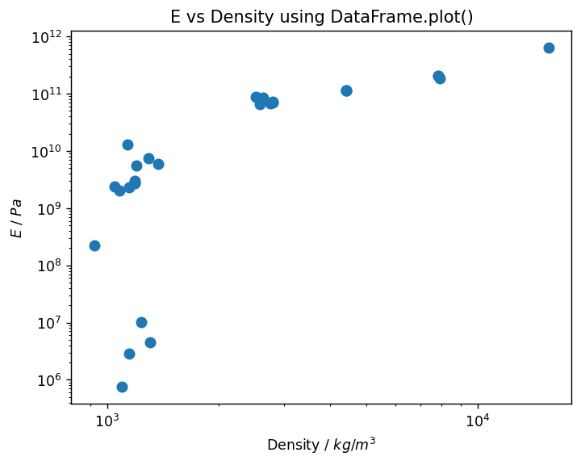
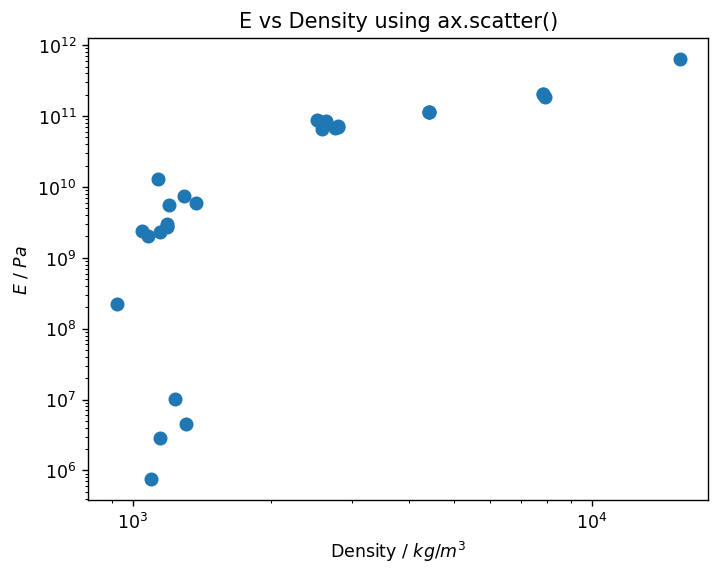
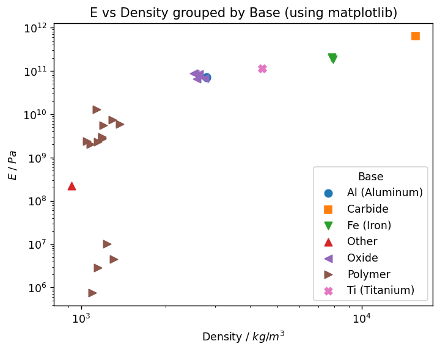
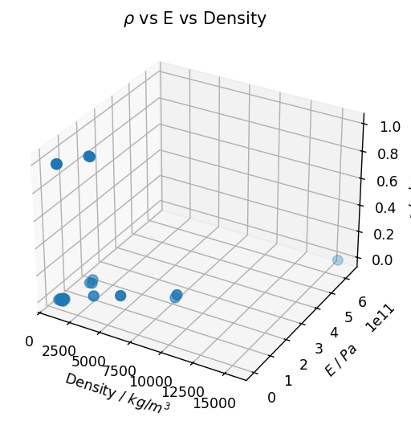
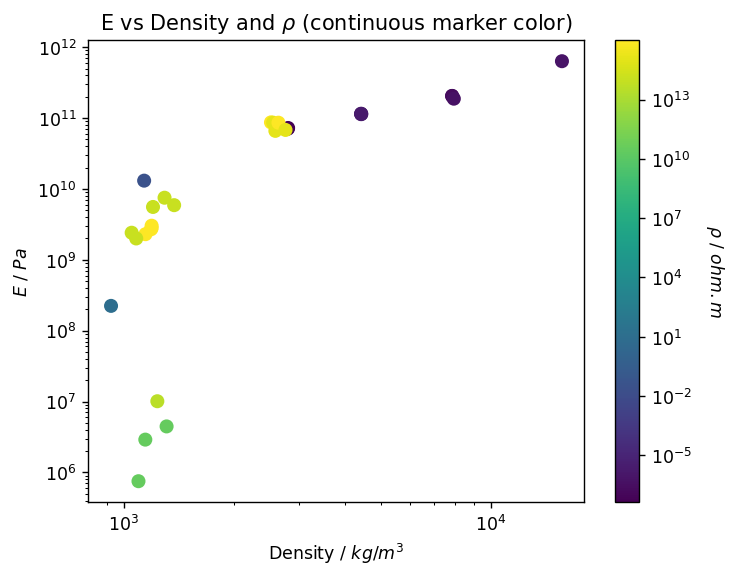
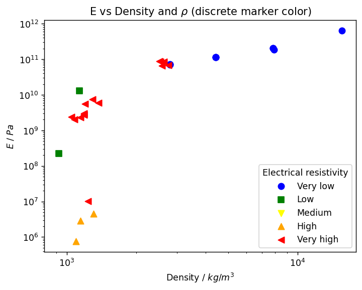
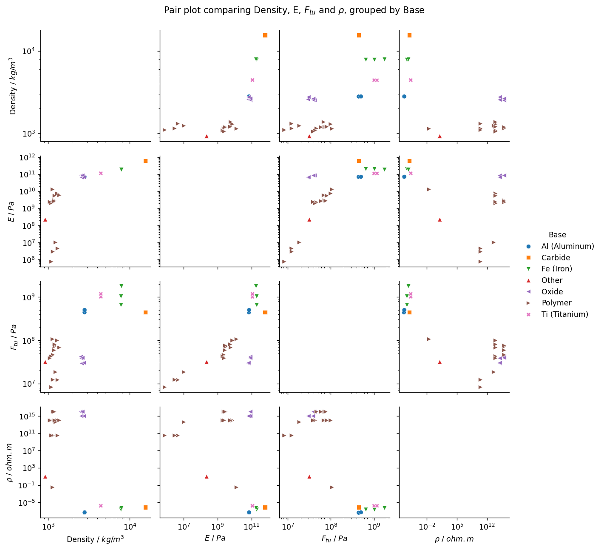

# Create scatter plots

Export multiple attributes from a table and use the `pandas`, `matplotlib` and `seaborn` packages to compare material
properties using 2D, 3D, and 4D scatter plots.

This example uses data from the *MaterialUniverse* table in the *MI Training* database.

## Get data from Granta MI

Import the `granta` libraries and connect to Granta MI via the Service Layer using Windows authentication,
replacing `my.server.name` with the name of your Granta MI server. Specify a database and table.


```python
import ansys.grantami.core as mpy

mi = mpy.SessionBuilder("http://my.server.name/mi_servicelayer").with_autologon()
db = mi.get_db(db_key="MI_Training")
db.unit_system = "SI (Consistent)"
material_universe = db.get_table("MaterialUniverse")
```

Specify the records whose attributes you want to plot. In this case, all records in the table are used, but you can
use other MI Scripting Toolkit methods to define a list of records (for example, `search_criterion()`).


```python
records = material_universe.all_records(include_generics=False, include_folders=False)
```

Bulk export the attributes you want to plot. (The attribute names are stored in a list for later use.)


```python
attributes = [
    "Designation", "Base", "Transparency", "Young's modulus", "Density", "Tensile strength", "Electrical resistivity",
]
material_universe.bulk_fetch(records, attributes=attributes)
```

## Process the data using `pandas`

### Build a DataFrame

A `pandas` DataFrame can be built from a `List` of `Dicts`, where each dictionary in the list corresponds to a
separate row in the DataFrame. Each key-value pair in the `Dict` corresponds to a column and the cell value in that
column, respectively.

First generate the list of dictionaries, and then use this list to create a DataFrame. Here, we are using the
`Record.record_guid` property as the DataFrame index, but any column with a unique value for each record can be used.
We also sort by the Base column to guarantee a repeatable row order.


```python
import pandas as pd

def get_attr_vals(r):
    return {mi_attr: r.attributes[mi_attr].value for mi_attr in attributes}

data = [{"guid": r.record_guid, **get_attr_vals(r)} for r in records]
df = pd.DataFrame(data).set_index("guid").sort_values(by="Base")
```

Use the DataFrame `.head()` method to output the first few rows of the DataFrame and check the structure.


```python
df.head()
```


<div>
<table border="1" class="dataframe">
  <thead>
    <tr style="text-align: right;">
      <th></th>
      <th>Designation</th>
      <th>Base</th>
      <th>Transparency</th>
      <th>Young's modulus</th>
      <th>Density</th>
      <th>Tensile strength</th>
      <th>Electrical resistivity</th>
    </tr>
    <tr>
      <th>guid</th>
      <th></th>
      <th></th>
      <th></th>
      <th></th>
      <th></th>
      <th></th>
      <th></th>
    </tr>
  </thead>
  <tbody>
    <tr>
      <th>00000e41-000e-4fff-8fff-dd92ffff0000</th>
      <td>7075</td>
      <td>Al (Aluminum)</td>
      <td>Opaque</td>
      <td>Range(low=69000000000.0, high=72538459777.8320...</td>
      <td>Range(low=2781.691551208496, high=2809.6480369...</td>
      <td>Range(low=386000000.0, high=510000000.0, low_v...</td>
      <td>Range(low=4.199999809265137e-08, high=4.400000...</td>
    </tr>
    <tr>
      <th>00000e38-000e-4fff-8fff-dd92ffff0000</th>
      <td>7075</td>
      <td>Al (Aluminum)</td>
      <td>Opaque</td>
      <td>Range(low=69000000000.0, high=76000000000.0, l...</td>
      <td>Range(low=2769.9999809265137, high=2829.999923...</td>
      <td>Range(low=434000000.0, high=580000000.0, low_v...</td>
      <td>Range(low=5.0999999046325684e-08, high=5.30000...</td>
    </tr>
    <tr>
      <th>02401a77-c3e7-4b68-875c-7be3b735b703</th>
      <td>Tungsten Carbide</td>
      <td>Carbide</td>
      <td>Opaque</td>
      <td>Range(low=599999999999.9996, high=670000000000...</td>
      <td>Range(low=15299.99999999999, high=15900.000000...</td>
      <td>Range(low=372999999.9999999, high=529999999.99...</td>
      <td>Range(low=6.309999847412099e-07, high=1.000000...</td>
    </tr>
    <tr>
      <th>000009cc-000e-4fff-8fff-dd92ffff0000</th>
      <td>AISI 4130</td>
      <td>Fe (Iron)</td>
      <td>Opaque</td>
      <td>Range(low=200000000000.0, high=210256408691.40...</td>
      <td>Range(low=7790.849685668945, high=7869.1496849...</td>
      <td>Range(low=862000000.0, high=1241000000.0, low_...</td>
      <td>Range(low=2e-07, high=2.5e-07, low_value_is_in...</td>
    </tr>
    <tr>
      <th>000009cb-000e-4fff-8fff-dd92ffff0000</th>
      <td>AISI 4130</td>
      <td>Fe (Iron)</td>
      <td>Opaque</td>
      <td>Range(low=200000000000.0, high=210256408691.40...</td>
      <td>Range(low=7794.244766235352, high=7872.5786209...</td>
      <td>Range(low=621000000.0, high=686368408.203125, ...</td>
      <td>Range(low=2e-07, high=2.5e-07, low_value_is_in...</td>
    </tr>
  </tbody>
</table>
</div>


### Process any range data

A DataFrame cell can contain any data type we choose to store in it. However, plotting packages such as `matplotlib`
require numerical values to be in a standard format. Some MI Scripting Toolkit data types, such as
ranges represented as dictionaries, are not in that format and have to be processed before plotting.

Below, we define a `granta_mean` function which takes a single `dict` as input and calculates either the arithmetic or
geometric mean (depending on the signs of the input values).


```python
import math

def granta_mean(value: mpy.Range | None):
    if value is None:
        return None
    if value.high is None:
        return value.low
    if value.low is None:
        return value.high
    product = value.low * value.high
    if product > 0:
        gm = math.sqrt(product)
        if value.low > 0:
            return gm
        else:
            return -gm
    else:
        return sum([value.low, value.high]) / 2
```

Apply the `granta_mean` function to each cell in the *Density*, *Young's modulus*, *Tensile strength*, and *Electrical
resistivity* columns. Store the results in a new DataFrame, and check the output to ensure the data processing worked
as expected.


```python
df_processed = df[["Density", "Young's modulus", "Tensile strength", "Electrical resistivity"]].map(granta_mean)
df_processed.sort_values(by="Density").head()
```


<div>
<table border="1" class="dataframe">
  <thead>
    <tr style="text-align: right;">
      <th></th>
      <th>Density</th>
      <th>Young's modulus</th>
      <th>Tensile strength</th>
      <th>Electrical resistivity</th>
    </tr>
    <tr>
      <th>guid</th>
      <th></th>
      <th></th>
      <th></th>
      <th></th>
    </tr>
  </thead>
  <tbody>
    <tr>
      <th>0000132e-000e-4fff-8fff-dd92ffff0000</th>
      <td>922.225549</td>
      <td>2.236068e+08</td>
      <td>3.162278e+07</td>
      <td>1.000000e+01</td>
    </tr>
    <tr>
      <th>0000157d-000e-4fff-8fff-dd92ffff0000</th>
      <td>1049.571352</td>
      <td>2.408319e+09</td>
      <td>3.872983e+07</td>
      <td>9.949874e+13</td>
    </tr>
    <tr>
      <th>00001584-000e-4fff-8fff-dd92ffff0000</th>
      <td>1079.953746</td>
      <td>1.999375e+09</td>
      <td>4.289522e+07</td>
      <td>9.949874e+13</td>
    </tr>
    <tr>
      <th>00001ca7-000e-4fff-8fff-dd92ffff0000</th>
      <td>1095.415362</td>
      <td>7.509658e+05</td>
      <td>8.289964e+06</td>
      <td>3.160000e+10</td>
    </tr>
    <tr>
      <th>00001570-000e-4fff-8fff-dd92ffff0000</th>
      <td>1134.988977</td>
      <td>1.308128e+10</td>
      <td>1.064425e+08</td>
      <td>3.162278e-02</td>
    </tr>
  </tbody>
</table>
</div>


Since the columns now contain numeric data, we can use the `.describe()` method to provide some initial insights into
the distribution of values in the table. (This also confirms that the `granta_mean` function worked as expected.)


```python
df_processed.describe()
```


<div>
<table border="1" class="dataframe">
  <thead>
    <tr style="text-align: right;">
      <th></th>
      <th>Density</th>
      <th>Young's modulus</th>
      <th>Tensile strength</th>
      <th>Electrical resistivity</th>
    </tr>
  </thead>
  <tbody>
    <tr>
      <th>count</th>
      <td>29.000000</td>
      <td>2.900000e+01</td>
      <td>2.900000e+01</td>
      <td>2.900000e+01</td>
    </tr>
    <tr>
      <th>mean</th>
      <td>3056.118133</td>
      <td>7.441616e+10</td>
      <td>3.107848e+08</td>
      <td>2.184037e+15</td>
    </tr>
    <tr>
      <th>std</th>
      <td>3201.106148</td>
      <td>1.256091e+11</td>
      <td>4.631297e+08</td>
      <td>4.056391e+15</td>
    </tr>
    <tr>
      <th>min</th>
      <td>922.225549</td>
      <td>7.509658e+05</td>
      <td>8.289964e+06</td>
      <td>4.298837e-08</td>
    </tr>
    <tr>
      <th>25%</th>
      <td>1184.905061</td>
      <td>2.408319e+09</td>
      <td>3.863832e+07</td>
      <td>1.689970e-06</td>
    </tr>
    <tr>
      <th>50%</th>
      <td>1369.963508</td>
      <td>1.308128e+10</td>
      <td>6.816744e+07</td>
      <td>4.000000e+13</td>
    </tr>
    <tr>
      <th>75%</th>
      <td>2799.839234</td>
      <td>8.692341e+10</td>
      <td>4.446234e+08</td>
      <td>1.000000e+15</td>
    </tr>
    <tr>
      <th>max</th>
      <td>15597.115118</td>
      <td>6.340347e+11</td>
      <td>1.775671e+09</td>
      <td>1.000000e+16</td>
    </tr>
  </tbody>
</table>
</div>


### Process any discrete or short text data

The *Designation* column is based on a short-text attribute, which is represented as a string and can be
used as is.

The columns *Transparency* and *Base* are based on discrete attributes. Since they are single-valued, they contain
strings and so can also be used as is.


```python
df_processed[["Transparency", "Base", "Designation"]] = df[["Transparency", "Base", "Designation"]]
df_processed.sort_values(by="Density").head()
```


<div>
<table border="1" class="dataframe">
  <thead>
    <tr style="text-align: right;">
      <th></th>
      <th>Density</th>
      <th>Young's modulus</th>
      <th>Tensile strength</th>
      <th>Electrical resistivity</th>
      <th>Transparency</th>
      <th>Base</th>
      <th>Designation</th>
    </tr>
    <tr>
      <th>guid</th>
      <th></th>
      <th></th>
      <th></th>
      <th></th>
      <th></th>
      <th></th>
      <th></th>
    </tr>
  </thead>
  <tbody>
    <tr>
      <th>0000132e-000e-4fff-8fff-dd92ffff0000</th>
      <td>922.225549</td>
      <td>2.236068e+08</td>
      <td>3.162278e+07</td>
      <td>1.000000e+01</td>
      <td>Opaque</td>
      <td>Other</td>
      <td>Leather</td>
    </tr>
    <tr>
      <th>0000157d-000e-4fff-8fff-dd92ffff0000</th>
      <td>1049.571352</td>
      <td>2.408319e+09</td>
      <td>3.872983e+07</td>
      <td>9.949874e+13</td>
      <td>Opaque</td>
      <td>Polymer</td>
      <td>Acrylonitrile Butadiene Styrene (Extrusion)</td>
    </tr>
    <tr>
      <th>00001584-000e-4fff-8fff-dd92ffff0000</th>
      <td>1079.953746</td>
      <td>1.999375e+09</td>
      <td>4.289522e+07</td>
      <td>9.949874e+13</td>
      <td>Transparent</td>
      <td>Polymer</td>
      <td>Acrylonitrile Butadiene Styrene (Transparent, ...</td>
    </tr>
    <tr>
      <th>00001ca7-000e-4fff-8fff-dd92ffff0000</th>
      <td>1095.415362</td>
      <td>7.509658e+05</td>
      <td>8.289964e+06</td>
      <td>3.160000e+10</td>
      <td>Translucent</td>
      <td>Polymer</td>
      <td>Polyvinyl chloride elastomer (ultra high molec...</td>
    </tr>
    <tr>
      <th>00001570-000e-4fff-8fff-dd92ffff0000</th>
      <td>1134.988977</td>
      <td>1.308128e+10</td>
      <td>1.064425e+08</td>
      <td>3.162278e-02</td>
      <td>Opaque</td>
      <td>Polymer</td>
      <td>Acrylonitrile Butadiene Styrene/20% PAN Carbon...</td>
    </tr>
  </tbody>
</table>
</div>


### Specify column units

`DataFrame` doesn't have a built-in method for specifying the units of a column. For this script, we will create a
separate `dict` that provides a simple mapping between column headings and units.


```python
units = {
    mi_attr: material_universe.attributes[mi_attr].unit
    for mi_attr in attributes
    if getattr(material_universe.attributes[mi_attr], "unit", None) is not None
}
units
```


*Previous cell output:*
```output
{"Young's modulus": 'Pa',
 'Density': 'kg/m^3',
 'Tensile strength': 'Pa',
 'Electrical resistivity': 'ohm.m'}
```


## Create scatter plots using `pandas`

This snippet of code is optional, and is included to increase the size of all plots generated in this
notebook:


```python
import matplotlib.pyplot as plt
plt.rcParams["figure.dpi"] = 125
```

Use the built-in `.plot()` method to plot the data in your DataFrame.

By default, `.plot()` uses `matplotlib` to generate plots. Text wrapped in dollar signs is processed as LaTeX-style
math text.


```python
density_unit = units["Density"]
ym_unit = units["Young's modulus"]
density_label = rf"Density / ${density_unit}$"
ym_label = rf"$E$ / ${ym_unit}$"

_ = df_processed.plot(
    x="Density",
    y="Young's modulus",
    kind="scatter",
    s=50,
    loglog=True,
    xlabel=density_label,
    ylabel=ym_label,
    title="E vs Density using DataFrame.plot()",
)
```


    

    


## Create scatter plots with `matplotlib`

Alternatively, you can use `matplotlib` directly with the DataFrame as an input. For comparison, here is the same plot
using `matplotlib`. The result is the same, but the figure and axes are first created with `plt.subplots()`, the axis
scales and labels modified, and then the `ax.scatter()` method is used to create the plot itself. Finally, the
top-level **plt** object is used to add a title.


```python
import matplotlib.pyplot as plt

fig, ax = plt.subplots()
ax.set_yscale("log")
ax.set_xscale("log")
ax.set_ylabel(ym_label)
ax.set_xlabel(density_label)
ax.scatter(data=df_processed, x="Density", y="Young's modulus", s=50)
_ = ax.set_title("E vs Density using ax.scatter()")
```


    

    


### Plotting data by category (discrete values)

Using `matplotlib` directly allows us to use the full power and flexibility of the package. For example, you can
create a plot color-coded by the value of a discrete attribute by iteratively adding scatter plots to the same set of
axes.

The simplest way to implement this is to use the `.groupby()` DataFrame method, which generates a set of **groupby**
objects. These behave like individual DataFrames, and can be plotted similarly to the previous example. `matplotlib`
will automatically increment the marker color for each new plot.

In the example below, the full `DataFrame` is separated into separate `groupby` objects that share the same *Base*
value. These `DataFrame` rows are each plotted on their own scatter plot with a separate color. The marker is
incremented manually through a pre-defined list, which ensures accessibility for users with color vision deficiencies.


```python
fig, ax = plt.subplots()
ax.set_yscale("log")
ax.set_xscale("log")
ax.set_ylabel(ym_label)
ax.set_xlabel(density_label)

markers = ["o", "s", "v", "^", "<", ">", "X"]

for idx, (key, df) in enumerate(df_processed.groupby("Base")):
    marker = markers[idx]
    ax.scatter(data=df, x="Density", y="Young's modulus", label=key, s=50, marker=marker)
ax.set_title("E vs Density grouped by Base (using matplotlib)")
_ = plt.legend(title="Base")
```


    

    


### Creating a 3D scatter plot

The set-up of a 3D scatter plot is slightly different to the 2D examples above, because the z-axis must be added as a
subplot. Use `figure()` and `add_subplot(projection="3d")` to create a 3D figure, then use an alternative syntax to
plot the data (in previous plots, the data was added using DataFrame column names, whereas this example plots the
arrays themselves).


```python
rho_unit = units["Electrical resistivity"]
rho_label = rf"$\rho$ / ${rho_unit}$"

fig = plt.figure()
ax = fig.add_subplot(projection="3d")
ax.set_ylabel(ym_label)
ax.set_xlabel(density_label)
ax.set_zlabel(rho_label)

ax.scatter(
    df_processed["Density"],
    df_processed["Young's modulus"],
    df_processed["Electrical resistivity"],
    s=50,
)
_ = ax.set_title(r"$\rho$ vs E vs Density")
```


    

    


### Adding a continuous color axis to a 2D scatter plot

Add a continuous color axis using the `c` and `cmap` arguments to the `plot.scatter()` constructor.

This example uses the optional `norm` argument to specify an alternative method of mapping numeric values to a color
in the colormap. The **color_norm** variable contains a logarithmic normalization which ensures color variation is
used across all values of electrical resistivity.

The `viridis` colormap is perceptually uniform (monotonically increases in luminance) so is accessible to users with
color vision deficiencies.


```python
import matplotlib.colors as colors

rho_unit = units["Electrical resistivity"]
rho_label = rf"$\rho$ / ${rho_unit}$"

fig, ax = plt.subplots()
ax.set_yscale("log")
ax.set_xscale("log")
ax.set_ylabel(ym_label)
ax.set_xlabel(density_label)

res_min = df_processed["Electrical resistivity"].min()
res_max = df_processed["Electrical resistivity"].max()
color_norm = colors.LogNorm(vmin=res_min, vmax=res_max)

sc = plt.scatter(
    data=df_processed,
    x="Density",
    y="Young's modulus",
    c="Electrical resistivity",
    s=50,
    cmap="viridis",
    norm=color_norm,
)
cbar = plt.colorbar(sc)
cbar.set_label(rho_label, rotation=270, labelpad=20)
_ = ax.set_title(r"E vs Density and $\rho$ (continuous marker color)")
```


    

    


### Plotting data by category (binned point or range values)

For this plot, we first use `numpy.geomspace()` to define 5 logarithmically-spaced bins and `DataFrame.cut()` to map
the continuous *Electrical resistivity* values to those categories.


```python
import numpy as np

min_value = df_processed["Electrical resistivity"].min()
max_value = df_processed["Electrical resistivity"].max()

# The number of values is calculated between the two values, and is one more than the required number of bins
spacing = np.geomspace(min_value, max_value, 6)

df_processed["Electrical resistivity (binned)"] = pd.cut(
    df_processed["Electrical resistivity"],
    spacing,
    labels=["Very low", "Low", "Medium", "High", "Very high"],
    include_lowest=True,
)
df_processed.head()
```


<div>
<table border="1" class="dataframe">
  <thead>
    <tr style="text-align: right;">
      <th></th>
      <th>Density</th>
      <th>Young's modulus</th>
      <th>Tensile strength</th>
      <th>Electrical resistivity</th>
      <th>Transparency</th>
      <th>Base</th>
      <th>Designation</th>
      <th>Electrical resistivity (binned)</th>
    </tr>
    <tr>
      <th>guid</th>
      <th></th>
      <th></th>
      <th></th>
      <th></th>
      <th></th>
      <th></th>
      <th></th>
      <th></th>
    </tr>
  </thead>
  <tbody>
    <tr>
      <th>00000e41-000e-4fff-8fff-dd92ffff0000</th>
      <td>2795.634849</td>
      <td>7.074711e+10</td>
      <td>4.436891e+08</td>
      <td>4.298837e-08</td>
      <td>Opaque</td>
      <td>Al (Aluminum)</td>
      <td>7075</td>
      <td>Very low</td>
    </tr>
    <tr>
      <th>00000e38-000e-4fff-8fff-dd92ffff0000</th>
      <td>2799.839234</td>
      <td>7.241547e+10</td>
      <td>5.017171e+08</td>
      <td>5.199038e-08</td>
      <td>Opaque</td>
      <td>Al (Aluminum)</td>
      <td>7075</td>
      <td>Very low</td>
    </tr>
    <tr>
      <th>02401a77-c3e7-4b68-875c-7be3b735b703</th>
      <td>15597.115118</td>
      <td>6.340347e+11</td>
      <td>4.446234e+08</td>
      <td>7.943551e-07</td>
      <td>Opaque</td>
      <td>Carbide</td>
      <td>Tungsten Carbide</td>
      <td>Very low</td>
    </tr>
    <tr>
      <th>000009cc-000e-4fff-8fff-dd92ffff0000</th>
      <td>7829.901810</td>
      <td>2.050641e+11</td>
      <td>1.034283e+09</td>
      <td>2.236068e-07</td>
      <td>Opaque</td>
      <td>Fe (Iron)</td>
      <td>AISI 4130</td>
      <td>Very low</td>
    </tr>
    <tr>
      <th>000009cb-000e-4fff-8fff-dd92ffff0000</th>
      <td>7833.313776</td>
      <td>2.050641e+11</td>
      <td>6.528666e+08</td>
      <td>2.236068e-07</td>
      <td>Opaque</td>
      <td>Fe (Iron)</td>
      <td>AISI 4130</td>
      <td>Very low</td>
    </tr>
  </tbody>
</table>
</div>


Then, we can use `.groupby()` to plot each bin with a different color and shape of marker. A `cycler.cycler` object
specifies which colors will be used for each separate scatter plot.


```python
from cycler import cycler

fig, ax = plt.subplots()
ax.set_yscale("log")
ax.set_xscale("log")
ax.set_ylabel(ym_label)
ax.set_xlabel(density_label)

ax.set_prop_cycle(cycler("color", ["blue", "green", "yellow", "orange", "red"]))

for idx, (key, df) in enumerate(df_processed.groupby("Electrical resistivity (binned)", observed=False)):
    marker = markers[idx]
    ax.scatter(
        data=df,
        x="Density",
        y="Young's modulus",
        label=key,
        s=50,
        marker=marker,
    )
plt.legend(title="Electrical resistivity", loc="lower right")
_ = ax.set_title(r"E vs Density and $\rho$ (discrete marker color)")
```


    

    


## Create scatter plots with `seaborn`

An alternative to using `matplotlib` directly is to use `seaborn`, a wrapper of `matplotlib` that aims to make it
easier to create professional-looking plots.

For example, here is the *E vs rho* plot grouped by 'Base' in `seaborn`. Note that the plot itself is defined in one
line, and we can specify DataFrame columns to use for the marker `hue` and `style` with no additional steps. The
legend is created automatically.


```python
from itertools import cycle, islice
import seaborn as sns

ax = sns.scatterplot(
    data=df_processed,
    x="Density",
    y="Young's modulus",
    hue="Base",
    style="Base",
    s=50,
)
ax.set_xscale("log")
ax.set_xlabel(density_label)
ax.set_yscale("log")
ax.set_ylabel(ym_label)
_ = ax.set_title("E vs Density grouped by Base (using seaborn)")
```


    

    


### Plotting in *n* dimensions (pair plots)

The `seaborn` package doesn't expose `matplotlib`'s 3D scatter plotting functionality. However, it can produce stacked
(paired) plots of any dimensionality as required. The example below shows a comparison across 4 continuous dimensions.

To avoid having to set the label of each axis, we've created a new DataFrame with the desired axis labels as column
names. The labelling is then done automatically.

Although `sns.pairplot` doesn't have a `style` argument, you can provide a list of markers instead. This must be the
same length as the number of categories. Here, we use itertools to cycle through the marker style list to get the
correct number.


```python
ftu_unit = units["Tensile strength"]
ftu_label = rf"$F_{{tu}}$ / ${ftu_unit}$"

column_mapping = {
    "Density": density_label,
    "Young's modulus": ym_label,
    "Tensile strength": ftu_label,
    "Electrical resistivity": rho_label,
}
df_pairplot = df_processed.rename(columns=column_mapping)

fig = plt.figure()
base_count = df_pairplot["Base"].nunique()
base_markers = list(islice(cycle(markers), 0, base_count))
g = sns.pairplot(
    vars=[density_label, ym_label, ftu_label, rho_label],
    data=df_pairplot,
    hue="Base",
    markers=base_markers,
    diag_kind="None",
)

for i in range(len(g.axes)):
    for j in range(len(g.axes[i])):
        g.axes[i, j].set_xscale("log")
        g.axes[i, j].set_yscale("log")
_ = g.fig.suptitle(r"Pair plot comparing Density, E, $F_{{{tu}}}$ and $\rho$, grouped by Base", y=1.03)
```

*Previous cell output:*
```output
<Figure size 800x600 with 0 Axes>
```


    

    

