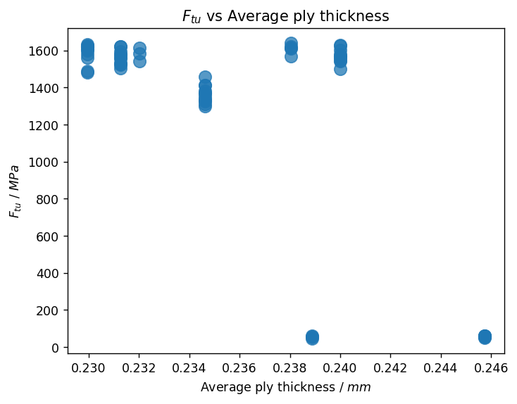
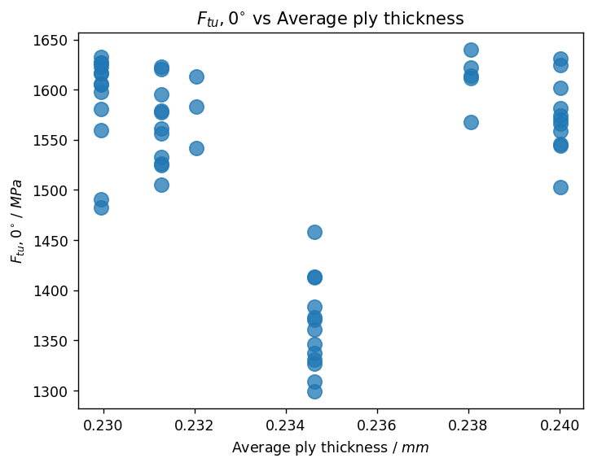
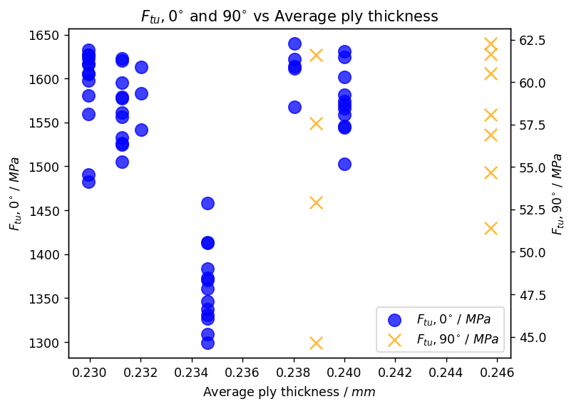

# Plot data by category

Export pedigree data and tensile test results for composite materials, process the data in a `pandas` DataFrame, and
plot summaries of the data (including layup information) using `matplotlib` and `seaborn`.

## Get data from Granta MI

Connect to Granta MI and specify a database.


```python
import ansys.grantami.core as mpy

mi = mpy.SessionBuilder("http://my.server.name/mi_servicelayer").with_autologon()
db = mi.get_db(db_key="MI_Training")
db.unit_system = "Metric"
```

Specify the records and attributes you want to export from the first table. We want to use attributes describing the
layup for all records in the *Composite Pedigree* table.


```python
comp_pedigree = db.get_table("Composite Pedigree")
pedigree_records = comp_pedigree.all_records()
pedigree_attributes = [
    "Panel number", "Ply count", "Panel thickness, average (measured)", "Ply thickness, average (measured)",
]
comp_pedigree.bulk_fetch(pedigree_records, attributes=pedigree_attributes)
```

Specify the records you want to export from the second table. Here, a link group is used to export only records linked
to records in the first table.

Alternatively, you can specify a table with no link groups to the original table, as long as you can join the two
datasets later on. For example, we could search for all records created after a certain date, or tested on a certain
machine.


```python
link_group = "Tensile test data"

# Use a set comprehension to ensure we only select each record once
tensile_test_records = {tr for pr in pedigree_records for tr in pr.links[link_group]}
tensile_test_records = list(tensile_test_records)
```

Specify the attributes you want to export from the second table. *Panel number* will be used to relate the tensile
tests to the layup data.


```python
tensile_test_data = db.get_table("Tensile Test Data")
tensile_attributes = [
    "Panel number", "Specimen ID", "Young's Modulus (11-axis)", "Ultimate Tensile Strength", "Test Type",
]
tensile_test_data.bulk_fetch(tensile_test_records, attributes=tensile_attributes)
```

## Use DataFrames to pre-process and append the data

### Build a separate DataFrame for each table

Create a DataFrame for each Granta MI table. The DataFrames are built from two separate lists of dictionaries:


```python
import pandas as pd
from functools import partial

def get_attr_vals(attributes, r):
    return {mi_attr: r.attributes[mi_attr].value for mi_attr in attributes}

get_pedigree_vals = partial(get_attr_vals, pedigree_attributes)
get_tensile_vals = partial(get_attr_vals, tensile_attributes)

pedigree_data = [get_pedigree_vals(r) for r in pedigree_records]
tensile_data = [get_tensile_vals(r) for r in tensile_test_records]
```

Create a DataFrame `pedigree_df` that contains the pedigree records. Set the DataFrame index to be the *Panel number*
attribute value
and sort by the index.


```python
pedigree_df = pd.DataFrame(pedigree_data).set_index("Panel number").sort_index()
pedigree_df.head()
```


<div>
<table border="1" class="dataframe">
  <thead>
    <tr style="text-align: right;">
      <th></th>
      <th>Ply count</th>
      <th>Panel thickness, average (measured)</th>
      <th>Ply thickness, average (measured)</th>
    </tr>
    <tr>
      <th>Panel number</th>
      <th></th>
      <th></th>
      <th></th>
    </tr>
  </thead>
  <tbody>
    <tr>
      <th>LBJ13</th>
      <td>6</td>
      <td>1.397000</td>
      <td>0.232029</td>
    </tr>
    <tr>
      <th>LBJ14</th>
      <td>6</td>
      <td>1.431636</td>
      <td>0.238044</td>
    </tr>
    <tr>
      <th>LBJ42</th>
      <td>6</td>
      <td>1.438564</td>
      <td>0.240007</td>
    </tr>
    <tr>
      <th>LBJ53</th>
      <td>6</td>
      <td>1.385455</td>
      <td>0.231279</td>
    </tr>
    <tr>
      <th>LBJ62</th>
      <td>6</td>
      <td>1.410677</td>
      <td>0.234618</td>
    </tr>
  </tbody>
</table>
</div>


Create a second DataFrame `tensile_df` that contains the tensile test results. Again, set the index to be the
*Panel number* attribute value and sort by both the index and the *Specimen ID*.


```python
tensile_df = pd.DataFrame(tensile_data).set_index("Panel number").sort_values(by=["Panel number", "Specimen ID"])
tensile_df.head()
```


<div>
<table border="1" class="dataframe">
  <thead>
    <tr style="text-align: right;">
      <th></th>
      <th>Specimen ID</th>
      <th>Young's Modulus (11-axis)</th>
      <th>Ultimate Tensile Strength</th>
      <th>Test Type</th>
    </tr>
    <tr>
      <th>Panel number</th>
      <th></th>
      <th></th>
      <th></th>
      <th></th>
    </tr>
  </thead>
  <tbody>
    <tr>
      <th>LBJ13</th>
      <td>LBJ1311A</td>
      <td>47.594514</td>
      <td>1582.870937</td>
      <td>0° tension</td>
    </tr>
    <tr>
      <th>LBJ13</th>
      <td>LBJ1312A</td>
      <td>47.353197</td>
      <td>1542.122918</td>
      <td>0° tension</td>
    </tr>
    <tr>
      <th>LBJ13</th>
      <td>LBJ1313A</td>
      <td>47.387671</td>
      <td>1612.952766</td>
      <td>0° tension</td>
    </tr>
    <tr>
      <th>LBJ14</th>
      <td>LBJ1413A</td>
      <td>NaN</td>
      <td>1613.614663</td>
      <td>0° tension</td>
    </tr>
    <tr>
      <th>LBJ14</th>
      <td>LBJ1415A</td>
      <td>NaN</td>
      <td>1611.201497</td>
      <td>0° tension</td>
    </tr>
  </tbody>
</table>
</div>


### Join the dataframes

Use the `dataframe.join()` method to create a DataFrame with both sets of data. The join type will default to a
left-join if not specified; this is fine in our case because the records were linked via a smart link in Granta MI,
and so the set of indices is the same for both DataFrames.


```python
df = pedigree_df.join(tensile_df)
df.head()
```


<div>
<table border="1" class="dataframe">
  <thead>
    <tr style="text-align: right;">
      <th></th>
      <th>Ply count</th>
      <th>Panel thickness, average (measured)</th>
      <th>Ply thickness, average (measured)</th>
      <th>Specimen ID</th>
      <th>Young's Modulus (11-axis)</th>
      <th>Ultimate Tensile Strength</th>
      <th>Test Type</th>
    </tr>
    <tr>
      <th>Panel number</th>
      <th></th>
      <th></th>
      <th></th>
      <th></th>
      <th></th>
      <th></th>
      <th></th>
    </tr>
  </thead>
  <tbody>
    <tr>
      <th>LBJ13</th>
      <td>6</td>
      <td>1.397000</td>
      <td>0.232029</td>
      <td>LBJ1311A</td>
      <td>47.594514</td>
      <td>1582.870937</td>
      <td>0° tension</td>
    </tr>
    <tr>
      <th>LBJ13</th>
      <td>6</td>
      <td>1.397000</td>
      <td>0.232029</td>
      <td>LBJ1312A</td>
      <td>47.353197</td>
      <td>1542.122918</td>
      <td>0° tension</td>
    </tr>
    <tr>
      <th>LBJ13</th>
      <td>6</td>
      <td>1.397000</td>
      <td>0.232029</td>
      <td>LBJ1313A</td>
      <td>47.387671</td>
      <td>1612.952766</td>
      <td>0° tension</td>
    </tr>
    <tr>
      <th>LBJ14</th>
      <td>6</td>
      <td>1.431636</td>
      <td>0.238044</td>
      <td>LBJ1413A</td>
      <td>NaN</td>
      <td>1613.614663</td>
      <td>0° tension</td>
    </tr>
    <tr>
      <th>LBJ14</th>
      <td>6</td>
      <td>1.431636</td>
      <td>0.238044</td>
      <td>LBJ1415A</td>
      <td>NaN</td>
      <td>1611.201497</td>
      <td>0° tension</td>
    </tr>
  </tbody>
</table>
</div>


Finally, create a `units` dict so you can create plots with meaningful axis labels.


```python
attr_defs = [comp_pedigree.attributes[attr] for attr in pedigree_attributes] + \
            [tensile_test_data.attributes[attr] for attr in tensile_attributes]
units = {attr.name: attr.unit for attr in attr_defs if getattr(attr, "unit", None) is not None}
units
```


*Previous cell output:*
```output
{'Panel thickness, average (measured)': 'mm',
 'Ply thickness, average (measured)': 'mm',
 "Young's Modulus (11-axis)": 'GPa',
 'Ultimate Tensile Strength': 'MPa'}
```


## Plot the data

This code snippet is optional, and is included to increase the size of all plots generated in this notebook.


```python
import matplotlib.pyplot as plt
plt.rcParams["figure.dpi"] = 125
```

### Investigate the relationship between two properties

Create a scatter plot with `matplotlib` comparing *Ultimate Tensile Strength* of the panels to
*Ply thickness, average*.


```python
import matplotlib.pyplot as plt

ply_thickness_unit = units["Ply thickness, average (measured)"]
ftu_unit = units["Ultimate Tensile Strength"]
ply_thickness_label = rf"Average ply thickness / ${ply_thickness_unit}$"
ftu_label = rf"$F_{{tu}}$ / ${ftu_unit}$"

fig, ax = plt.subplots()
ax.scatter(data=df, x="Ply thickness, average (measured)", y="Ultimate Tensile Strength", alpha=0.75, s=100)
ax.set_xlabel(ply_thickness_label)
ax.set_ylabel(ftu_label)
_ = ax.set_title(r"$F_{tu}$ vs Average ply thickness")
```


    

    


There is a significant difference between the results at 1200 - 1600 MPa and the group below 100 MPa. We need to
identify what causes this difference, and then represent the data in a clearer way.

### Investigate the impact of other properties

First, examine the underlying data; use the `DataFrame.describe()` method to view a statistical summary of the data in
each column.


```python
df.describe(include="all")
```


<div>
<table border="1" class="dataframe">
  <thead>
    <tr style="text-align: right;">
      <th></th>
      <th>Ply count</th>
      <th>Panel thickness, average (measured)</th>
      <th>Ply thickness, average (measured)</th>
      <th>Specimen ID</th>
      <th>Young's Modulus (11-axis)</th>
      <th>Ultimate Tensile Strength</th>
      <th>Test Type</th>
    </tr>
  </thead>
  <tbody>
    <tr>
      <th>count</th>
      <td>67.000000</td>
      <td>67.000000</td>
      <td>67.000000</td>
      <td>67</td>
      <td>18.000000</td>
      <td>67.000000</td>
      <td>67</td>
    </tr>
    <tr>
      <th>unique</th>
      <td>NaN</td>
      <td>NaN</td>
      <td>NaN</td>
      <td>67</td>
      <td>NaN</td>
      <td>NaN</td>
      <td>2</td>
    </tr>
    <tr>
      <th>top</th>
      <td>NaN</td>
      <td>NaN</td>
      <td>NaN</td>
      <td>LBJ1311A</td>
      <td>NaN</td>
      <td>NaN</td>
      <td>0° tension</td>
    </tr>
    <tr>
      <th>freq</th>
      <td>NaN</td>
      <td>NaN</td>
      <td>NaN</td>
      <td>1</td>
      <td>NaN</td>
      <td>NaN</td>
      <td>56</td>
    </tr>
    <tr>
      <th>mean</th>
      <td>6.492537</td>
      <td>1.534167</td>
      <td>0.235604</td>
      <td>NaN</td>
      <td>42.775844</td>
      <td>1288.110261</td>
      <td>NaN</td>
    </tr>
    <tr>
      <th>std</th>
      <td>1.119701</td>
      <td>0.294450</td>
      <td>0.005039</td>
      <td>NaN</td>
      <td>13.523385</td>
      <td>557.743977</td>
      <td>NaN</td>
    </tr>
    <tr>
      <th>min</th>
      <td>6.000000</td>
      <td>1.379415</td>
      <td>0.229948</td>
      <td>NaN</td>
      <td>13.217251</td>
      <td>44.629768</td>
      <td>NaN</td>
    </tr>
    <tr>
      <th>25%</th>
      <td>6.000000</td>
      <td>1.385455</td>
      <td>0.231279</td>
      <td>NaN</td>
      <td>47.022249</td>
      <td>1353.613343</td>
      <td>NaN</td>
    </tr>
    <tr>
      <th>50%</th>
      <td>6.000000</td>
      <td>1.410677</td>
      <td>0.234618</td>
      <td>NaN</td>
      <td>47.973725</td>
      <td>1545.653034</td>
      <td>NaN</td>
    </tr>
    <tr>
      <th>75%</th>
      <td>6.000000</td>
      <td>1.438564</td>
      <td>0.240007</td>
      <td>NaN</td>
      <td>49.364743</td>
      <td>1603.610369</td>
      <td>NaN</td>
    </tr>
    <tr>
      <th>max</th>
      <td>9.000000</td>
      <td>2.213429</td>
      <td>0.245727</td>
      <td>NaN</td>
      <td>51.400420</td>
      <td>1639.559637</td>
      <td>NaN</td>
    </tr>
  </tbody>
</table>
</div>


The *Test Type* column summary shows that the most frequent value is '0° tension' (as expected), but there are 9
occurrences of a second test type.

To identify all possible values in the *Test Type* column, use `DataFrame["Test Type"].unique()`.


```python
df["Test Type"].unique()
```


*Previous cell output:*
```output
array(['0° tension', '90° tension'], dtype=object)
```


Although there is only one populated attribute for *Ultimate Tensile Strength* and *Young's modulus*, the *Test Type*
column shows that the tensile tests were performed in two different directions.

Since composite materials are often highly orthotropic, the direction of the test must be taken into account when
plotting the results. We can filter the DataFrame based on the *Test Type* column when plotting:


```python
ftu_0_label = rf"$F_{{tu}}, 0^{{\circ}}$ / ${ftu_unit}$"
df_0_tension = df[df["Test Type"] == "0° tension"]

fig, ax = plt.subplots()
ax.scatter(
    data=df_0_tension,
    x="Ply thickness, average (measured)",
    y="Ultimate Tensile Strength",
    alpha=0.75,
    s=100,
)
ax.set_xlabel(ply_thickness_label)
ax.set_ylabel(ftu_0_label)
_ = ax.set_title(r"$F_{tu}, 0^{{\circ}}$ vs Average ply thickness")
```


    

    


We can also overlay the 90° *Ultimate Tensile Strength* results, using `.twinx()` to plot them on a separate y-axis.


```python
ftu_90_label = rf"$F_{{tu}}, 90^{{\circ}}$ / ${ftu_unit}$"
df_90_tension = df[df["Test Type"] == "90° tension"]

fig, ax1 = plt.subplots()
ax1.scatter(
    data=df_0_tension,
    x="Ply thickness, average (measured)",
    y="Ultimate Tensile Strength",
    color="blue",
    marker="o",
    alpha=0.75,
    s=100,
)
ax2 = plt.twinx()
ax2.scatter(
    data=df_90_tension,
    x="Ply thickness, average (measured)",
    y="Ultimate Tensile Strength",
    color="orange",
    marker="x",
    alpha=0.75,
    s=100,
)

ax1.set_xlabel(ply_thickness_label)
ax1.set_ylabel(ftu_0_label)
ax2.set_ylabel(ftu_90_label)

h1, l1 = ax1.get_legend_handles_labels()
h2, l2 = ax2.get_legend_handles_labels()

ax1.legend(h1 + h2, [ftu_0_label, ftu_90_label], loc="lower right")
_ = ax1.set_title(r"$F_{tu}, 0^{{\circ}}$ and $90^{{\circ}}$ vs Average ply thickness")
```


    

    

