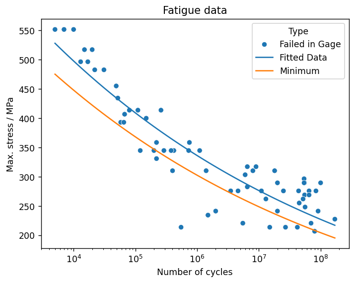

# Fit series data and import fit results

Analyze high-cycle fatigue test data and fit a fatigue model using SciPy, using an approach suitable for automation
with either MI Data Flow or as a simple scheduled task (cron job).

## Connect to Granta MI

Specify a database and tables.


```python
import ansys.grantami.core as mpy

mi = mpy.SessionBuilder("http://my.server.name/mi_servicelayer").with_autologon()
db = mi.get_db(db_key="MI_Training")

statistics_table = db.get_table("Fatigue Statistical Data")
test_data_table = db.get_table("Fatigue Test Data")
```

## Search for records with statistical data

This script will perform a fatigue analysis on the first record whose *Statistical Analysis Status* is set to 'In
Progress', but it can easily be generalised to operate on multiple statistical data records.

First, perform a criteria search to find the target record.


```python
criterion_type = statistics_table.attributes["Material type"].search_criterion(contains="Aluminum alloys")
criterion_status = statistics_table.attributes["Statistical Analysis Status"].search_criterion(contains="In Progress")
statistical_records = statistics_table.search_for_records_where([criterion_type, criterion_status])
print(f"Found {len(statistical_records)} corresponding HCF test results.")

record = statistical_records[0]
print(f"Analyzing fatigue data for {record.name}.")
```
*Previous cell output:*
```output
Found 1 corresponding HCF test results.
Analyzing fatigue data for 7075 T6, R=0, T=430F.
```
## Get the source data for the record

Get the *R-Ratio* and *Test Temperature* values from the record, and fetch the corresponding test results. Then read
the attribute values from the test result records into a `pandas` DataFrame for plotting and analysis.


```python
import pandas as pd
import statistics

r_ratio = record.attributes["Target R-Ratio Range"].value
r_ratio_mean = statistics.mean([r_ratio.low, r_ratio.high])
test_temperature = record.attributes["Test Temperature Range"].value
test_temperature_mean = statistics.mean([test_temperature.low, test_temperature.high])
material_id_value = f"{record.attributes['Alloy'].value}-{record.attributes['Condition'].value}/{record.attributes['Form'].value}"

target_r_ratio = test_data_table.attributes["Target r-ratio"]
target_r_ratio_criterion = target_r_ratio.search_criterion(
    less_than=r_ratio_mean,
    greater_than=r_ratio_mean,
)
test_temperature = test_data_table.attributes["Test temperature"]
test_temperature_criterion = test_temperature.search_criterion(
    less_than=test_temperature_mean,
    greater_than=test_temperature_mean,
)
material_id = test_data_table.attributes["Material ID"]
material_id_criterion = material_id.search_criterion(contains=material_id_value)
test_records = test_data_table.search_for_records_where(
    [target_r_ratio_criterion, test_temperature_criterion, material_id_criterion]
)

print(f"Found {len(test_records)} corresponding HCF test results.")

t_results = ["Cyclic life", "Maximum stress", "Fatigue failure"]
test_data_table.bulk_fetch(records=test_records, attributes=t_results)

rs_dict = {attribute: [r.attributes[attribute].value for r in test_records] for attribute in t_results}
rs_dict.update({"ShortName": [r.short_name for r in test_records]})

rs_df = pd.DataFrame(rs_dict)
```
*Previous cell output:*
```output
Found 66 corresponding HCF test results.
```
## Fit the data

Fit the fatigue test data using the SciPy `curve_fit()` function, and create a new DataFrame for the fitted data and
the lower bound. Define an expression for fitting as follows:


To maximize the fit precision, normalize the y values to a single order of magnitude. The y values are of the order of
100 MPa, so use a scale factor of 0.01. Based on the expression being used, multiplying by a scale factor
requires adding log10 of the scale factor to the A1 result.


```python
from scipy.optimize import curve_fit
import numpy as np

def fatigue_func(x, A1, A2):
    return 10 ** (-A1) * x ** A2

SCALE_FACTOR = 0.01

(A1, A2), pcov = curve_fit(
    fatigue_func,
    rs_df["Cyclic life"],
    rs_df["Maximum stress"] * SCALE_FACTOR,
    bounds=([-500.0, -500.0], [500.0, 500.0]),
)

A1 += np.log10(SCALE_FACTOR)

min_coefficient = 0.9
x = np.geomspace(
    start=rs_df["Cyclic life"].min(),
    stop=rs_df["Cyclic life"].max(),
    num=rs_df["Cyclic life"].count(),
)
fitted_series = 10 ** (-A1) * x ** A2

fitted_df = (
    pd.DataFrame(
        index=x,
        data=np.transpose([fitted_series, min_coefficient * fitted_series]),
        columns=["Fitted Data", "Minimum"],
    )
    .reset_index()
    .melt(id_vars=["index"])
    .rename(columns={"index": "Cyclic life", "value": "Maximum stress", "variable": "Type"})
)

fitted_df.head()
```


<div>
<table border="1" class="dataframe">
  <thead>
    <tr style="text-align: right;">
      <th></th>
      <th>Cyclic life</th>
      <th>Type</th>
      <th>Maximum stress</th>
    </tr>
  </thead>
  <tbody>
    <tr>
      <th>0</th>
      <td>5000.000000</td>
      <td>Fitted Data</td>
      <td>527.961676</td>
    </tr>
    <tr>
      <th>1</th>
      <td>5870.634799</td>
      <td>Fitted Data</td>
      <td>520.791950</td>
    </tr>
    <tr>
      <th>2</th>
      <td>6892.870589</td>
      <td>Fitted Data</td>
      <td>513.719590</td>
    </tr>
    <tr>
      <th>3</th>
      <td>8093.105189</td>
      <td>Fitted Data</td>
      <td>506.743272</td>
    </tr>
    <tr>
      <th>4</th>
      <td>9502.332991</td>
      <td>Fitted Data</td>
      <td>499.861692</td>
    </tr>
  </tbody>
</table>
</div>


## Plot the data

Create a scatter plot of the source data (*Maximum stress* vs *Number of cycles*).


```python
import seaborn as sns
from matplotlib import pyplot as plt

plt.rcParams["figure.dpi"] = 125

fig, ax = plt.subplots()
ax = sns.scatterplot(data=rs_df, y="Maximum stress", x="Cyclic life", hue="Fatigue failure", ax=ax)

plt.title("Fatigue data")
plt.xlabel("Number of cycles")
max_stress_unit = test_data_table.attributes["Maximum stress"].unit
plt.ylabel(f"Max. stress / {max_stress_unit}")
plt.show()
```


    

    


Add the fitted curve and the minimum curve to the plot, and set the x-axis scale to logarithmic.


```python
sns.lineplot(data=fitted_df, x="Cyclic life", y="Maximum stress", hue="Type", ax=ax)
ax.set(xscale="log")

fig
```


    

    


## Import the fitted data to Granta MI

Replace the data in the original record's functional attribute *Maximum Stress v Cycles (Equivalent Stress)* with the
fitted data. Use `Session.update()` to push the changes to Granta MI.


```python
fit = record.attributes["Maximum Stress v Cycles (Equivalent Stress)"]
fit.unit = test_data_table.attributes["Maximum stress"].unit

fitted_data = fitted_df[fitted_df["Type"]=="Fitted Data"]
series_fitted = mpy.SeriesPoint(
    y=tuple(fitted_data["Maximum stress"]),
    x=tuple(fitted_data["Cyclic life"]),
    parameters=(
        mpy.SeriesParameterValue("Data Type", "Fitted Data"),
        mpy.SeriesParameterValue("Stress Ratio", r_ratio_mean),
    ),
    decoration=mpy.GraphDecoration.LINES,
)

minimum_data = fitted_df[fitted_df["Type"]=="Minimum"]
series_minimum = mpy.SeriesPoint(
    y=tuple(minimum_data["Maximum stress"]),
    x=tuple(minimum_data["Cyclic life"]),
    parameters=(
        mpy.SeriesParameterValue("Data Type", "Minimum"),
        mpy.SeriesParameterValue("Stress Ratio", r_ratio_mean),
    ),
    decoration=mpy.GraphDecoration.LINES,
)

series_test_data = mpy.SeriesPoint(
    y=tuple(rs_df["Maximum stress"]),
    x=tuple(rs_df["Cyclic life"]),
    parameters=(
        mpy.SeriesParameterValue("Data Type", "Test Data"),
        mpy.SeriesParameterValue("Stress Ratio", r_ratio_mean),
    ),
    decoration=mpy.GraphDecoration.MARKERS,
)
fit.value = (
    series_fitted,
    series_minimum,
    series_test_data,
)

record.attributes["Equivalent Stress, A1"].value = A1
record.attributes["Equivalent Stress, A2"].value = A2
record.attributes["Statistical Analysis Status"].value = "Complete"
record.set_attributes(
    [
        record.attributes["Equivalent Stress, A1"],
        record.attributes["Equivalent Stress, A2"],
        # The status is not updated; this allows the notebook to be re-run.
        # r.attributes["Statistical Analysis Status"],
        fit,
    ]
)

mi.update([record])
print(f"Updated attributes in {record.name}.")
```
*Previous cell output:*
```output
Updated attributes in 7075 T6, R=0, T=430F.
```
## Create traceability links

Add a record link group, and use `Session.update_links()` to push the changes to Granta MI.


```python
rec_link_group = record.links["Fatigue Test Data"]
for rsi in test_records:
    rec_link_group.add(rsi)
record.set_links("Fatigue Test Data", rec_link_group)
mi.update_links([record])
print(f"Updated links in {record.name}.")
```
*Previous cell output:*
```output
Updated links in 7075 T6, R=0, T=430F.
```