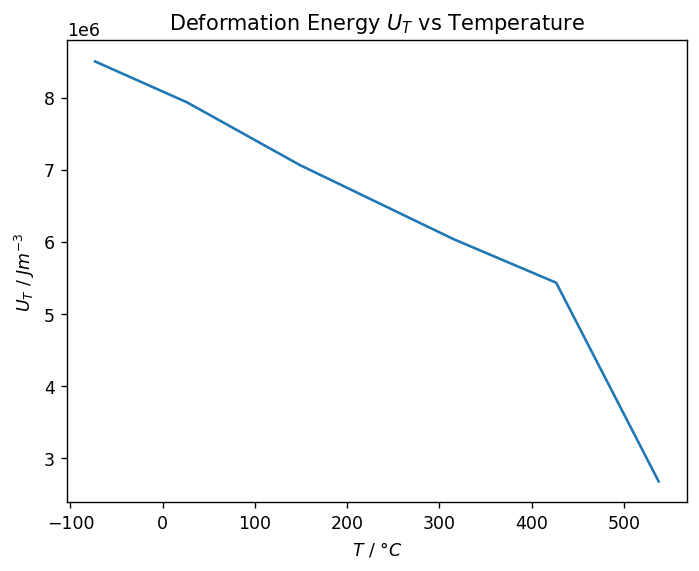
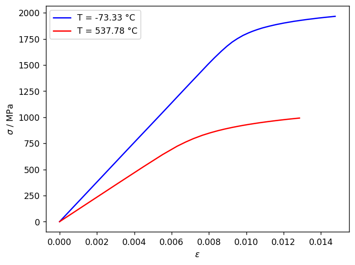
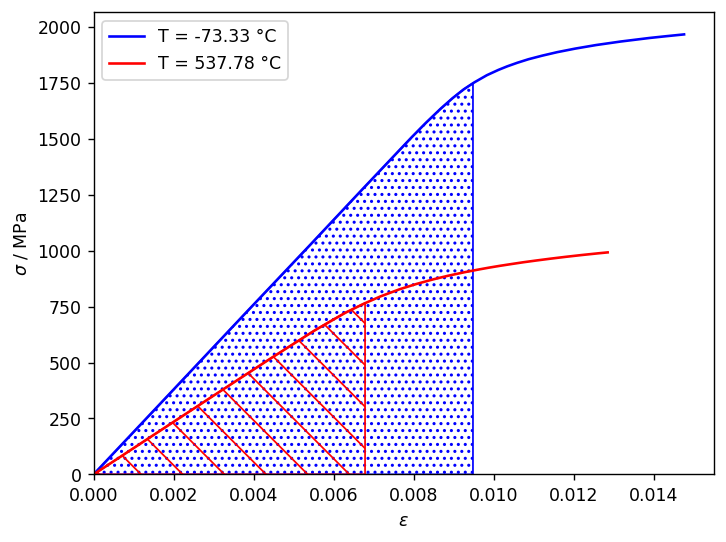
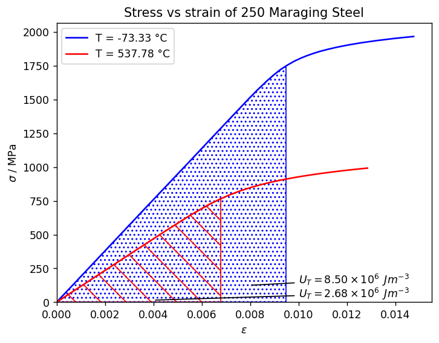

# Find the area under a curve

Calculate the area under a set of temperature-dependent stress-strain curves with `numpy` and `scipy`, and determine
how the toughness and energy stored in the material up to the yield point varies with temperature.

## Connect to Granta MI

Create a session, and specify a database and table.


```python
import ansys.grantami.core as mpy

mi = mpy.SessionBuilder("http://my.server.name/mi_servicelayer").with_autologon()

db = mi.get_db(db_key="MI_Training")
db.unit_system = "SI (Consistent)"

design_data = db.get_table("Design Data")
```

Specify the record you want to export using a lookup value (requires MI Scripting Toolkit 2.3 or later).


```python
record = design_data.get_record_by_lookup_value(attribute_name="Common Name", lookup_value="250 Grade Maraging")
```

Get the attribute data you need from the record. (*Yield Stress* and *Tensile Modulus* are needed to calculate the
yield point at each temperature.)


```python
stress_strain = record.attributes["Tensile Stress/Strain, L"]
yield_stress = record.attributes["Tens. Yield Stress (L-dir) with Temp."]
youngs_modulus = record.attributes["Tensile Modulus (L-dir) with Temp."]
```

## Use a DataFrame to prepare the data

### Build a DataFrame for each functional attribute

MI Scripting Toolkit's list-of-lists format for functional data can be loaded directly into a DataFrame, as long as
you separate the datum into the first list item (the column headers) and the subsequent list items (the datapoints).


```python
import pandas as pd

def functional_to_dataframe(attr):
    headers, *func_data = attr.table_view.table_view
    df = pd.DataFrame(func_data, columns=headers)
    return df

df_stress_strain = functional_to_dataframe(stress_strain)
df_yield_stress = functional_to_dataframe(yield_stress)
df_youngs_modulus = functional_to_dataframe(youngs_modulus)
df_stress_strain.head()
```


<div>
<table border="1" class="dataframe">
  <thead>
    <tr style="text-align: right;">
      <th></th>
      <th>Y min (Tensile Stress/Strain, L [Pa])</th>
      <th>Y max (Tensile Stress/Strain, L [Pa])</th>
      <th>Strain [strain]</th>
      <th>Temperature [°C]</th>
      <th>Time [s]</th>
      <th>Other [None]</th>
      <th>Stress/Strain Curve Type [None]</th>
      <th>Estimated point?</th>
    </tr>
  </thead>
  <tbody>
    <tr>
      <th>0</th>
      <td>0.000000e+00</td>
      <td>0.000000e+00</td>
      <td>0.00000</td>
      <td>-73.332999</td>
      <td>1800.0</td>
      <td>None</td>
      <td>Yield</td>
      <td>False</td>
    </tr>
    <tr>
      <th>1</th>
      <td>3.964485e+08</td>
      <td>3.964485e+08</td>
      <td>0.00209</td>
      <td>-73.332999</td>
      <td>1800.0</td>
      <td>None</td>
      <td>Yield</td>
      <td>False</td>
    </tr>
    <tr>
      <th>2</th>
      <td>7.136074e+08</td>
      <td>7.136074e+08</td>
      <td>0.00376</td>
      <td>-73.332999</td>
      <td>1800.0</td>
      <td>None</td>
      <td>Yield</td>
      <td>False</td>
    </tr>
    <tr>
      <th>3</th>
      <td>1.030766e+09</td>
      <td>1.030766e+09</td>
      <td>0.00544</td>
      <td>-73.332999</td>
      <td>1800.0</td>
      <td>None</td>
      <td>Yield</td>
      <td>False</td>
    </tr>
    <tr>
      <th>4</th>
      <td>1.268635e+09</td>
      <td>1.268635e+09</td>
      <td>0.00669</td>
      <td>-73.332999</td>
      <td>1800.0</td>
      <td>None</td>
      <td>Yield</td>
      <td>False</td>
    </tr>
  </tbody>
</table>
</div>


### Refine the data

Define a function that takes a DataFrame and performs the following transformations as needed:

* Removes columns that aren't required, including the duplicated y-axis column

* Renames the x and y columns

* Copies columns


```python
def clean_dataframe(df, y_name, x_name, columns_to_drop=None, columns_to_keep=None):
    if not columns_to_drop:
        columns_to_drop = []
    if not columns_to_keep:
        columns_to_keep = []
    new_df = df.drop(columns=[f"Y max ({y_name})"] + [f"Y min ({y_name})"] + columns_to_drop)
    new_df["y"] = df[[f"Y max ({y_name})", f"Y min ({y_name})"]].mean(axis=1)
    new_df = new_df.rename(columns={x_name: "x"})
    new_df[columns_to_keep] = df[columns_to_keep]
    return new_df
```

Use this function to create 'clean' versions of all three DataFrames.


```python
df_stress_strain_clean = clean_dataframe(
    df=df_stress_strain,
    y_name="Tensile Stress/Strain, L [Pa]",
    x_name="Strain [strain]",
    columns_to_drop=[
        "Y max (Tensile Stress/Strain, L [Pa])",
        "Time [s]",
        "Estimated point?",
        "Other [None]",
        "Stress/Strain Curve Type [None]",
    ],
    columns_to_keep=["Temperature [°C]"],
)
df_stress_strain_clean = df_stress_strain_clean.rename(columns={"Temperature [°C]": "Temperature"})
df_stress_strain_clean.head()
```


<div>
<table border="1" class="dataframe">
  <thead>
    <tr style="text-align: right;">
      <th></th>
      <th>x</th>
      <th>Temperature</th>
      <th>y</th>
    </tr>
  </thead>
  <tbody>
    <tr>
      <th>0</th>
      <td>0.00000</td>
      <td>-73.332999</td>
      <td>0.000000e+00</td>
    </tr>
    <tr>
      <th>1</th>
      <td>0.00209</td>
      <td>-73.332999</td>
      <td>3.964485e+08</td>
    </tr>
    <tr>
      <th>2</th>
      <td>0.00376</td>
      <td>-73.332999</td>
      <td>7.136074e+08</td>
    </tr>
    <tr>
      <th>3</th>
      <td>0.00544</td>
      <td>-73.332999</td>
      <td>1.030766e+09</td>
    </tr>
    <tr>
      <th>4</th>
      <td>0.00669</td>
      <td>-73.332999</td>
      <td>1.268635e+09</td>
    </tr>
  </tbody>
</table>
</div>


```python
df_yield_stress_clean = clean_dataframe(
    df=df_yield_stress,
    y_name="Tens. Yield Stress (L-dir) with Temp. [Pa]",
    x_name="Temperature [°C]",
    columns_to_drop=[
        "Y max (Tens. Yield Stress (L-dir) with Temp. [Pa])",
        "Time [s]",
        "Estimated point?",
        "Other [None]",
    ],
)
df_yield_stress_clean.head()
```


<div>
<table border="1" class="dataframe">
  <thead>
    <tr style="text-align: right;">
      <th></th>
      <th>x</th>
      <th>y</th>
    </tr>
  </thead>
  <tbody>
    <tr>
      <th>0</th>
      <td>-195.555602</td>
      <td>2.034443e+09</td>
    </tr>
    <tr>
      <th>1</th>
      <td>-184.444403</td>
      <td>1.994060e+09</td>
    </tr>
    <tr>
      <th>2</th>
      <td>-173.333296</td>
      <td>1.957518e+09</td>
    </tr>
    <tr>
      <th>3</th>
      <td>-162.221999</td>
      <td>1.924320e+09</td>
    </tr>
    <tr>
      <th>4</th>
      <td>-151.110999</td>
      <td>1.894286e+09</td>
    </tr>
  </tbody>
</table>
</div>


```python
df_youngs_modulus_clean = clean_dataframe(
    df=df_youngs_modulus,
    y_name="Tensile Modulus (L-dir) with Temp. [Pa]",
    x_name="Temperature [°C]",
    columns_to_drop=[
        "Y max (Tensile Modulus (L-dir) with Temp. [Pa])",
        "Time [s]",
        "Estimated point?",
        "Other [None]",
    ],
)
df_youngs_modulus_clean.head()
```


<div>
<table border="1" class="dataframe">
  <thead>
    <tr style="text-align: right;">
      <th></th>
      <th>x</th>
      <th>y</th>
    </tr>
  </thead>
  <tbody>
    <tr>
      <th>0</th>
      <td>-73.332999</td>
      <td>1.891060e+11</td>
    </tr>
    <tr>
      <th>1</th>
      <td>-62.222006</td>
      <td>1.886130e+11</td>
    </tr>
    <tr>
      <th>2</th>
      <td>-51.110999</td>
      <td>1.879552e+11</td>
    </tr>
    <tr>
      <th>3</th>
      <td>-40.000006</td>
      <td>1.872244e+11</td>
    </tr>
    <tr>
      <th>4</th>
      <td>-28.888998</td>
      <td>1.864384e+11</td>
    </tr>
  </tbody>
</table>
</div>


## Calculate the area under the curves

### Calculate the yield strain for each temperature

We need to integrate from x = 0 to the yield strain value. To calculate the yield strain, we require the exact
*Young's modulus* and *Yield stress* at each temperature.

Our data may not have a value at that temperature, so use the `interp1d` function to interpolate between datapoints.


```python
from scipy.interpolate import interp1d

modulus_x = df_youngs_modulus_clean.x
modulus_y = df_youngs_modulus_clean.y
f_modulus = interp1d(modulus_x, modulus_y, kind="cubic")

yield_x = df_yield_stress_clean.x
yield_y = df_yield_stress_clean.y
f_yield = interp1d(yield_x, yield_y, kind="cubic")
```

Define a function, `get_yield_strain_at()`, to calculate the yield strain from the interpolated values of
*Young's modulus* and *Yield stress*. Assume an offset strain value of 0.02%.


```python
OFFSET_STRAIN = 0.0002

def get_yield_strain_at(temp):
    modulus = f_modulus(temp)
    yield_stress = f_yield(temp)
    yield_strain = yield_stress / modulus + OFFSET_STRAIN
    return yield_strain
```

### Re-sample the stress-strain curve up to the yield strain point

Define a function to generate a re-sampled set of x-y points for the stress-strain curve, up to the yield strain
value.

Use `get_yield_strain_at()` to calculate the x limit of the resampling, then create a new set of linearly-spaced x
values up to this limit. Then use `interp1d` to calculate the corresponding set of y values.


```python
import numpy as np

def resample_stress_strain(x, y, x_t):
    yield_strain = get_yield_strain_at(x_t)
    xnew = np.linspace(0, yield_strain, num=101, endpoint=True)
    f = interp1d(x, y, kind="cubic")
    ynew = f(xnew)
    return xnew, ynew
```

### Perform the numerical integration

Define a function that uses Simpson's rule to perform the numerical integration on the resampled data points.


```python
from scipy.integrate import simpson

def area_under_stress_strain_curve(temp, df_single_temp):
    x = df_single_temp.x
    y = df_single_temp.y
    xnew, ynew = resample_stress_strain(x, y, temp)
    result = simpson(y=ynew, x=xnew)
    return result
```

### Run the calculations for each stress-strain curve

Use the `DataFrame.groupby()` function to generate sub-DataFrames for each unique temperature value. Iterate over
these, storing the results of `area_under_stress_strain_curve()` in a dict.


```python
def_groupedby_temperature = df_stress_strain_clean.groupby("Temperature")
results = [
    {"x": t, "y": area_under_stress_strain_curve(t, df)}
    for t, df in def_groupedby_temperature
]
df_results = pd.DataFrame(results)
df_results
```


<div>
<table border="1" class="dataframe">
  <thead>
    <tr style="text-align: right;">
      <th></th>
      <th>x</th>
      <th>y</th>
    </tr>
  </thead>
  <tbody>
    <tr>
      <th>0</th>
      <td>-73.332999</td>
      <td>8.500279e+06</td>
    </tr>
    <tr>
      <th>1</th>
      <td>26.666986</td>
      <td>7.931328e+06</td>
    </tr>
    <tr>
      <th>2</th>
      <td>148.889001</td>
      <td>7.063304e+06</td>
    </tr>
    <tr>
      <th>3</th>
      <td>315.555994</td>
      <td>6.036317e+06</td>
    </tr>
    <tr>
      <th>4</th>
      <td>426.667017</td>
      <td>5.433286e+06</td>
    </tr>
    <tr>
      <th>5</th>
      <td>537.777979</td>
      <td>2.680041e+06</td>
    </tr>
  </tbody>
</table>
</div>


## Plot the results

This code snippet is optional, and is included to increase the size of all plots generated in this notebook.


```python
import matplotlib.pyplot as plt
plt.rcParams["figure.dpi"] = 125
```

### Plot Deformation Energy vs Temperature

Plot the accumulated energy (or *Deformation Energy* $U_T$) vs *Temperature*. As temperature increases, the
deformation energy stored up to the yield point is reduced.


```python
from matplotlib import pyplot as plt

energy_per_volume_unit = "Jm^{{-3}}"
temperature_unit = "°C"
x_label = rf"$T$ / ${temperature_unit}$"
y_label = rf"$U_T$ / ${energy_per_volume_unit}$"

fig, ax = plt.subplots()
ax.plot(df_results["x"], df_results["y"])
ax.set_ylabel(y_label)
ax.set_xlabel(x_label)
_ = ax.set_title("Deformation Energy $U_T$ vs Temperature")
```


    

    


### Compare Deformation Energy at temperature extrema

The area under the high- and low-temperature *Stress-Strain* curves can be shown graphically, providing a
more visual comparison.

Create a basic *Stress-Strain* plot at both temperatures, dividing the plotted y values by $10^6$ and changing the
y-axis units to MPa. Add the legend manually.


```python
# Low temperature
t_low = df_stress_strain_clean.Temperature.min()
df_ss_t_low = df_stress_strain_clean[df_stress_strain_clean.Temperature == t_low]

# High temperature
t_high = df_stress_strain_clean.Temperature.max()
df_ss_t_high = df_stress_strain_clean[df_stress_strain_clean.Temperature == t_high]

x_label = rf"$\epsilon$"
y_label = rf"$\sigma$ / MPa"

fig, ax = plt.subplots()
ax.set_ylabel(y_label)
ax.set_xlabel(x_label)

ax.plot(
    df_ss_t_low["x"],
    df_ss_t_low["y"] / 1e6,
    color="blue",
    label=f"T = {t_low:.2f} °C",
)
ax.plot(
    df_ss_t_high["x"],
    df_ss_t_high["y"] / 1e6,
    color="red",
    label=f"T = {t_high:.2f} °C",
)

handles, labels = ax.get_legend_handles_labels()
_ = ax.legend(handles, labels)
```


    

    


Next, use the functions you defined above to calculate the stress-strain curves up to the yield stress.


```python
# Low temperature
xnew_t_low, ynew_t_low = resample_stress_strain(
    df_ss_t_low.x,
    df_ss_t_low.y / 1e6,
    t_low,
)

# High temperature
xnew_t_high, ynew_t_high = resample_stress_strain(
    df_ss_t_high.x,
    df_ss_t_high.y / 1e6,
    t_high,
)
```

Use `ax.fill_between()` to fill the space between the resampled curves and the x-axis, and set the lower limit for
both axes to 0. (`fig` forces jupyter to re-plot the existing chart.)


```python
ax.fill_between(
    xnew_t_low,
    0,
    ynew_t_low,
    facecolor="none",
    hatch="...",
    edgecolor="blue",
)
ax.fill_between(
    xnew_t_high,
    0,
    ynew_t_high,
    facecolor="none",
    hatch="\\",
    edgecolor="red",
)

ax.set_xlim(left=0)
ax.set_ylim(bottom=0)

fig
```


    

    


Finally, add a chart title and annotate the filled areas with the corresponding *Deformation Energy*.

To render the *Deformation Energy* value in standard form, we've defined a function which returns the mantissa and
exponent, and inserted them into LaTeX-formatted strings.


```python
energy_low = df_results.y[0]
energy_high = df_results.y.iloc[-1]

import math

def get_mantissa_and_exponent(x: float) -> tuple[str, str]:
    exponent = int(math.floor(math.log10(abs(x))))
    mantissa = x / 10**exponent
    return f"{mantissa:.2f}", f"{exponent}"

arrow_props = {
    "facecolor": "black",
    "arrowstyle": "-",
}

ax.annotate(
    r"$U_T = {0} \times 10^{{{1}}} \enspace Jm^{{-3}}$".format(*get_mantissa_and_exponent(energy_low)),
    xy=(0.008, 125),
    xytext=(0.010, 140),
    arrowprops=arrow_props,
)

ax.annotate(
    r"$U_T = {0} \times 10^{{{1}}} \enspace Jm^{{-3}}$".format(*get_mantissa_and_exponent(energy_high)),
    xy=(0.004, 15),
    xytext=(0.010, 35),
    arrowprops=arrow_props,
)
ax.set_title("Stress vs strain of 250 Maraging Steel")
fig
```


    

    


