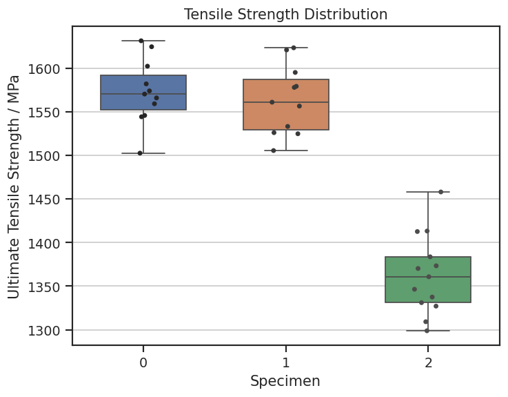

# Calculate statistics for a set of records

Summarise (roll up) test results into new statistical data records.

In this example, the tests are stored in *Tensile Test Data* table and the statistical data is stored in *Tensile
Statistical Data*. Since the sample data is arranged by specimen, the mean and other statistics will be stored by
specimen in the new record.

Statistical data is commonly stored using meta-attributes. Here, we store the mean of each property as the attribute
value, and statistical results (*Minimum*, *Maximum*, *Median*, *Range* and *Standard Deviation*) as its
meta-attributes whenever possible.

## Define a function which rolls up an attribute

Create a function to calculate statistics for, and store the values on the meta-attributes of, a target attribute.

The `rollup_point_attribute()` method below is a general example which will work whether meta-attributes are present
or not, or if the number of samples is too small to provide meaningful statistics. It checks if each named
meta-attribute exists, then sets existing meta-attributes and updates them by calling `Record.set_attributes()`.

To simplify your own roll-up, you can:

* Make sure there are meta-attributes for roll-up statistics on all relevant attributes when setting up a Granta MI
  schema.
* Make sure all the target attributes in your script have the same meta-attributes.
* Set up a workflow where all statistical data records are created new.


```python
import statistics
from typing import List
import ansys.grantami.core as mpy

def rollup_point_attribute(
    source_attributes: List[mpy.AttributeValue],
    target_attribute: mpy.AttributeValue,
    record: mpy.Record,
) -> None:
    if any(isinstance(attr, mpy.AttributePointMulti) for attr in source_attributes):
        raise TypeError("Multi-valued points are not supported by this script")
    
    values = [attr.value for attr in source_attributes if attr.value]

    if len(values) == 0:
        return

    target_attribute.unit = source_attributes[0].unit
    target_attribute.value = statistics.mean(values)
    updated_meta_attributes = []

    if "Minimum" in target_attribute.meta_attributes:
        target_attribute.meta_attributes["Minimum"].value = min(values)
        target_attribute.meta_attributes["Minimum"].unit = target_attribute.unit
        updated_meta_attributes.append("Minimum")

    if "Maximum" in target_attribute.meta_attributes:
        target_attribute.meta_attributes["Maximum"].value = max(values)
        target_attribute.meta_attributes["Maximum"].unit = target_attribute.unit
        updated_meta_attributes.append("Maximum")

    if "Median" in target_attribute.meta_attributes:
        target_attribute.meta_attributes["Median"].value = statistics.median(values)
        target_attribute.meta_attributes["Median"].unit = target_attribute.unit
        updated_meta_attributes.append("Median")

    if "Number of Samples" in target_attribute.meta_attributes:
        target_attribute.meta_attributes["Number of Samples"].value = len(values)
        updated_meta_attributes.append("Number of Samples")

    if "Range" in target_attribute.meta_attributes:
        target_attribute.meta_attributes["Range"].value = max(values) - min(values)
        target_attribute.meta_attributes["Range"].unit = target_attribute.unit
        updated_meta_attributes.append("Range")

    if len(values) > 2 and "Standard Deviation" in target_attribute.meta_attributes:
        target_attribute.meta_attributes["Standard Deviation"].value = statistics.stdev(values)
        target_attribute.meta_attributes["Standard Deviation"].unit = target_attribute.unit
        updated_meta_attributes.append("Standard Deviation")

    record.set_attributes([target_attribute])
    record.set_attributes([target_attribute.meta_attributes[updated_meta] for updated_meta in updated_meta_attributes])
```

## Define a function which copies attribute values

Define a `copy_attribute()` function which copies an attribute value from the source records, for example a *Specimen
ID* stored in a short-text attribute, or a test temperature.

This example supports several attribute types, and could easily be extended to support others such as discrete or
hyperlink.


```python
def copy_attribute(
    source_attributes: List[mpy.AttributeValue],
    target_attribute: mpy.AttributeValue,
    record: mpy.Record,
) -> None:
    if target_attribute.type == "POIN":
        if any(isinstance(attr, mpy.AttributePointMulti) for attr in source_attributes):
            raise TypeError("Multi-valued points are not supported by this script")
        values = {attr.value for attr in source_attributes if attr.value}
        if len(values) != 1:
            formatted_values = ", ".join(values)
            raise ValueError(f"Values must be identical to copy, received '{formatted_values}'")
        target_attribute.value = values.pop()

    elif target_attribute.type == "DISC":
        if any(isinstance(attr, mpy.AttributeDiscreteMulti) for attr in source_attributes):
            raise TypeError("Multi-valued discretes are not supported by this script")
        values = {attr.value for attr in source_attributes if attr.value}
        if len(values) != 1:
            formatted_values = ", ".join(values)
            raise ValueError(f"Values must be identical to copy, received '{formatted_values}'")
        target_attribute.value = values.pop()

    else:
        values = {attr.value for attr in source_attributes if attr.value}
        if len(values) != 1:
            formatted_values = ", ".join(values)
            raise ValueError(f"Values must be identical to copy, received '{formatted_values}'")
        target_attribute.value = values.pop()

    record.set_attributes([target_attribute])
```

## Get test data from Granta MI

Composite data in Granta MI is stored according to layup orientation and *Specimen ID*. The roll-up process retains
the overall structure of the records, but creates a single new record for each specimen.

Connect to Granta MI and fetch the folder corresponding to the composite *3M, S-Glass Unitape S2/SP381*:


```python
mi = mpy.SessionBuilder("http://my.server.name/mi_servicelayer").with_autologon()

db = mi.get_db(db_key="MI_Training")
test_table = db.get_table("Tensile Test Data")
statistics_table = db.get_table("Tensile Statistical Data")

material_record = test_table.search_for_records_by_name("3M, S-Glass Unitape S2/SP381")[0]
material_record
```


*Previous cell output:*
```output
<Record long name: 3M, S-Glass Unitape S2/SP381>
```


To make processing easier, convert the structure of the data from

    Material => Orientation => RTD => Specimen => Test result

to a dictionary with each layer indexed by name (removing the redundant layers):

    { Orientation name :
        { Specimen name :
            [ Test 1,
              Test 2 ...
            ]
        }
    }

Although this structure is sufficient for this example, a network library or tree wrapper class might be better suited
to dealing with advanced tree-traversal.


```python
orientation_records = material_record.children
test_records = {
    orientation.name: {
        specimen.name: specimen.children
        for specimen in test_table.get_records_from_path(
            starting_node=orientation,
            tree_path=["RTD"],
            use_short_names=True,
        )
    }
    for orientation in orientation_records
}
```

Define the attributes you want to calculate statistics for, and those you want to copy from the test records.

To fetch large numbers of records or attributes efficiently, use the `table.bulk_fetch()` method (see
[Performance optimization](../../user_guide/performance_optimization.rst)).


```python
attributes_to_rollup = [
    "Ultimate Tensile Strength",
    "Young's Modulus (11-axis)",
]
attributes_to_copy = [
    "Test Temperature",
    "Test Type",
    "Material designation",
    "Composite system type",
    "Test Environment",
]

test_table.bulk_fetch(
    records=[
        test for orientation in test_records.values()
        for specimen in orientation.values()
        for test in specimen
    ],
    attributes=attributes_to_copy + attributes_to_rollup,
)
```

Create box-plots for three of the specimens using the `seaborn` plotting libraries, first 'flattening' the data into a
usable list of `numpy` arrays.

Alternatively, you could convert the data into a `pandas` DataFrame at this point (useful if you needed to process the
data further).


```python
import seaborn as sns
import numpy as np
import matplotlib.pyplot as plt

plt.rcParams["figure.dpi"] = 125

specimens_to_plot = ["LBJ42", "LBJ53", "LBJ62"]
specimen_data = {specimen_name: test_records["0° tension"][specimen_name] for specimen_name in specimens_to_plot}
plot_data = [
    np.array([test.attributes["Ultimate Tensile Strength"].value for test in specimen])
    for specimen in specimen_data.values()
]

y_unit = test_table.attributes["Ultimate Tensile Strength"].unit

sns.set(context="notebook", style="ticks")
f, ax = plt.subplots()
sns.boxplot(data=plot_data, width=0.6)
sns.stripplot(data=plot_data, size=4, palette="dark:.3", linewidth=0)

ax.tick_params(axis="x")
ax.set_ylabel(f"Ultimate Tensile Strength / {y_unit}")
ax.set_xlabel("Specimen")
ax.set_title("Tensile Strength Distribution")
ax.yaxis.grid(True)
plt.show()
```


    

    


Perform the roll-up by creating the new records and iterating through the attributes defined above, copying or rolling
up as required. Here we have used the `table.path_from()` method to create a folder path for each orientation, and
`table.create_record()` for each new roll-up record.

Finally, use `Session.update()` to write the new record to the server, then set and update links between the new
statistical data record and the test records it summarises.


```python
import datetime

timestamp = datetime.datetime.now().isoformat()
for orientation, specimens in test_records.items():
    folder = statistics_table.path_from(
        starting_node=None,
        tree_path=[
            "Epoxy/Glass",
            "3M, S-Glass Unitape S2/SP381",
            timestamp,
            orientation,
            "RTD",
        ],
        color=mpy.RecordColor.Aqua,
    )
    for specimen, test_runs in specimens.items():
        rollup_record = statistics_table.create_record(name=specimen, parent=folder)
        for rollup in attributes_to_rollup:
            source_attributes = [test_run.attributes[rollup] for test_run in test_runs]
            try:
                target_attribute = rollup_record.attributes[rollup]
                rollup_point_attribute(source_attributes, target_attribute, rollup_record)
            except TypeError:  # Attribute contains multivalued data
                continue
            except KeyError:
                print("No attribute in target table to roll attribute '{0}' into.".format(rollup))
                continue

        for copy_attr in attributes_to_copy:
            source_attributes = [test_run.attributes[copy_attr] for test_run in test_runs]
            try:
                target_attribute = rollup_record.attributes[copy_attr]
                copy_attribute(source_attributes, target_attribute, rollup_record)
            except TypeError:  # Attribute contains multivalued data
                continue
            except KeyError:
                print("No attribute in target table to copy attribute '{0}' into.".format(copy_attr))
                continue

        rollup_record = mi.update([rollup_record])[0]
        rollup_record.set_links("Tensile Test Data", test_runs)

        rollup_record = mi.update_links([rollup_record])[0]
        print(
            f"Rollup completed for the specimen '{rollup_record.name}', "
            f"view this record at '{rollup_record.viewer_url}'"
        )
```
*Previous cell output:*
```output
Rollup completed for the specimen 'LBU15', view this record at 'http://my.server.name/mi/datasheet.aspx?dbKey=MI_Training&recordHistoryGuid=de12216b-85c0-49c9-b605-3448a89e13c5'
Rollup completed for the specimen 'LBU14', view this record at 'http://my.server.name/mi/datasheet.aspx?dbKey=MI_Training&recordHistoryGuid=00addbdf-1631-4bef-99cc-6c0a962f1833'
Rollup completed for the specimen 'LBJ83', view this record at 'http://my.server.name/mi/datasheet.aspx?dbKey=MI_Training&recordHistoryGuid=2395f499-c293-4446-acb3-1e904fafab90'
Rollup completed for the specimen 'LBJ62', view this record at 'http://my.server.name/mi/datasheet.aspx?dbKey=MI_Training&recordHistoryGuid=f44b6cb6-749e-4913-861d-5cd07d8db2d7'
Rollup completed for the specimen 'LBJ53', view this record at 'http://my.server.name/mi/datasheet.aspx?dbKey=MI_Training&recordHistoryGuid=f94cfc30-d44c-4100-b2f2-a7b57abf4d85'
Rollup completed for the specimen 'LBJ42', view this record at 'http://my.server.name/mi/datasheet.aspx?dbKey=MI_Training&recordHistoryGuid=219396fd-ad80-4def-a91c-f435074ef72c'
Rollup completed for the specimen 'LBJ14', view this record at 'http://my.server.name/mi/datasheet.aspx?dbKey=MI_Training&recordHistoryGuid=6d964778-afc3-42e3-808f-c86f3253815f'
Rollup completed for the specimen 'LBJ13', view this record at 'http://my.server.name/mi/datasheet.aspx?dbKey=MI_Training&recordHistoryGuid=9de8cc1b-c728-4ed4-844c-ae47ee57f929'
```