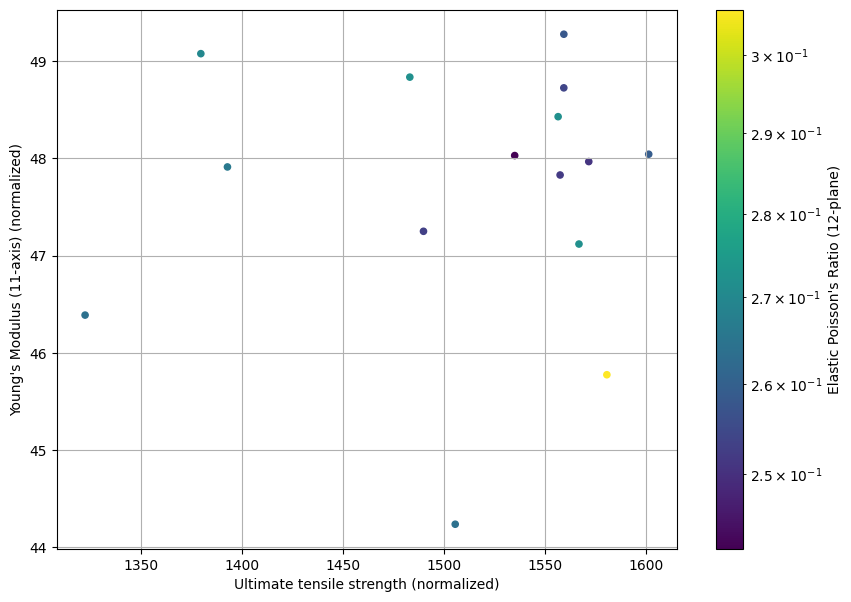

# Exporting data

Export the values of Ultimate tensile strength, Modulus, Baseline fiber volume, and Poisson's ratio for a set of
records from the MI Training database.

This example demonstrates:

* Retrieving a list of databases from a Granta MI server
* Browsing the tables of a Granta MI database
* Searching a Granta MI database using the *CriteriaSearch* operation
* Retrieving values for attributes of a record

## Create a Granta MI Session

Import the ansys.grantami.backend.soap package, and create a connection to a Granta MI server.


```python
import ansys.grantami.backend.soap as gdl

session = gdl.GRANTA_MISession("http://my.server.name/mi_servicelayer", auto_logon=True)
```

## Get the Databases

Access the browse service from the session and execute the *GetDatabases* method.


```python
browse_service = session.browse_service
databases = browse_service.get_databases().databases

print(f"Found {len(databases)} databases on the Granta MI Server")
for d in databases:
    print(f"Database key: {d.db_key}, database name: {d.volume_name}")
```
*Previous cell output:*
```output
Found 1 databases on the Granta MI Server
Database key: MI_Training, database name: MI Training
```
Use pandas to display the available databases.


```python
import pandas as pd

df = pd.DataFrame(
    {
        "DBKey": [db.db_key for db in databases],
        "DBName": [db.volume_name for db in databases],
    }
)
df
```


<div>
<table border="1" class="dataframe">
  <thead>
    <tr style="text-align: right;">
      <th></th>
      <th>DBKey</th>
      <th>DBName</th>
    </tr>
  </thead>
  <tbody>
    <tr>
      <th>0</th>
      <td>MI_Training</td>
      <td>MI Training</td>
    </tr>
  </tbody>
</table>
</div>


## Get the tables in a database

Use the *GetTables* method from the browse service to see what tables are available in the MI Training database.


```python
dbKey = "MI_Training"

tables = browse_service.get_tables(gdl.GetTables(db_key=dbKey)).table_details

print(f"Found {len(tables)} tables in database {dbKey}")
print("Printing the first 5")
for t in tables[:5]:
    print(f"Table name: {t.table_reference.name}")
```
*Previous cell output:*
```output
Found 20 tables in database MI_Training
Printing the first 5
Table name: MaterialUniverse
Table name: ProcessUniverse
Table name: Restricted Substances
Table name: Legislations and Lists
Table name: Design Data
```
## Searching a database

Search MI Training for all records in the Tensile Test Data table which have a defined *Young's modulus (11-axis)
normalized)*


```python
table = "Tensile Test Data"
attribute = "Young's modulus (11-axis) (normalized)"

table_ref = gdl.PartialTableReference(table_name=table)
attr_ref = gdl.AttributeReference(
    name=attribute,
    db_key=dbKey,
    partial_table_reference=table_ref,
)
search_criterion = gdl.RecordSearchCriterion(
    search_attribute=attr_ref,
    exists_search_value=gdl.ExistsSearchValue(),
)
request = gdl.CriteriaSearch(
    db_key=dbKey,
    search_criteria=[search_criterion],
)

search_results = session.search_service.criteria_search(request).search_results
```

Print the *shortName* and *longName* of the first 5 records returned by the search.


```python
df2 = pd.DataFrame(
    {
        "ShortName": [r.short_name for r in search_results],
        "LongName": [r.long_name for r in search_results],
    }
)
df2.head()
```


<div>
<table border="1" class="dataframe">
  <thead>
    <tr style="text-align: right;">
      <th></th>
      <th>ShortName</th>
      <th>LongName</th>
    </tr>
  </thead>
  <tbody>
    <tr>
      <th>0</th>
      <td>LBJ8312A</td>
      <td>S-Glass Unitape S2/SP381, 3M, 0° tension, Spec...</td>
    </tr>
    <tr>
      <th>1</th>
      <td>LBJ5313A</td>
      <td>S-Glass Unitape S2/SP381, 3M, 0° tension, Spec...</td>
    </tr>
    <tr>
      <th>2</th>
      <td>LBJ4212A</td>
      <td>S-Glass Unitape S2/SP381, 3M, 0° tension, Spec...</td>
    </tr>
    <tr>
      <th>3</th>
      <td>LBJ6212A</td>
      <td>S-Glass Unitape S2/SP381, 3M, 0° tension, Spec...</td>
    </tr>
    <tr>
      <th>4</th>
      <td>LBJ6213A</td>
      <td>S-Glass Unitape S2/SP381, 3M, 0° tension, Spec...</td>
    </tr>
  </tbody>
</table>
</div>


## Export data from records

Create attribute references for the attributes you want to export and export data from all records.


```python
attributes = [
    "Young's Modulus (11-axis) (normalized)",
    "Ultimate tensile strength (normalized)",
    "Baseline fiber volume",
    "Elastic Poisson's Ratio (12-plane)",
]

attribute_refs = [
    gdl.AttributeReference(
        name=a,
        db_key=dbKey,
        partial_table_reference=table_ref,
    )
    for a in attributes
]
record_refs = [r.record_reference for r in search_results]
request = gdl.GetRecordAttributesByRefRequest(
    record_references=record_refs,
    attribute_references=attribute_refs,
)

record_data = session.data_export_service.get_record_attributes_by_ref(request).record_data
```

Print the values of the attributes from the first 5 exported records. Note that some records may not have values for
all attributes.


```python
s = [None] * len(df2)
for attribute in attributes:
    for idx, record in enumerate(record_data):
        attr_value = next((x for x in record.attribute_values if x.attribute_name == attribute), None)
        s[idx] = attr_value.point_data_value.points[0].value if attr_value else None
    df2[attribute] = s

df2.head()
```


<div>
<table border="1" class="dataframe">
  <thead>
    <tr style="text-align: right;">
      <th></th>
      <th>ShortName</th>
      <th>LongName</th>
      <th>Young's Modulus (11-axis) (normalized)</th>
      <th>Ultimate tensile strength (normalized)</th>
      <th>Baseline fiber volume</th>
      <th>Elastic Poisson's Ratio (12-plane)</th>
    </tr>
  </thead>
  <tbody>
    <tr>
      <th>0</th>
      <td>LBJ8312A</td>
      <td>S-Glass Unitape S2/SP381, 3M, 0° tension, Spec...</td>
      <td>49.276835</td>
      <td>1559.477024</td>
      <td>53.473</td>
      <td>0.258</td>
    </tr>
    <tr>
      <th>1</th>
      <td>LBJ5313A</td>
      <td>S-Glass Unitape S2/SP381, 3M, 0° tension, Spec...</td>
      <td>47.249776</td>
      <td>1490.005443</td>
      <td>53.473</td>
      <td>0.253</td>
    </tr>
    <tr>
      <th>2</th>
      <td>LBJ4212A</td>
      <td>S-Glass Unitape S2/SP381, 3M, 0° tension, Spec...</td>
      <td>45.774298</td>
      <td>1580.774931</td>
      <td>53.473</td>
      <td>0.306</td>
    </tr>
    <tr>
      <th>3</th>
      <td>LBJ6212A</td>
      <td>S-Glass Unitape S2/SP381, 3M, 0° tension, Spec...</td>
      <td>49.076887</td>
      <td>1379.806528</td>
      <td>53.473</td>
      <td>0.270</td>
    </tr>
    <tr>
      <th>4</th>
      <td>LBJ6213A</td>
      <td>S-Glass Unitape S2/SP381, 3M, 0° tension, Spec...</td>
      <td>47.911673</td>
      <td>1392.975515</td>
      <td>53.473</td>
      <td>0.266</td>
    </tr>
  </tbody>
</table>
</div>


Create a plot of the exported values


```python
import matplotlib

df2.plot.scatter(
    x="Ultimate tensile strength (normalized)",
    y="Young's Modulus (11-axis) (normalized)",
    loglog=False,
    c="Elastic Poisson's Ratio (12-plane)",
    colormap="viridis",
    norm=matplotlib.colors.LogNorm(),
    grid=True,
    figsize=(10, 7),
)
```


*Previous cell output:*
```output
<Axes: xlabel='Ultimate tensile strength (normalized)', ylabel="Young's Modulus (11-axis) (normalized)">
```


    

    

