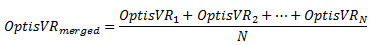

# OptisVRMerge 

## Description 

Merges several maps into a new map.

**Note:** 



Returns 1 if the call has succeeded, 0 otherwise.

## Syntax 

*object*.OptisVRMerge\(VARIANT\* *pInputListOptisVR*, BSTR *strOutputFileName*\) As Int

- *object*: Virtual Reality Lab object

- *pInputListOptisVR*: tab including the absolute filename strings of all the Speos360 files to merge

- *strOutputFileName*: absolute filename string for the result of the merge operation


## Example 

```
Sub OptisVRMerge()
'Error Management
Dim Error As Integer
'Declare VRLab
Dim VirtualRealityLab As Object
Set VirtualRealityLab = CreateObject("HDRIViewer.Application")
'Definition of the Speos360 files to merge
Dim FileTab
ReDim FileTab(2)
FileTab(0) = "U:\AMT\API VRLab\InteriorCar1.speos360"
FileTab(1) = "U:\AMT\API VRLab\InteriorCar2.speos360"
'Execution of the merge operation
Error = VirtualRealityLab.OptisVRMerge(FileTab, "U:\AMT\API VRLab\InteriorCar_Merged.speos360")
MsgBox ("Files Merged")
End Sub

```


