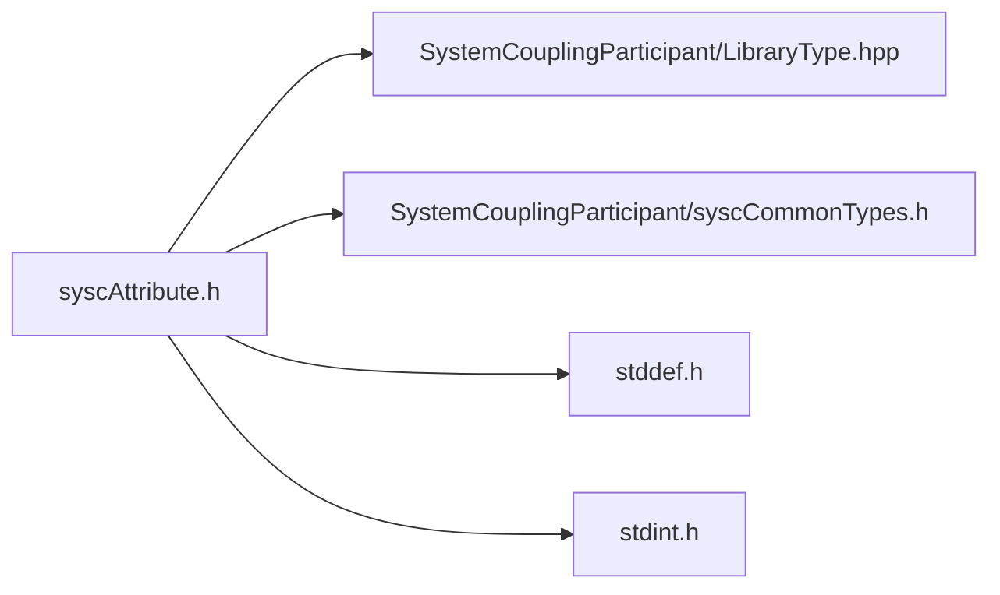

# File syscAttribute.h

![][C]

**Location**: `syscAttribute.h`


## Classes

* [SyscRealAttribute](structSyscRealAttribute.md#structSyscRealAttribute)
* [SyscIntegerAttribute](structSyscIntegerAttribute.md#structSyscIntegerAttribute)

## Includes

* SystemCouplingParticipant/LibraryType.hpp
* SystemCouplingParticipant/syscCommonTypes.h
* <stddef.h>
* <stdint.h>





## Functions

<a id="group__SyscParticipantLibraryCAPI_1ga7025ebcdef40667b4c2df0d2b087f600"></a>
### Function syscGetRealAttribute

<a id="group__SyscParticipantLibraryCAPI_1ga65737d6497a88298c80afab5d62f7687"></a>
### Function syscGetRealAttributeVDM

<a id="group__SyscParticipantLibraryCAPI_1gac4c28a276819a5f6abd81d3b1448d9c9"></a>
### Function syscGetRealAttributeBounds

<a id="group__SyscParticipantLibraryCAPI_1ga982541fc4b4624b14f1b033e0348b26a"></a>
### Function syscGetRealAttributeLB

<a id="group__SyscParticipantLibraryCAPI_1gaa0dd0654f5cc1441edf161e179f530eb"></a>
### Function syscGetRealAttributeUB

<a id="group__SyscParticipantLibraryCAPI_1gaf6d02a55f607a7af07039957b21ab511"></a>
### Function syscGetIntegerAttribute

<a id="group__SyscParticipantLibraryCAPI_1gac3ae9103fa3cad3c60b1f794ecb27752"></a>
### Function syscGetIntegerAttributeVM

<a id="group__SyscParticipantLibraryCAPI_1gaa83ae2839ef394b34af5949c40a4e60c"></a>
### Function syscGetIntegerAttributeBounds

<a id="group__SyscParticipantLibraryCAPI_1ga8c622398624d6aa557656df497b86ddb"></a>
### Function syscGetIntegerAttributeLB

<a id="group__SyscParticipantLibraryCAPI_1gab6167fd4ff37c4eff9d6fd20738a26bf"></a>
### Function syscGetIntegerAttributeUB

## Source


```
/*
* Copyright ANSYS, Inc. Unauthorized use, distribution, or duplication is prohibited.
*/

#pragma once

#include "SystemCouplingParticipant/LibraryType.hpp"

#include "SystemCouplingParticipant/syscCommonTypes.h"

#include <stddef.h>
#include <stdint.h>

#ifdef __cplusplus
extern "C" {
#endif


typedef struct {
  char name[SYSC_STRING_LENGTH];     
  double value;                      
  SyscDimensionality dimensionality; 
  int modifiable;                    
  int hasLowerBound;                 
  int hasUpperBound;                 
  double lowerBound;                 
  double upperBound;                 
} SyscRealAttribute;


SyscRealAttribute syscGetRealAttribute(
  const char* name,
  double value,
  SyscDimensionality dimensionality);


SyscRealAttribute syscGetRealAttributeVDM(
  const char* name,
  double value,
  SyscDimensionality dimensionality,
  int modifiable);


SyscRealAttribute syscGetRealAttributeBounds(
  const char* name,
  double value,
  SyscDimensionality dimensionality,
  int modifiable,
  double lowerBound,
  double upperBound);


SyscRealAttribute syscGetRealAttributeLB(
  const char* name,
  double value,
  SyscDimensionality dimensionality,
  int modifiable,
  double lowerBound);


SyscRealAttribute syscGetRealAttributeUB(
  const char* name,
  double value,
  SyscDimensionality dimensionality,
  int modifiable,
  double upperBound);

typedef struct {
  char name[SYSC_STRING_LENGTH]; 
  long long int value;           
  int modifiable;                
  int hasLowerBound;             
  int hasUpperBound;             
  long long int lowerBound;      
  long long int upperBound;      
} SyscIntegerAttribute;


SyscIntegerAttribute syscGetIntegerAttribute(
  const char* name,
  long long int value);


SyscIntegerAttribute syscGetIntegerAttributeVM(
  const char* name,
  long long int value,
  int modifiable);


SyscIntegerAttribute syscGetIntegerAttributeBounds(
  const char* name,
  long long int value,
  int modifiable,
  long long int lowerBound,
  long long int upperBound);


SyscIntegerAttribute syscGetIntegerAttributeLB(
  const char* name,
  long long int value,
  int modifiable,
  long long int lowerBound);


SyscIntegerAttribute syscGetIntegerAttributeUB(
  const char* name,
  long long int value,
  int modifiable,
  long long int upperBound);


#ifdef __cplusplus
}
#endif
```


[public]: https://img.shields.io/badge/-public-brightgreen (public)
[C]: https://img.shields.io/badge/language-C-blue (C)