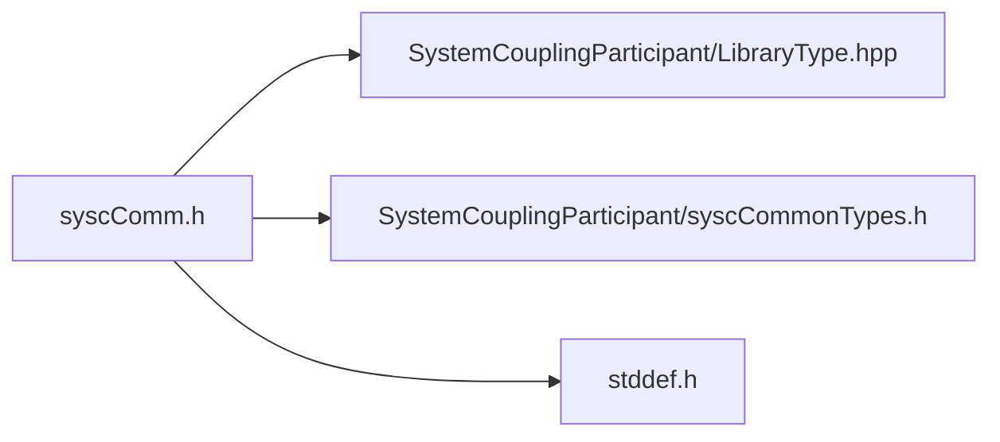

# File syscComm.h

![][C]

**Location**: `syscComm.h`


## Classes

* [SyscHostAndPort](structSyscHostAndPort.md#structSyscHostAndPort)

## Includes

* SystemCouplingParticipant/LibraryType.hpp
* SystemCouplingParticipant/syscCommonTypes.h
* <stddef.h>





## Typedefs

<a id="syscComm_8h_1a5869b904d7585095ac78a7352e664714"></a>
### Typedef SyscHostAndPort

![][public]

**Definition**: `syscComm.h` (line 28)


```
typedef struct SyscHostAndPort SyscHostAndPort
```


Provide a structure for host and port for remote connections.

**Parameters**:

* **host**: remote server host name
* **port**: remote server port number


**Return type**: struct SyscHostAndPort

## Functions

<a id="syscComm_8h_1aeaa1828a785bf6066df43406d37596b6"></a>
### Function syscCreateRootServer

![][public]


```
SyscHostAndPort syscCreateRootServer(const char *host, unsigned short port)
```


Provide a function to create a remote server for connecting multiple applications.

If it is desired to connect multiple applications using the SCP library, the global root rank must create a remote server for client connections from other processes. This function creates this remote server and returns its host name and port number. Note that only the global root process should call this function.


The returned host and port structure provides the information for other processes to connect to the global root process. The connections are established during the invocation of one of the syscConnect* functions. See the SCP library developer's guide for more details.


**Parameters**:

* **host**: Host name for the remote server. If left empty, SCP library will automatically determine the host name and return the value. If the non-empty host name is provided, it will be respected and returned in the host and port structure.
* **port**: Port number for the remote server. If zero value is provided, SCP library will automatically determine the available port number on which the remote server is listening for incoming connections and return the value. If non-zero value is provided, SCP library will attempt to start the remote server on that port. If the requested port is not available, an error state will be returned.


**Returns**:

Host and port for the remote server. If any error occurs, an empty structure will be returned (empty host name, port 0).


**Parameters**:

* const char * **host**
* unsigned short **port**

**Return type**: [SyscHostAndPort](structSyscHostAndPort.md#structSyscHostAndPort)

<a id="syscComm_8h_1a3f1caeb8eeb1e24fdae32fef01238739"></a>
### Function syscGetMyRank

![][public]


```
int syscGetMyRank()
```


Get the unique rank assigned to this process by the SCP library.


**Return type**: int

<a id="syscComm_8h_1a441719a17fed65f30fe9a8505f403e56"></a>
### Function syscReduceSumUInt64

![][public]


```
uint64_t syscReduceSumUInt64(uint64_t value)
```


Perform a reduction to get sum of value across all processes, connected by the SCP library.


**Parameters**:

* uint64_t **value**

**Return type**: uint64_t

<a id="syscComm_8h_1a5b037076ad25efe4bdbea315fc5c4fad"></a>
### Function syscReduceMaxDouble

![][public]


```
double syscReduceMaxDouble(double value)
```


Perform a reduction to get max value across all processes, connected by the SCP library.


**Parameters**:

* double **value**

**Return type**: double

## Source


```
/*
* Copyright ANSYS, Inc. Unauthorized use, distribution, or duplication is prohibited.
*/

#pragma once

#include "SystemCouplingParticipant/LibraryType.hpp"

#include "SystemCouplingParticipant/syscCommonTypes.h"

#include <stddef.h>

#ifdef __cplusplus
extern "C" {
#endif

typedef struct SyscHostAndPort {
  char host[SYSC_STRING_LENGTH];
  unsigned short port;
} SyscHostAndPort;


SyscHostAndPort syscCreateRootServer(const char* host, unsigned short port);

 int syscGetMyRank();

 uint64_t syscReduceSumUInt64(uint64_t value);

 double syscReduceMaxDouble(double value);

#ifdef __cplusplus
}
#endif
```


[public]: https://img.shields.io/badge/-public-brightgreen (public)
[C]: https://img.shields.io/badge/language-C-blue (C)