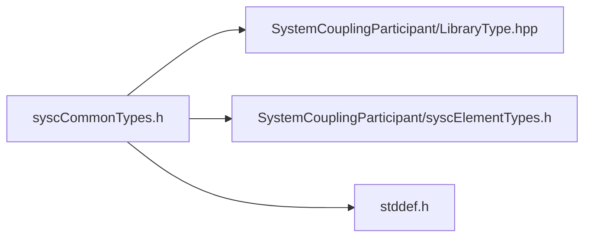

# File syscCommonTypes.h

![][C]

**Location**: `syscCommonTypes.h`


## Classes

* [SyscDimensionality](structSyscDimensionality.md#structSyscDimensionality)
* [SyscTimeStep](structSyscTimeStep.md#structSyscTimeStep)
* [SyscSolutionControl](structSyscSolutionControl.md#structSyscSolutionControl)
* [SyscError](structSyscError.md#structSyscError)
* [SyscSetupInfo](structSyscSetupInfo.md#structSyscSetupInfo)
* [SyscSetupFileInfo](structSyscSetupFileInfo.md#structSyscSetupFileInfo)
* [SyscResultsInfo](structSyscResultsInfo.md#structSyscResultsInfo)
* [SyscParticipantInfo](structSyscParticipantInfo.md#structSyscParticipantInfo)

## Includes

* SystemCouplingParticipant/LibraryType.hpp
* SystemCouplingParticipant/syscElementTypes.h
* <stddef.h>





## Macros

<a id="group__SyscParticipantLibraryCAPI_1gab4cd55b5b37dd76c5755020302086b15"></a>
### Macro SYSC\_STRING\_LENGTH


```
#define SYSC_STRING_LENGTH
```


## Enumeration types

<a id="group__SyscParticipantLibraryCAPI_1gade42aba1a68acbbf5956edcd388cdcda"></a>
### Enumeration type SyscLocation


```
enum SyscLocation { /* ... */ }
```


<a id="group__SyscParticipantLibraryCAPI_1ga007e2fd66e7263a63c114a6d12b3808d"></a>
### Enumeration type SyscTensorType


```
enum SyscTensorType { /* ... */ }
```


<a id="group__SyscParticipantLibraryCAPI_1gabf36499a0f333dc9b856c4bcbb25385a"></a>
### Enumeration type SyscTopology


```
enum SyscTopology { /* ... */ }
```


<a id="group__SyscParticipantLibraryCAPI_1ga83942e23c7ff51ec76e4632612a34d45"></a>
### Enumeration type SyscRegionDiscretizationType


```
enum SyscRegionDiscretizationType { /* ... */ }
```


<a id="group__SyscParticipantLibraryCAPI_1gacf32f1d9c1566f28bee2b348b2dcd9f5"></a>
### Enumeration type SyscInterfaceSide


```
enum SyscInterfaceSide { /* ... */ }
```


<a id="group__SyscParticipantLibraryCAPI_1gac5a5f66ee72fd8015eab632a642cf26d"></a>
### Enumeration type SyscDimension


```
enum SyscDimension { /* ... */ }
```


<a id="group__SyscParticipantLibraryCAPI_1gaedf008f34febb068e44cb21292dc167f"></a>
### Enumeration type SyscTimeIntegration


```
enum SyscTimeIntegration { /* ... */ }
```


<a id="group__SyscParticipantLibraryCAPI_1gaa28a3de6c7c91003a8a15721a5301f12"></a>
### Enumeration type SyscQuantityType


```
enum SyscQuantityType { /* ... */ }
```


<a id="group__SyscParticipantLibraryCAPI_1ga1e750bcf34a1c16aed218b03a95ee7ed"></a>
### Enumeration type SyscDataType


```
enum SyscDataType { /* ... */ }
```


<a id="group__SyscParticipantLibraryCAPI_1ga10ce3774353dfbc811147a9ad211b3cd"></a>
### Enumeration type SyscConvergenceStatus


```
enum SyscConvergenceStatus { /* ... */ }
```


<a id="group__SyscParticipantLibraryCAPI_1ga7d5b3786948265c902f7231abe6d79b5"></a>
### Enumeration type SyscAnalysisType


```
enum SyscAnalysisType { /* ... */ }
```


<a id="group__SyscParticipantLibraryCAPI_1gade3becc3625d881bdd988111e0895a3c"></a>
### Enumeration type SyscPrimitiveType


```
enum SyscPrimitiveType { /* ... */ }
```


<a id="group__SyscParticipantLibraryCAPI_1gab997855544b4c0ac77104b89faffae5d"></a>
### Enumeration type SyscParticipantType


```
enum SyscParticipantType { /* ... */ }
```


## Typedefs

<a id="syscCommonTypes_8h_1a29cac2a7bcb30e8f76c639e8aa8316bf"></a>
### Typedef SyscParticipantInfo

![][public]

**Definition**: `syscCommonTypes.h` (line 371)


```
typedef struct SyscParticipantInfo SyscParticipantInfo
```


**Return type**: struct SyscParticipantInfo

<a id="group__SyscParticipantLibraryCAPI_1gaaabd83bdde051f257f11c5c0cdd73990"></a>
### Typedef SyscSolutionControl

<a id="group__SyscParticipantLibraryCAPI_1ga17ef60969b3c919163ba2471eb95a28b"></a>
### Typedef SyscOpaqueDataAccess

<a id="group__SyscParticipantLibraryCAPI_1ga80be2caaea1dd7e82a2da155c7283875"></a>
### Typedef SyscSetupInfo

<a id="group__SyscParticipantLibraryCAPI_1ga97036eb61b15d6efd5f9602bd19bb562"></a>
### Typedef SyscSetupFileInfo

<a id="group__SyscParticipantLibraryCAPI_1gacab0987c6f6f3da0ae499505c3f67d9e"></a>
### Typedef SyscResultsInfo

## Functions

<a id="syscCommonTypes_8h_1a535be0a3cda4ea6aeb160c17bac238c4"></a>
### Function syscGetParticipantInfoDefault

![][public]


```
SyscParticipantInfo syscGetParticipantInfoDefault()
```


Provide a function to get & construct a default [SyscParticipantInfo](structSyscParticipantInfo.md#structSyscParticipantInfo) struct.

**Returns**:

[SyscParticipantInfo](structSyscParticipantInfo.md#structSyscParticipantInfo) A [SyscParticipantInfo](structSyscParticipantInfo.md#structSyscParticipantInfo) struct


**Return type**: [SyscParticipantInfo](structSyscParticipantInfo.md#structSyscParticipantInfo)

<a id="syscCommonTypes_8h_1a9071ddbfc5cf54e03c28c0747e924fa1"></a>
### Function syscGetParticipantInfo

![][public]


```
SyscParticipantInfo syscGetParticipantInfo(const char *scHost, unsigned short scPort, const char *participantName)
```


Provide a function to get & construct a [SyscParticipantInfo](structSyscParticipantInfo.md#structSyscParticipantInfo) struct if it doesn't exist.

**Parameters**:

* **scHost**: Name of the host on which System Coupling is running.
* **scPort**: Port number on which System Coupling is listening for participant connections.
* **participantName**: Name of this participant (e.g. "MAPDL-1").
* **buildInformation**: Information about the build of this participant solver.
* **isCosimulation**: Flag signifying if the simulation is a cosimulation.
* **transcriptFilename**: The filename to be given to the output participant transcript.


**Returns**:

[SyscParticipantInfo](structSyscParticipantInfo.md#structSyscParticipantInfo) A [SyscParticipantInfo](structSyscParticipantInfo.md#structSyscParticipantInfo) containing minimal attributes to connect to System Coupling


**Parameters**:

* const char * **scHost**
* unsigned short **scPort**
* const char * **participantName**

**Return type**: [SyscParticipantInfo](structSyscParticipantInfo.md#structSyscParticipantInfo)

<a id="syscCommonTypes_8h_1a1bfc8232912e47178cbc2f6f28997e2b"></a>
### Function syscGetParticipantInfoB

![][public]


```
SyscParticipantInfo syscGetParticipantInfoB(const char *scHost, unsigned short scPort, const char *participantName, const char *buildInformation)
```


**Parameters**:

* const char * **scHost**
* unsigned short **scPort**
* const char * **participantName**
* const char * **buildInformation**

**Return type**: [SyscParticipantInfo](structSyscParticipantInfo.md#structSyscParticipantInfo)

<a id="syscCommonTypes_8h_1ac22d0523ec1309af395e2f852afbf173"></a>
### Function syscGetParticipantInfoBT

![][public]


```
SyscParticipantInfo syscGetParticipantInfoBT(const char *scHost, unsigned short scPort, const char *participantName, const char *buildInformation, const char *transcriptFileName)
```


**Parameters**:

* const char * **scHost**
* unsigned short **scPort**
* const char * **participantName**
* const char * **buildInformation**
* const char * **transcriptFileName**

**Return type**: [SyscParticipantInfo](structSyscParticipantInfo.md#structSyscParticipantInfo)

<a id="group__SyscParticipantLibraryCAPI_1ga22ab81fcb82b1eb1b58bac1dd3fbcf0d"></a>
### Function syscGetDimensionality

<a id="group__SyscParticipantLibraryCAPI_1ga1d656df31d1a737654883968e029eb72"></a>
### Function syscGetSyscError

<a id="group__SyscParticipantLibraryCAPI_1ga65a1735a49d0e0ab7f32d03f27f325a3"></a>
### Function syscGetSetupInfo

<a id="group__SyscParticipantLibraryCAPI_1gae399cbc645966a48cc2928bb51018d9b"></a>
### Function syscGetSetupInfoA

<a id="group__SyscParticipantLibraryCAPI_1ga49c86c342e0c0d2881958a7a752eb99b"></a>
### Function syscGetSetupInfoAR

<a id="group__SyscParticipantLibraryCAPI_1gae3a34c9ed638c50c65e1d87dabe66737"></a>
### Function syscGetSetupInfoARD

<a id="group__SyscParticipantLibraryCAPI_1gaf3b03ee2974bbd198008e70e15dd1d1a"></a>
### Function syscGetSetupInfoARDT

<a id="group__SyscParticipantLibraryCAPI_1ga34fa5345c4ca947eca11bd6ee25f09ab"></a>
### Function syscGetSetupInfoARDTP

<a id="group__SyscParticipantLibraryCAPI_1gac80fa7c7f1ebe9a8d9ef3c4f90d274eb"></a>
### Function syscGetSetupFileInfo

<a id="group__SyscParticipantLibraryCAPI_1gabf49efc0bc2492b1c8198ba9bd3dab06"></a>
### Function syscGetResultsInfo

## Source


```
/*
* Copyright ANSYS, Inc. Unauthorized use, distribution, or duplication is prohibited.
*/

#pragma once

#include "SystemCouplingParticipant/LibraryType.hpp"

#include "SystemCouplingParticipant/syscElementTypes.h"

#include <stddef.h>

#ifdef __cplusplus
extern "C" {
#endif


#define SYSC_STRING_LENGTH 256

enum SyscLocation {
  SyscNode = 0,   
  SyscElement = 1 
};

enum SyscTensorType {
  SyscScalar = 0, 
  SyscVector = 1  
};

enum SyscTopology {
  SyscSurface = 2, 
  SyscVolume = 3   
};

enum SyscRegionDiscretizationType {
  SyscMeshRegion = 0,      
  SyscPointCloudRegion = 1 
};

enum SyscInterfaceSide {
  SyscInterfaceSide_One = 1,
  SyscInterfaceSide_Two = 2
};

enum SyscDimension {
  SyscD2 = 2,
  SyscD3 = 3
};

enum SyscTimeIntegration {
  SyscImplicit = 0,
  SyscExplicit = 1
};

typedef struct {
  double length;            
  double time;              
  double mass;              
  double temperature;       
  double amountOfSubstance; 
  double current;           
  double luminousIntensity; 
  double angle;             
} SyscDimensionality;


SyscDimensionality syscGetDimensionality();

enum SyscQuantityType {
  SyscUnspecified = 0,
  SyscForce = 1,
  SyscIncrementalDisplacement = 2,
  SyscTemperature = 3,
  SyscHeatRate = 4,
  SyscHeatTransferCoefficient = 5,
  SyscConvectionReferenceTemperature = 6,
  SyscModeShape = 7,
  SyscElectricalConductivity = 8
};

enum SyscDataType {
  SyscDataType_Real = 0,
  SyscDataType_Complex = 1
};

enum SyscConvergenceStatus {
  SyscDiverging = -1,
  SyscNotYetConverged = 0,
  SyscConverged = 1,
  SyscComplete = 2,
  SyscNotEvaluated = 3
};

enum SyscAnalysisType {
  SyscSteady = 0,    
  SyscTransient = 1, 
  SyscMapping = 2    
};

typedef struct {
  int timeStepNumber;  
  double startTime;    
  double timeStepSize; 
} SyscTimeStep;

typedef struct SyscSolutionControl {
  int minimumIterations; 
  int maximumIterations; 
} SyscSolutionControl;

typedef struct {
  int retcode;                      
  char message[SYSC_STRING_LENGTH]; 
} SyscError;


SyscError syscGetSyscError(int retcode, const char* message);

enum SyscPrimitiveType {
  SyscFloat = 0,         
  SyscDouble = 1,        
  SyscInt32 = 2,         
  SyscInt64 = 3,         
  SyscUnsignedInt16 = 4, 
  SyscUnsignedInt64 = 5  
};

enum SyscParticipantType {
  SyscDEFAULT = 0,
  SyscCFX = 1,
  SyscFLUENT = 2,
  SyscMAPDL = 3,
  SyscAEDT = 4,
  SyscFMU = 5,
  SyscFMU_PROXY = 6,
  SyscEXTERNALDATA = 7,
  SyscFORTE = 8,
  SyscDEFAULT_SRV = 9,
  SyscMECH_SRV = 10,
  SyscCFD_SRV = 11,
  SyscSCDT_SRV = 12,
  SyscTHERMAL_DESKTOP = 13,
  SyscLS_DYNA = 14,
  SyscROCKY = 15
};

typedef void* SyscOpaqueDataAccess; 

/******************************* Setup info **********************************/

typedef struct SyscSetupInfo {
  enum SyscAnalysisType analysisType;       
  int restartsSupported;                    
  enum SyscDimension dimension;             
  enum SyscTimeIntegration timeIntegration; 
  enum SyscParticipantType participantType; 
} SyscSetupInfo;


SyscSetupInfo syscGetSetupInfo();


SyscSetupInfo syscGetSetupInfoA(
  enum SyscAnalysisType analysisType);


SyscSetupInfo syscGetSetupInfoAR(
  enum SyscAnalysisType analysisType,
  int restartsSupported);


SyscSetupInfo syscGetSetupInfoARD(
  enum SyscAnalysisType analysisType,
  int restartsSupported,
  enum SyscDimension dimension);


SyscSetupInfo syscGetSetupInfoARDT(
  enum SyscAnalysisType analysisType,
  int restartsSupported,
  enum SyscDimension dimension,
  enum SyscTimeIntegration timeIntegration);


SyscSetupInfo syscGetSetupInfoARDTP(
  enum SyscAnalysisType analysisType,
  int restartsSupported,
  enum SyscDimension dimension,
  enum SyscTimeIntegration timeIntegration,
  enum SyscParticipantType participantType);

/**************************** Setup file info ********************************/

typedef struct SyscSetupFileInfo {
  char setupFileName[SYSC_STRING_LENGTH]; 
  int restartsSupported;                  
} SyscSetupFileInfo;


SyscSetupFileInfo syscGetSetupFileInfo(
  const char* setupFileName);

/***************************** Results info **********************************/

typedef struct SyscResultsInfo {
  char baseFileName[SYSC_STRING_LENGTH]; 
} SyscResultsInfo;


SyscResultsInfo syscGetResultsInfo(const char* baseFileName);


typedef struct SyscParticipantInfo {
  char scHost[SYSC_STRING_LENGTH];
  unsigned short scPort;
  char participantName[SYSC_STRING_LENGTH];
  int isCosimulation;
  char buildInformation[SYSC_STRING_LENGTH];
  char transcriptFilename[SYSC_STRING_LENGTH];
  size_t numApps;
  char myHostName[SYSC_STRING_LENGTH];
} SyscParticipantInfo;


SyscParticipantInfo syscGetParticipantInfoDefault();


SyscParticipantInfo syscGetParticipantInfo(
  const char* scHost,
  unsigned short scPort,
  const char* participantName);


SyscParticipantInfo syscGetParticipantInfoB(
  const char* scHost,
  unsigned short scPort,
  const char* participantName,
  const char* buildInformation);


SyscParticipantInfo syscGetParticipantInfoBT(
  const char* scHost,
  unsigned short scPort,
  const char* participantName,
  const char* buildInformation,
  const char* transcriptFileName);

#ifdef __cplusplus
}
#endif
```


[public]: https://img.shields.io/badge/-public-brightgreen (public)
[C]: https://img.shields.io/badge/language-C-blue (C)