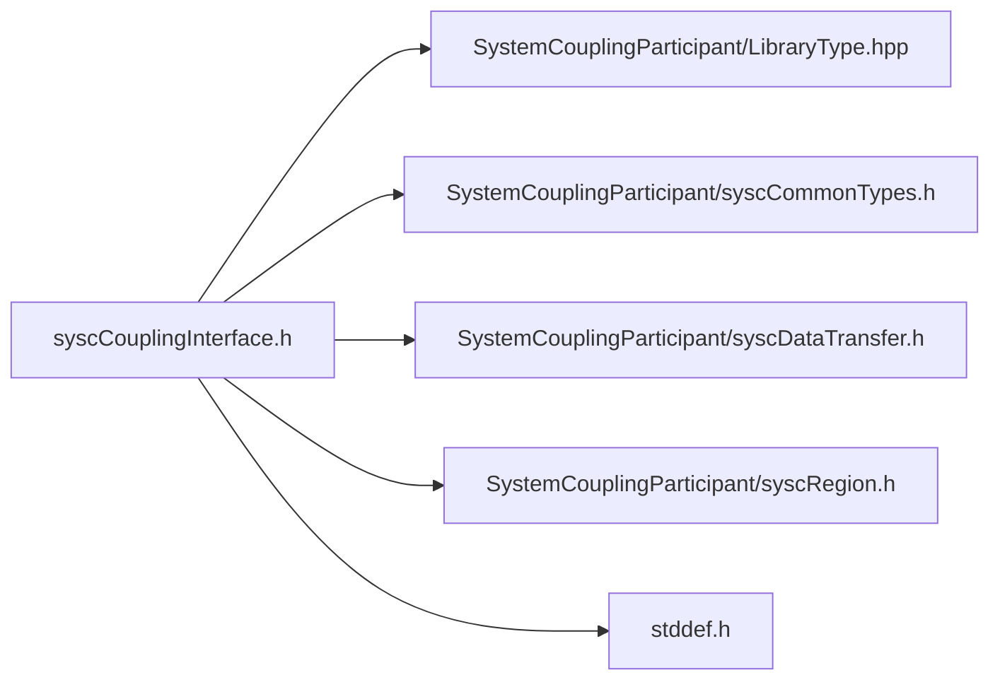

# File syscCouplingInterface.h

![][C]

**Location**: `syscCouplingInterface.h`


## Classes

* [SyscCouplingInterface](structSyscCouplingInterface.md#structSyscCouplingInterface)

## Includes

* SystemCouplingParticipant/LibraryType.hpp
* SystemCouplingParticipant/syscCommonTypes.h
* SystemCouplingParticipant/syscDataTransfer.h
* SystemCouplingParticipant/syscRegion.h
* <stddef.h>





## Typedefs

<a id="group__SyscParticipantLibraryCAPI_1ga828a191dd9fffcb117c398848b9ad10b"></a>
### Typedef SyscCouplingInterface

## Functions

<a id="group__SyscParticipantLibraryCAPI_1gae356c9cb4c0dd69f5e1ea9eef6a7c63b"></a>
### Function syscGetCouplingInterface

<a id="group__SyscParticipantLibraryCAPI_1gaa8401af709fa7638f76f168aa05784a3"></a>
### Function syscAddSideOneRegion

<a id="group__SyscParticipantLibraryCAPI_1ga3bbbec8ccb73b5da2997d2cdcd7abb6b"></a>
### Function syscAddSideTwoRegion

<a id="group__SyscParticipantLibraryCAPI_1gaec7e1373da295e5fb0c7ecfc52409888"></a>
### Function syscAddDataTransfer

<a id="group__SyscParticipantLibraryCAPI_1gade11af63d2e79ab75e7db7919998e6b5"></a>
### Function syscCouplingInterfaceGetNumDataTransfers

<a id="group__SyscParticipantLibraryCAPI_1ga13eed5fd3144989e2f7dc2265f6a199e"></a>
### Function syscCouplingInterfaceGetNumSideOneRegions

<a id="group__SyscParticipantLibraryCAPI_1gaf2e509aada51179b4ddab8d343f5e392"></a>
### Function syscCouplingInterfaceGetNumSideTwoRegions

<a id="group__SyscParticipantLibraryCAPI_1ga40ed5be0892f1d14a520221f8b439a45"></a>
### Function syscCouplingInterfaceGetDataTransfer

<a id="group__SyscParticipantLibraryCAPI_1ga7ab5c93d920b15c8d2e7ba6baddddb28"></a>
### Function syscCouplingInterfaceGetSideOneRegion

<a id="group__SyscParticipantLibraryCAPI_1ga1747f6ce3729ff459e26175ded7059f0"></a>
### Function syscCouplingInterfaceGetSideTwoRegion

## Source


```
/*
* Copyright ANSYS, Inc. Unauthorized use, distribution, or duplication is prohibited.
*/

#pragma once

#include "SystemCouplingParticipant/LibraryType.hpp"

#include "SystemCouplingParticipant/syscCommonTypes.h"
#include "SystemCouplingParticipant/syscDataTransfer.h"
#include "SystemCouplingParticipant/syscRegion.h"

#include <stddef.h>

#ifdef __cplusplus
extern "C" {
#endif


typedef struct SyscCouplingInterface {
  char name[SYSC_STRING_LENGTH]; 
} SyscCouplingInterface;


SyscCouplingInterface syscGetCouplingInterface(const char* name);


SyscError syscAddSideOneRegion(
  const SyscCouplingInterface couplingInterface,
  const SyscRegion region);


SyscError syscAddSideTwoRegion(
  const SyscCouplingInterface couplingInterface,
  const SyscRegion region);


SyscError syscAddDataTransfer(
  SyscCouplingInterface couplingInterface,
  SyscDataTransfer dataTransfer);


size_t syscCouplingInterfaceGetNumDataTransfers(
  SyscCouplingInterface couplingInterface);


size_t syscCouplingInterfaceGetNumSideOneRegions(
  SyscCouplingInterface couplingInterface);


size_t syscCouplingInterfaceGetNumSideTwoRegions(
  SyscCouplingInterface couplingInterface);


SyscDataTransfer syscCouplingInterfaceGetDataTransfer(
  SyscCouplingInterface couplingInterface,
  size_t index);


SyscRegion syscCouplingInterfaceGetSideOneRegion(
  SyscCouplingInterface couplingInterface,
  size_t index);


SyscRegion syscCouplingInterfaceGetSideTwoRegion(
  SyscCouplingInterface couplingInterface,
  size_t index);


#ifdef __cplusplus
}
#endif
```


[public]: https://img.shields.io/badge/-public-brightgreen (public)
[C]: https://img.shields.io/badge/language-C-blue (C)