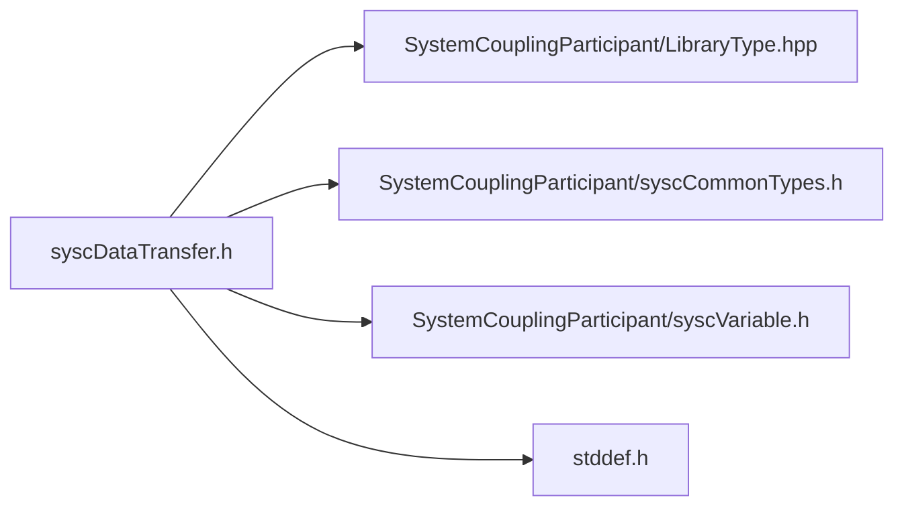

# File syscDataTransfer.h

![][C]

**Location**: `syscDataTransfer.h`


## Classes

* [SyscDataTransfer](structSyscDataTransfer.md#structSyscDataTransfer)

## Includes

* SystemCouplingParticipant/LibraryType.hpp
* SystemCouplingParticipant/syscCommonTypes.h
* SystemCouplingParticipant/syscVariable.h
* <stddef.h>





## Typedefs

<a id="group__SyscParticipantLibraryCAPI_1ga8e23d76b7478495ca52b0e1f719607fc"></a>
### Typedef SyscDataTransfer

## Functions

<a id="group__SyscParticipantLibraryCAPI_1ga10c3562aba2bdcef468fbde205008112"></a>
### Function syscGetDataTransfer

<a id="group__SyscParticipantLibraryCAPI_1gadb07659695562864d8bc0df67bec847e"></a>
### Function syscGetDataTransferST

## Source


```
/*
* Copyright ANSYS, Inc. Unauthorized use, distribution, or duplication is prohibited.
*/

#pragma once

#include "SystemCouplingParticipant/LibraryType.hpp"

#include "SystemCouplingParticipant/syscCommonTypes.h"
#include "SystemCouplingParticipant/syscVariable.h"

#include <stddef.h>

#ifdef __cplusplus
extern "C" {
#endif


typedef struct SyscDataTransfer {
  SyscVariable sourceVariable;
  SyscVariable targetVariable;
  enum SyscInterfaceSide targetSide;
} SyscDataTransfer;


SyscDataTransfer syscGetDataTransfer(
  SyscVariable sideOneVariable,
  SyscVariable sideTwoVariable,
  enum SyscInterfaceSide targetSide);


SyscDataTransfer syscGetDataTransferST(
  SyscVariable sourceVariable,
  SyscVariable targetVariable,
  enum SyscInterfaceSide targetSide);


#ifdef __cplusplus
}
#endif
```


[public]: https://img.shields.io/badge/-public-brightgreen (public)
[C]: https://img.shields.io/badge/language-C-blue (C)