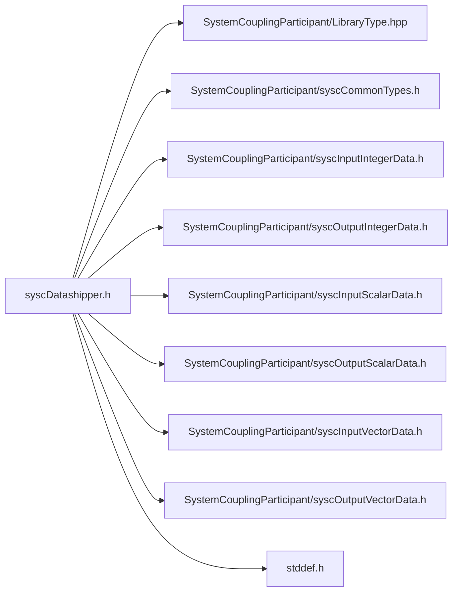

# File syscDatashipper.h

![][C]

**Location**: `syscDatashipper.h`


## Includes

* SystemCouplingParticipant/LibraryType.hpp
* SystemCouplingParticipant/syscCommonTypes.h
* SystemCouplingParticipant/syscInputIntegerData.h
* SystemCouplingParticipant/syscOutputIntegerData.h
* SystemCouplingParticipant/syscInputScalarData.h
* SystemCouplingParticipant/syscOutputScalarData.h
* SystemCouplingParticipant/syscInputVectorData.h
* SystemCouplingParticipant/syscOutputVectorData.h
* <stddef.h>





## Source


```
/*
* Copyright ANSYS, Inc. Unauthorized use, distribution, or duplication is prohibited.
*/

#pragma once

#include "SystemCouplingParticipant/LibraryType.hpp"

#include "SystemCouplingParticipant/syscCommonTypes.h"
#include "SystemCouplingParticipant/syscInputIntegerData.h"
#include "SystemCouplingParticipant/syscOutputIntegerData.h"
#include "SystemCouplingParticipant/syscInputScalarData.h"
#include "SystemCouplingParticipant/syscOutputScalarData.h"
#include "SystemCouplingParticipant/syscInputVectorData.h"
#include "SystemCouplingParticipant/syscOutputVectorData.h"

#include <stddef.h>

#ifdef __cplusplus
extern "C" {
#endif

#ifdef __cplusplus
}
#endif
```


[public]: https://img.shields.io/badge/-public-brightgreen (public)
[C]: https://img.shields.io/badge/language-C-blue (C)