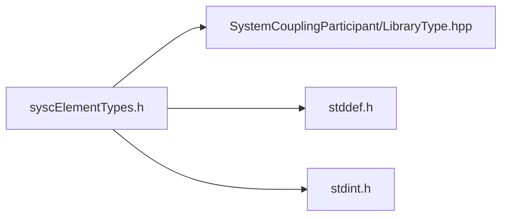

# File syscElementTypes.h

![][C]

**Location**: `syscElementTypes.h`


## Includes

* SystemCouplingParticipant/LibraryType.hpp
* <stddef.h>
* <stdint.h>





## Enumeration types

<a id="group__SyscParticipantLibraryCAPI_1gab18060c2493ddba0678016696642f005"></a>
### Enumeration type SyscElementTypes


```
enum SyscElementTypes { /* ... */ }
```


## Source


```
/*
* Copyright ANSYS, Inc. Unauthorized use, distribution, or duplication is prohibited.
*/

#pragma once

#include "SystemCouplingParticipant/LibraryType.hpp"

#include <stddef.h>
#include <stdint.h>

#ifdef __cplusplus
extern "C" {
#endif

enum SyscElementTypes {
  SyscTri3 = 5,       
  SyscTri6 = 6,       
  SyscQuad4 = 7,      
  SyscQuad8 = 8,      
  SyscTet4 = 9,       
  SyscTet10 = 10,     
  SyscHex8 = 11,      
  SyscHex20 = 12,     
  SyscWedge6 = 13,    
  SyscWedge15 = 14,   
  SyscPyramid5 = 15,  
  SyscPyramid13 = 16, 
  SyscPolygon = 18,   
  SyscPolyhedron = 19 
};

#ifdef __cplusplus
}
#endif
```


[public]: https://img.shields.io/badge/-public-brightgreen (public)
[C]: https://img.shields.io/badge/language-C-blue (C)