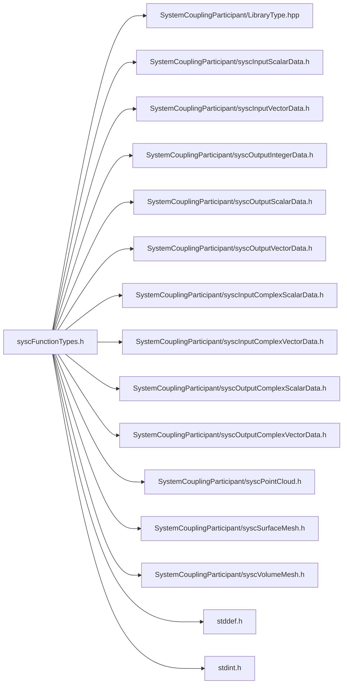

# File syscFunctionTypes.h

![][C]

**Location**: `syscFunctionTypes.h`


## Includes

* SystemCouplingParticipant/LibraryType.hpp
* SystemCouplingParticipant/syscInputScalarData.h
* SystemCouplingParticipant/syscInputVectorData.h
* SystemCouplingParticipant/syscOutputIntegerData.h
* SystemCouplingParticipant/syscOutputScalarData.h
* SystemCouplingParticipant/syscOutputVectorData.h
* SystemCouplingParticipant/syscInputComplexScalarData.h
* SystemCouplingParticipant/syscInputComplexVectorData.h
* SystemCouplingParticipant/syscOutputComplexScalarData.h
* SystemCouplingParticipant/syscOutputComplexVectorData.h
* SystemCouplingParticipant/syscPointCloud.h
* SystemCouplingParticipant/syscSurfaceMesh.h
* SystemCouplingParticipant/syscVolumeMesh.h
* <stddef.h>
* <stdint.h>





## Typedefs

<a id="group__SyscParticipantLibraryCAPI_1gaaf3788ac706a730edbf6093c7e543681"></a>
### Typedef SyscInputScalarDataAccess

<a id="group__SyscParticipantLibraryCAPI_1gad41922f1a4f5abb891d5a913ba5fcccf"></a>
### Typedef SyscInputScalarDataAccessWithPointer

<a id="group__SyscParticipantLibraryCAPI_1ga844dc6322bd6e4eabc2d3d2d9e69bdb1"></a>
### Typedef SyscInputScalarDataMultiZoneAccess

<a id="group__SyscParticipantLibraryCAPI_1ga8d5f53de4e65a4bacef0f25ba8b46483"></a>
### Typedef SyscInputVectorDataAccess

<a id="group__SyscParticipantLibraryCAPI_1gae7c6372393f3ec720b8d6d1535fcf9b3"></a>
### Typedef SyscInputVectorDataAccessWithPointer

<a id="group__SyscParticipantLibraryCAPI_1gae2e92f1b7ae911c36bf3606c60a01511"></a>
### Typedef SyscInputVectorDataMultiZoneAccess

<a id="group__SyscParticipantLibraryCAPI_1gabd35283796cae3d3dbc851ac66b8564f"></a>
### Typedef SyscOutputScalarDataAccess

<a id="group__SyscParticipantLibraryCAPI_1gab378ed75ffd9b081ad7eccf8107a5542"></a>
### Typedef SyscOutputScalarDataAccessWithPointer

<a id="group__SyscParticipantLibraryCAPI_1ga7767f728d880014dfbd853bbb8e0eb07"></a>
### Typedef SyscOutputScalarDataMultiZoneAccess

<a id="group__SyscParticipantLibraryCAPI_1gae99c8cb78199403b9e74217557be206a"></a>
### Typedef SyscOutputVectorDataAccess

<a id="group__SyscParticipantLibraryCAPI_1gab30cbe5478bf769c81f5c0a07e885afd"></a>
### Typedef SyscOutputVectorDataAccessWithPointer

<a id="group__SyscParticipantLibraryCAPI_1ga1d6d5d9fa806ac5820d9a6ed85811804"></a>
### Typedef SyscOutputVectorDataMultiZoneAccess

<a id="group__SyscParticipantLibraryCAPI_1gab388f936f3a73b9b480a792c401a95a1"></a>
### Typedef SyscInputComplexScalarDataAccess

<a id="group__SyscParticipantLibraryCAPI_1ga7a0c5889de7b17b59d44595d7636747e"></a>
### Typedef SyscInputComplexScalarDataAccessWithPointer

<a id="group__SyscParticipantLibraryCAPI_1gace54794852b48d8725b930f1aed89c4d"></a>
### Typedef SyscInputComplexVectorDataAccess

<a id="group__SyscParticipantLibraryCAPI_1ga68dcce877e8cc69f13bee845c76f1b4d"></a>
### Typedef SyscInputComplexVectorDataAccessWithPointer

<a id="group__SyscParticipantLibraryCAPI_1ga17d96c2c29a44374309efafdfb8fef62"></a>
### Typedef SyscOutputComplexScalarDataAccess

<a id="group__SyscParticipantLibraryCAPI_1ga71ac4910edd87d8d62e871001258c698"></a>
### Typedef SyscOutputComplexScalarDataAccessWithPointer

<a id="group__SyscParticipantLibraryCAPI_1ga65a0f3a119f2cec715ac89798f16a97c"></a>
### Typedef SyscOutputComplexVectorDataAccess

<a id="group__SyscParticipantLibraryCAPI_1ga18e31a00d833843895c731e69ca006b0"></a>
### Typedef SyscOutputComplexVectorDataAccessWithPointer

<a id="group__SyscParticipantLibraryCAPI_1ga71e4eb102d00dd0a211f6dc2f4d24222"></a>
### Typedef SyscSurfMeshAccess

<a id="group__SyscParticipantLibraryCAPI_1gafbfb299099d65e3f232bb67a04d1a8e9"></a>
### Typedef SyscSurfaceMeshAccessWithPointer

<a id="group__SyscParticipantLibraryCAPI_1ga9ffe052c4c28ff40b4a14b32cd9f227c"></a>
### Typedef SyscSurfaceMeshMultiZoneAccess

<a id="group__SyscParticipantLibraryCAPI_1gad0ff77c2af045d3294b149219123a084"></a>
### Typedef SyscVolumeMeshAccess

<a id="group__SyscParticipantLibraryCAPI_1gadcb6262e27485836632696e52cf80fb9"></a>
### Typedef SyscVolumeMeshAccessWithPointer

<a id="group__SyscParticipantLibraryCAPI_1gaf381b799bec1baf9f3ab727b61458b59"></a>
### Typedef SyscVolumeMeshMultiZoneAccess

<a id="group__SyscParticipantLibraryCAPI_1gae999907f608779e525e34f60d2803038"></a>
### Typedef SyscPointCloudAccess

<a id="group__SyscParticipantLibraryCAPI_1gafa62fd6d86905625ae071dea4749a8df"></a>
### Typedef SyscPointCloudAccessWithPointer

<a id="group__SyscParticipantLibraryCAPI_1gac4a0788f14f0d473372f07638e9dceaa"></a>
### Typedef SyscPointCloudMultiZoneAccess

<a id="group__SyscParticipantLibraryCAPI_1gaabc0678095ad5a5efb8be4d666ce2677"></a>
### Typedef SyscZoneCountAccess

<a id="group__SyscParticipantLibraryCAPI_1ga800a36e5223ab1f89d2207333fb4f959"></a>
### Typedef SyscRestartPointCreation

## Source


```
/*
* Copyright ANSYS, Inc. Unauthorized use, distribution, or duplication is prohibited.
*/

#pragma once

#include "SystemCouplingParticipant/LibraryType.hpp"

#include "SystemCouplingParticipant/syscInputScalarData.h"
#include "SystemCouplingParticipant/syscInputVectorData.h"
#include "SystemCouplingParticipant/syscOutputIntegerData.h"
#include "SystemCouplingParticipant/syscOutputScalarData.h"
#include "SystemCouplingParticipant/syscOutputVectorData.h"
#include "SystemCouplingParticipant/syscInputComplexScalarData.h"
#include "SystemCouplingParticipant/syscInputComplexVectorData.h"
#include "SystemCouplingParticipant/syscOutputComplexScalarData.h"
#include "SystemCouplingParticipant/syscOutputComplexVectorData.h"
#include "SystemCouplingParticipant/syscPointCloud.h"
#include "SystemCouplingParticipant/syscSurfaceMesh.h"
#include "SystemCouplingParticipant/syscVolumeMesh.h"

#include <stddef.h>
#include <stdint.h>

#ifdef __cplusplus
extern "C" {
#endif


/* ***************** Data access functions prototypes ********************** */

/* *** input scalar data *** */

typedef SyscInputScalarData (*SyscInputScalarDataAccess)(
  const char* regionName,
  const char* variableName);

typedef SyscInputScalarData (*SyscInputScalarDataAccessWithPointer)(
  SyscOpaqueDataAccess opaqueDataAccess,
  const char* regionName,
  const char* variableName);

typedef SyscInputScalarData (*SyscInputScalarDataMultiZoneAccess)(
  SyscOpaqueDataAccess opaqueDataAccess,
  const char* regionName,
  const char* variableName,
  uint16_t zoneIndex);

/* *** input vector data *** */

typedef SyscInputVectorData (*SyscInputVectorDataAccess)(
  const char* regionName,
  const char* variableName);

typedef SyscInputVectorData (*SyscInputVectorDataAccessWithPointer)(
  SyscOpaqueDataAccess opaqueDataAccess,
  const char* regionName,
  const char* variableName);

typedef SyscInputVectorData (*SyscInputVectorDataMultiZoneAccess)(
  SyscOpaqueDataAccess opaqueDataAccess,
  const char* regionName,
  const char* variableName,
  uint16_t zoneIndex);

/* *** output scalar data *** */

typedef SyscOutputScalarData (*SyscOutputScalarDataAccess)(
  const char* regionName,
  const char* variableName);

typedef SyscOutputScalarData (*SyscOutputScalarDataAccessWithPointer)(
  SyscOpaqueDataAccess opaqueDataAccess,
  const char* regionName,
  const char* variableName);

typedef SyscOutputScalarData (*SyscOutputScalarDataMultiZoneAccess)(
  SyscOpaqueDataAccess opaqueDataAccess,
  const char* regionName,
  const char* variableName,
  uint16_t zoneIndex);

/* *** output vector data *** */

typedef SyscOutputVectorData (*SyscOutputVectorDataAccess)(
  const char* regionName,
  const char* variableName);

typedef SyscOutputVectorData (*SyscOutputVectorDataAccessWithPointer)(
  SyscOpaqueDataAccess opaqueDataAccess,
  const char* regionName,
  const char* variableName);

typedef SyscOutputVectorData (*SyscOutputVectorDataMultiZoneAccess)(
  SyscOpaqueDataAccess opaqueDataAccess,
  const char* regionName,
  const char* variableName,
  uint16_t zoneIndex);

/* *** input complex scalar data *** */

typedef SyscInputComplexScalarData (*SyscInputComplexScalarDataAccess)(
  const char* regionName,
  const char* variableName);

typedef SyscInputComplexScalarData (*SyscInputComplexScalarDataAccessWithPointer)(
  SyscOpaqueDataAccess opaqueDataAccess,
  const char* regionName,
  const char* variableName);

/* *** input complex vector data *** */

typedef SyscInputComplexVectorData (*SyscInputComplexVectorDataAccess)(
  const char* regionName,
  const char* variableName);

typedef SyscInputComplexVectorData (*SyscInputComplexVectorDataAccessWithPointer)(
  SyscOpaqueDataAccess opaqueDataAccess,
  const char* regionName,
  const char* variableName);

/* *** output complex scalar data *** */

typedef SyscOutputComplexScalarData (*SyscOutputComplexScalarDataAccess)(
  const char* regionName,
  const char* variableName);

typedef SyscOutputComplexScalarData (*SyscOutputComplexScalarDataAccessWithPointer)(
  SyscOpaqueDataAccess opaqueDataAccess,
  const char* regionName,
  const char* variableName);

/* *** output complex vector data *** */

typedef SyscOutputComplexVectorData (*SyscOutputComplexVectorDataAccess)(
  const char* regionName,
  const char* variableName);

typedef SyscOutputComplexVectorData (*SyscOutputComplexVectorDataAccessWithPointer)(
  SyscOpaqueDataAccess opaqueDataAccess,
  const char* regionName,
  const char* variableName);

/* *** surface mesh *** */

typedef SyscSurfaceMesh (*SyscSurfMeshAccess)(
  const char* regionName);

typedef SyscSurfaceMesh (*SyscSurfaceMeshAccessWithPointer)(
  SyscOpaqueDataAccess opaqueDataAccess,
  const char* regionName);

typedef SyscSurfaceMesh (*SyscSurfaceMeshMultiZoneAccess)(
  SyscOpaqueDataAccess opaqueDataAccess,
  const char* regionName,
  uint16_t zoneIndex);

/* *** volume mesh *** */

typedef SyscVolumeMesh (*SyscVolumeMeshAccess)(
  const char* regionName);

typedef SyscVolumeMesh (*SyscVolumeMeshAccessWithPointer)(
  SyscOpaqueDataAccess opaqueDataAccess,
  const char* regionName);

typedef SyscVolumeMesh (*SyscVolumeMeshMultiZoneAccess)(
  SyscOpaqueDataAccess opaqueDataAccess,
  const char* regionName,
  uint16_t zoneIndex);

/* *** point cloud *** */

typedef SyscPointCloud (*SyscPointCloudAccess)(
  const char* regionName);

typedef SyscPointCloud (*SyscPointCloudAccessWithPointer)(
  SyscOpaqueDataAccess opaqueDataAccess,
  const char* regionName);

typedef SyscPointCloud (*SyscPointCloudMultiZoneAccess)(
  SyscOpaqueDataAccess opaqueDataAccess,
  const char* regionName,
  uint16_t zoneIndex);

/* *** zone count *** */

typedef uint16_t (*SyscZoneCountAccess)(
  SyscOpaqueDataAccess opaqueDataAccess,
  const char* regionName);

/* *** restart points *** */

typedef const char* (*SyscRestartPointCreation)();


#ifdef __cplusplus
}
#endif
```


[public]: https://img.shields.io/badge/-public-brightgreen (public)
[C]: https://img.shields.io/badge/language-C-blue (C)