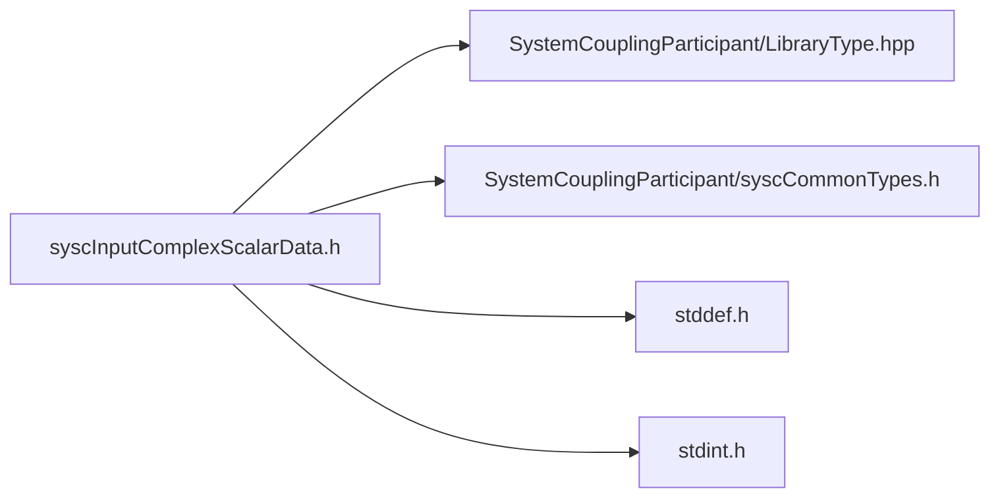

# File syscInputComplexScalarData.h

![][C]

**Location**: `syscInputComplexScalarData.h`


## Classes

* [SyscInputComplexScalarData](structSyscInputComplexScalarData.md#structSyscInputComplexScalarData)

## Includes

* SystemCouplingParticipant/LibraryType.hpp
* SystemCouplingParticipant/syscCommonTypes.h
* <stddef.h>
* <stdint.h>





## Functions

<a id="group__SyscParticipantLibraryCAPI_1ga1843bbb3648ac07766c7e6ea9f309a54"></a>
### Function syscGetInputComplexScalarData

<a id="group__SyscParticipantLibraryCAPI_1gaaed0337275d991d2cd2a1ec4dbf2a595"></a>
### Function syscGetInputComplexScalarDataSplitDouble

<a id="group__SyscParticipantLibraryCAPI_1ga11c65e99f509cd226f13b0932aba8eb7"></a>
### Function syscGetInputComplexScalarDataSplitFloat

<a id="group__SyscParticipantLibraryCAPI_1ga5cbb0ff3aa857c03d3626038e3a20ffa"></a>
### Function syscGetInputComplexScalarDataCompactDouble

<a id="group__SyscParticipantLibraryCAPI_1ga0ff093e80497efd6dccb6ea29c9face3"></a>
### Function syscGetInputComplexScalarDataCompactFloat

## Source


```
/*
* Copyright ANSYS, Inc. Unauthorized use, distribution, or duplication is prohibited.
*/

#pragma once

#include "SystemCouplingParticipant/LibraryType.hpp"

#include "SystemCouplingParticipant/syscCommonTypes.h"

#include <stddef.h>
#include <stdint.h>

#ifdef __cplusplus
extern "C" {
#endif


typedef struct {
  enum SyscPrimitiveType primitiveType; 
  void* data1;                          
  void* data2;                          
  size_t size;                          
} SyscInputComplexScalarData;


SyscInputComplexScalarData syscGetInputComplexScalarData();


SyscInputComplexScalarData syscGetInputComplexScalarDataSplitDouble(
  double* const dataReal,
  double* const dataImag,
  size_t dataSize);


SyscInputComplexScalarData syscGetInputComplexScalarDataSplitFloat(
  float* const dataReal,
  float* const dataImag,
  size_t dataSize);


SyscInputComplexScalarData syscGetInputComplexScalarDataCompactDouble(
  double* const data,
  size_t dataSize);


SyscInputComplexScalarData syscGetInputComplexScalarDataCompactFloat(
  float* const data,
  size_t dataSize);


#ifdef __cplusplus
}
#endif
```


[public]: https://img.shields.io/badge/-public-brightgreen (public)
[C]: https://img.shields.io/badge/language-C-blue (C)