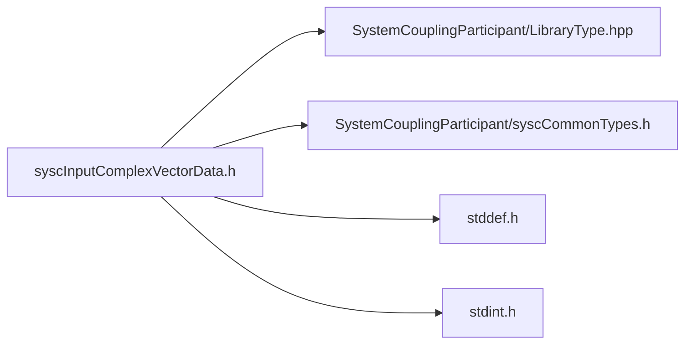

# File syscInputComplexVectorData.h

![][C]

**Location**: `syscInputComplexVectorData.h`


## Classes

* [SyscInputComplexVectorData](structSyscInputComplexVectorData.md#structSyscInputComplexVectorData)

## Includes

* SystemCouplingParticipant/LibraryType.hpp
* SystemCouplingParticipant/syscCommonTypes.h
* <stddef.h>
* <stdint.h>





## Functions

<a id="group__SyscParticipantLibraryCAPI_1gaa7291e96ae240db79de4b35ad82c4cc0"></a>
### Function syscGetInputComplexVectorData

<a id="group__SyscParticipantLibraryCAPI_1ga311e2b750be4212f60557b49870f1eac"></a>
### Function syscGetInputCompactComplexCompactVectorDataDouble

<a id="group__SyscParticipantLibraryCAPI_1ga5396c1513b3448bfd783c2db743606d2"></a>
### Function syscGetInputCompactComplexCompactVectorDataFloat

<a id="group__SyscParticipantLibraryCAPI_1ga8cce8fbb7655b448cd3c6c08772e1766"></a>
### Function syscGetInputSplitComplexCompactVectorDataDouble

<a id="group__SyscParticipantLibraryCAPI_1ga0c9104179a6e98a7a043e4412f1dafd5"></a>
### Function syscGetInputSplitComplexCompactVectorDataFloat

<a id="group__SyscParticipantLibraryCAPI_1ga7eefc4444dbdf8924e4074046de5eba2"></a>
### Function syscGetInputCompactComplexSplitVectorDataDouble

<a id="group__SyscParticipantLibraryCAPI_1ga513ecaae813a2904f6926c5839cc11a1"></a>
### Function syscGetInputCompactComplexSplitVectorDataFloat

<a id="group__SyscParticipantLibraryCAPI_1ga1fd576a79df5e1b27247f4b71e2afbf0"></a>
### Function syscGetInputSplitComplexSplitVectorDataDouble

<a id="group__SyscParticipantLibraryCAPI_1ga6b650f50fa53c996a07147474343f55f"></a>
### Function syscGetInputSplitComplexSplitVectorDataFloat

<a id="group__SyscParticipantLibraryCAPI_1ga93d5fd27a2899ea57f88958aa29506cd"></a>
### Function syscGetInputCompactComplexCompactVectorDataDoubleDim

<a id="group__SyscParticipantLibraryCAPI_1ga6fa6c5f2890928560f68ebb6d45cabc9"></a>
### Function syscGetInputCompactComplexCompactVectorDataFloatDim

## Source


```
/*
* Copyright ANSYS, Inc. Unauthorized use, distribution, or duplication is prohibited.
*/

#pragma once

#include "SystemCouplingParticipant/LibraryType.hpp"

#include "SystemCouplingParticipant/syscCommonTypes.h"

#include <stddef.h>
#include <stdint.h>

#ifdef __cplusplus
extern "C" {
#endif


typedef struct {
  enum SyscPrimitiveType primitiveType; 
  void* data1;                          
  void* data2;                          
  void* data3;                          
  void* data4;                          
  void* data5;                          
  void* data6;                          
  size_t size;                          
  enum SyscDimension dimension;         
} SyscInputComplexVectorData;


SyscInputComplexVectorData syscGetInputComplexVectorData();


SyscInputComplexVectorData syscGetInputCompactComplexCompactVectorDataDouble(
  double* const data,
  size_t dataSize);


SyscInputComplexVectorData syscGetInputCompactComplexCompactVectorDataFloat(
  float* const data,
  size_t dataSize);


SyscInputComplexVectorData syscGetInputSplitComplexCompactVectorDataDouble(
  double* const dataReal,
  double* const dataImag,
  size_t dataSize);


SyscInputComplexVectorData syscGetInputSplitComplexCompactVectorDataFloat(
  float* const dataReal,
  float* const dataImag,
  size_t dataSize);


SyscInputComplexVectorData syscGetInputCompactComplexSplitVectorDataDouble(
  double* const data1,
  double* const data2,
  double* const data3,
  size_t dataSize);


SyscInputComplexVectorData syscGetInputCompactComplexSplitVectorDataFloat(
  float* const data1,
  float* const data2,
  float* const data3,
  size_t dataSize);


SyscInputComplexVectorData syscGetInputSplitComplexSplitVectorDataDouble(
  double* const data1Real,
  double* const data1Imag,
  double* const data2Real,
  double* const data2Imag,
  double* const data3Real,
  double* const data3Imag,
  size_t dataSize);


SyscInputComplexVectorData syscGetInputSplitComplexSplitVectorDataFloat(
  float* const data1Real,
  float* const data1Imag,
  float* const data2Real,
  float* const data2Imag,
  float* const data3Real,
  float* const data3Imag,
  size_t dataSize);


SyscInputComplexVectorData syscGetInputCompactComplexCompactVectorDataDoubleDim(
  double* const data,
  size_t dataSize,
  enum SyscDimension dimension);


SyscInputComplexVectorData syscGetInputCompactComplexCompactVectorDataFloatDim(
  float* const data,
  size_t dataSize,
  enum SyscDimension dimension);


#ifdef __cplusplus
}
#endif
```


[public]: https://img.shields.io/badge/-public-brightgreen (public)
[C]: https://img.shields.io/badge/language-C-blue (C)