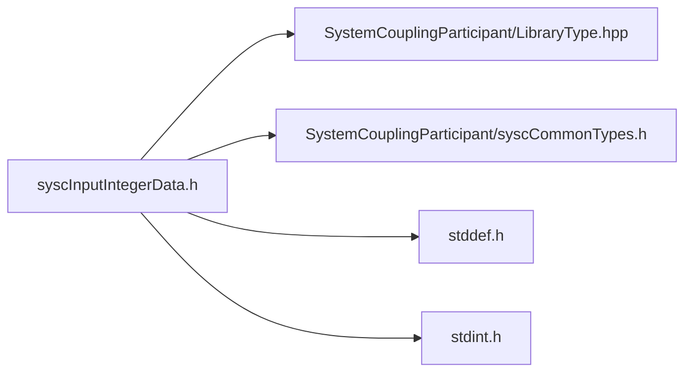

# File syscInputIntegerData.h

![][C]

**Location**: `syscInputIntegerData.h`


## Classes

* [SyscInputIntegerData](structSyscInputIntegerData.md#structSyscInputIntegerData)

## Includes

* SystemCouplingParticipant/LibraryType.hpp
* SystemCouplingParticipant/syscCommonTypes.h
* <stddef.h>
* <stdint.h>





## Functions

<a id="group__SyscParticipantLibraryCAPI_1ga1a21004d5965100d25754dc2ed0ef73b"></a>
### Function syscGetInputIntegerData

<a id="group__SyscParticipantLibraryCAPI_1ga89f1f12bf6e2c97cad4c9542b7ffced0"></a>
### Function syscGetInputIntegerDataInt32

<a id="group__SyscParticipantLibraryCAPI_1ga9e6520bef4b9090c53482e0efab666d9"></a>
### Function syscGetInputIntegerDataInt64

<a id="group__SyscParticipantLibraryCAPI_1gafe52826809bd746c073a4d6d0df8f899"></a>
### Function syscGetInputIntegerDataUInt16

<a id="group__SyscParticipantLibraryCAPI_1ga1336ea16cf502554714f26e62b1d324c"></a>
### Function syscGetInputIntegerDataUInt64

## Source


```
/*
* Copyright ANSYS, Inc. Unauthorized use, distribution, or duplication is prohibited.
*/

#pragma once

#include "SystemCouplingParticipant/LibraryType.hpp"

#include "SystemCouplingParticipant/syscCommonTypes.h"

#include <stddef.h>
#include <stdint.h>

#ifdef __cplusplus
extern "C" {
#endif


typedef struct {
  enum SyscPrimitiveType primitiveType; 
  void* data;                           
  size_t size;                          
} SyscInputIntegerData;


SyscInputIntegerData syscGetInputIntegerData();


SyscInputIntegerData syscGetInputIntegerDataInt32(
  int32_t* const data,
  size_t dataSize);


SyscInputIntegerData syscGetInputIntegerDataInt64(
  int64_t* const data,
  size_t dataSize);


SyscInputIntegerData syscGetInputIntegerDataUInt16(
  uint16_t* const data,
  size_t dataSize);


SyscInputIntegerData syscGetInputIntegerDataUInt64(
  uint64_t* const data,
  size_t dataSize);


#ifdef __cplusplus
}
#endif
```


[public]: https://img.shields.io/badge/-public-brightgreen (public)
[C]: https://img.shields.io/badge/language-C-blue (C)